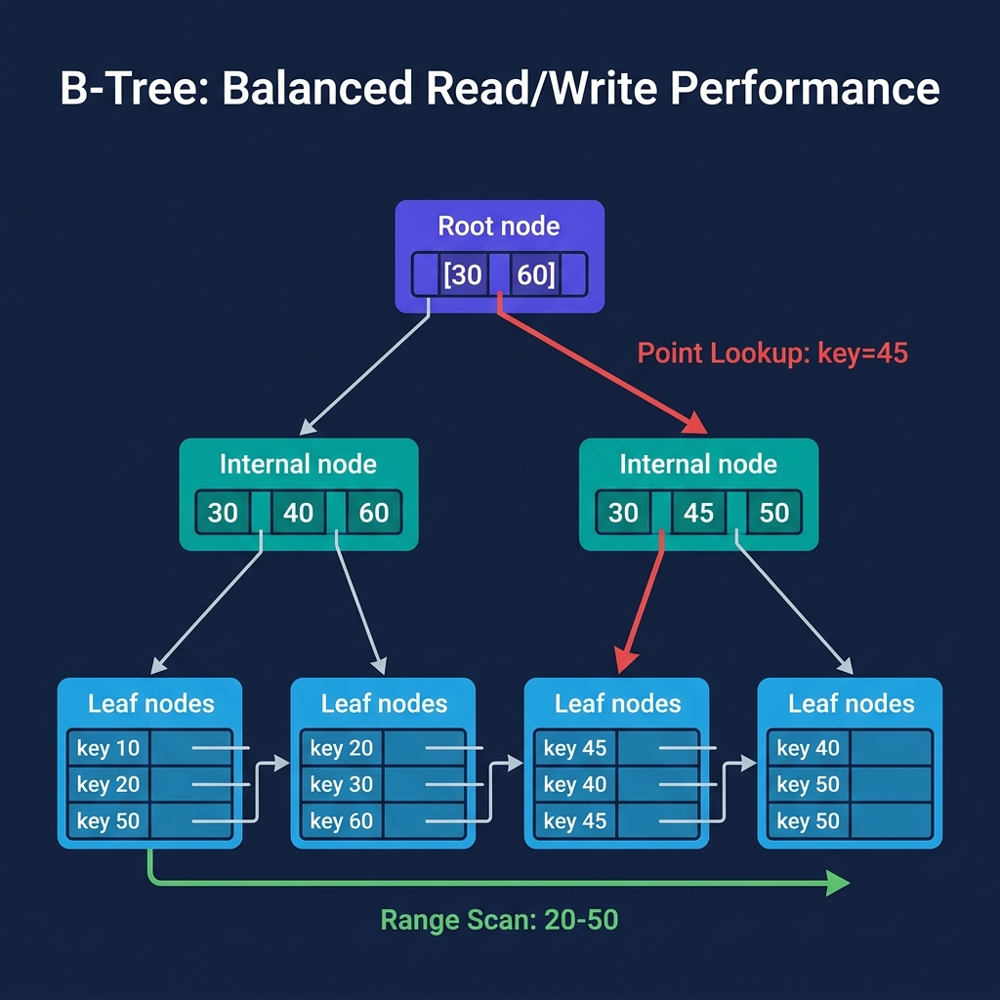
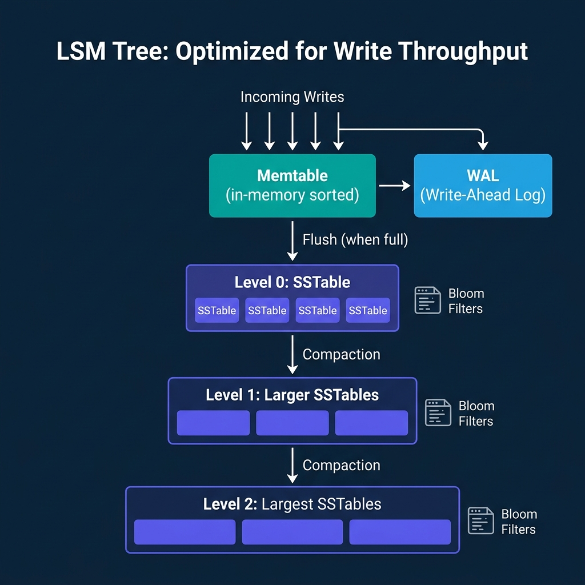
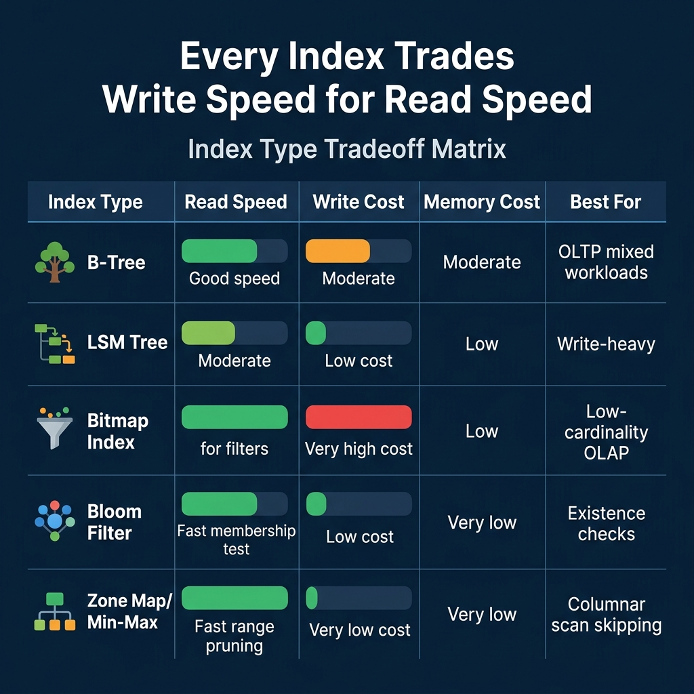

<!-- Meta Description: B-trees balance reads and writes for OLTP. LSM trees maximize write throughput. Bitmap indexes accelerate OLAP filtering. Here is when to use each. -->
<!-- Primary Keyword: database indexing strategies -->
<!-- Secondary Keywords: B-tree vs LSM tree, bitmap index, bloom filter database -->

This is Part 4 of a 10-part series on query engine design. [Part 3](/2026/2026-04-qeo-03-how-databases-organize-data-on-disk-pages-blocks-and-file-fo/) covered how data is structured within files. This article covers the auxiliary data structures that make lookups fast: indexes.

Every index exists to answer the same question faster: "where is the data I need?" The fundamental tradeoff is universal: every index speeds up reads and slows down writes, because every insert, update, or delete must also update every index on the table.

## Table of Contents

1. [How Query Engines Think: The Tradeoffs Behind Every Data System](/2026/2026-04-qeo-01-how-query-engines-think-the-tradeoffs-behind-every-data-syst/)
2. [Row vs. Column: How Storage Layout Shapes Everything](/2026/2026-04-qeo-02-row-vs-column-how-storage-layout-shapes-everything/)
3. [How Databases Organize Data on Disk: Pages, Blocks, and File Formats](/2026/2026-04-qeo-03-how-databases-organize-data-on-disk-pages-blocks-and-file-fo/)
4. [B-Trees, LSM Trees, and the Indexing Tradeoff Spectrum](/2026/2026-04-qeo-04-b-trees-lsm-trees-and-the-indexing-tradeoff-spectrum/)
5. [Inside the Query Optimizer: How Engines Pick a Plan](/2026/2026-04-qeo-05-inside-the-query-optimizer-how-engines-pick-a-plan/)
6. [Volcano, Vectorized, Compiled: How Engines Execute Your Query](/2026/2026-04-qeo-06-volcano-vectorized-compiled-how-engines-execute-your-query/)
7. [Buffer Pools, Caches, and the Memory Hierarchy](/2026/2026-04-qeo-07-buffer-pools-caches-and-the-memory-hierarchy/)
8. [Partitioning, Sharding, and Data Distribution Strategies](/2026/2026-04-qeo-08-partitioning-sharding-and-data-distribution-strategies/)
9. [Hash, Sort-Merge, Broadcast: How Distributed Joins Work](/2026/2026-04-qeo-09-hash-sort-merge-broadcast-how-distributed-joins-work/)
10. [Concurrency, Isolation, and MVCC: How Engines Handle Contention](/2026/2026-04-qeo-10-concurrency-isolation-and-mvcc-how-engines-handle-contention/)

## B-Trees: The OLTP Standard

The B-tree is the most widely deployed index structure in production databases. PostgreSQL, MySQL, Oracle, SQL Server, SQLite, and CockroachDB all default to B-tree indexes.

A B-tree is a balanced tree where each node contains sorted keys and pointers. The tree stays balanced because splits and merges propagate upward when nodes get too full or too empty.

**Point lookups** traverse from root to leaf: O(log n) comparisons. For a table with a billion rows and a branching factor of 100, that is approximately 5 node reads. If the upper levels are cached in memory (they usually are), a point lookup hits disk once.

**Range scans** find the starting leaf and follow horizontal pointers across adjacent leaves. The scan is sequential I/O, which is the fastest access pattern on both SSDs and HDDs.

**Writes** are where B-trees pay their cost. Inserting a key may trigger a node split that propagates up the tree. Updates are in-place random writes. Under heavy write loads, fragmentation accumulates and periodic rebuilding or vacuuming is needed. PostgreSQL's VACUUM process exists specifically to reclaim space from B-tree bloat.

## LSM Trees: Built for Write Throughput

When write volume overwhelms B-tree performance, LSM trees offer an alternative that converts random writes into sequential writes.

The architecture has three layers:

1. **Memtable**: An in-memory sorted structure (typically a skip list or red-black tree). All writes go here first. A Write-Ahead Log (WAL) on disk ensures durability if the process crashes before the memtable is flushed.
2. **SSTables**: When the memtable fills up, it is flushed to disk as an immutable sorted file. These files are never modified after creation.
3. **Compaction**: Background processes merge SSTables from the same level into larger files at the next level, removing duplicate keys and tombstones (deletion markers).

RocksDB (used as the storage engine inside CockroachDB, TiDB, and many others), LevelDB, Cassandra, HBase, and ScyllaDB all use LSM trees.

The write advantage is dramatic: because the memtable buffers writes in memory and flushes them sequentially, the disk sees only large sequential writes instead of random scattered writes. For write-heavy workloads (event logging, time-series data, IoT telemetry), LSM trees handle 5-10x more writes per second than B-trees on the same hardware.

The read tradeoff: a point lookup may need to check the memtable plus multiple levels of SSTables. A key that was written long ago could live in the deepest level, requiring reads across several files. Bloom filters mitigate this: a compact probabilistic structure attached to each SSTable answers "is this key definitely not in this file?" with no false negatives, allowing the engine to skip files without reading them.

## Bitmap Indexes: OLAP Filtering

Bitmap indexes take a different approach entirely. For each distinct value in a column, the index stores a bit vector where each bit represents a row. A 1 means the row has that value. A 0 means it does not.

For a `status` column with three values (`active`, `pending`, `closed`), the index stores three bit vectors, each with one bit per row. Filtering `WHERE status = 'active' AND region = 'US'` becomes a bitwise AND between two bit vectors, which modern CPUs execute in nanoseconds.

Bitmap indexes are excellent for low-cardinality columns (few distinct values) in read-heavy OLAP workloads. Oracle's data warehouse features and some specialized OLAP engines use them.

The write tradeoff is severe: updating a single row in a bitmap index requires locking and modifying the entire bit segment. Under concurrent writes, this creates contention that kills throughput. Bitmap indexes are effectively read-only structures that get rebuilt during batch loads.

## Zone Maps and Min/Max Indexes

Columnar engines like Dremio, Snowflake, ClickHouse, DuckDB, and Spark do not typically use traditional indexes at all. Instead, they rely on zone maps: per-block metadata storing the minimum and maximum value for each column.

When a query filters `WHERE order_date > '2024-06-01'`, the engine checks each block's max `order_date`. Any block where the max is before June 2024 is skipped entirely. No tree traversal, no separate index structure, just a few bytes of metadata per block.

Zone maps are "almost free" to maintain because the min/max values are computed during the write process with negligible overhead. The tradeoff: they only help with range predicates, and they are useless if the data within each block is randomly ordered (the min and max span the entire value range, so nothing gets skipped). This is why columnar engines often sort or cluster data by frequently filtered columns.

Dremio automates this through its clustering table maintenance, and Iceberg's manifest files store per-file column statistics that enable file-level pruning before any data files are opened.

## Inverted Indexes: Full-Text Search

Elasticsearch, Apache Lucene, and Solr use inverted indexes: a mapping from each term to the list of documents containing it. Searching for "query engine optimization" finds the intersection of the posting lists for "query," "engine," and "optimization."

Inverted indexes are the reason text search engines return results in milliseconds across billions of documents. They are highly specialized and not used for general-purpose relational queries.

## The Tradeoff Matrix

| Index Type | Read Speed | Write Cost | Best For |
|---|---|---|---|
| B-tree | O(log n) point + range | Moderate (in-place, splits) | OLTP mixed workloads |
| LSM tree | Moderate (multi-level search) | Low (sequential flushes) | Write-heavy workloads |
| Bitmap | Excellent for boolean filters | Very high (locking, rebuild) | Low-cardinality OLAP |
| Bloom filter | Fast membership test | Low (hash at write time) | Reducing LSM read amplification |
| Zone map | Fast range pruning | Very low (compute at write) | Columnar scan skipping |
| Inverted index | Fast term lookup | Moderate (posting list updates) | Full-text search |

## Where Real Systems Land

| System | Primary Index | Secondary Indexes | Workload |
|---|---|---|---|
| PostgreSQL | B-tree | GIN, GiST, BRIN, hash | OLTP |
| MySQL/InnoDB | B-tree (clustered) | Secondary B-trees | OLTP |
| RocksDB | LSM tree | Bloom filters | Write-heavy storage |
| Cassandra | LSM tree + partition index | Materialized views, SAI | Write-heavy distributed |
| ClickHouse | Sparse primary index + zone maps | Data skipping indexes | Real-time OLAP |
| DuckDB | Zone maps | ART indexes (adaptive) | Embedded OLAP |
| Snowflake | Zone maps (micro-partition pruning) | None (scan-based) | Cloud OLAP |
| Dremio | Zone maps + Iceberg manifest stats | Bloom filter pruning | Lakehouse OLAP |
| Elasticsearch | Inverted index | Doc values (columnar) | Full-text search |

The pattern is clear: OLTP systems invest in B-trees for balanced read/write. Write-heavy systems use LSM trees. Analytical systems minimize index overhead with zone maps and rely on columnar layout for scan efficiency.

No single indexing strategy works for all workloads. The right choice depends on whether your bottleneck is read latency, write throughput, or scan efficiency.

### Books to Go Deeper

- [Architecting the Apache Iceberg Lakehouse](https://www.amazon.com/Architecting-Apache-Iceberg-Lakehouse-open-source/dp/1633435105/) by Alex Merced (Manning)
- [Lakehouses with Apache Iceberg: Agentic Hands-on](https://www.amazon.com/Lakehouses-Apache-Iceberg-Agentic-Hands-ebook/dp/B0GQL4QNRT/) by Alex Merced
- [Constructing Context: Semantics, Agents, and Embeddings](https://www.amazon.com/Constructing-Context-Semantics-Agents-Embeddings/dp/B0GSHRZNZ5/) by Alex Merced
- [Apache Iceberg & Agentic AI: Connecting Structured Data](https://www.amazon.com/Apache-Iceberg-Agentic-Connecting-Structured/dp/B0GW2WF4PX/) by Alex Merced
- [Open Source Lakehouse: Architecting Analytical Systems](https://www.amazon.com/Open-Source-Lakehouse-Architecting-Analytical/dp/B0GW595MVL/) by Alex Merced
