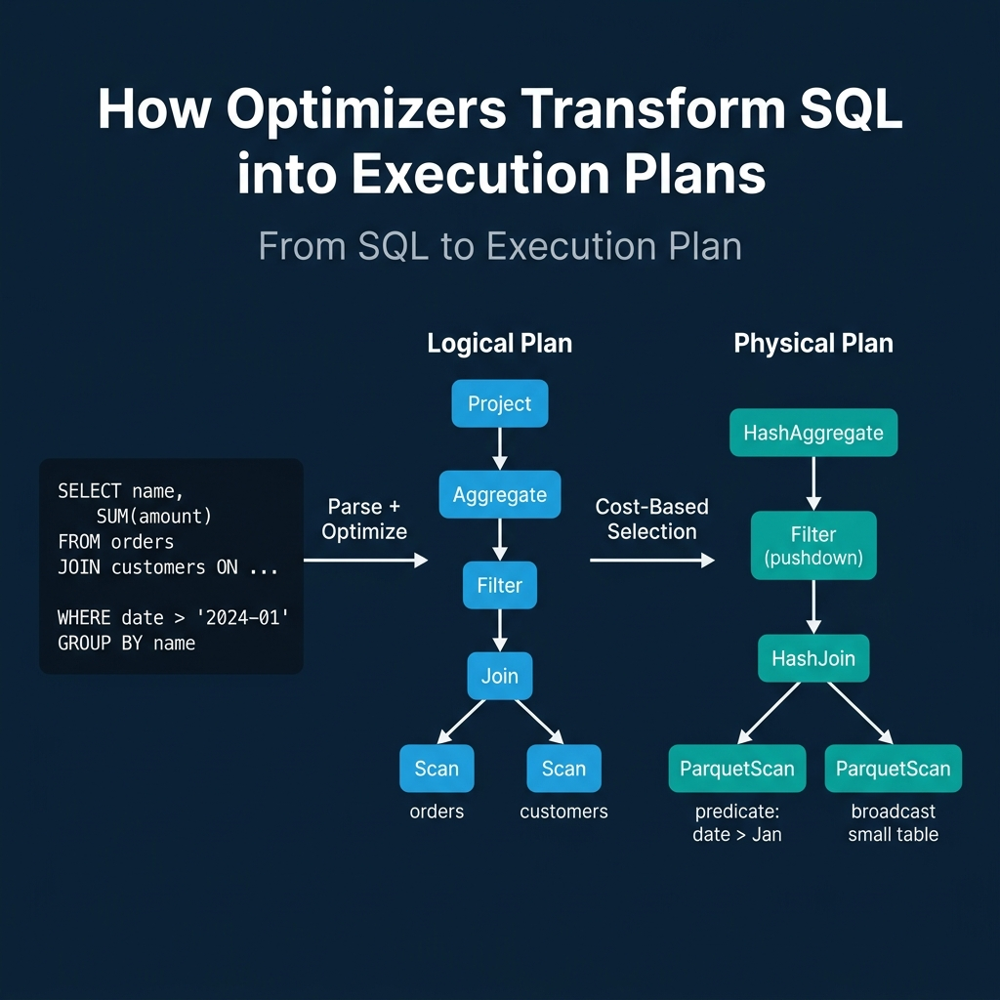
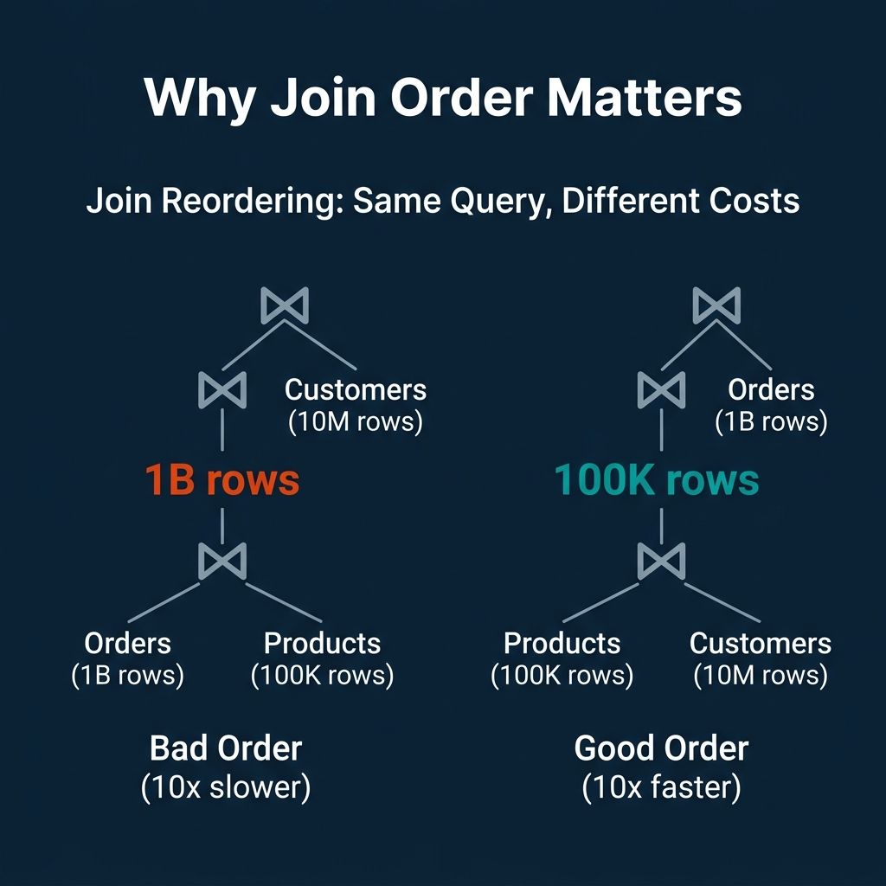
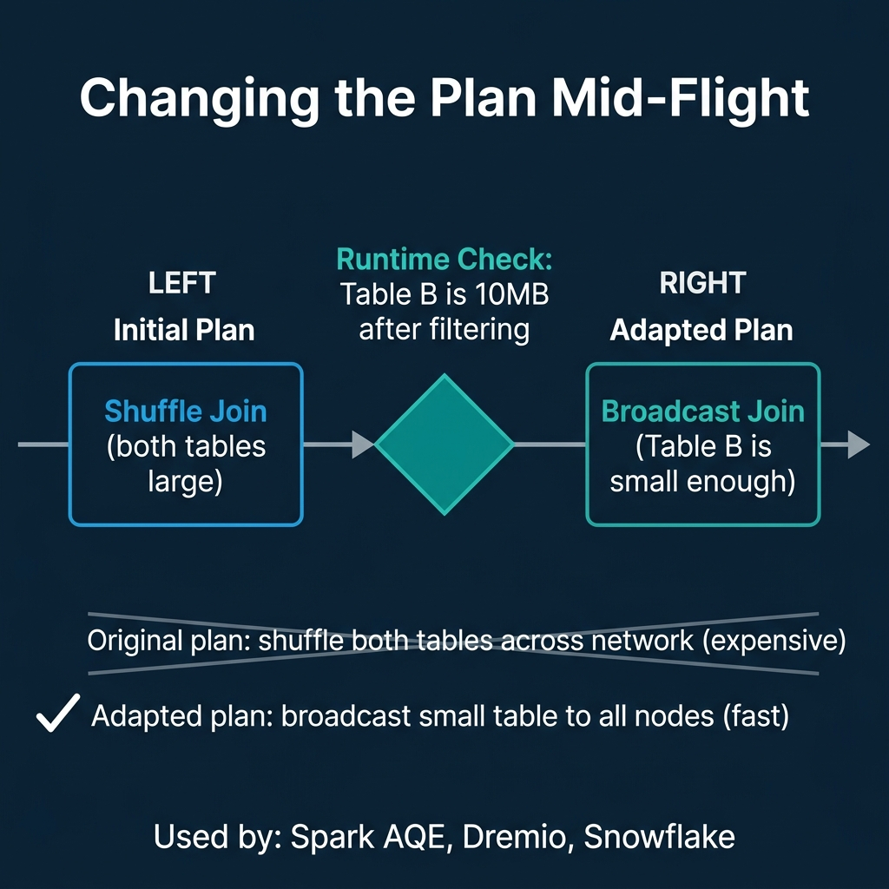

<!-- Meta Description: Query optimizers transform SQL into execution plans using rule-based rewrites, cost-based search, and adaptive runtime adjustments. Here is how each approach works. -->
<!-- Primary Keyword: query optimizer -->
<!-- Secondary Keywords: cost-based optimization, query planning, adaptive query execution -->

This is Part 5 of a 10-part series on query engine design. [Part 4](/2026/2026-04-qeo-04-b-trees-lsm-trees-and-the-indexing-tradeoff-spectrum/) covered indexing strategies. This article covers what happens after the engine parses your SQL: how the optimizer decides the fastest way to execute it.

The same SQL query can be executed in hundreds of different ways. The tables can be joined in different orders. Filters can be applied early or late. Indexes can be used or ignored. The optimizer's job is to find a plan that finishes quickly without spending too much time searching for it.

## Table of Contents

1. [How Query Engines Think: The Tradeoffs Behind Every Data System](/2026/2026-04-qeo-01-how-query-engines-think-the-tradeoffs-behind-every-data-syst/)
2. [Row vs. Column: How Storage Layout Shapes Everything](/2026/2026-04-qeo-02-row-vs-column-how-storage-layout-shapes-everything/)
3. [How Databases Organize Data on Disk: Pages, Blocks, and File Formats](/2026/2026-04-qeo-03-how-databases-organize-data-on-disk-pages-blocks-and-file-fo/)
4. [B-Trees, LSM Trees, and the Indexing Tradeoff Spectrum](/2026/2026-04-qeo-04-b-trees-lsm-trees-and-the-indexing-tradeoff-spectrum/)
5. [Inside the Query Optimizer: How Engines Pick a Plan](/2026/2026-04-qeo-05-inside-the-query-optimizer-how-engines-pick-a-plan/)
6. [Volcano, Vectorized, Compiled: How Engines Execute Your Query](/2026/2026-04-qeo-06-volcano-vectorized-compiled-how-engines-execute-your-query/)
7. [Buffer Pools, Caches, and the Memory Hierarchy](/2026/2026-04-qeo-07-buffer-pools-caches-and-the-memory-hierarchy/)
8. [Partitioning, Sharding, and Data Distribution Strategies](/2026/2026-04-qeo-08-partitioning-sharding-and-data-distribution-strategies/)
9. [Hash, Sort-Merge, Broadcast: How Distributed Joins Work](/2026/2026-04-qeo-09-hash-sort-merge-broadcast-how-distributed-joins-work/)
10. [Concurrency, Isolation, and MVCC: How Engines Handle Contention](/2026/2026-04-qeo-10-concurrency-isolation-and-mvcc-how-engines-handle-contention/)

## From SQL to Execution Plan

Every query goes through three stages:

1. **Parse**: The SQL text is converted into an abstract syntax tree (AST). Syntax errors are caught here.
2. **Logical plan**: The AST becomes a tree of logical operators (Scan, Filter, Join, Aggregate, Project). This plan describes *what* to compute but not *how*.
3. **Physical plan**: The optimizer selects specific algorithms for each logical operator. A logical Join becomes a HashJoin or SortMergeJoin. A logical Scan becomes an IndexScan or SequentialScan. This plan describes exactly how the engine will execute the query.

The gap between the logical and physical plan is where the optimizer earns its keep. The same logical plan can produce dozens of physical plans with performance differences of 10x to 1000x.

## Rule-Based Optimization: The Guaranteed Wins

Rule-based optimization (RBO) applies fixed transformation rules that always improve the plan. These are deterministic: the optimizer applies every applicable rule without evaluating alternatives.

**Predicate pushdown** moves filter operations closer to the data source. If a query joins two tables and then filters, the optimizer pushes the filter below the join so fewer rows enter the join. This reduces the intermediate result size, which reduces memory usage, network transfer (in distributed engines), and CPU time.

**Projection pruning** removes columns that are never referenced downstream. If a table has 50 columns but the query only uses 3, the optimizer drops the other 47 from the scan operator. Combined with columnar storage, this means 94% of the data is never read.

**Constant folding** evaluates constant expressions at planning time. `WHERE date > '2024-01-01' AND 1 = 1` becomes `WHERE date > '2024-01-01'` before execution starts.

**Predicate simplification** rewrites complex conditions. `WHERE x > 5 AND x > 10` becomes `WHERE x > 10`.

Every production query engine applies these rules: PostgreSQL, MySQL, Dremio, Snowflake, Spark, DuckDB, ClickHouse, Trino. They are cheap to compute and always beneficial.

## Cost-Based Optimization: Searching for the Best Plan

Rule-based optimization handles the obvious improvements but cannot answer the hard questions: which join order is fastest? Should we use a hash join or a sort-merge join? Should we scan the index or the full table?

Cost-based optimization (CBO) answers these by estimating the cost of multiple candidate plans and selecting the cheapest one.

### How Cost Estimation Works

The optimizer maintains **table statistics**: row counts, column cardinality (number of distinct values), value distribution histograms, null counts, and average column widths. PostgreSQL stores these in `pg_statistic` and updates them via `ANALYZE`. Dremio and Snowflake collect statistics automatically during query execution and table maintenance.

For each candidate plan, the optimizer estimates:
- **Cardinality**: How many rows will each operator produce? A filter on `status = 'active'` with cardinality 5 on a 1M-row table produces approximately 200K rows.
- **Cost**: How much CPU, I/O, and memory will each operator consume? A sequential scan costs proportionally to table size. An index scan costs proportionally to result size plus index traversal.

The optimizer generates multiple plan candidates (different join orders, different join algorithms, different access methods) and picks the one with the lowest estimated total cost.

### Why Join Order Matters So Much

For a query joining three tables (Orders: 1B rows, Products: 100K rows, Customers: 10M rows):

- **Bad order**: Join Orders with Products first. The intermediate result is up to 1B rows. Then join with Customers.
- **Good order**: Join Products with Customers first. The intermediate result is at most 100K rows. Then join with Orders.

The second plan produces a 10,000x smaller intermediate result. For queries with 5-10 joins, the number of possible orderings grows factorially, and the performance gap between the best and worst order can exceed 1000x.

This is why cost-based optimization exists. Rule-based optimization cannot determine join order because the "best" order depends on the actual data sizes, which require statistics.

### The Cardinality Estimation Problem

CBO's Achilles' heel is cardinality estimation. If the optimizer estimates that a filter produces 100 rows but it actually produces 10 million, every downstream cost estimate is wrong. The optimizer may choose a nested loop join (efficient for small inputs) when a hash join (efficient for large inputs) would have been 100x faster.

Common sources of estimation error:
- **Correlated columns**: The optimizer assumes independence between predicates. `WHERE city = 'Seattle' AND state = 'WA'` is estimated as if city and state are independent, drastically underestimating the result.
- **Stale statistics**: If statistics were collected before a large data load, the estimates are based on the old distribution.
- **Complex expressions**: Functions, LIKE patterns, and nested subqueries are difficult to estimate accurately.

PostgreSQL addresses this with extended statistics (CREATE STATISTICS for correlated columns). But no optimizer fully solves the estimation problem.

## Adaptive Query Execution: Fixing Plans at Runtime

The most modern approach is to stop trusting planning-time estimates and adjust the plan during execution based on actual observed data sizes.

Apache Spark introduced Adaptive Query Execution (AQE) in Spark 3.0. After a shuffle stage completes, AQE checks the actual size of the shuffled data. If one side of a join turns out to be small enough, AQE switches from a shuffle join to a broadcast join. If partitions are too small, AQE coalesces them to reduce overhead. If data is skewed, AQE splits the hot partition.

Dremio, Snowflake, and other distributed engines use similar adaptive techniques: adjusting parallelism, switching join strategies, and coalescing small tasks based on runtime observations.

The tradeoff: adaptive execution adds overhead at stage boundaries (must collect and analyze statistics) and cannot change decisions that have already been executed. It works best in distributed engines where the planning-time uncertainty is highest.

## Where Real Systems Land

| System | Rule-Based | Cost-Based | Adaptive | Statistics Source |
|---|---|---|---|---|
| PostgreSQL | Yes | Yes (advanced) | Limited | `ANALYZE` command |
| MySQL | Yes | Yes | Limited | `ANALYZE TABLE` |
| Dremio | Yes | Yes | Yes | Automatic collection |
| Snowflake | Yes | Yes | Yes | Automatic |
| Spark | Yes | Yes (Catalyst) | Yes (AQE) | `ANALYZE TABLE`, runtime |
| DuckDB | Yes | Yes | Limited | Automatic sampling |
| ClickHouse | Yes | Limited | No | Per-part statistics |
| Trino | Yes | Yes | Limited | Connector statistics |

The pattern: simpler engines (ClickHouse) prioritize fast planning with rule-based optimization. Complex distributed engines (Spark, Dremio, Snowflake) invest heavily in cost-based and adaptive optimization because the performance stakes are higher when queries span multiple nodes and terabytes of data.

## The Meta-Tradeoff: Planning Time vs. Execution Time

There is a cost to optimization itself. Exploring thousands of join orderings for a 10-table query takes time. For a simple point lookup that runs in milliseconds, spending 100ms on optimization is wasteful. For a complex analytical query that runs for minutes, spending 5 seconds on optimization to find a 10x better plan is a bargain.

Most engines set timeouts on the optimization search. If the optimizer has not found a better plan within a time budget, it stops and uses the best plan found so far. This means complex queries with many joins sometimes get suboptimal plans because the search space was too large to explore fully.

The optimizer is always making a bet: invest time now to save time later. How much to invest depends on how long the query is expected to run.

### Books to Go Deeper

- [Architecting the Apache Iceberg Lakehouse](https://www.amazon.com/Architecting-Apache-Iceberg-Lakehouse-open-source/dp/1633435105/) by Alex Merced (Manning)
- [Lakehouses with Apache Iceberg: Agentic Hands-on](https://www.amazon.com/Lakehouses-Apache-Iceberg-Agentic-Hands-ebook/dp/B0GQL4QNRT/) by Alex Merced
- [Constructing Context: Semantics, Agents, and Embeddings](https://www.amazon.com/Constructing-Context-Semantics-Agents-Embeddings/dp/B0GSHRZNZ5/) by Alex Merced
- [Apache Iceberg & Agentic AI: Connecting Structured Data](https://www.amazon.com/Apache-Iceberg-Agentic-Connecting-Structured/dp/B0GW2WF4PX/) by Alex Merced
- [Open Source Lakehouse: Architecting Analytical Systems](https://www.amazon.com/Open-Source-Lakehouse-Architecting-Analytical/dp/B0GW595MVL/) by Alex Merced
