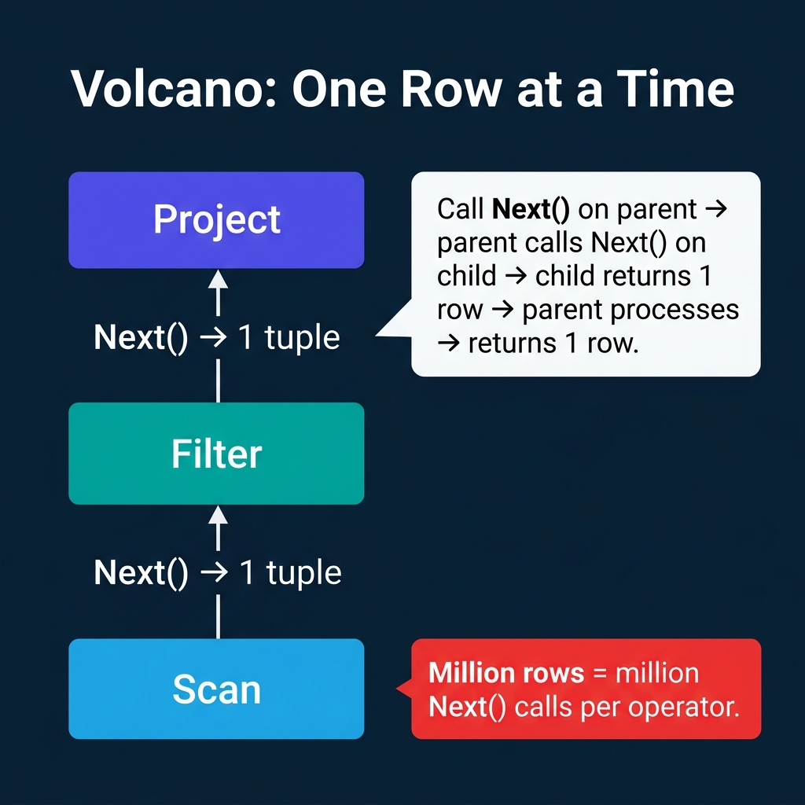
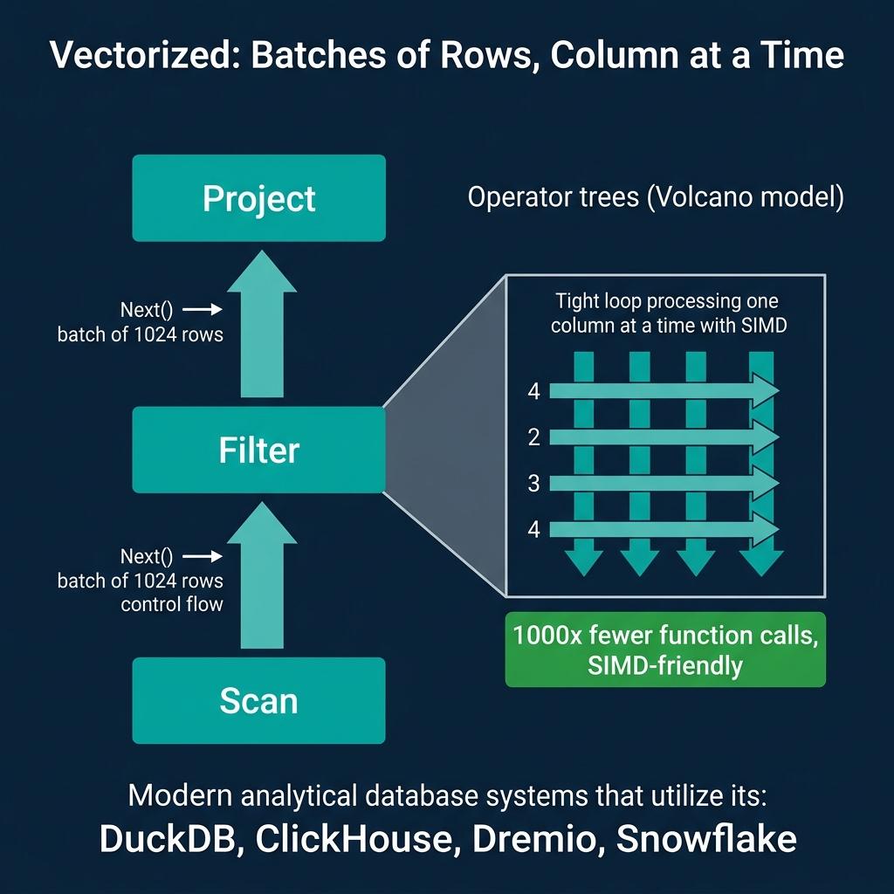
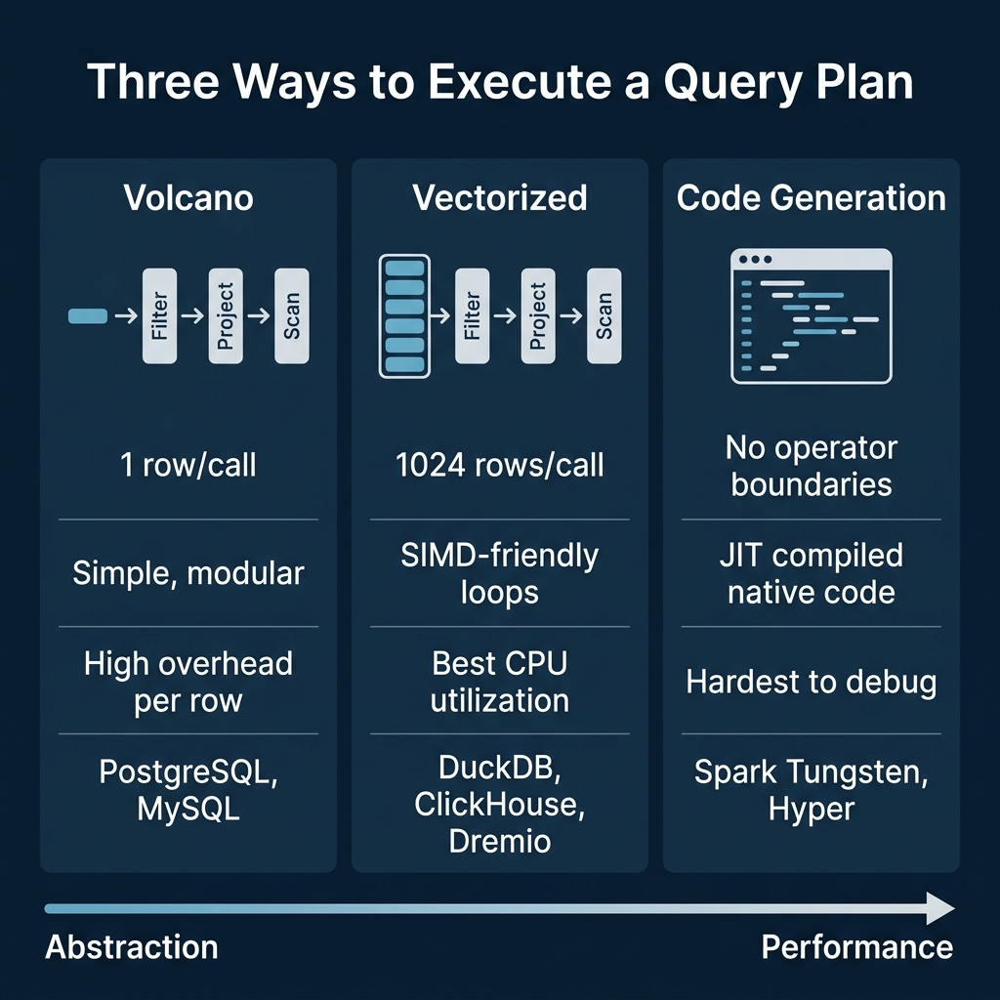

<!-- Meta Description: The Volcano model processes one row at a time. Vectorized execution processes batches with SIMD. Code generation fuses operators into compiled code. Here is how each works. -->
<!-- Primary Keyword: query execution models -->
<!-- Secondary Keywords: vectorized execution, volcano iterator model, query code generation -->

This is Part 6 of a 10-part series on query engine design. [Part 5](/2026/2026-04-qeo-05-inside-the-query-optimizer-how-engines-pick-a-plan/) covered how optimizers pick a plan. This article covers what happens next: how the engine actually processes data through the operators in that plan.

The execution model determines how data flows between operators (scan, filter, join, aggregate) and how each operator processes that data internally. The choice has a direct impact on CPU utilization, and in modern analytical engines where I/O is no longer the primary bottleneck, CPU efficiency is the performance differentiator.


## Table of Contents

1. [How Query Engines Think: The Tradeoffs Behind Every Data System](/2026/2026-04-qeo-01-how-query-engines-think-the-tradeoffs-behind-every-data-syst/)
2. [Row vs. Column: How Storage Layout Shapes Everything](/2026/2026-04-qeo-02-row-vs-column-how-storage-layout-shapes-everything/)
3. [How Databases Organize Data on Disk: Pages, Blocks, and File Formats](/2026/2026-04-qeo-03-how-databases-organize-data-on-disk-pages-blocks-and-file-fo/)
4. [B-Trees, LSM Trees, and the Indexing Tradeoff Spectrum](/2026/2026-04-qeo-04-b-trees-lsm-trees-and-the-indexing-tradeoff-spectrum/)
5. [Inside the Query Optimizer: How Engines Pick a Plan](/2026/2026-04-qeo-05-inside-the-query-optimizer-how-engines-pick-a-plan/)
6. [Volcano, Vectorized, Compiled: How Engines Execute Your Query](/2026/2026-04-qeo-06-volcano-vectorized-compiled-how-engines-execute-your-query/)
7. [Buffer Pools, Caches, and the Memory Hierarchy](/2026/2026-04-qeo-07-buffer-pools-caches-and-the-memory-hierarchy/)
8. [Partitioning, Sharding, and Data Distribution Strategies](/2026/2026-04-qeo-08-partitioning-sharding-and-data-distribution-strategies/)
9. [Hash, Sort-Merge, Broadcast: How Distributed Joins Work](/2026/2026-04-qeo-09-hash-sort-merge-broadcast-how-distributed-joins-work/)
10. [Concurrency, Isolation, and MVCC: How Engines Handle Contention](/2026/2026-04-qeo-10-concurrency-isolation-and-mvcc-how-engines-handle-contention/)

## Volcano: One Row at a Time



The Volcano model (also called the iterator model) was introduced by Goetz Graefe in 1994 and became the standard execution model for relational databases. PostgreSQL, MySQL, SQLite, and most traditional RDBMS engines use it.

Every operator implements three methods:

- **Open()**: Initialize the operator (allocate buffers, open files).
- **Next()**: Return the next row. The operator calls Next() on its child operator to get input, processes it, and returns one output row.
- **Close()**: Release resources.

The parent operator "pulls" data from its children one row at a time. A query plan tree of three operators (Scan, Filter, Project) processing 1 million rows results in 1 million Next() calls on each operator, totaling 3 million virtual function calls.

**Why it was good**: The model is elegant and modular. Adding a new operator means implementing three methods. Operators are composable: any operator can sit on top of any other. Memory usage is minimal because only one row exists in flight at any point.

**Why it struggles on modern hardware**: Those millions of virtual function calls cause two problems. First, each call has overhead (function pointer indirection, stack frame setup). Second, the CPU's branch predictor cannot predict virtual dispatch, causing pipeline stalls. For a table with a billion rows and a plan with 5 operators, that is 5 billion function calls where the CPU is stalling instead of computing.

## Vectorized: Batches of Rows, Column at a Time



Vectorized execution keeps the pull-based structure of Volcano but changes the granularity. Instead of returning one row per Next() call, each operator returns a batch (vector) of rows, typically 1024 to 4096 rows.

Inside each operator, processing happens one column at a time in tight loops. A filter operator checking `price > 100` runs a simple loop over the `price` column array:

```
for i in 0..batch_size:
    selection[i] = prices[i] > 100
```

This loop has three properties that make it fast:

1. **No virtual function calls inside the loop**. The loop body is a direct comparison, not a function pointer dispatch.
2. **CPU cache friendly**. The `prices` array is contiguous in memory. The CPU prefetcher loads the next cache line automatically.
3. **SIMD compatible**. The compiler can auto-vectorize this loop to process 4-16 values per CPU instruction using SIMD (Single Instruction, Multiple Data) instructions like AVX-256 or AVX-512.

The result: vectorized execution processes analytical queries 5-10x faster than Volcano on the same hardware, purely from CPU efficiency improvements.

DuckDB, ClickHouse, Dremio, Snowflake, and Velox (Meta's execution library) all use vectorized execution. DuckDB's implementation is particularly well-documented as a reference for the approach.

## Code Generation: Fusing Operators Into Compiled Code

Code generation (also called "compiled execution" or "query compilation") takes a different approach. Instead of passing data between separate operator objects, the engine generates a custom program for each query that fuses multiple operators into a single tight loop.

For a query `SELECT name FROM users WHERE age > 30`, instead of three separate operators (Scan, Filter, Project), the engine generates something equivalent to:

```
for each row in users_table:
    if row.age > 30:
        emit(row.name)
```

There are no operator boundaries, no Next() calls, no batch transfers. The data stays in CPU registers as long as possible. The generated code is compiled (JIT or ahead-of-time) into native machine instructions.

Apache Spark uses whole-stage code generation (Tungsten) to fuse chains of operators into single Java methods that the JVM JIT-compiles. Hyper (from the TUM database group, now part of Tableau) and its successor Umbra compile queries into native LLVM code.

**The tradeoff**: Generated code is harder to debug, profile, and maintain than modular operator trees. When something goes wrong, you are debugging auto-generated code rather than a clean operator abstraction. Adding new operator types requires integrating them into the code generator rather than implementing a simple interface.

## Morsel-Driven Parallelism

A complementary technique used by DuckDB and Hyper is morsel-driven parallelism. Instead of statically partitioning data across threads at the beginning, the engine divides data into small chunks called "morsels" (typically 10K rows) and assigns them dynamically to worker threads from a shared work queue.

When a thread finishes its morsel, it picks up the next one. If one thread is slower (due to cache misses, OS scheduling, or data skew), the other threads absorb the remaining work. This achieves near-perfect CPU utilization without the straggler problem that plagues static partitioning.

Morsel-driven parallelism works particularly well with vectorized execution: each thread processes its morsel using the same vectorized operators, and the morsel boundaries align naturally with batch sizes.

## The Abstraction vs. Performance Spectrum



| Model | Data Unit | Overhead | CPU Efficiency | Modularity | Systems |
|---|---|---|---|---|---|
| Volcano | 1 row | High (virtual calls) | Low | High | PostgreSQL, MySQL, SQLite |
| Vectorized | 1024+ rows | Low (batch amortized) | High (SIMD) | High | DuckDB, ClickHouse, Dremio, Snowflake |
| Code Gen | Continuous stream | Minimal (fused code) | Highest | Low | Spark Tungsten, Hyper |

The evolution reflects a shift in bottlenecks. When Volcano was designed in 1994, disk I/O dominated query time. The CPU overhead of per-row function calls was irrelevant compared to waiting for disk seeks. Modern SSDs and in-memory processing have made I/O fast enough that CPU efficiency now determines query performance for many analytical workloads.

## Hybrid Approaches

Some engines combine models. Spark uses code generation for simple operator chains (filter, project, aggregate) but falls back to Volcano-style iteration for complex operators (certain join types, UDFs) that are difficult to fuse.

Dremio uses vectorized execution with Apache Arrow as the in-memory columnar format. Arrow's fixed-width column arrays are designed specifically for SIMD-friendly vectorized processing, making the data format and execution model work together.

PostgreSQL has added JIT compilation (via LLVM) for expression evaluation since version 11, keeping the Volcano operator structure but compiling individual filter and projection expressions into native code. This is a targeted optimization rather than a full model change.

## When the Model Matters

For OLTP workloads (point lookups, small updates), the execution model rarely matters. A query that touches 1-10 rows does not benefit from batch processing or SIMD because the overhead per query (parsing, planning, transaction management) dominates.

For OLAP workloads (scanning millions to billions of rows), the execution model is one of the most important performance factors. A 10x difference in CPU efficiency on a query that scans 10 billion rows translates to minutes of wall-clock time.

This is why analytical engines have universally moved away from pure Volcano toward vectorized or compiled execution, while transactional engines have largely stayed with Volcano and focused their optimization efforts elsewhere (buffer management, concurrency control, index efficiency).

### Books to Go Deeper

- [Architecting the Apache Iceberg Lakehouse](https://www.amazon.com/Architecting-Apache-Iceberg-Lakehouse-open-source/dp/1633435105/) by Alex Merced (Manning)
- [Lakehouses with Apache Iceberg: Agentic Hands-on](https://www.amazon.com/Lakehouses-Apache-Iceberg-Agentic-Hands-ebook/dp/B0GQL4QNRT/) by Alex Merced
- [Constructing Context: Semantics, Agents, and Embeddings](https://www.amazon.com/Constructing-Context-Semantics-Agents-Embeddings/dp/B0GSHRZNZ5/) by Alex Merced
- [Apache Iceberg & Agentic AI: Connecting Structured Data](https://www.amazon.com/Apache-Iceberg-Agentic-Connecting-Structured/dp/B0GW2WF4PX/) by Alex Merced
- [Open Source Lakehouse: Architecting Analytical Systems](https://www.amazon.com/Open-Source-Lakehouse-Architecting-Analytical/dp/B0GW595MVL/) by Alex Merced
