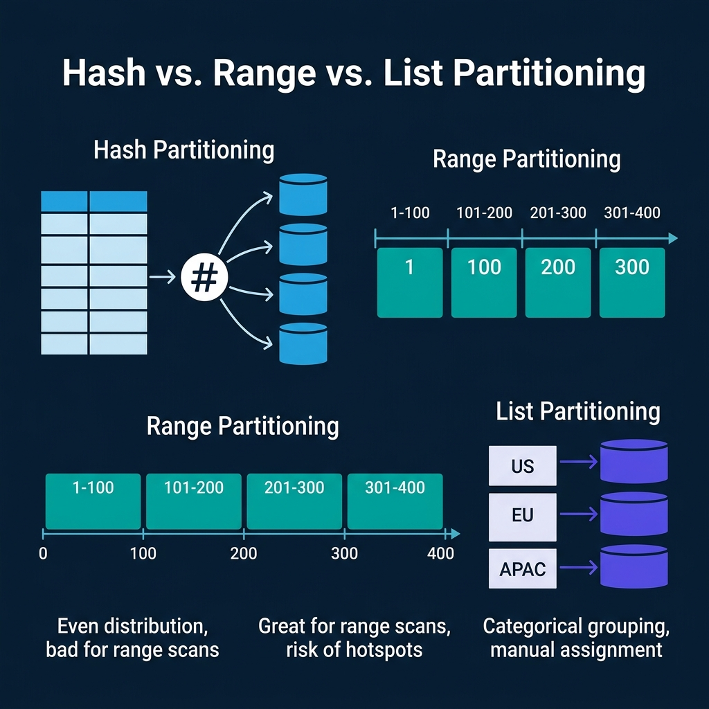
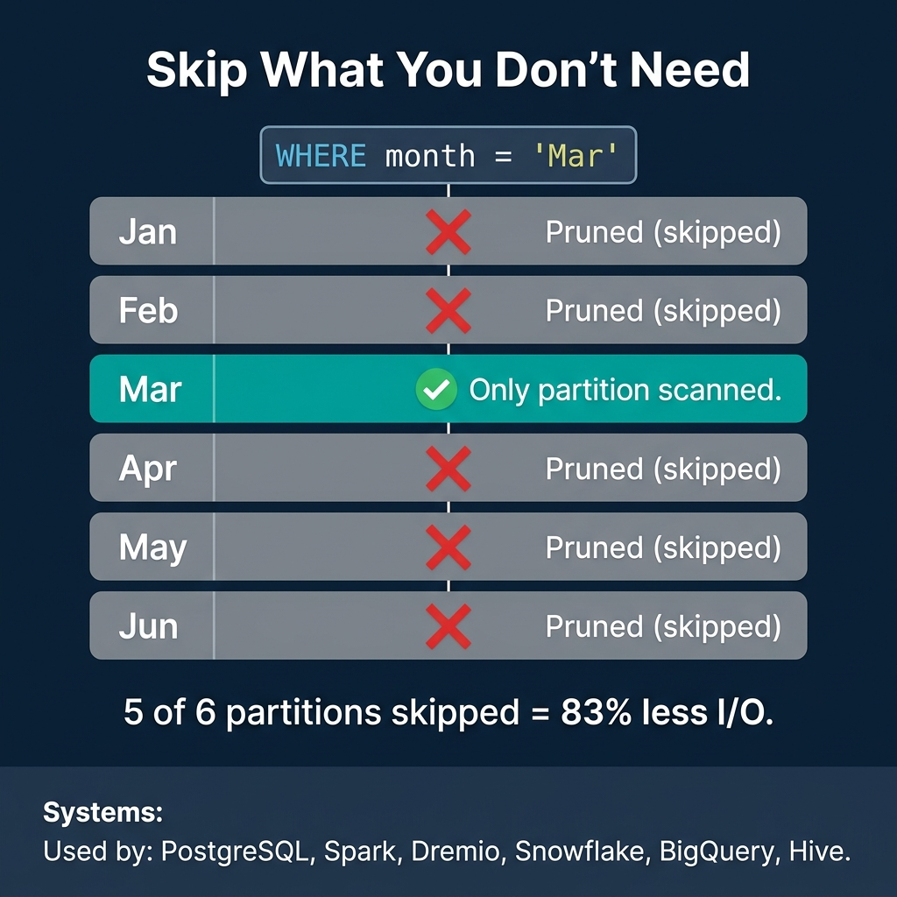
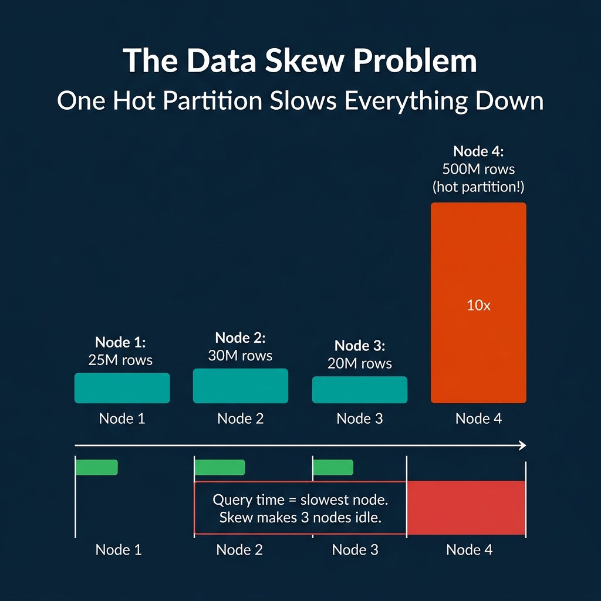

<!-- Meta Description: Hash partitioning distributes data evenly. Range partitioning enables fast range scans. Both create tradeoffs. Here is how databases divide data across storage and nodes. -->
<!-- Primary Keyword: data partitioning -->
<!-- Secondary Keywords: database sharding, partition pruning, data distribution -->

This is Part 8 of a 10-part series on query engine design. [Part 7](/2026/2026-04-qeo-07-buffer-pools-caches-and-the-memory-hierarchy/) covered memory management. This article covers how engines divide data across files, disks, or cluster nodes to enable parallel processing and reduce the amount of data each query must touch.

Partitioning answers a simple question: when a table has billions of rows, how do you avoid scanning all of them for every query? The answer is to divide the data into smaller, independent chunks and skip the chunks that cannot contain relevant data.

## Table of Contents

1. [How Query Engines Think: The Tradeoffs Behind Every Data System](/2026/2026-04-qeo-01-how-query-engines-think-the-tradeoffs-behind-every-data-syst/)
2. [Row vs. Column: How Storage Layout Shapes Everything](/2026/2026-04-qeo-02-row-vs-column-how-storage-layout-shapes-everything/)
3. [How Databases Organize Data on Disk: Pages, Blocks, and File Formats](/2026/2026-04-qeo-03-how-databases-organize-data-on-disk-pages-blocks-and-file-fo/)
4. [B-Trees, LSM Trees, and the Indexing Tradeoff Spectrum](/2026/2026-04-qeo-04-b-trees-lsm-trees-and-the-indexing-tradeoff-spectrum/)
5. [Inside the Query Optimizer: How Engines Pick a Plan](/2026/2026-04-qeo-05-inside-the-query-optimizer-how-engines-pick-a-plan/)
6. [Volcano, Vectorized, Compiled: How Engines Execute Your Query](/2026/2026-04-qeo-06-volcano-vectorized-compiled-how-engines-execute-your-query/)
7. [Buffer Pools, Caches, and the Memory Hierarchy](/2026/2026-04-qeo-07-buffer-pools-caches-and-the-memory-hierarchy/)
8. [Partitioning, Sharding, and Data Distribution Strategies](/2026/2026-04-qeo-08-partitioning-sharding-and-data-distribution-strategies/)
9. [Hash, Sort-Merge, Broadcast: How Distributed Joins Work](/2026/2026-04-qeo-09-hash-sort-merge-broadcast-how-distributed-joins-work/)
10. [Concurrency, Isolation, and MVCC: How Engines Handle Contention](/2026/2026-04-qeo-10-concurrency-isolation-and-mvcc-how-engines-handle-contention/)

## Hash Partitioning

Hash partitioning applies a hash function to a partition key and assigns each row to a bucket based on the hash value. With 4 partitions and a hash of `customer_id`, rows are distributed as `hash(customer_id) % 4`.

**Strengths**: Even data distribution regardless of key distribution. No hotspots unless the hash function is poorly chosen. Good for point lookups on the partition key (the engine hashes the lookup value and checks only the matching partition).

**Weaknesses**: Range scans are expensive. A query like `WHERE customer_id BETWEEN 1000 AND 2000` must check all partitions because the hash function scatters sequential keys across buckets. Adding or removing partitions requires re-hashing and redistributing most of the data.

**Used by**: CockroachDB (hash-based ranges), Cassandra (consistent hashing), DynamoDB (hash partitions), Spark (default shuffle partitioning), Dremio (hash distribution for distributed execution).

## Range Partitioning

Range partitioning divides the key space into contiguous ranges. Each partition owns a specific range of values. A date-partitioned table might have one partition per month: all January 2024 data in one partition, all February 2024 data in another.

**Strengths**: Range scans on the partition key are fast because the engine reads only the partitions whose ranges overlap the query filter. Time-based queries on date-partitioned tables scan only the relevant months. This is the most common partitioning strategy for analytical data.

**Weaknesses**: Susceptible to data skew. If most orders arrive in December, the December partition is much larger than June. Susceptible to write hotspots: in a time-partitioned table, all current writes go to the latest partition.

**Used by**: PostgreSQL (native table partitioning), Hive (directory-based partitioning by date/region), Apache Iceberg (partition transforms including year, month, day, hour), BigQuery (partitioned tables by date), Dremio (reads and writes Iceberg partitioned tables).

## List Partitioning

List partitioning assigns specific discrete values to specific partitions. A `region` column might map `US` to partition 1, `EU` to partition 2, `APAC` to partition 3.

**Strengths**: Queries filtering on the partition column skip all other partitions. Data is grouped by business-meaningful categories.

**Weaknesses**: Uneven distribution if some values have far more rows than others. New values require manually creating or updating partition definitions.

**Used by**: PostgreSQL (list partitioning), Oracle (list partitioning), MySQL (list partitioning).

## Partition Pruning: The Primary Performance Win

The biggest performance benefit of partitioning is not parallelism. It is pruning: the optimizer's ability to skip partitions that cannot contain matching data.

A table partitioned by month with a query `WHERE month = 'Mar'` scans only the March partition and skips the other five. That is 83% less I/O with zero changes to the query. For a table partitioned into 365 daily partitions, a query on one day skips 99.7% of the data.

Partition pruning is supported by PostgreSQL, Spark, Dremio, Snowflake, BigQuery, Hive, Trino, and essentially every analytical engine. It is often the single largest performance optimization available for large tables.

Apache Iceberg improves on traditional partitioning with **hidden partitioning**: the partition values are derived from data columns using transforms (year, month, day, hour, truncate, bucket) and stored in manifest metadata. Users write queries using the original columns (`WHERE order_date > '2024-03-01'`) and the engine automatically prunes based on the partition structure without users needing to know the physical layout.

## Bucketing and Clustering

Bucketing (Hive, Spark) and clustering (BigQuery, Snowflake, Dremio) go beyond partitioning by organizing data within partitions.

**Bucketing** hashes data by a key into a fixed number of buckets within each partition. If two tables are bucketed by the same key into the same number of buckets, they can be joined without a shuffle because matching keys are guaranteed to be in the same bucket. This is called a bucket join or sort-merge bucket join.

**Clustering** sorts data within files by a designated column. This makes zone maps (min/max statistics) more effective because sorting clusters similar values together, narrowing the min/max range per file. A file where `customer_id` ranges from 1 to 1,000,000 has a useless zone map for selective filters. A file where `customer_id` ranges from 500 to 600 will be skipped by any filter outside that range.

Dremio automates clustering through its table optimization jobs. When Dremio compacts an Iceberg table, it sorts the data by frequently filtered columns, tightening the min/max ranges and improving subsequent query pruning without manual intervention.

## The Data Skew Problem

Partitioning assumes that data is distributed somewhat evenly across partitions. When it is not, one partition becomes a bottleneck.

In a distributed engine, query time equals the time of the slowest node. If one node processes 500M rows while three others process 25M each, those three nodes sit idle waiting for the straggler. The cluster's effective throughput drops to one-quarter of its capacity.

Skew arises from several sources:
- **Natural data distribution**: A few customers generate most of the orders. A few products account for most of the sales.
- **Time-based partitioning**: Recent partitions have more data than old ones in growing systems.
- **Key cardinality**: Partitioning by a low-cardinality column (status, region) creates few large partitions.

**Mitigation strategies**:
- **Salting**: Add a random component to the partition key to spread hot keys across multiple partitions. Queries must then scan all salt values.
- **Adaptive partition splitting**: Spark AQE detects skewed partitions during shuffle and splits them automatically.
- **Composite partitioning**: Partition by date at the top level and hash within each date partition.
- **Dynamic resource allocation**: Some cloud engines allocate more compute to larger partitions.

## Where Real Systems Land

| System | Partitioning Strategy | Pruning | Clustering | Skew Handling |
|---|---|---|---|---|
| PostgreSQL | Range, list, hash (native) | Yes | Manual (CLUSTER command) | Manual |
| Spark | Hash (shuffle), range (sort) | Yes | Bucketing | AQE skew join |
| Hive | Directory-based (date, region) | Yes | Bucketing | Manual |
| Dremio | Iceberg hidden partitioning | Yes (manifest-level) | Automatic (table optimization) | Adaptive |
| Snowflake | Micro-partitions (auto) | Yes (pruning via metadata) | Clustering keys | Automatic |
| BigQuery | Date/integer range, ingestion time | Yes | Clustering columns | Automatic |
| Cassandra | Consistent hash (partition key) | Token-range pruning | Clustering columns (within partition) | Virtual nodes |

The tradeoff in every partitioning decision is specificity vs. flexibility. The more you optimize the partition scheme for one query pattern (e.g., filter by date), the worse other patterns become (e.g., filter by customer). Choosing the right partition key requires understanding which queries dominate your workload.

### Books to Go Deeper

- [Architecting the Apache Iceberg Lakehouse](https://www.amazon.com/Architecting-Apache-Iceberg-Lakehouse-open-source/dp/1633435105/) by Alex Merced (Manning)
- [Lakehouses with Apache Iceberg: Agentic Hands-on](https://www.amazon.com/Lakehouses-Apache-Iceberg-Agentic-Hands-ebook/dp/B0GQL4QNRT/) by Alex Merced
- [Constructing Context: Semantics, Agents, and Embeddings](https://www.amazon.com/Constructing-Context-Semantics-Agents-Embeddings/dp/B0GSHRZNZ5/) by Alex Merced
- [Apache Iceberg & Agentic AI: Connecting Structured Data](https://www.amazon.com/Apache-Iceberg-Agentic-Connecting-Structured/dp/B0GW2WF4PX/) by Alex Merced
- [Open Source Lakehouse: Architecting Analytical Systems](https://www.amazon.com/Open-Source-Lakehouse-Architecting-Analytical/dp/B0GW595MVL/) by Alex Merced
