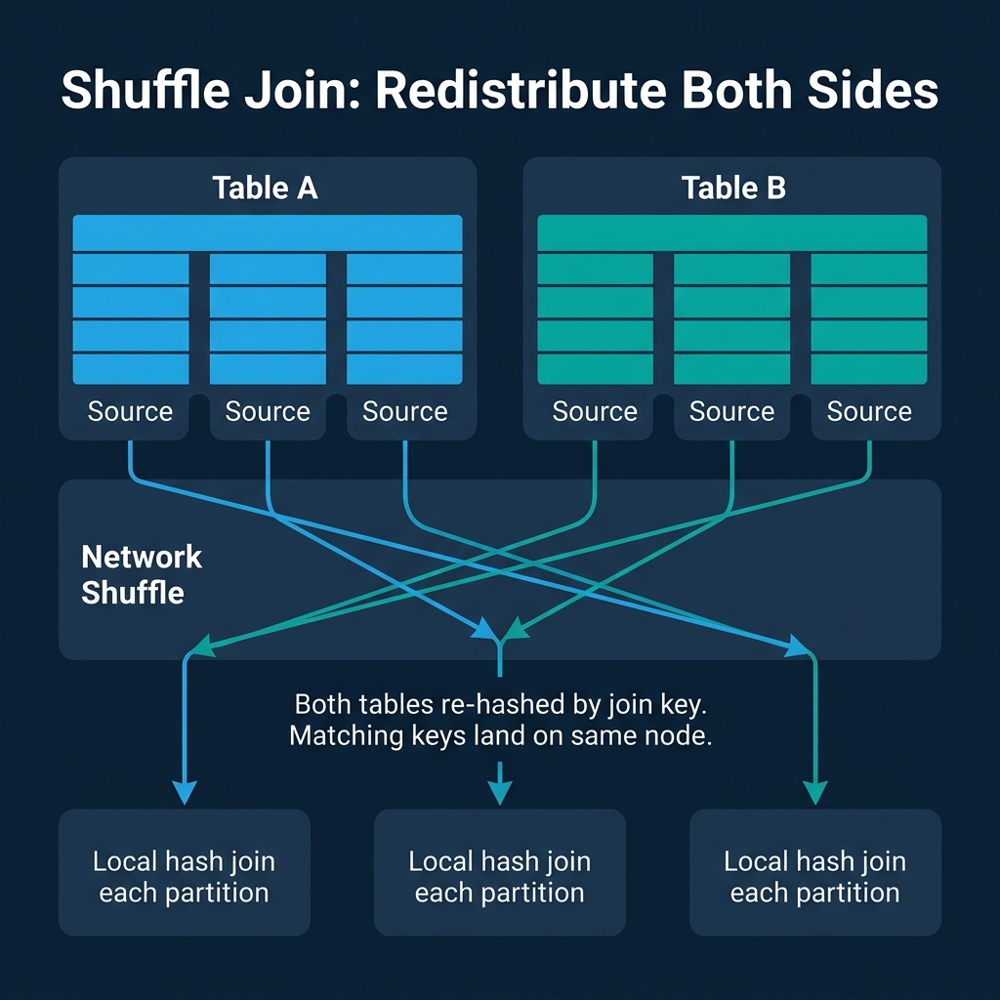
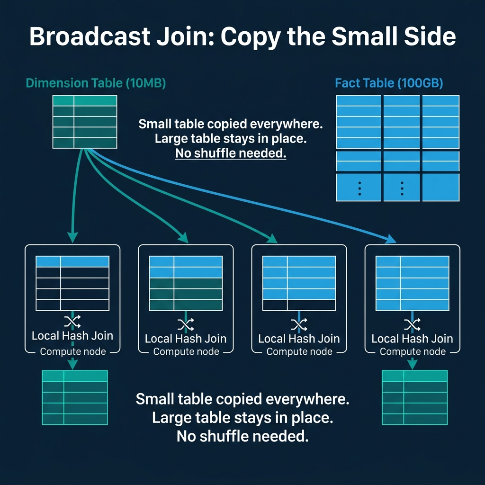
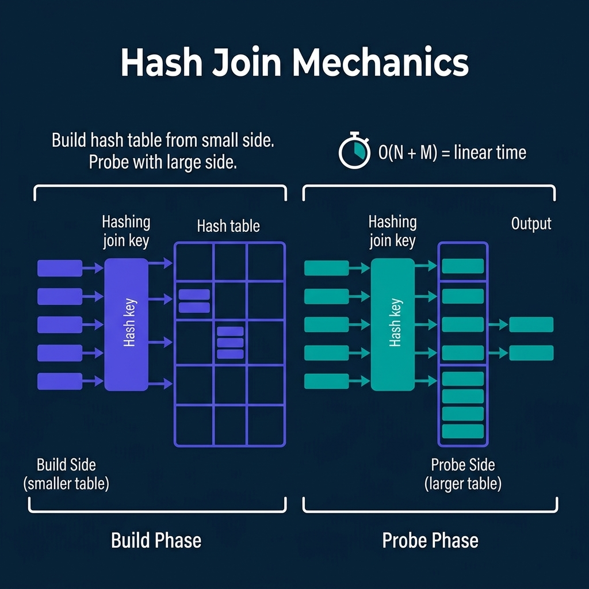

<!-- Meta Description: Distributed joins move data across the network using shuffle, broadcast, or co-location strategies. Here is how each works and when engines choose which. -->
<!-- Primary Keyword: distributed join algorithms -->
<!-- Secondary Keywords: shuffle join, broadcast join, hash join database -->

This is Part 9 of a 10-part series on query engine design. [Part 8](/2026/2026-04-qeo-08-partitioning-sharding-and-data-distribution-strategies/) covered partitioning. This article covers the most expensive operation in distributed query processing: joining two tables whose data lives on different nodes.

In a single-node database, a join is a CPU-bound operation. In a distributed engine, it becomes a network-bound operation because the data for matching rows may live on different machines. The choice of join strategy determines how much data moves across the network, and network I/O is typically the bottleneck in distributed query execution.

## Table of Contents

1. [How Query Engines Think: The Tradeoffs Behind Every Data System](/2026/2026-04-qeo-01-how-query-engines-think-the-tradeoffs-behind-every-data-syst/)
2. [Row vs. Column: How Storage Layout Shapes Everything](/2026/2026-04-qeo-02-row-vs-column-how-storage-layout-shapes-everything/)
3. [How Databases Organize Data on Disk: Pages, Blocks, and File Formats](/2026/2026-04-qeo-03-how-databases-organize-data-on-disk-pages-blocks-and-file-fo/)
4. [B-Trees, LSM Trees, and the Indexing Tradeoff Spectrum](/2026/2026-04-qeo-04-b-trees-lsm-trees-and-the-indexing-tradeoff-spectrum/)
5. [Inside the Query Optimizer: How Engines Pick a Plan](/2026/2026-04-qeo-05-inside-the-query-optimizer-how-engines-pick-a-plan/)
6. [Volcano, Vectorized, Compiled: How Engines Execute Your Query](/2026/2026-04-qeo-06-volcano-vectorized-compiled-how-engines-execute-your-query/)
7. [Buffer Pools, Caches, and the Memory Hierarchy](/2026/2026-04-qeo-07-buffer-pools-caches-and-the-memory-hierarchy/)
8. [Partitioning, Sharding, and Data Distribution Strategies](/2026/2026-04-qeo-08-partitioning-sharding-and-data-distribution-strategies/)
9. [Hash, Sort-Merge, Broadcast: How Distributed Joins Work](/2026/2026-04-qeo-09-hash-sort-merge-broadcast-how-distributed-joins-work/)
10. [Concurrency, Isolation, and MVCC: How Engines Handle Contention](/2026/2026-04-qeo-10-concurrency-isolation-and-mvcc-how-engines-handle-contention/)

## The Fundamental Problem

To join two tables on a key, matching rows must end up on the same compute node. If Table A's row with `customer_id = 42` is on Node 1 and Table B's row with `customer_id = 42` is on Node 3, one of those rows must move before the join can happen.

Distributed engines have three strategies for solving this: shuffle both tables, broadcast the small one, or pre-arrange the data so matching keys are already co-located.

## Shuffle Join: Redistribute Both Sides

The shuffle join (also called repartition join or hash-exchange join) is the default strategy for joining two large tables. Both tables are re-hashed by the join key and redistributed across the cluster so that all rows with the same join key value land on the same destination node.

**How it works**:
1. Each node reads its local portion of Table A, hashes each row's join key, and sends it to the appropriate destination node.
2. Each node does the same for Table B.
3. Each destination node now has all matching rows from both tables and performs a local join.

**When it is used**: Two large tables where neither is small enough to broadcast. This is the most common scenario for analytical joins (fact-to-fact joins, large table self-joins).

**The cost**: Every row of both tables is sent over the network. For two 100 GB tables, the shuffle moves up to 200 GB of data across the cluster. Network bandwidth becomes the bottleneck.

**Used by**: Spark (default shuffle join), Dremio, Snowflake, Trino, BigQuery, Redshift. Every distributed analytical engine implements shuffle joins.

## Broadcast Join: Copy the Small Side

When one side of the join is small enough to fit in memory on each node, broadcasting it is far cheaper than shuffling both sides.

**How it works**:
1. The small table (the "build side") is read in full and sent to every node in the cluster.
2. Each node builds an in-memory hash table from the broadcast data.
3. Each node scans its local portion of the large table and probes the hash table for matches.

**When it is used**: Fact-to-dimension joins where the dimension table is small (typically under a few hundred MB). A 10 MB dimension table broadcast to 100 nodes costs 1 GB of network transfer. Shuffling both a 10 MB table and a 100 GB table would cost over 100 GB of transfer.

**The risk**: If the optimizer incorrectly estimates the small table's size and broadcasts a table that is actually large, every node receives a huge copy. This can cause out-of-memory errors and is one of the most common performance disasters in distributed engines.

**Used by**: Spark (broadcast hint or auto-broadcast threshold), Dremio (automatic broadcast decisions), Snowflake (automatic), Trino (broadcast join), BigQuery (automatic).

## Co-Located Join: No Data Movement

The fastest distributed join is one where no data moves at all. If both tables are already partitioned by the join key with the same number of partitions, matching keys are guaranteed to be on the same node. Each node performs a local join independently.

**When it is used**: Both tables were deliberately bucketed/partitioned by the same key. This requires planning at data load time. In Spark, this means both tables are bucketed by the join key into the same number of buckets. In Iceberg, this means both tables are partitioned with matching partition transforms.

**The tradeoff**: You are locking in a specific physical layout at write time to benefit one join pattern. Queries that join on a different key do not benefit and still require shuffles. This is a deliberate investment in one access pattern at the cost of flexibility.

**Used by**: Spark (bucket joins), Hive (sort-merge bucket joins), Dremio (co-located joins on matching Iceberg partitions).

## Local Join Algorithms: Hash vs. Sort-Merge

Once matching rows are on the same node (via shuffle, broadcast, or co-location), the engine performs a local join using one of two algorithms.

### Hash Join

**Build phase**: Read the smaller table and insert each row into an in-memory hash table, keyed by the join column.

**Probe phase**: Read the larger table row by row. For each row, hash the join key and look up the matching bucket in the hash table. Emit matching pairs.

**Complexity**: O(N + M) where N and M are the sizes of the two tables. Linear time.

**Strengths**: Fast when the build side fits in memory. No sorting required.

**Weaknesses**: If the build side is too large for memory, the engine must use a grace hash join or hybrid hash join that spills partitions to disk, significantly increasing I/O.

**Used by**: Every analytical engine (Dremio, Spark, Snowflake, DuckDB, ClickHouse, Trino, Redshift, BigQuery) defaults to hash joins for equi-joins.

### Sort-Merge Join

**Sort phase**: Sort both tables by the join key. If either table is already sorted (from an index or previous sort operation), this phase is skipped.

**Merge phase**: Walk through both sorted tables simultaneously. When join keys match, emit the pair. When one side is ahead, advance the other.

**Complexity**: O(N log N + M log M) for sorting, plus O(N + M) for merging.

**Strengths**: Handles very large datasets gracefully because sorting can use external sort (spill to disk in sorted runs). Does not require the build side to fit in memory. If the data is already sorted, the merge phase alone is O(N + M) with no memory pressure.

**Weaknesses**: Sorting is expensive. For unsorted data, hash join is almost always faster.

**Used by**: PostgreSQL (merge join), Spark (sort-merge join, the default when tables are large), Oracle (sort-merge join option). Dremio and Snowflake generally prefer hash joins and fall back to sort-merge when memory is constrained.

## How Optimizers Choose

The optimizer selects a join strategy based on table sizes, data distribution, and available resources:

| Decision | Condition | Strategy |
|---|---|---|
| One side is small (< broadcast threshold) | Dimension table < 100 MB | **Broadcast join** |
| Both sides are large, not co-located | Fact-to-fact join | **Shuffle + hash join** |
| Both sides bucketed by join key | Pre-planned layout | **Co-located join** |
| Memory constrained, large tables | Hash table spills | **Shuffle + sort-merge join** |
| Data is skewed | One join key dominates | **Skew-aware shuffle** (split hot keys) |

Spark's Adaptive Query Execution can change this decision at runtime. If a shuffle reveals that one side is actually small, AQE converts the shuffle join to a broadcast join mid-flight. Dremio makes similar adaptive decisions based on runtime statistics.

## The Network Bottleneck

In distributed analytics, the network is usually the bottleneck for join-heavy queries. A rough hierarchy of join costs:

1. **Co-located join**: 0 bytes transferred. Free.
2. **Broadcast join (small side)**: Small table size x number of nodes. Cheap.
3. **Shuffle join**: Both table sizes transferred. Expensive.
4. **Broadcast join (large side, mistaken)**: Large table size x number of nodes. Catastrophic.

This is why data engineers spend time on partitioning and bucketing strategies: every byte that does not need to move across the network is a byte that does not cost time.

### Books to Go Deeper

- [Architecting the Apache Iceberg Lakehouse](https://www.amazon.com/Architecting-Apache-Iceberg-Lakehouse-open-source/dp/1633435105/) by Alex Merced (Manning)
- [Lakehouses with Apache Iceberg: Agentic Hands-on](https://www.amazon.com/Lakehouses-Apache-Iceberg-Agentic-Hands-ebook/dp/B0GQL4QNRT/) by Alex Merced
- [Constructing Context: Semantics, Agents, and Embeddings](https://www.amazon.com/Constructing-Context-Semantics-Agents-Embeddings/dp/B0GSHRZNZ5/) by Alex Merced
- [Apache Iceberg & Agentic AI: Connecting Structured Data](https://www.amazon.com/Apache-Iceberg-Agentic-Connecting-Structured/dp/B0GW2WF4PX/) by Alex Merced
- [Open Source Lakehouse: Architecting Analytical Systems](https://www.amazon.com/Open-Source-Lakehouse-Architecting-Analytical/dp/B0GW595MVL/) by Alex Merced
