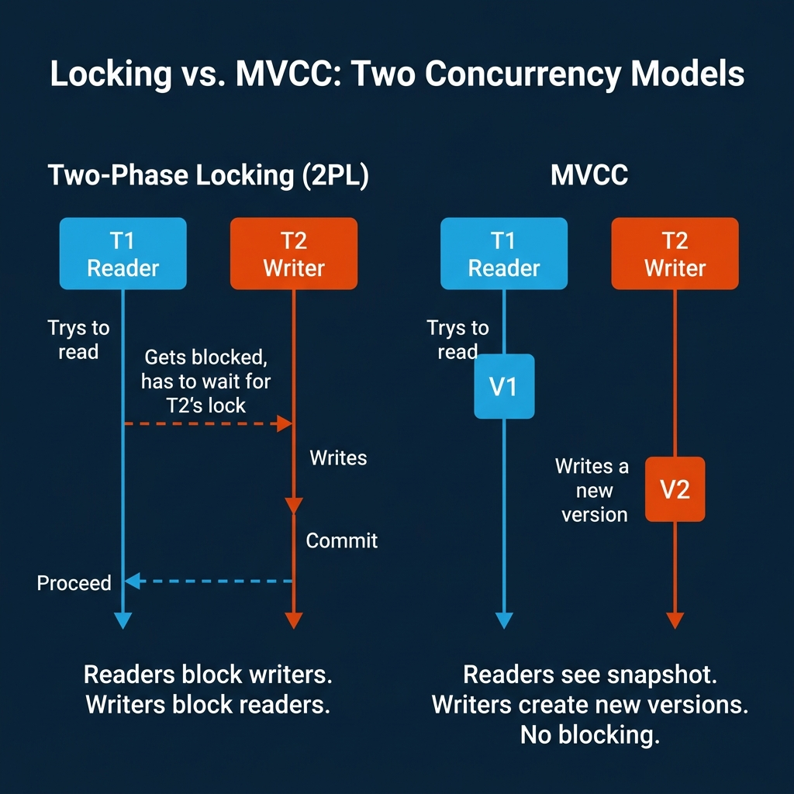
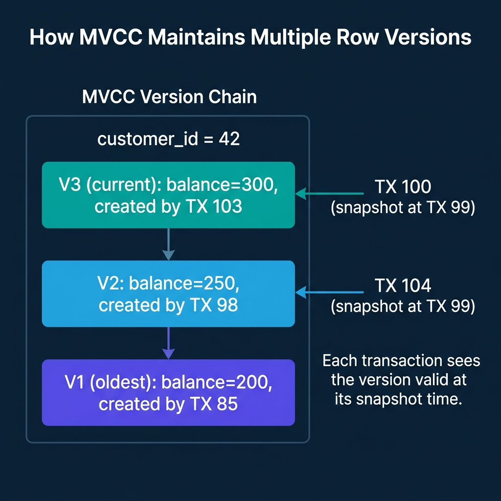
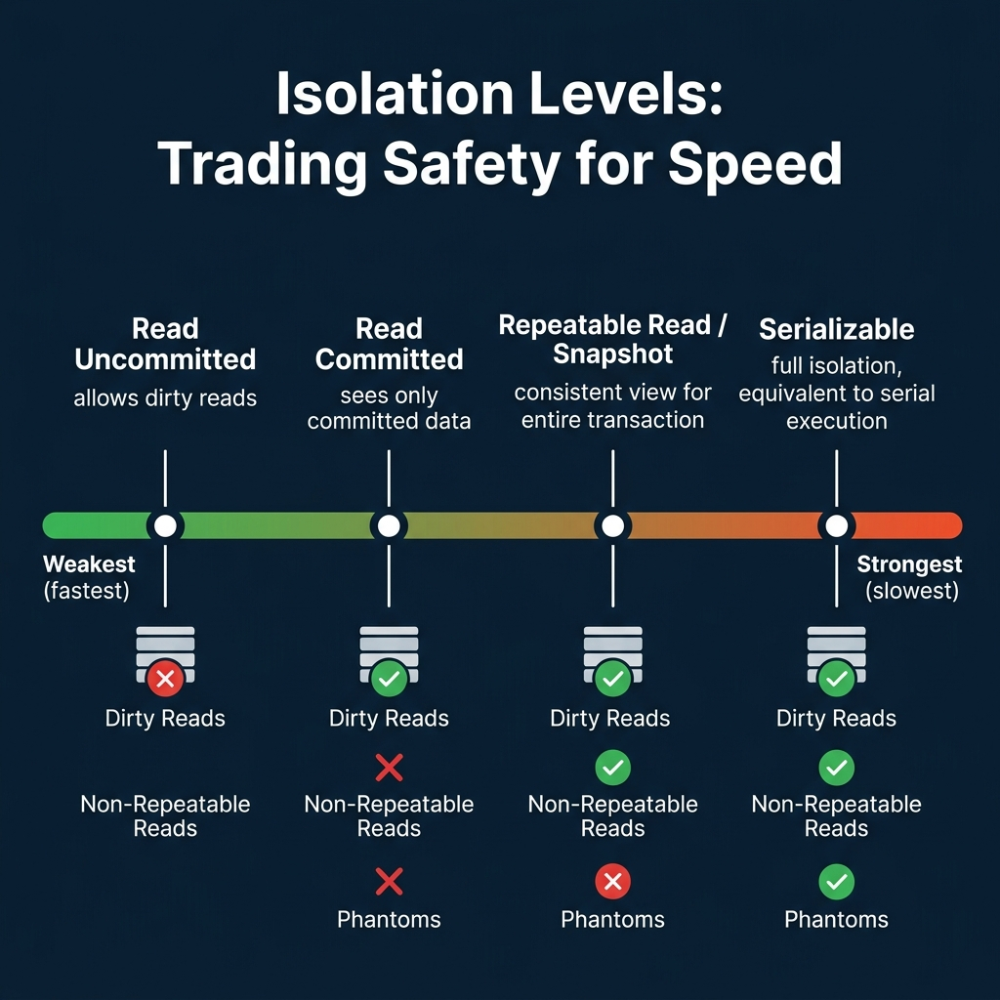

<!-- Meta Description: Databases handle concurrent access using locks, MVCC, or optimistic concurrency control. Here is how each approach works and what tradeoffs each creates. -->
<!-- Primary Keyword: database concurrency control -->
<!-- Secondary Keywords: MVCC database, isolation levels, optimistic concurrency control -->

This is Part 10 of a 10-part series on query engine design. [Part 9](/2026/2026-04-qeo-09-hash-sort-merge-broadcast-how-distributed-joins-work/) covered distributed joins. This final article covers how engines handle the inevitable conflict when multiple users read and write the same data simultaneously.

Every production database serves multiple concurrent users. Without concurrency control, simultaneous reads and writes produce corrupted data, inconsistent query results, or both. The question is not whether to control concurrency, but how much control to impose and what performance to sacrifice for it.

## Table of Contents

1. [How Query Engines Think: The Tradeoffs Behind Every Data System](/2026/2026-04-qeo-01-how-query-engines-think-the-tradeoffs-behind-every-data-syst/)
2. [Row vs. Column: How Storage Layout Shapes Everything](/2026/2026-04-qeo-02-row-vs-column-how-storage-layout-shapes-everything/)
3. [How Databases Organize Data on Disk: Pages, Blocks, and File Formats](/2026/2026-04-qeo-03-how-databases-organize-data-on-disk-pages-blocks-and-file-fo/)
4. [B-Trees, LSM Trees, and the Indexing Tradeoff Spectrum](/2026/2026-04-qeo-04-b-trees-lsm-trees-and-the-indexing-tradeoff-spectrum/)
5. [Inside the Query Optimizer: How Engines Pick a Plan](/2026/2026-04-qeo-05-inside-the-query-optimizer-how-engines-pick-a-plan/)
6. [Volcano, Vectorized, Compiled: How Engines Execute Your Query](/2026/2026-04-qeo-06-volcano-vectorized-compiled-how-engines-execute-your-query/)
7. [Buffer Pools, Caches, and the Memory Hierarchy](/2026/2026-04-qeo-07-buffer-pools-caches-and-the-memory-hierarchy/)
8. [Partitioning, Sharding, and Data Distribution Strategies](/2026/2026-04-qeo-08-partitioning-sharding-and-data-distribution-strategies/)
9. [Hash, Sort-Merge, Broadcast: How Distributed Joins Work](/2026/2026-04-qeo-09-hash-sort-merge-broadcast-how-distributed-joins-work/)
10. [Concurrency, Isolation, and MVCC: How Engines Handle Contention](/2026/2026-04-qeo-10-concurrency-isolation-and-mvcc-how-engines-handle-contention/)

## The Core Problem

Consider two transactions running simultaneously:

- **Transaction A** reads a customer's balance (currently $500) and subtracts $100.
- **Transaction B** reads the same balance ($500) and subtracts $200.

Without concurrency control, both transactions read $500, compute their results independently, and write back. Transaction A writes $400. Transaction B overwrites it with $300. The correct result ($200) is never produced. This is a lost update, and it destroys data integrity.

## Two-Phase Locking (2PL)

The oldest approach is locking. Two-Phase Locking enforces a simple rule: a transaction must acquire all the locks it needs before releasing any of them.

**Shared locks** allow multiple readers but block writers. **Exclusive locks** block both readers and writers. When Transaction B tries to write a row that Transaction A holds a shared lock on, Transaction B waits until A releases the lock.

**Strengths**: Correctness is straightforward. If you hold the lock, no one else can interfere.

**Weaknesses**: Readers block writers. Writers block readers. Under high concurrency, transactions spend more time waiting for locks than doing useful work. **Deadlocks** arise when two transactions each hold a lock the other needs. The engine must detect the cycle and abort one transaction.

MySQL/InnoDB uses row-level locking for write operations. SQL Server uses lock escalation (row to page to table) when too many individual locks are held. Both systems also implement MVCC to reduce reader-writer conflicts.

## MVCC: Readers Never Block

Multi-Version Concurrency Control solves the reader-writer conflict by keeping multiple versions of each row. Writers create new versions instead of overwriting the current one. Readers see the version that was current when their transaction started.

**How it works**:

1. Each transaction gets a snapshot identifier when it starts (typically a transaction ID or timestamp).
2. When a transaction reads a row, the engine walks the version chain and returns the most recent version that was committed before the transaction's snapshot.
3. When a transaction writes a row, it creates a new version. The old version remains available for transactions that started earlier.
4. A background garbage collection process (PostgreSQL calls it VACUUM) removes old versions that no transaction can see anymore.

**The key property**: Readers never block and are never blocked. A long-running analytical query sees a consistent snapshot of the entire database as it existed at the moment the query started, even if other transactions commit changes during execution.

**Weaknesses**: Version storage consumes space. PostgreSQL stores old versions in the heap table itself, requiring VACUUM to reclaim space. If VACUUM falls behind, the table bloats and performance degrades. Oracle and MySQL/InnoDB store old versions in a separate undo log, which is cleaner but adds complexity.

PostgreSQL, Oracle, MySQL/InnoDB, SQL Server, CockroachDB, DuckDB, Snowflake, and Dremio all use MVCC. It is the dominant concurrency control mechanism in modern databases.

## Isolation Levels

The SQL standard defines four isolation levels that control what anomalies a transaction can observe:

| Level | Prevents | Allows | Performance |
|---|---|---|---|
| **Read Uncommitted** | Nothing | Dirty reads, non-repeatable reads, phantoms | Fastest |
| **Read Committed** | Dirty reads | Non-repeatable reads, phantoms | Fast |
| **Repeatable Read** | Dirty reads, non-repeatable reads | Phantoms (in some systems) | Moderate |
| **Serializable** | All anomalies | Nothing | Slowest |

**Dirty read**: Transaction A sees uncommitted changes from Transaction B. If B rolls back, A has acted on data that never existed.

**Non-repeatable read**: Transaction A reads a row, Transaction B modifies and commits it, Transaction A reads the same row and gets a different value.

**Phantom**: Transaction A runs a query with a range condition, Transaction B inserts a new row matching that condition and commits, Transaction A re-runs the query and gets an extra row.

Most production systems default to **Read Committed** (PostgreSQL, Oracle, SQL Server) or **Repeatable Read** (MySQL/InnoDB). **Serializable** provides the strongest guarantees but at the highest cost: either through strict two-phase locking (which reduces concurrency) or serializable snapshot isolation (which detects conflicts and aborts transactions).

## Optimistic Concurrency Control (OCC)

OCC takes the opposite approach from locking: assume conflicts are rare and do not acquire locks during the transaction. Instead, the transaction reads and writes freely, then checks for conflicts at commit time.

1. **Read phase**: The transaction executes all reads and writes in a local workspace.
2. **Validation phase**: At commit time, the engine checks whether any data the transaction read was modified by another committed transaction since it started.
3. **Write phase**: If validation passes, the changes are written permanently. If not, the transaction is aborted and must retry.

**Strengths**: No lock contention during execution. If conflicts are truly rare, OCC achieves high throughput because transactions never wait.

**Weaknesses**: If conflicts are frequent, transactions are repeatedly aborted and retried, wasting all the work done before validation. OCC works well when contention is low and transactions are short.

CockroachDB and TiDB use forms of optimistic concurrency control. Google Spanner uses a hybrid approach.

## How Lakehouse Table Formats Handle Concurrency

Apache Iceberg, Delta Lake, and Apache Hudi take a fundamentally different approach to concurrency because they operate on immutable files in object storage rather than mutable database pages.

**Iceberg's approach**: Writes produce new data files and new metadata files (manifests, snapshot). The commit is an atomic pointer swap of the metadata file. Concurrent writers that do not conflict (e.g., inserting into different partitions) both succeed via optimistic concurrency with retry. Conflicting writes (e.g., both deleting the same rows) are detected at commit time and one writer retries.

Readers always see a consistent snapshot because they read from a fixed snapshot pointer. There is no locking, no blocking, and no VACUUM needed. Old snapshots and their data files are cleaned up by an explicit expire_snapshots operation.

This model is why lakehouse engines like Dremio, Spark, and Trino can run long analytical queries concurrently with ongoing data ingestion without any interference. The reader sees the snapshot that existed when the query started; the writer creates a new snapshot that future queries will see.

## Where Real Systems Land

| System | Primary Mechanism | Default Isolation | Write Conflicts | Garbage Collection |
|---|---|---|---|---|
| PostgreSQL | MVCC (heap-stored versions) | Read Committed | Row-level locking | VACUUM (autovacuum) |
| MySQL/InnoDB | MVCC (undo log) + row locks | Repeatable Read | Row-level locking | Purge thread |
| Oracle | MVCC (undo tablespace) | Read Committed | Row-level locking | Automatic undo management |
| CockroachDB | MVCC + OCC | Serializable | Optimistic with retry | GC job |
| DuckDB | MVCC | Snapshot | Single-writer lock | Automatic |
| Snowflake | MVCC (micro-partition versioning) | Read Committed | Automatic conflict detection | Automatic |
| Dremio + Iceberg | Snapshot isolation (immutable files) | Snapshot | Optimistic commit with retry | expire_snapshots |
| Spark + Delta Lake | Optimistic concurrency (transaction log) | Snapshot / Serializable | Conflict detection at commit | VACUUM |

## The Fundamental Tradeoff

Every concurrency control mechanism trades throughput for correctness guarantees:

- **Stronger isolation** (Serializable, strict locking) prevents more anomalies but reduces the number of transactions that can run concurrently.
- **Weaker isolation** (Read Committed, optimistic) allows more concurrent transactions but permits anomalies that application code must handle.
- **MVCC with snapshot isolation** provides a pragmatic middle ground: readers never block, writers are serialized on conflicting rows, and the only anomaly permitted (write skew) is rare in most applications.

Most analytical engines (Dremio, Snowflake, BigQuery, DuckDB) default to snapshot isolation because analytical workloads are read-heavy with infrequent writes. The readers-never-block property of MVCC is exactly what long-running analytical queries need.

There is no single best concurrency control strategy. The right choice depends on your ratio of reads to writes, the frequency of conflicts, and how much application complexity you are willing to accept.

### Books to Go Deeper

- [Architecting the Apache Iceberg Lakehouse](https://www.amazon.com/Architecting-Apache-Iceberg-Lakehouse-open-source/dp/1633435105/) by Alex Merced (Manning)
- [Lakehouses with Apache Iceberg: Agentic Hands-on](https://www.amazon.com/Lakehouses-Apache-Iceberg-Agentic-Hands-ebook/dp/B0GQL4QNRT/) by Alex Merced
- [Constructing Context: Semantics, Agents, and Embeddings](https://www.amazon.com/Constructing-Context-Semantics-Agents-Embeddings/dp/B0GSHRZNZ5/) by Alex Merced
- [Apache Iceberg & Agentic AI: Connecting Structured Data](https://www.amazon.com/Apache-Iceberg-Agentic-Connecting-Structured/dp/B0GW2WF4PX/) by Alex Merced
- [Open Source Lakehouse: Architecting Analytical Systems](https://www.amazon.com/Open-Source-Lakehouse-Architecting-Analytical/dp/B0GW595MVL/) by Alex Merced
