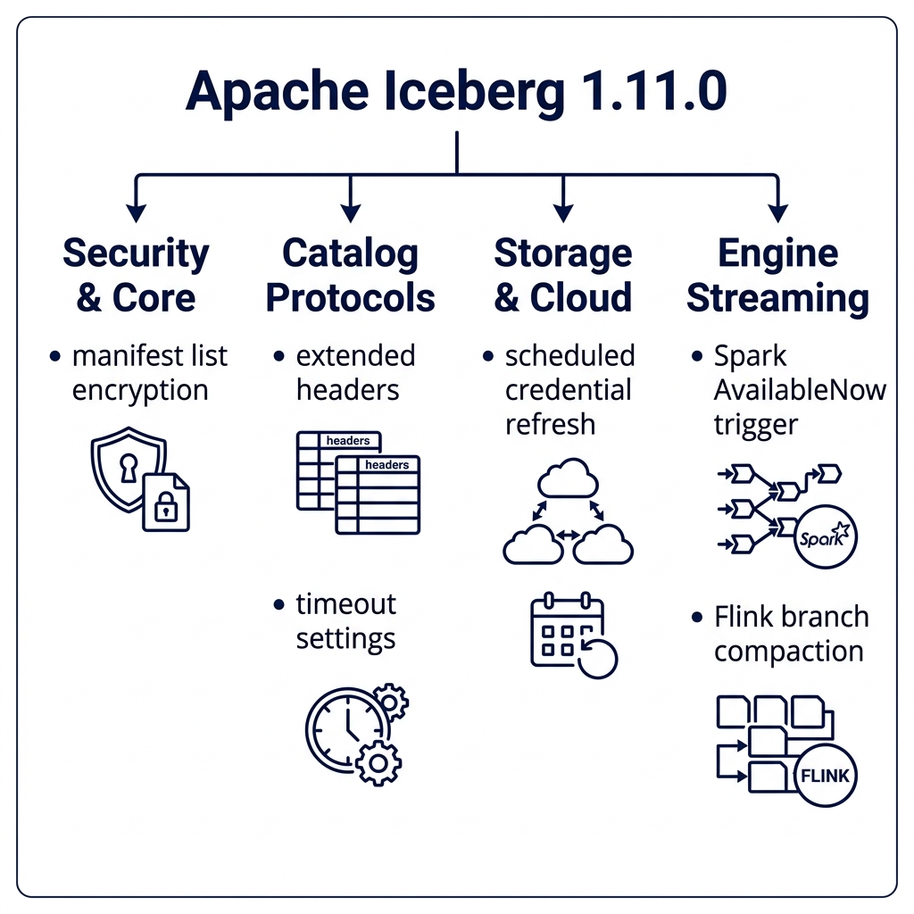
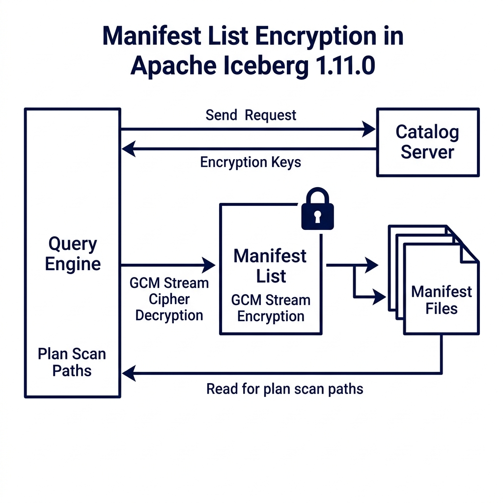
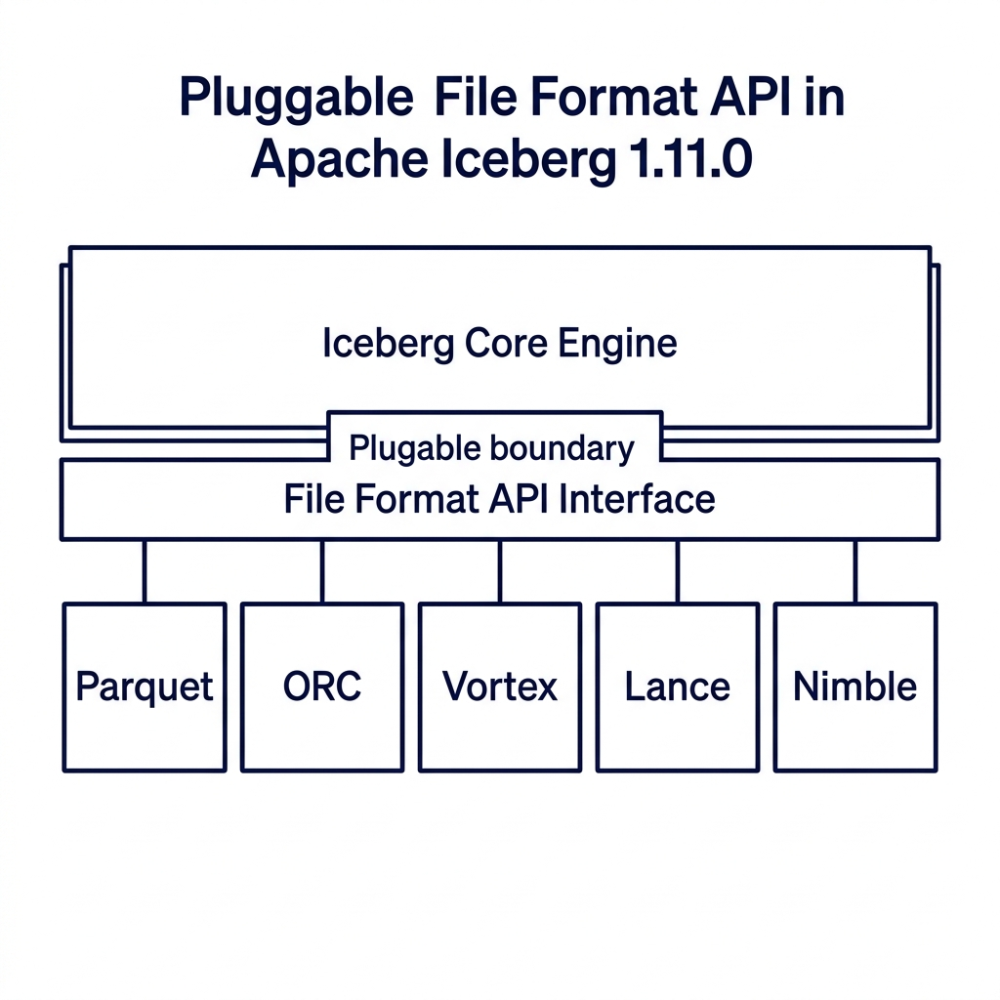
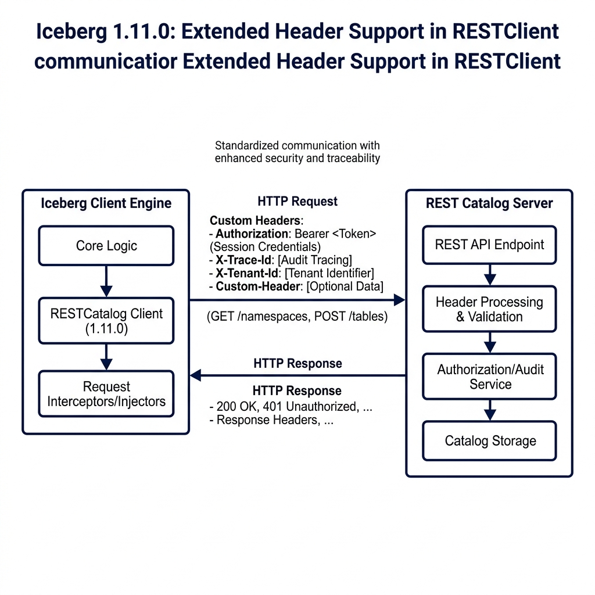
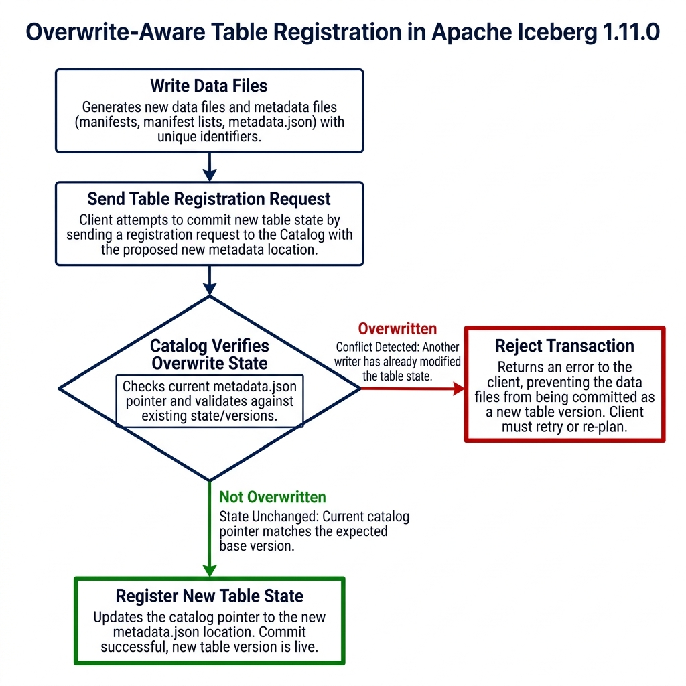
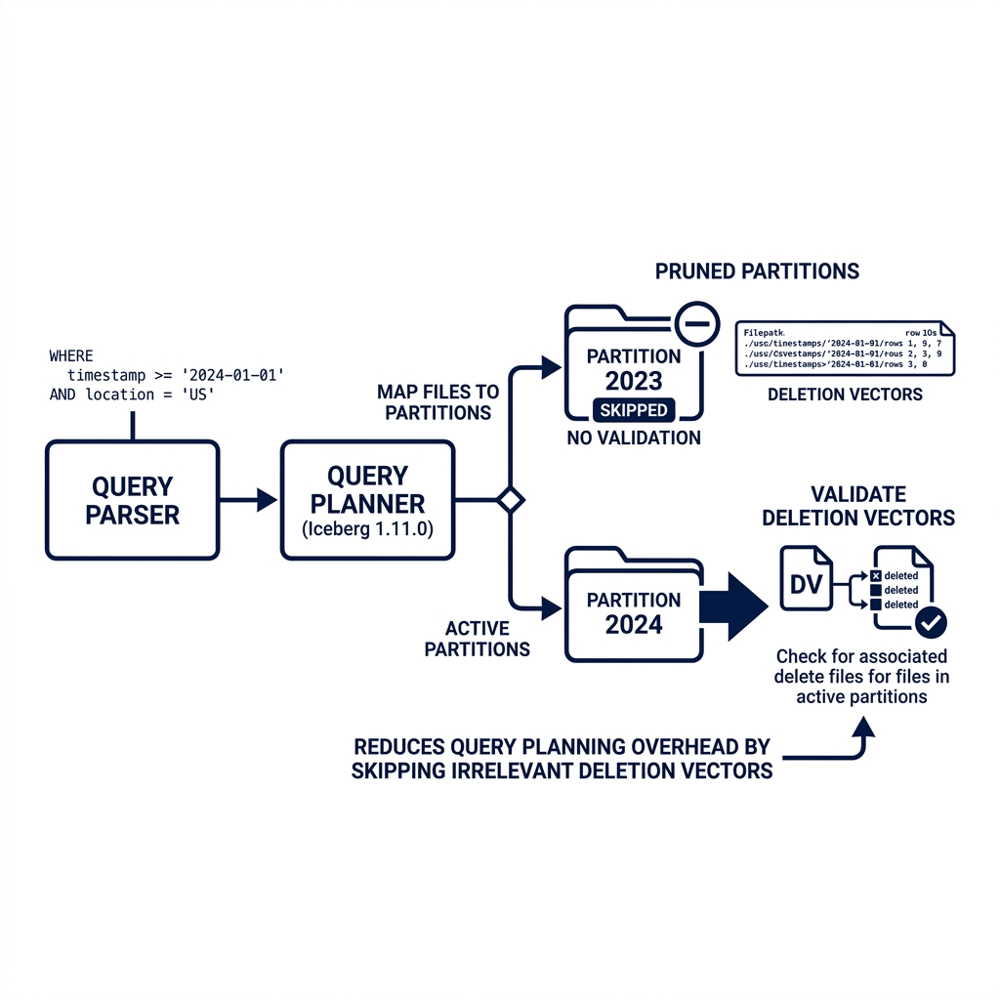
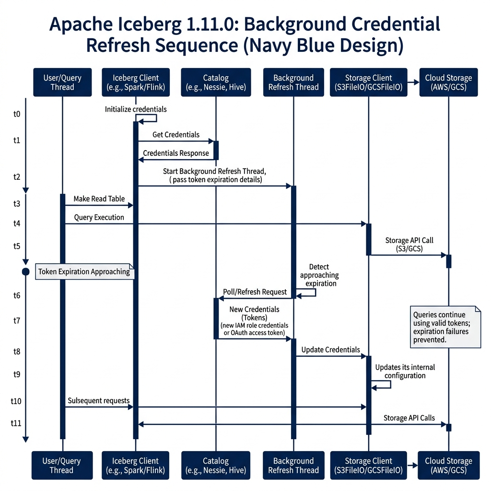
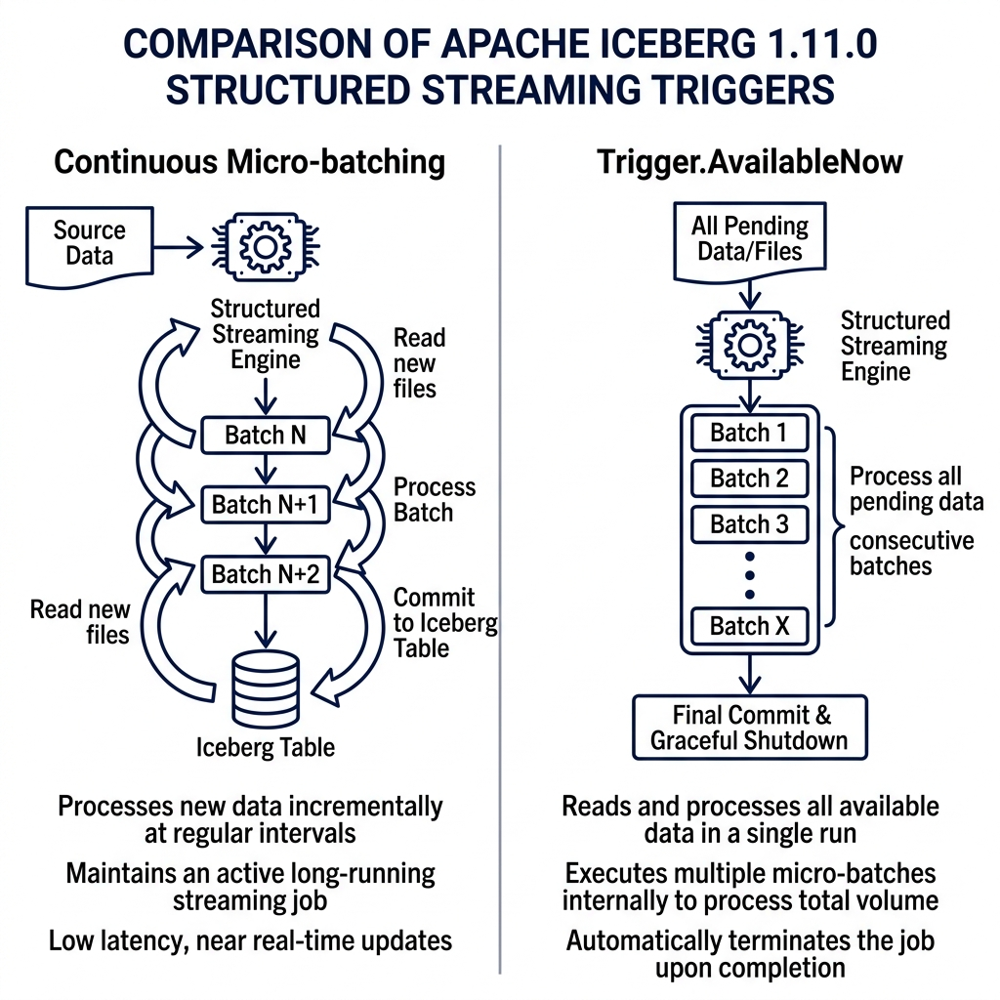
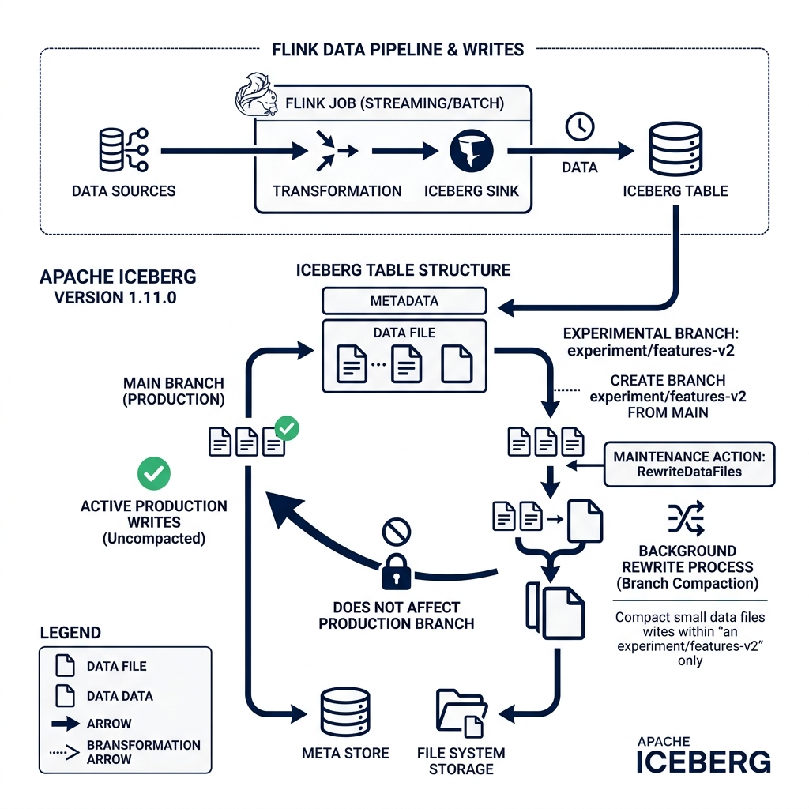
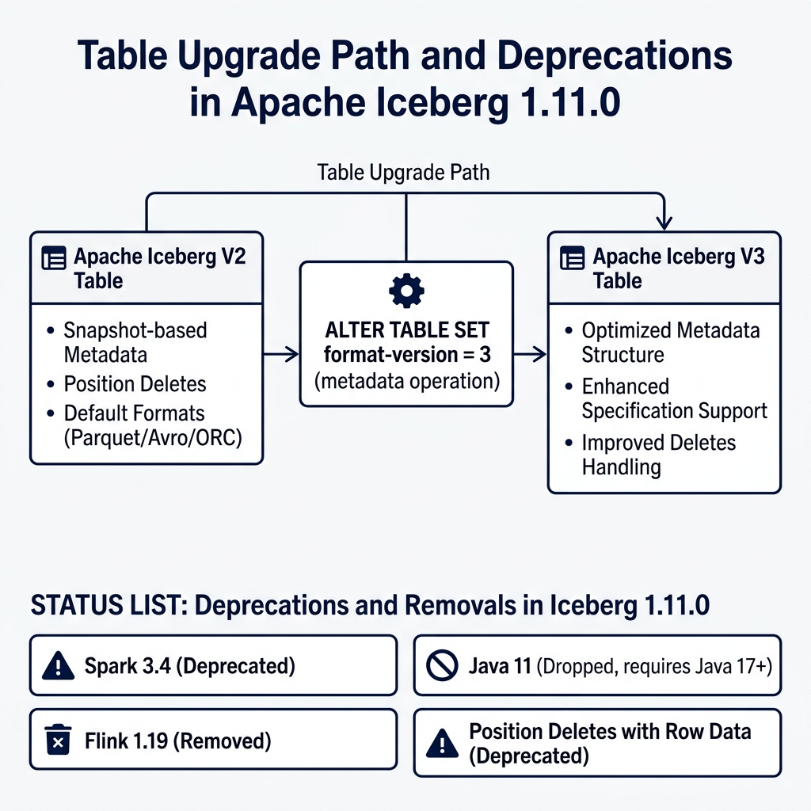

# An In-Depth Overview of the Apache Iceberg 1.11.0 Release

Apache Iceberg 1.11.0 was officially released on May 19, 2026, marking a major milestone in the evolution of open data lakehouse architectures. While minor point releases often focus on small bug fixes and dependency bumps, this release introduces fundamental structural changes. The community has completed major initiatives to improve security, extend file format capabilities, and optimize query planning overhead.

This release represents a convergence of two development focuses. First, it introduces structural changes to the core metadata specification to support advanced security features and lay the groundwork for future format revisions. Second, it stabilizes several feature sets in the Iceberg format specification, moving them from experimental status to fully stable defaults. 

To understand the context of this release, it helps to review the history of the Apache Iceberg specification. The V1 specification focused on the core foundations of the data lake: defining metadata schemas, enabling basic schema evolution, and introducing hidden partitioning to eliminate directory-based partition layouts. The V2 specification, which has been the production standard for several years, introduced row-level delete support through copy-on-write (COW) and merge-on-read (MOR) operations. The V3 specification, which reaches production maturity in the 1.11.0 release, focuses on optimizing read paths, securing metadata, and standardizing complex data types like semi-structured records and spatial coordinates.

This post analyzes the most critical improvements in the Apache Iceberg 1.11.0 release. We will examine the specific GitHub pull requests, explain the underlying mechanics of each feature, and review what these changes mean for data engineers and platform architects.



---

## Manifest List Encryption (PR #7770, #15813)

Security in open data lakehouses has historically focused on encrypting the actual data files stored in object storage. While file-level encryption prevents unauthorized users from reading raw Parquet or ORC data, the table metadata has remained exposed. In a default setup, anyone with read access to the storage bucket could inspect the metadata JSON, manifest lists, and manifest files. 

These metadata files contain sensitive structural details. An attacker scanning an unencrypted manifest list can extract file paths, column names, partitions, partition bounds, and exact null value counts. In highly regulated industries such as healthcare or financial services, this structural exposure constitutes a major data leak.

To resolve this vulnerability, PR #7770, introduced by @ggershinsky, adds native encryption for manifest lists. This change works alongside follow-up improvements in PR #15813. Manifest lists can now be encrypted using the Galois/Counter Mode (GCM) stream cipher.

```
Metadata JSON (Contains encryption state references)
       │
       ▼
Manifest List (Encrypted via GCM Stream Cipher) ◄── Decrypted in-memory during planning
       │
       ▼
Manifest Files (Point to encrypted Parquet data files)
```

The table encryption configuration can be defined during table creation or updated via table properties:

| Property | Default | Description |
|---|---|---|
| `encryption.kms.impl` | *None* | The fully qualified class name of the Key Management Service client. |
| `encryption.kms.key-id` | *None* | The master key identifier used to encrypt data encryption keys (DEKs). |
| `encryption.gcm.key-length` | `256` | The length of the encryption key in bits (128, 192, or 256). |

When a query engine plans a scan against an encrypted table, it performs the following sequence:

1. The client queries the catalog to fetch the table metadata.
2. The catalog returns the metadata location along with the required decryption keys.
3. The query engine reads the encrypted manifest list from object storage.
4. Using the catalog keys, the engine decrypts the manifest list in-memory.
5. The engine processes the decrypted partitions and statistics to prune manifest files.

The choice of the GCM cipher is technically significant. In traditional Block Cipher Chaining (CBC) modes, decryption must occur sequentially from the beginning of the file, which adds latency. In contrast, GCM allows parallelized, seek-aware random-access decryption. This capability is critical for query engines during planning: the engine can read and decrypt only the specific blocks of the manifest list it needs to plan the query, avoiding the overhead of decrypting the entire file.

This approach implements a model of envelope encryption: each metadata file is encrypted with a unique data encryption key (DEK), and these DEKs are encrypted using the table's master key managed by the Key Management Service (KMS). Even if an attacker gains raw access to the storage bucket, they find only encrypted bytes, protecting both the table contents and its structural metadata.



---

## Pluggable File Format API and V4 Spec Foundations (PR #15049)

Historically, Apache Iceberg hardcoded its support for data file formats. The core library contained format-specific code paths for Parquet, ORC, and Avro. If you wanted to query or write a table, the engine executed internal code blocks tailored to those exact structures.

This hardcoded design created a major bottleneck for format innovation. If a team wanted to test a next-generation format, they had to modify the core engine codebase, extending complex switch statements and format-dependent utilities.

PR #15049, introduced by @anoopj, restructures this architecture. It introduces a pluggable File Format API that decouples Iceberg core metadata management from physical storage layouts.

```
┌────────────────────────────────────────────────────────┐
│                  Iceberg Core Engine                   │
└───────────────────────────┬────────────────────────────┘
                            │
                            ▼
┌────────────────────────────────────────────────────────┐
│            File Format API Interface Layer             │
└──────┬────────────┬─────────────┬─────────────┬────────┘
       │            │             │             │
       ▼            ▼             ▼             ▼
  ┌─────────┐  ┌─────────┐   ┌─────────┐   ┌─────────┐
  │ Parquet │  │   ORC   │   │ Vortex  │   │  Lance  │
  └─────────┘  └─────────┘   └─────────┘   └─────────┘
```

The File Format API provides a clean plugin interface. A file format is defined as a plugin that implements standard reader and writer interfaces. Iceberg core negotiates table transactions, schemas, and partition specs, while delegating the physical file access to the registered plugin.

This decoupling makes it practical to support next-generation formats:

*   **Vortex:** A general-purpose, modular format designed as a successor to Parquet. It is optimized for high-performance analytics, utilizing fixed-width columns with bitmap masks for nulls. This enables Single Instruction Multiple Data (SIMD) filtering directly on memory-mapped files without CPU decompression cycles. The community is actively using the new API to build a Vortex-backed Iceberg plugin.
*   **Lance:** A layout built for machine learning and AI workloads. It is optimized for high-dimensional vector search and random access to nested embeddings, implementing index structures such as Inverted File with Product Quantization (IVF-PQ) directly in the file format to enable fast query planning.
*   **Nimble:** A format optimized for wide tables containing thousands of feature columns. Nimble prioritizes fast decoding over high compression ratios, opting for lightweight run-length and bit-packing compression schemes. This reduces the CPU overhead of ML training loops that consume millions of rows per second.

Additionally, PR #15049 introduces the foundational Java interfaces and types for the upcoming V4 manifest specification. These changes prepare Iceberg for format-agnostic manifest storage, ensuring the metadata layer can scale to tables with millions of files without hitting Java memory overhead limits.



---

## REST Client Protocols and Extended Headers (PR #12194)

The REST Catalog protocol has become the standard interface for managing Iceberg tables across multiple processing engines. It isolates clients from catalog catalog details and provides a unified API for schema management, snapshot commits, and credential vending.

However, as deployments scale inside large enterprises, catalogs need to process custom client context. For example, a platform team might want to track which business unit submitted a query, pass custom security tokens, or inject correlation IDs for distributed tracing. In previous versions, the standard `RESTClient` did not allow clients to send custom HTTP headers.

PR #12194, written by @gaborkaszab, solves this constraint by extending header support inside the `RESTClient` implementations. 

```
┌────────────────────────────────┐
│      Iceberg REST Client       │
│  (Spark, Flink, Trino, etc.)   │
└───────────────┬────────────────┘
                │
                │  POST /v1/namespaces/db/tables/events
                │  Custom-Headers:
                │    - X-Trace-Id: trace-98421
                │    - X-Tenant-Id: finance-billing
                │
                ▼
┌────────────────────────────────┐
│      REST Catalog Server       │
│  (Parses headers for auditing)  │
└────────────────────────────────┘
```

With this update, client engines can configure and inject custom headers into every REST call. The client-server handshake follows this sequence:

1. The client initializes the REST catalog using the properties map.
2. The client specifies static custom headers using the prefix `header.custom.`:
   ```properties
   header.custom.X-Tenant-Id=finance-billing
   header.custom.X-Trace-Id=system-trace-99
   ```
3. During request execution, the `RESTClient` intercepts the HTTP call and injects these custom headers.
4. The REST catalog server processes the headers to apply dynamic authorization, audit logging, or request routing.

This change enables the following capabilities:

*   **Auditing and Governance:** Engines can pass tenant identifiers or user profiles in the HTTP headers, allowing the REST catalog server to log catalog operations with full user context.
*   **Distributed Tracing:** Tracing headers such as W3C Trace Context can propagate from client engines through the catalog server, providing end-to-end trace visibility for query planning operations.
*   **Dynamic Authorization:** Clients can send custom authorization tokens that the REST catalog server evaluates dynamically to enforce fine-grained access control.

The properties are configured during catalog initialization using the standard configuration map, making it simple to roll out headers across existing query platforms.



---

## Overwrite-Aware Table Registration (PR #15525)

In multi-tenant data platforms, multiple engines frequently access and modify the same table metadata. When registering a new table or importing an existing table state into the catalog, concurrency conflicts can occur.

If two separate processes attempt to register or overwrite a table reference at the same location simultaneously, a naive catalog might register the second request, silently overwriting the first. This creates data inconsistencies where the catalog points to an outdated or incorrect `metadata.json` file.

PR #15525, written by @sririshindra, adds overwrite-aware table registration to the catalog API. 

```
Writer 1: Commits events_v1 ────► [Catalog Table Pointer] ◄──── Writer 2: Commits events_v2
                                            │
                                            ├────────► If conflict: Catalog rejects Writer 2
                                            └────────► Prevents silent metadata overwrites
```

This implementation leverages Optimistic Concurrency Control (OCC) at the catalog level. The conflict resolution sequence proceeds as follows:

1. Writer A and Writer B both read the current table state pointing to snapshot v1.
2. Writer A writes new data files, generating metadata version `metadata_v2.json`.
3. Writer B writes new data files in parallel, generating metadata version `metadata_v3.json`.
4. Writer A calls the catalog's `/v1/namespaces/db/tables/events/register` endpoint, stating that the expected base location is `metadata_v1.json`.
5. The catalog verifies the base matches, registers the new pointer to `metadata_v2.json`, and updates the table version.
6. Writer B attempts to register its state, listing `metadata_v1.json` as its expected base.
7. The catalog detects that the current pointer is now `metadata_v2.json`.
8. The catalog rejects Writer B's request, returning a HTTP 409 Conflict. Writer B must re-read the updated table state, resolve any overlapping partition commits, and retry the registration.

This validation ensures that table registration is safe and prevents silent metadata overwrites in highly active environments.



---

## Deletion Vector Pruning in Snapshot Validation (PR #15653)

One of the major highlights of the V3 format specification is the stabilization of deletion vectors. Deletion vectors improve row-level delete performance by replacing positional delete files with Roaring bitmaps. Instead of writing a new delete file for every minor update, the engine updates a binary bitmap linked directly to the data file.

These deletion bitmaps are stored in the Puffin file format. You can inspect active deletion vector locations using metadata system tables:

```sql
SELECT file_path, pos, row_position, deletion_vector
FROM TABLE(table_files('my_catalog.schema.events'));
```

However, as tables grow to hold millions of data files, validating these deletion vectors during query planning can introduce latency. During scan planning, the query engine must ensure that the deletion vectors linked in the metadata are valid and match the corresponding data files.

In earlier versions, this validation was executed across the entire table snapshot during plan initialization. If you had a 50 TB table and queried a single day, the planner still spent time validating deletion vectors for the entire table.

PR #15653, introduced by @anoopj, optimizes this process. It adds manifest partition pruning to deletion vector validation inside the `MergingSnapshotProducer`.

```
Query Filter: WHERE event_date = '2026-05-23'
       │
       ▼
Partition Pruning Step
       │
       ├─► Skip Partition '2026-05-22' ──► Skip Deletion Vector Validation
       │
       └─► Read Partition '2026-05-23'  ──► Run Deletion Vector Validation
```

With this change, the query planner matches the query filter predicates against partition bounds before executing deletion vector checks. If a partition is pruned out, the engine skips validating the deletion vectors for the files in that partition. This change reduces planning CPU cycles and improves scan startup times for partitioned tables.

For a detailed look at how hidden partitioning helps the query engine perform partition pruning and reduce metadata scan sizes, refer to the [Apache Iceberg Hidden Partitioning Post](/blog/apache-iceberg-hidden-partitioning-reduces-full-scans/).



---

## Scheduled Credential Lifecycle Refresh (PR #15678, #15732, #15696)

To security-harden data lakehouses, platforms avoid using long-lived storage credentials. Instead, query engines authenticate using temporary tokens vended by the REST catalog or cloud identity providers. These credentials typically have short lifespans, often expiring after one hour.

This security model creates issues for long-running operations. If a massive query runs for 90 minutes, or a streaming Flink sink runs continuously, the temporary credentials expire mid-job. When the client attempts to write new files or fetch manifests after the expiration window, the storage client throws an authentication exception, failing the job.

The 1.11.0 release resolves this lifecycle problem. PR #15678 (by @danielcweeks) and PR #15732 (by @nastra) add scheduled refresh threads to the `S3FileIO` client. A parallel change in PR #15696 (by @nastra) implements the same capability for `GCSFileIO`.

```
Query Thread (Reads/Writes Data)
       │
       ├───────► Token Expiration Approaching (e.g. at 50 minutes)
       │
Background Refresh Thread
       │
       ├───────► Send Request to Catalog ──► Fetch New Credentials
       │
       └───────► Update S3FileIO/GCSFileIO Credentials In-Memory
       │
Query Thread (Continues without interruption)
```

The credential refresh system runs a background daemon thread that tracks token expiration times. The lifecycle is controlled by the following properties:

| Property | Default | Description |
|---|---|---|
| `s3.credentials-refresh-interval` | *None* | The interval at which the S3FileIO refresh thread checks and requests new credentials. |
| `gcs.oauth2.token-expires-in` | `3600` | The lifespan in seconds of the GCS OAuth token before the refresh thread requests a new one. |

Before the active credential expires, the background thread automatically polls the catalog's `/v1/tokens` endpoint for refreshed tokens and updates the file system client in-memory. The main query and write threads continue to run without interruption, eliminating query failures caused by expired credentials.

This scheduled refresh is particularly important in enterprise Kubernetes environments. In these setups, pod identities are linked to IAM roles with short-lived session durations. By handling this rotation transparently within the `FileIO` layer, Iceberg removes the need for engines to restart or implement external wrapper scripts to manage token state.



---

## Spark Streaming Triggers and Z-Ordering (PR #13824, #15706)

Apache Spark remains the primary engine for heavy write workloads and batch compaction in Iceberg tables. Version 1.11.0 includes several updates to improve Spark streaming and layout optimization.

### Trigger.AvailableNow Support (PR #13824, #14026)
PR #13824, introduced by @alexprosak, adds support for the `AvailableNow` trigger in Spark Structured Streaming. This change was also backported to Spark 4.0, 3.5, and 3.4 in PR #14026.

```
Continuous Trigger:
[Read Batch 1] -> [Write] -> [Wait] -> [Read Batch 2] -> [Write] -> (Runs indefinitely)

AvailableNow Trigger:
[Scan All Available Data] -> [Process Batch 1] -> [Process Batch 2] -> [Write All] -> [Graceful Shutdown]
```

In Spark streaming, the default trigger runs continuously in the background, consuming resources even when no new files are arriving. The alternative `Once` trigger processes only a single batch and shuts down, which can leave data unprocessed if a large backlog has accumulated.

The `AvailableNow` trigger combines the benefits of both approaches. It scans the source for all available data, splits the workload into consecutive micro-batches, processes them all in a single run, and then shuts down the streaming context. This is configured in PySpark as follows:

```python
# Configure Trigger.AvailableNow with Iceberg source and sink
query = spark.readStream \
    .format("iceberg") \
    .load("prod_catalog.db.events") \
    .writeStream \
    .format("iceberg") \
    .trigger(availableNow=True) \
    .option("checkpointLocation", "/mnt/checkpoints/events") \
    .toTable("prod_catalog.db.events_compacted")
```

This trigger configuration allows data platforms to run streaming ingestion pipelines as scheduled cron jobs, reducing cluster idle time.

### Z-Order Column Collision Validation (PR #15706)
PR #15706, introduced by @YanivZalach, addresses a failure mode during Z-order layout optimization. Spark uses the internal column name `ICEZVALUE` during Z-order sorting. If a user table already contained a column named `ICEZVALUE`, the compaction process failed or generated incorrect sort orders. 

The update adds strict schema validation that checks for column name collisions before running Z-order compactions, preventing data corruption.



---

## Flink Post-Commit Maintenance and Branch Compaction (PR #15566, #15672, #14148)

Apache Flink is the standard engine for real-time streaming ingestion into Iceberg tables. Streaming ingestion has different write characteristics than batch ingestion, often writing many small files at high frequency. Iceberg 1.11.0 adds features to manage these files directly within Flink pipelines.

### Flink Post-Commit Maintenance (PR #15566, #15667)
PR #15566, written by @mxm, adds support for arbitrary post-commit maintenance tasks inside the Flink `IcebergSink` builder. This is also backported to active Flink branches in PR #15667.

During streaming ingestion, Flink commits data to the Iceberg table at every checkpoint. These frequent commits generate a large number of small manifest files. With the new post-commit interface, you can attach background maintenance tasks directly to the sink:

```java
// Configure Flink sink with post-commit compaction
IcebergSink.forRowData(dataStream, tableLoader)
    .table(icebergTable)
    .tableLoader(tableLoader)
    .writeParallelism(4)
    .distributionMode(DistributionMode.HASH)
    .postCommitMaintenance(
        PostCommitMaintenance.builder()
            .optimizeDataFiles(true)
            .rewriteManifests(true)
            .build()
    )
    .append();
```

After a commit succeeds, Flink runs compaction and manifest cleaning tasks in the background, keeping the table structure optimized without requiring external scheduler jobs.

```
Flink Stream Ingestion
       │
       ▼
[Commit Data File (Checkpoint)]
       │
       ├───────► Post-Commit Trigger
       │
       ▼
[Background Maintenance Action (RewriteDataFiles / Compaction)]
```

### Flink Branch Compaction Support (PR #15672, #15690)
PR #15672, also written by @mxm, adds branch support to the Flink `RewriteDataFiles` action. 

Historically, Flink's background compaction actions could only run on the table's main branch. In modern architectures, engines often ingest experimental data or staging runs into separate table branches. Flink can now run file compaction directly on these non-main branches, keeping staging and experiment branches organized before they are merged back.

### Flink Metadata Columns (PR #14148)
PR #14148, introduced by @Guosmilesmile, exposes metadata columns to Flink readers. 

Flink applications can now read the `_row_id` and `_last_updated_sequence_number` system columns. This is useful for CDC (Change Data Capture) reconciliation pipelines that need to track the exact ingestion sequence of rows.



---

## JSON to Variant Mapping and Spec Cleanups (PR #13137, #14045)

The Variant type is a key part of the Iceberg V3 specification, designed to store semi-structured data using a binary representation that supports predicate pushdown. Iceberg 1.11.0 refines this integration across multiple engines.

### Variant Type Validation (PR #13137, #14081)
PR #13137 (by @manirajv06) and PR #14081 (by @geruh) add schema validation and filtering rules for the Variant type in Parquet metrics. 

These updates ensure that Parquet file readers can extract column-level statistics from nested variant structures. This allows the query engine to prune files based on nested variant fields, improving query performance.

### Trino Variant Type Mapping
In parallel, query engine connectors are adopting these changes. Trino now maps its native `JSON` type to Iceberg's Variant type in V3 tables. This means you can write JSON data from Trino and query it with predicate pushdown, avoiding the performance penalties of plain string JSON.

### Positional Deletes with Row Data Deprecated (PR #14045)
PR #14045, written by @pvary, deprecates positional delete files that embed row data. 

In Iceberg V2, positional delete files could store the actual deleted row data alongside the file path and row offset. While this design saved a join step during reads, it duplicated data in the delete files, increasing storage costs and metadata complexity. 

The community has deprecated this option in favor of Deletion Vectors, simplifying the V3 read path.

---

## Table Upgrade Path and Connector Compatibility

All V3 features: manifest list encryption, deletion vectors, Variant types, geospatial types, and nanosecond timestamps: require upgrading your tables to format version 3.

```
Existing V2 Table
       │
       ├───────► Run: ALTER TABLE events SET TBLPROPERTIES ('format-version' = '3')
       │
Upgraded V3 Table
       │
       ├───────► New writes use Deletion Vectors and Variant type
       └───────► Existing data files are left untouched (no rewrite required)
```

The upgrade is a metadata-only operation executed using SQL:

```sql
-- Upgrade an existing table to Iceberg V3 format version
ALTER TABLE my_catalog.schema.events
SET TBLPROPERTIES ('format-version' = '3');
```

This operation updates the `format-version` pointer in the table's metadata JSON. It does not rewrite your existing data files, which remain in place and continue to be readable. 

New writes to the table will adopt V3 features automatically. For example, subsequent update or delete statements will write deletion vectors instead of positional delete files.

### Lifecycle Status Updates
Before planning your migration to V3, review the engine compatibility changes in Iceberg 1.11.0:

*   **Java 11 Support Dropped:** Iceberg 1.11.0 drops support for Java 11. Core libraries and engine connectors now require **Java 17** or **Java 21**. Migrating to Java 17 was a critical decision for the community, allowing the codebase to utilize modern JVM language features (such as Java records, pattern matching, and enhanced switch expressions) to improve metadata parsing efficiency and reduce CPU utilization.
*   **Spark 3.4 Support Deprecated:** Support for Spark 3.4 is deprecated. Teams should migrate to Spark 3.5 or Spark 4.0+.
*   **Flink 1.19 Support Removed:** Flink 1.19 is no longer supported. The release adds support for **Flink 2.1.0**.

Make sure all query engines and toolchains in your lakehouse deployment support Iceberg V3 and Java 17 before upgrading production tables.

For more on managing query performance optimizations and table format versions inside Dremio, refer to the [Dremio Autonomous Performance Blog](/blog/autonomous-performance-dremio-agentic-analytics/).



---

## Conclusion

Apache Iceberg 1.11.0 is a significant release for the project. It moves beyond incremental enhancements to deliver major architectural updates. 

The unified File Format API restructures how Iceberg interacts with physical storage formats. This change makes it easier to integrate next-generation codecs designed for AI and high-performance workloads. 

At the same time, the stabilization of V3 features provides a production-ready path for deletion vectors, Variant data, geospatial types, and nanosecond precision. These features help organizations optimize query performance and reduce operational overhead.

If you are running Iceberg V2 tables in production, evaluate your workloads to identify tables that will benefit from a V3 upgrade. In particular, tables with active update patterns or large JSON columns will see immediate performance gains.

---

### Build Your Data Lakehouse Expertise

If you are designing, building, or managing modern data platforms, staying ahead of formatting specifications is critical. To deepen your understanding of these technologies, consider reading:

*   **"Architecting an Apache Iceberg Lakehouse"**: An architectural guide to designing open lakehouse platforms, managing catalog architectures, partition tuning, and optimizing table layouts for high-performance query execution engines.
*   **Other Data Lakehouse Publications**: Practical books and reference materials covering hidden partitioning, metadata structure, schema evolution, and query acceleration engines in enterprise data systems.

Find these books and other lakehouse learning resources at [books.alexmerced.com](https://books.alexmerced.com).

To query your newly upgraded Iceberg V3 tables with automatic file layout optimization, background partition-level compaction, reflection acceleration, and zero infrastructure management, start a free trial of Dremio Cloud at [dremio.com/get-started](https://www.dremio.com/get-started).
