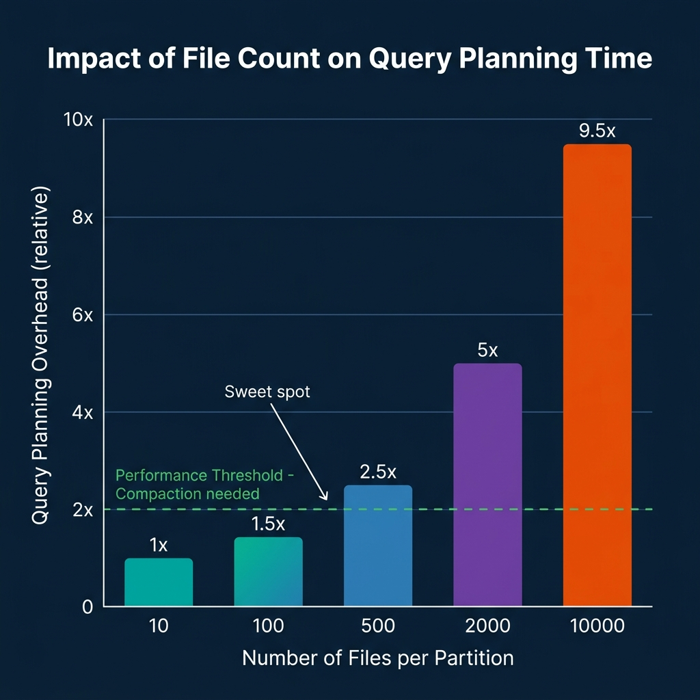
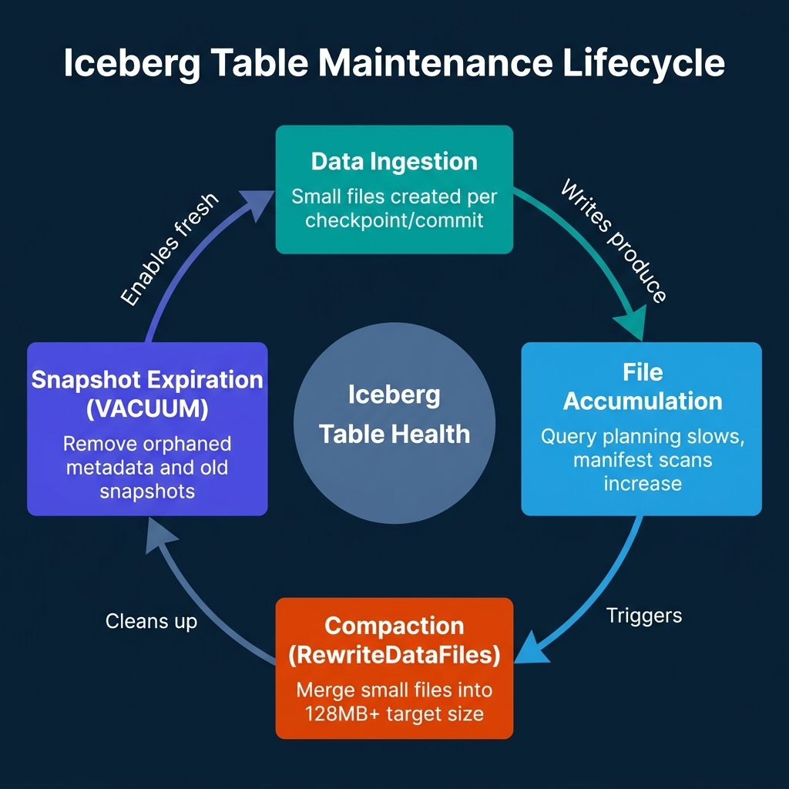
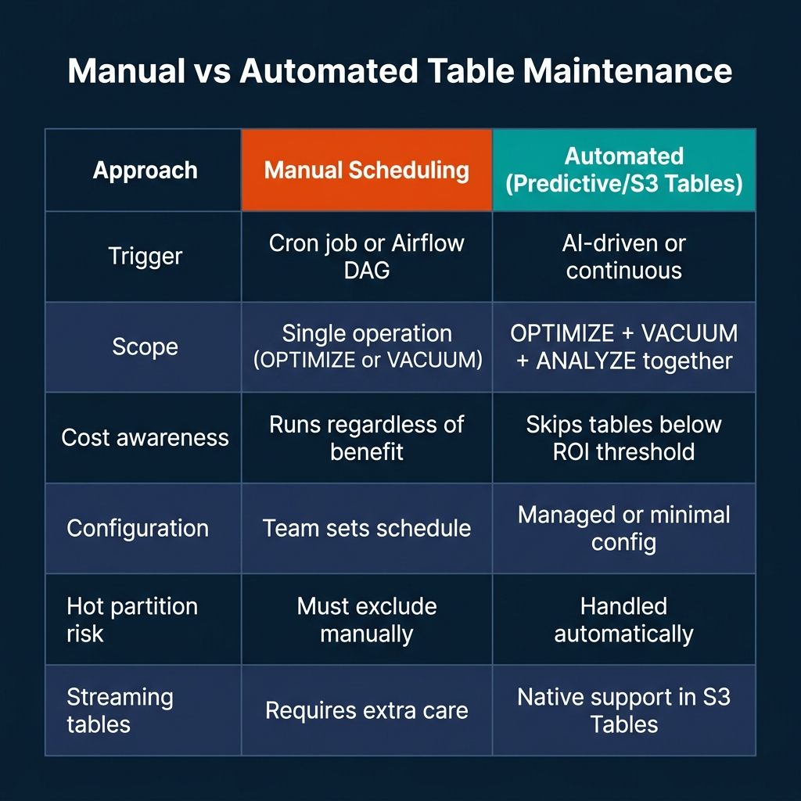

# Automating Table Maintenance Before Small Files Accumulate

Table maintenance is one of those problems that feels manageable until it isn't. You run compaction manually when query performance degrades, schedule a VACUUM job after reports of slow planning times, and generally treat maintenance as reactive work. Then streaming pipelines arrive, partition counts multiply, and the files-per-partition metric climbs past the threshold where ad-hoc fixes stop working.

The industry has moved on from treating compaction as an optional afterthought. Databricks made Predictive Optimization the default behavior for Unity Catalog managed tables in 2025. AWS S3 Tables provides continuous, automatic compaction for table bucket-stored Iceberg tables, and reduced processing fees for those operations by up to 90% in July 2025. The message is clear: manual maintenance scheduling is becoming the exception, not the norm.

This post covers what table maintenance actually does, why the small-file problem is specifically painful for Iceberg, and how the current generation of automated and policy-driven approaches changes the operational model.

---

## What the Small File Problem Actually Costs

Every write to an Apache Iceberg table creates new data files. A batch ETL job that appends 1 GB of data might create 8 x 128 MB Parquet files, reasonable. A Flink streaming job with a 5-minute checkpoint interval writing to 20 partitions creates at least 20 files every 5 minutes. Over 24 hours, that's 5,760 files, none of which are large enough to be efficient for columnar analytics.

The cost is not primarily storage. S3 pricing at scale makes small files a storage non-issue. The cost is query planning and scan performance.

Iceberg query planners read manifest files to determine which data files are relevant to a query. Each manifest entry is a file reference with column-level statistics (min/max values, null counts). When a planner needs to determine which files might contain rows matching a predicate, it scans manifest entries. With 100 files per partition, this is fast. With 10,000 files per partition, the metadata scan itself becomes the bottleneck, often adding seconds to planning time even before a single data byte is read.



The secondary cost is snapshot accumulation. Every commit to an Iceberg table creates a new snapshot, which references the current manifest list. Streaming pipelines create hundreds of snapshots per day. Without regular snapshot expiration, the metadata tree grows indefinitely, slowing time-travel queries and increasing catalog scan times.

---

## The Four Operations of Iceberg Maintenance

Iceberg table maintenance is four distinct operations, each addressing a different part of the file and metadata accumulation problem.



**RewriteDataFiles (Compaction).** This is the core operation. It reads multiple small Parquet files from a table partition and rewrites them as fewer, larger files. The operation is transparent to readers: Iceberg commits the new files and the removal of the originals as an atomic snapshot update. The table remains readable throughout. The standard target file size is 128 MB to 256 MB, which balances read efficiency against write amplification.

**RewriteManifests.** Over time, manifest files accumulate entries for both live and expired files. This operation rewrites the manifest list to clean up stale entries and rebalance entry distribution. It's cheaper than data compaction but often overlooked. Manifest rewriting reduces planning overhead independent of data file sizes.

**ExpireSnapshots.** This removes snapshot metadata that is no longer accessible for time-travel queries within your retention window. Critically, it doesn't actually delete the underlying data files, that happens in the next step. Snapshot expiration removes the pointer to old file sets, not the files themselves.

**DeleteOrphanFiles.** This removes data files that are no longer referenced by any snapshot. Orphaned files accumulate from failed or partial writes. Running this operation periodically ensures storage doesn't silently grow from write failures.

The recommended maintenance sequence is: compact first, expire snapshots second, delete orphans last. Running in this order ensures compaction completes before you remove the snapshot history that the compacted files are referenced by.

---

## Databricks Predictive Optimization: Autonomous Maintenance

Databricks' Predictive Optimization changes the maintenance model from "schedule jobs and hope" to "define policy and let the platform decide."

Enabled by default for Unity Catalog managed tables in 2025, Predictive Optimization monitors query patterns and table statistics using Databricks' platform intelligence layer. Rather than running compaction on a fixed schedule regardless of whether a table actually needs it, the system analyzes each table's write volume, query frequency, and file count metrics to decide when maintenance provides sufficient performance benefit to justify the compute cost.

The operations it manages automatically are OPTIMIZE (compaction), VACUUM (snapshot expiration and orphan cleanup), and ANALYZE (statistics refresh for query planning). All three run asynchronously using serverless compute, independent of any job the team is actively running.

For Unity Catalog managed tables, enabling Predictive Optimization requires no manual configuration after the feature is enabled at the metastore level. For tables where you want explicit control, you can exclude specific tables from automatic optimization:

```sql
-- Enable predictive optimization for a table explicitly
ALTER TABLE my_catalog.my_schema.events
SET TBLPROPERTIES ('delta.enableAutoOptimize' = 'true');

-- Or disable for tables where you manage maintenance manually
ALTER TABLE my_catalog.my_schema.manual_table
SET TBLPROPERTIES ('delta.enableAutoOptimize' = 'false');
```

Predictive Optimization is distinct from Auto Compaction. Auto Compaction runs on the same cluster performing writes, merging small files immediately after they are created. Predictive Optimization is a background service that analyzes and acts asynchronously. Both can run simultaneously. The combination addresses both the immediate small-file production problem (Auto Compaction) and the longer-term layout and statistics management problem (Predictive Optimization).

The tradeoff: because Databricks is making the maintenance decision rather than the platform team, you have less visibility into when compaction runs and which tables are being prioritized. The system provides audit logs, but teams accustomed to explicit maintenance job monitoring may find the autonomous model less transparent than they'd like.

---

## AWS S3 Tables: Managed Maintenance for Table Buckets

Amazon S3 Tables provides fully managed Apache Iceberg table storage where compaction and cleanup are built into the storage service rather than delegated to the compute engine. When you store Iceberg tables in S3 Table Buckets (not standard S3 buckets), AWS runs compaction continuously using three strategies:

**Binpack compaction:** The default. Merges files targeting a configurable size, typically 128 MB to 512 MB. This is the standard compaction approach equivalent to Iceberg's `RewriteDataFiles` with the binpack strategy.

**Sort compaction:** Applied automatically when a sort order is defined in the table metadata. Organizes data within files by the sort column, improving predicate pushdown performance for range queries on sorted columns.

**Z-order compaction:** Enabled through the `put-table-maintenance-configuration` API for workloads requiring efficient pruning across multiple columns simultaneously. Z-order reorders data spatially so that records with similar values across multiple columns are physically co-located in the same files.

In July 2025, AWS reduced S3 Tables compaction processing fees by up to 90% for binpack operations and 80% for sort and z-order compaction. For teams that were previously avoiding S3 Tables due to per-operation pricing, this makes the managed maintenance model substantially more cost-competitive with self-managed Iceberg on standard S3.

```bash
# Configure target file size for S3 Tables compaction
aws s3tables put-table-maintenance-configuration \
    --table-bucket-arn arn:aws:s3tables:us-east-1:123456789:bucket/my-table-bucket \
    --namespace analytics \
    --name events \
    --type icebergCompaction \
    --value '{"status": "enabled", "settings": {"icebergCompaction": {"targetFileSizeMB": 256}}}'
```

The S3 Tables maintenance model has one significant constraint: it only applies to tables stored in S3 Table Buckets. Iceberg tables stored in standard S3 general-purpose buckets don't receive automatic maintenance. Those tables require either self-managed Spark or Flink maintenance jobs, or Glue Data Catalog–based compaction configuration.

---

## Self-Managed Maintenance with Spark and Iceberg APIs

For teams that can't use managed maintenance services, whether due to cloud provider, cost structure, or operational preference, the Iceberg Java API provides direct maintenance actions that can be wrapped in Spark or Flink jobs.

The standard pattern for compaction using the Iceberg Spark Actions API:

```python
from pyspark.sql import SparkSession
from org.apache.iceberg.spark.actions import SparkActions
from org.apache.iceberg.expressions import Expressions

spark = SparkSession.builder.getOrCreate()
table = spark.catalog.loadTable("catalog.analytics.events")

# Run compaction on historical partitions (not the hot partition)
rewrite_result = SparkActions.get() \
    .rewriteDataFiles(table) \
    .option("target-file-size-bytes", str(128 * 1024 * 1024)) \
    .option("partial-progress.enabled", "true") \
    .filter(
        Expressions.lessThan("event_date", "2025-05-23")
    ) \
    .execute()

print(f"Compacted {rewrite_result.rewrittenDataFilesCount()} files into "
      f"{rewrite_result.addedDataFilesCount()} new files")
```

The `filter` parameter is critical for streaming tables. Always exclude the partition currently receiving writes, the "hot" partition. If compaction attempts to rewrite files in a partition where a streaming job is actively writing, the commit can conflict, failing the compaction job and potentially causing the streaming job to retry or fail.

For snapshot management:

```python
from org.apache.iceberg.spark.actions import SparkActions
import datetime

# Expire snapshots older than 7 days, retain at least 5 snapshots
expire_result = SparkActions.get() \
    .expireSnapshots(table) \
    .expireOlderThan(
        (datetime.datetime.now() - datetime.timedelta(days=7)).timestamp() * 1000
    ) \
    .retainLast(5) \
    .execute()

print(f"Deleted {expire_result.deletedDataFilesCount()} orphaned data files")
```

Schedule these maintenance jobs with awareness of the write schedule. Running compaction during peak write periods competes for I/O and compute resources. The standard recommendation is off-peak maintenance windows, late night or early morning, with compaction running hourly or every few hours for active streaming tables.

---

## Comparing the Approaches



The right choice depends on your operating model and platform. Teams on Databricks Unity Catalog should adopt Predictive Optimization for all managed tables, the default behavior requires no configuration and the cost-aware scheduling avoids running maintenance on tables that don't need it. Teams on AWS building new Iceberg infrastructure should evaluate S3 Tables for workloads where the 90% cost reduction on compaction processing makes the managed model economically competitive.

Self-managed maintenance remains the appropriate choice for teams with multi-cloud platforms, strict control requirements, or existing operational processes built around Airflow DAGs and Spark jobs. The Iceberg Actions API is production-grade and well-documented. The operational cost is the scheduling complexity and the risk of hot partition conflicts if exclusion logic isn't implemented carefully.

---

## Conclusion

Table maintenance is no longer optional when you're running streaming pipelines into Iceberg tables. The question is whether you implement it reactively, proactively on a fixed schedule, or through an adaptive platform layer that decides when and what to compact based on actual usage patterns.

If you're starting fresh on Databricks or AWS, the automated options have matured to the point where self-managed maintenance is harder to justify on engineering time alone. If you're self-managing, set a file-count monitoring alert at 500 files per partition and treat that as the trigger for a compaction run. Don't wait for query performance to tell you there's a problem.

---

## Monitoring Compaction Health with Key Metrics

Effective compaction management requires monitoring the right metrics. Compaction is a reactive operation; you want to trigger it based on leading indicators rather than waiting for query degradation.

**Files per partition.** This is the primary leading indicator. Iceberg metadata exposes this through the `files` system table:

```sql
-- Track file count per partition in an Iceberg table
SELECT 
    partition,
    COUNT(*) as file_count,
    SUM(file_size_in_bytes) / (1024 * 1024) as total_size_mb,
    AVG(file_size_in_bytes) / (1024 * 1024) as avg_file_size_mb
FROM my_catalog.analytics.events.files
GROUP BY partition
ORDER BY file_count DESC
LIMIT 20;
```

**Snapshot count.** Tables receiving frequent streaming writes accumulate snapshots quickly. Track snapshot count to determine when expiration is needed:

```sql
-- Check snapshot count and age distribution
SELECT 
    COUNT(*) as total_snapshots,
    MIN(committed_at) as oldest_snapshot,
    MAX(committed_at) as newest_snapshot,
    DATEDIFF(day, MIN(committed_at), MAX(committed_at)) as age_days
FROM my_catalog.analytics.events.history;
```

**Compaction effectiveness ratio.** Compare files-before vs files-after for completed compaction runs. The ideal ratio is 50+ input files per 1 output file. Low ratios (10:1) indicate compaction is running too frequently on tables that don't have sufficient small-file accumulation.

Building a simple dashboard from these three metrics, files per partition, snapshot count, and compaction ratio, gives maintenance teams visibility into table health without requiring deep inspection of individual files.

---

## Z-Order Optimization for Multi-Dimensional Queries

Standard binpack compaction merges small files without changing their sort order. Z-order compaction applies a space-filling curve to reorder data within merged files, co-locating rows with similar values across multiple dimensions.

For analytics tables where queries frequently filter on two or more columns, Z-order can dramatically improve predicate pushdown effectiveness. A table storing web events that is queried by both `user_id` and `event_date` benefits from Z-order on both columns:

```sql
-- Apply Z-order compaction on Databricks Delta (equivalent pattern)
OPTIMIZE events
ZORDER BY (user_id, event_date);

-- On Iceberg with sort order, set at table creation or with alter
ALTER TABLE my_catalog.analytics.events
WRITE ORDERED BY (user_id, event_date);
```

The trade-off with Z-order compaction is higher write cost than binpack. Z-order requires a full sort pass before writing output files, which uses more memory and compute per file rewritten. For high-churn tables receiving continuous streaming writes, running Z-order on all new data is impractical. The recommended pattern is:

- **Hot, recent data:** Binpack compaction to merge small files quickly
- **Cold, historical data:** Z-order compaction to optimize for read performance

This tiered approach applies Z-order only where the read performance benefit justifies the higher compaction cost, typically data older than a few days that is well-established in the table and unlikely to receive further updates.

---

## Partition Evolution: Planning for Growth

One of the most expensive compaction scenarios is a poorly designed partition strategy that requires a full table rewrite to fix. Iceberg's partition evolution feature allows changing a table's partitioning scheme without rewriting existing files, new files use the new scheme while old files retain their original partition structure.

Updating a table from daily partitioning to hourly partitioning as data volume grows:

```sql
-- Add a new partition field without rewriting existing data
ALTER TABLE my_catalog.analytics.events
ADD PARTITION FIELD hour(event_time);

-- Remove the old daily partition field from new writes
-- (existing files still use the old partition, new files use the new one)
ALTER TABLE my_catalog.analytics.events
DROP PARTITION FIELD days(event_date);
```

After partition evolution, old data files retain the daily partition structure while new files use the hourly partition. Iceberg's hidden partitioning ensures queries remain transparent, the planner handles both partition schemes simultaneously. Over time, natural turnover (through retention policies or explicit rewrites) eliminates the old partition format from the table.

Planning partition strategy before a table reaches scale avoids the costly alternative: exporting all data, dropping the table, recreating with the correct partition scheme, and re-ingesting everything. Iceberg's partition evolution is one of the format's most operationally valuable features for growing data platforms.

---

### Learn More About Lakehouse Operations

To build deeper expertise in lakehouse architecture, compaction strategies, and open table format operations, pick up [The 2026 Guide to Lakehouses, Apache Iceberg and Agentic AI: A Hands-On Practitioner's Guide to Modern Data Architecture, Open Table Formats, and Agentic AI](https://www.amazon.com/dp/B0GQNY21TD).

Browse Alex's other data engineering and analytics books at [books.alexmerced.com](https://books.alexmerced.com).

Dremio automatically handles reflection refreshes and query acceleration on top of your Iceberg tables without requiring manual materialization management. Try it free at [dremio.com/get-started](https://www.dremio.com/get-started).
