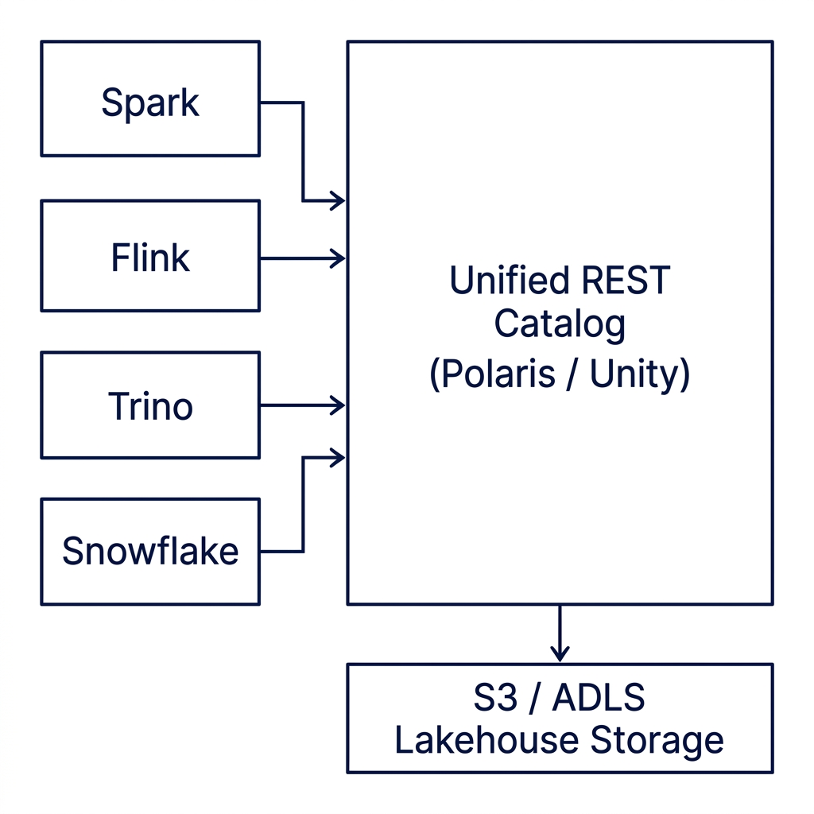
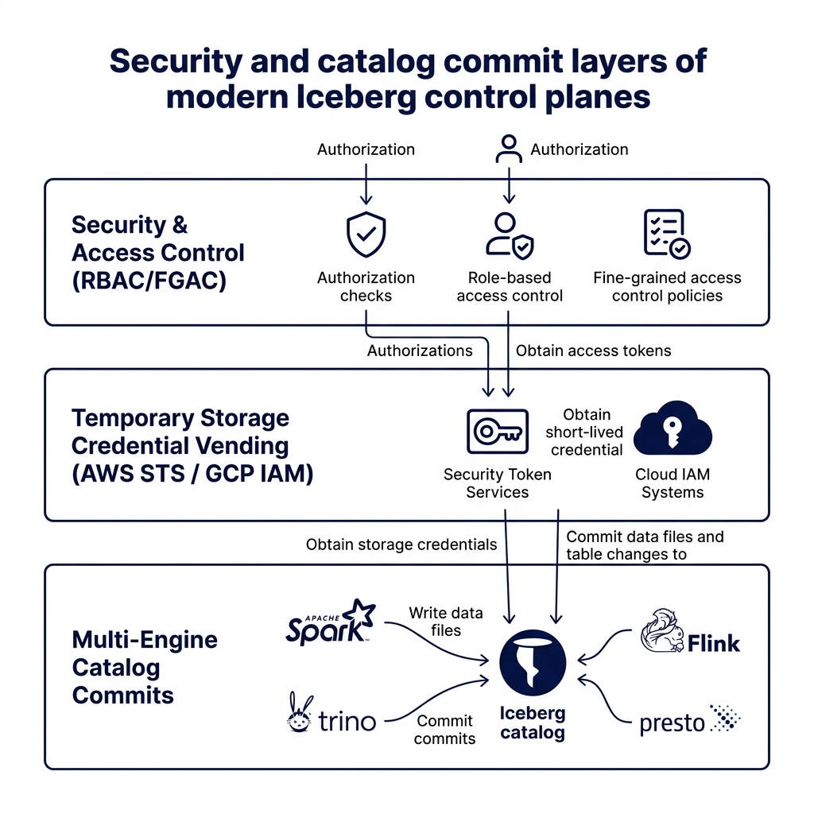
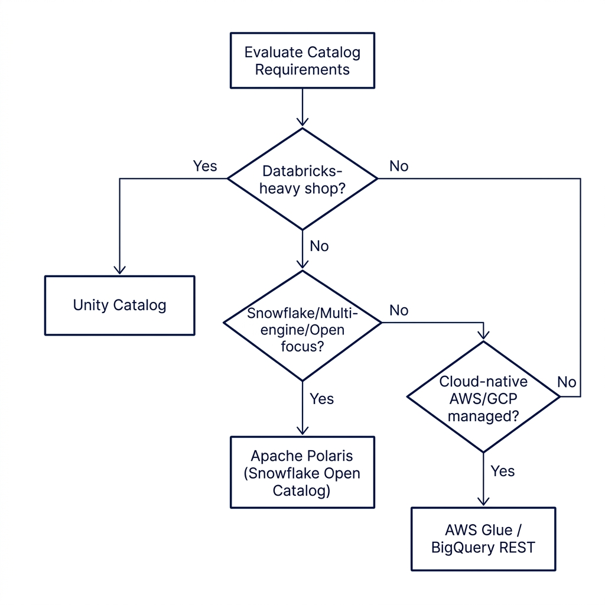

# Choosing the Right Iceberg Control Plane: Polaris vs. Unity Catalog vs. Cloud REST

Modern data architecture is undergoing a quiet but fundamental shift. For years, teams focused on choosing the right open table format, debating the file-level mechanics of Delta Lake versus Apache Iceberg. Today, that format debate is largely settled by metadata interoperability. 

Databricks added native Iceberg support in June 2025, Google Cloud enabled BigQuery read/write interoperability with Iceberg-compatible engines in April 2026, and Snowflake continues to establish open catalogs as standard enterprise infrastructure. The real battleground has moved up the stack from file formats to the metadata control plane.

When multiple compute engines, such as Apache Spark for batch ETL, Apache Flink for real-time streaming, Trino for ad-hoc SQL, and Snowflake or BigQuery for enterprise BI, need to read and write to the same shared files simultaneously, they cannot rely on local file structures. They need a centralized authority to coordinate table updates, track snapshots, and enforce security policies. 

This centralized coordinator is the Apache Iceberg catalog. Selecting the right catalog control plane is now the most critical design decision in lakehouse engineering, dictating your platform's security boundaries, cloud costs, and multi-engine interoperability.

To understand why this layer has become so strategic, you must look at how the data lakehouse has evolved. The first wave of lakehouse design separated compute from storage. You stored your data as Parquet files in an open S3 bucket and spun up compute engines dynamically to run queries. 

However, this model created a metadata vacuum. Because S3 has no native understanding of schemas, transaction records, or table partitions, every engine had to maintain its own list of what files made up a table. The second wave of the lakehouse is about separating metadata from compute and storage. The catalog control plane is that decoupled metadata layer.



---

## Decoupled Interoperability: The Iceberg REST Catalog Standard

In early data lake designs, engines interacted directly with physical storage catalogs. The query engine read metadata files directly from S3 or polled a Hive Metastore database to discover which Parquet files belonged to a table. 

This tightly coupled design introduced several structural problems. Every engine had to implement its own lock management and metadata parsing logic, which frequently led to commit collisions, read-write drift, and vendor lock-in.

The Apache Iceberg REST Catalog specification decouples the compute engine from metadata management. It defines a standardized, language-agnostic OpenAPI specification for catalog operations. 

Under this model, the query engine never inspects raw storage directories to determine table states. Instead, it sends standard HTTP requests to a REST Catalog endpoint:

```
Query Engine (Spark/Trino) ──► GET /v1/namespaces/db/tables/events ──► REST Catalog Server
Query Engine (Spark/Trino) ◄── [JSON Table Metadata & Storage Token] ◄── REST Catalog Server
```

The REST Catalog server handles the request, interacts with the underlying metadata database, and returns a JSON payload containing the table's schema, partition specifications, current snapshot details, and temporary security credentials to access the data files.

This API-first design provides several platform benefits. It standardizes catalog operations across diverse compute engines, allowing a Spark write commit and a Trino read request to use the exact same catalog interface. 

It centralizes transaction management, allowing the REST server to handle commit conflicts and enforce Optimistic Concurrency Control (OCC) without relying on engine-specific file locking. 

Finally, it secures storage access through credential vending. The catalog server issues temporary, scoped access tokens (such as AWS STS tokens) to the compute engine for a specific table path, avoiding the security risk of sharing root-level storage credentials with query clients.

Additionally, by standardizing the JSON response schema for table metadata, the REST API ensures that secondary metadata details (such as column statistics, sort orders, and partition specs) are interpreted identically by all reading engines. 

Without this standard interface, differences in how engines (like Trino versus Spark) parsed physical metadata files often led to query plan mismatches. The REST catalog eliminates this discrepancy by acting as the single, authoritative interpreter of table state.

A standard Iceberg REST Catalog response for a table request contains structured sections detailing the table state:

```json
{
  "metadata-location": "s3://my-lakehouse/metadata/00001-abc.metadata.json",
  "metadata": {
    "format-version": 2,
    "table-uuid": "a1b2c3d4-e5f6-7a8b-9c0d-1e2f3a4b5c6d",
    "location": "s3://my-lakehouse/data",
    "last-updated-ms": 1779629242000,
    "last-column-id": 3,
    "schemas": [
      {
        "type": "struct",
        "fields": [
          {"id": 1, "name": "id", "required": true, "type": "int"},
          {"id": 2, "name": "event_date", "required": true, "type": "date"},
          {"id": 3, "name": "metric_value", "required": false, "type": "double"}
        ]
      }
    ],
    "current-schema-id": 0,
    "partition-specs": [
      {
        "spec-id": 0,
        "fields": [
          {"source-id": 2, "field-id": 1000, "name": "event_date", "transform": "identity"}
        ]
      }
    ],
    "default-spec-id": 0,
    "last-partition-id": 1000,
    "snapshots": [
      {
        "snapshot-id": 987654321,
        "timestamp-ms": 1779629242000,
        "summary": {
          "operation": "append",
          "added-data-files": "4"
        },
        "manifest-list": "s3://my-lakehouse/metadata/snap-987654321.manifest.list.avro"
      }
    ],
    "current-snapshot-id": 987654321
  },
  "config": {
    "client.factory": "org.apache.iceberg.rest.auth.OAuth2Client"
  }
}
```

This clean structure isolates the reading client from having to query physical directories or parse raw metadata files. The catalog server performs the lookups and serves the exact logical plan foundations in a unified JSON response.

---

## Independent and Open: Apache Polaris Architecture

Apache Polaris is an open-source, vendor-neutral metadata control plane designed for Apache Iceberg tables. Polaris graduated to a Top-Level Project (TLP) at the Apache Software Foundation (ASF) on February 18, 2026. This independent status ensures that Polaris operates under community-driven governance, free from single-vendor lock-in.

Architecturally, Polaris acts as a stateless REST Catalog server that communicates with a backend metadata database (such as PostgreSQL, MySQL, or CockroachDB). Polaris provides a unified namespace where you can manage Iceberg tables and register external catalog sources.

Polaris implements a zero-trust security model centered on temporary credential vending. When a client engine queries a table, Polaris does not share raw IAM keys. Instead, the Polaris server negotiates temporary tokens (such as AWS STS scoped sessions or Google Cloud Service Account impersonations) that allow the engine to access only the specific storage path linked to that table.

The v1.4 release of Apache Polaris (April 2026) introduced several updates designed for production deployments:

*   **AWS STS Session Tag Customization:** Platform administrators can now map specific catalog parameters (such as the Polaris realm, catalog name, or database name) directly to AWS STS session tags. When an engine reads storage, these tags propagate to AWS CloudTrail, providing audit logs that tie S3 file operations back to specific catalog tables and users.
*   **Storage-Scoped Key Management:** Polaris enables storage-scoped credential vending down to the individual table prefix. This means separate tables in the same storage bucket can be encrypted with distinct KMS keys, allowing administrators to restrict access at the bucket level while delegating keys dynamically based on catalog RBAC roles.
*   **Metrics Persistence:** Polaris now supports persisting query execution metrics and commit statistics directly to its catalog database. This enables teams to monitor read-write patterns, track catalog performance, and identify slow commits across multiple engines.
*   **CockroachDB Backend Integration:** The database storage layer has been optimized to support CockroachDB, providing horizontally-scalable metadata storage for high-concurrency enterprise catalogs.
*   **Gateway API Support:** Helm charts have been updated to support the Kubernetes Gateway API, simplifying ingress routing and certificate management in containerized environments.
*   **UV Packaging:** The Python packaging and dependency infrastructure switched from Poetry to UV, significantly reducing the build and deployment times of custom Polaris clients and CLI tools.

To configure an Apache Spark session to connect to a Polaris server using the standard Iceberg REST Catalog API, you define the catalog properties in your configuration file or code:

```python
from pyspark.sql import SparkSession

# Initialize Spark Session with Apache Polaris REST Catalog configuration
spark = SparkSession.builder \
    .appName("PolarisCatalogConnection") \
    .config("spark.sql.extensions", "org.apache.iceberg.spark.extensions.IcebergSparkSessionExtensions") \
    .config("spark.sql.catalog.polaris", "org.apache.iceberg.spark.SparkCatalog") \
    .config("spark.sql.catalog.polaris.type", "rest") \
    .config("spark.sql.catalog.polaris.uri", "http://polaris-server.data-platform.local:8181/api/catalog") \
    .config("spark.sql.catalog.polaris.credential", "client_id_123:client_secret_xyz") \
    .config("spark.sql.catalog.polaris.warehouse", "my_s3_warehouse") \
    .getOrCreate()

# Query an Iceberg table managed by Polaris
df = spark.read.table("polaris.db.sales_records")
df.show()
```

This open architecture makes Polaris the preferred catalog control plane for organizations building multi-engine, multi-cloud platforms using standard open-source technologies.

---

## Serverless Simplicity: Snowflake Open Catalog & Horizon

For teams that want the interoperability of Apache Polaris but do not want to manage the operational overhead of running a self-hosted metadata server, Snowflake provides a fully managed implementation: **Snowflake Open Catalog**.

Open Catalog is a serverless, managed version of the Polaris core engine. It retains 100% API compatibility with open-source Polaris, ensuring that you can migrate between self-hosted Polaris and Snowflake-managed instances without changing client code or rewriting metadata schemas. Snowflake charges for this catalog on a pay-per-request billing model scheduled for rollout in the first half of 2026.

Within the Snowflake ecosystem, Open Catalog serves as the bridge to **Snowflake Horizon**. Horizon is Snowflake's broader compliance, security, and data governance platform.

```
External Engine (Trino/Spark) ──► Open Catalog (Polaris API)
                                            │
                                            ▼
                              Snowflake Horizon Governance
                                            │
                                            ├─► Row-Level Security
                                            └─► Column Masking
```

Horizon integrates with Open Catalog to enforce data access policies across heterogeneous compute environments. You can define access policies, such as row-level filters and column-level masking rules, inside Snowflake using standard SQL. 

When an external query engine (like Apache Spark or Trino) calls the Open Catalog REST API to plan a query, Horizon intercepts the request, evaluates the user's role and database permissions, and down-scopes the returned Iceberg metadata. 

The external engine receives only the specific data files and columns the user is authorized to view. This pattern enforces consistent, unified governance across all query tools without requiring you to duplicate policy definitions in every engine.

For example, if you define a masking policy on a column named `social_security_number` to only show the last four digits, the policy is evaluated at the metadata level during query planning. 

When Trino requests the list of manifest files, Snowflake Horizon intercepts the call and modifies the returned schema metadata. The external engine does not receive the raw columns or physical data addresses for the masked data, preventing unauthorized reading of the physical Parquet storage blocks.

---

## Multi-Format Security: Open-Source Unity Catalog

While Polaris and Snowflake Open Catalog focus exclusively on the Apache Iceberg format, Databricks has taken a multi-format approach by open-sourcing **Unity Catalog**. Licensed under the Apache 2.0 license and managed as a sandbox project under the LF AI & Data Foundation, open-source Unity Catalog acts as a unified catalog for Delta Lake, Apache Iceberg, Apache Hudi, and unstructured files.

Unity Catalog provides a metadata governance layer that extends beyond basic table files. It tracks data lineage, registers machine learning models, manages volumes (unstructured files), and handles access control policies.

Key technical milestones for open-source Unity Catalog in 2026 include:

*   **Catalog Commits (GA 2026):** Coordinates write transactions directly at the catalog layer. Instead of engines writing transaction files directly to S3 and risking conflicts, the catalog commits changes atomically. This eliminates race conditions when multiple engines (such as Spark and Flink) write to the same tables concurrently.
*   **Business Semantics Open Sourcing (April 2026):** Databricks open-sourced the core implementation of its Business Semantics layer. This framework allows developers to define governed metrics, dimensions, and logic inside the catalog using an open format. These definitions integrate directly with Apache Spark, translating natural-language queries from BI tools and AI agents into deterministic SQL queries.
*   **Delta Sharing integration:** Includes built-in support for Delta Sharing, providing secure, real-time sharing of tables and ML models across clouds and platforms without copying physical data.

To access tables managed by an open-source Unity Catalog server using a Python client (such as DuckDB), you can register the catalog connection directly:

```python
import duckdb

# Connect to a local Unity Catalog server using the REST API
con = duckdb.connect()
con.execute("INSTALL uc_catalog;")
con.execute("LOAD uc_catalog;")

# Register the Unity Catalog server endpoint
con.execute("""
    CREATE SECRET (
        TYPE UC,
        TOKEN 'uc_token_abc123',
        ENDPOINT 'http://unity-server.data-platform.local:8080'
    );
""")

# Query a Delta or Iceberg table managed by Unity Catalog
df = con.execute("SELECT * FROM unity_catalog.main.db.inventory").fetchdf()
print(df.head())
```

Unity Catalog's multi-format support makes it a strong option for teams managing mixed data environments containing both Delta Lake and Apache Iceberg tables.

The catalog commits mechanism is particularly significant for multi-engine architectures. In traditional setups, if Spark and Flink attempt to write to the same table concurrently, they rely on basic file-level locking, which can result in write collisions and orphaned data files. 

Unity Catalog's commit service coordinates these operations, checking table schemas and transaction sequences before applying the changes. This ensures ACID compliance and prevents write failures across different processing frameworks.



---

## Cloud Native Scoping: AWS Glue & Google Cloud Managed REST

In addition to open-source and serverless options, the major cloud providers offer native managed REST endpoints for Iceberg catalogs.

### AWS Glue Iceberg REST Catalog
AWS Glue provides a managed, serverless REST Catalog endpoint for Iceberg tables. This catalog integrates directly with the AWS security and metadata stack, including AWS IAM for authentication, AWS Lake Formation for column-level access control, and Amazon S3.

*   *Implementation:* Computes (such as AWS Athena, Amazon EMR, and AWS Glue Jobs) connect to the REST endpoint using IAM role authentication. Glue handles metadata commits, coordinates transactional writes, and manages metadata file scaling.
*   *Workload Fit:* This option is ideal for AWS-centric data platforms. If your storage, computing, and BI tools are hosted entirely inside AWS, Glue provides a zero-maintenance, serverless control plane. However, accessing this catalog from external clouds (such as Google Cloud or Azure) requires setting up complex IAM federation and cross-account credentials.
*   *Security Details:* By linking AWS Glue to AWS Lake Formation, administrators can set security policies using tag-based access control (TBAC). This allows you to tag tables as "Confidential" or "Public" and grant access to IAM users or roles based on these tags, which the Glue REST Catalog enforces dynamically for all connected engines.

### Google Cloud BigQuery Managed REST Catalog
In April 2026, Google Cloud announced the preview of a managed Iceberg-compatible REST Catalog interface for BigQuery. This interface allows external query engines to read and write Iceberg metadata managed directly by Google Cloud's catalog service.

*   *Implementation:* The BigQuery catalog acts as the single source of truth for table schemas and snapshots. External engines (such as a Spark job running on Dataproc or an external Trino cluster) query the BigQuery REST endpoint to resolve table states. BigQuery handles the metadata updates and ensures that changes are reflected in BigQuery storage.
*   *Workload Fit:* This managed catalog provides read/write interoperability for hybrid platforms using Google Cloud storage. It allows teams to use BigQuery's storage speed while running specialized analytical workloads on external open-source engines.

---

## Feature Matrix: Comparing Access Control and Credential Vending

Selecting a catalog requires comparing their support for key platform features:

| Capability | Apache Polaris (v1.4) | Open-Source Unity Catalog | Snowflake Open Catalog | AWS Glue REST Catalog |
|---|---|---|---|---|
| **Governance Body** | Apache Software Foundation | Linux Foundation (LF AI & Data) | Snowflake (Managed Polaris) | Proprietary (AWS) |
| **Primary Formats** | Apache Iceberg | Delta Lake, Iceberg, Hudi | Apache Iceberg | Apache Iceberg |
| **Credential Vending** | Native (AWS STS, GCP, Azure) | Delta Sharing Protocol | Native Serverless Vending | Cloud IAM Integration |
| **Access Control** | Role-Based Access (RBAC) | Lineage, Metric Semantics | Snowflake Horizon (RBAC/FGAC) | AWS Lake Formation |
| **Metadata Commits** | REST API Commit Protocol | Catalog Commits Service | REST API Commit Protocol | AWS Glue Commit API |
| **Billing Model** | Free (Open Source) | Free (Open Source) | Managed (Pay-per-request) | Serverless (Glue request pricing)|

---

## Decision Framework: Choosing the Right Catalog Control Plane

No single catalog control plane fits every data architecture. Your choice depends on your existing technology stack, cloud provider alignment, and format requirements.

Use this engineering decision framework to guide your selection:

1.  **Are you a Databricks-centric shop running Delta Lake tables?**
    *   *Recommendation:* Use **Unity Catalog**. It provides native delta-commit logic, delta sharing, and lineage tracking. The open-source version allows you to integrate non-Databricks engines into your catalog namespace.
2.  **Are you building an open-source, multi-engine lakehouse utilizing Apache Iceberg?**
    *   *Recommendation:* Use **Apache Polaris**. Its vendor-neutral ASF governance, advanced AWS/GCP credential vending, and v1.4 updates (such as STS session tag auditing and metrics persistence) make it the optimal standard for open data platforms.
3.  **Do you use Snowflake as your primary query engine but want to query tables with external engines (like Spark or Flink) without vendor lock-in?**
    *   *Recommendation:* Use **Snowflake Open Catalog**. It provides a managed, serverless implementation of Polaris that integrates with Snowflake Horizon, allowing you to enforce row-level security and column masking across all query engines.
4.  **Are you hosted entirely inside a single cloud provider (AWS or Google Cloud) and want a managed, serverless catalog?**
    *   *Recommendation:* Use **AWS Glue REST Catalog** or **BigQuery Managed REST Catalog**. These options integrate with cloud-native security and IAM policies, reducing operational setup overhead.

For example, if your pipeline is built primarily on Spark and Trino running on AWS EMR, using self-hosted Apache Polaris or AWS Glue REST Catalog is the logical choice. However, if your business units query data using both Databricks and Snowflake, deploying a managed Snowflake Open Catalog or using Delta Sharing via Unity Catalog provides the necessary bridge to avoid data duplication.



---

## Conclusion

The metadata control plane is the strategic layer of the modern data lakehouse. By decoupling query execution from metadata management, the Apache Iceberg REST Catalog specification enables true multi-engine interoperability and secure data access. 

Whether you deploy the open-source Apache Polaris server, open-source Unity Catalog, Snowflake Open Catalog, or cloud-native managed REST endpoints, establishing a centralized catalog is the critical step to scale your data platform and secure your metadata.

---

### Master the Modern Lakehouse

To build your expertise in modern data architectures, open table formats, and semantic metadata design, consider the following next steps:

*   **Read the Lakehouse Guide:** Order a copy of [The 2026 Guide to Lakehouses, Apache Iceberg and Agentic AI: A Hands-On Practitioner's Guide to Modern Data Architecture, Open Table Formats, and Agentic AI](https://www.amazon.com/dp/B0GQNY21TD) for a detailed, hands-on exploration of building open data platforms.
*   **Explore Other Technical Books:** Find listings of Alex Merced's other data engineering and analytics books at [books.alexmerced.com](https://books.alexmerced.com).
*   **Test Polaris Locally:** Run a local Apache Polaris instance using Docker and connect a local DuckDB or PySpark session to experiment with REST catalog commits and credential vending.
*   **Try Dremio Cloud:** To query your Iceberg tables with sub-second performance, automated reflection tuning, and unified catalog integration, try Dremio Cloud free for 30 days at [dremio.com/get-started](https://www.dremio.com/get-started).
