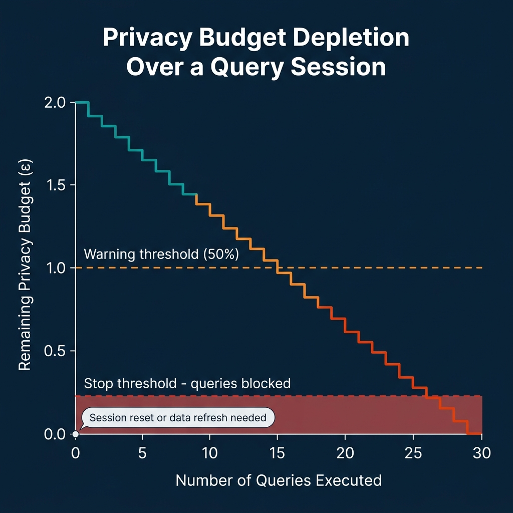
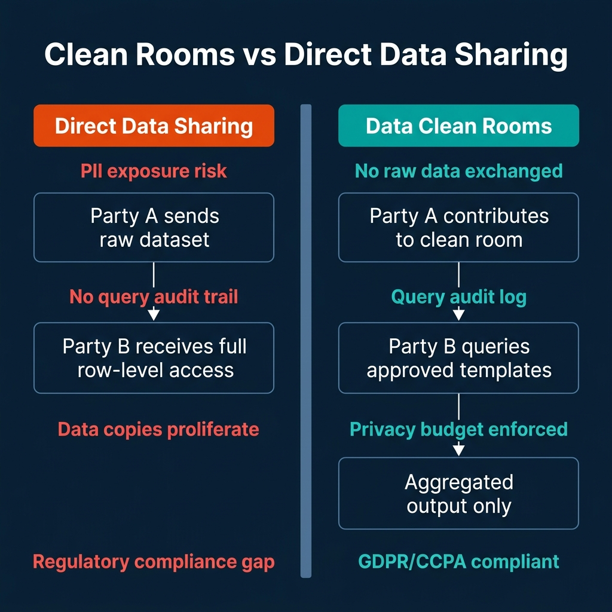

# Clean Rooms for Privacy-Preserving Analytics

Every organization that wants to collaborate on data faces the same tension. The analysis is valuable, matching your customer purchase history against a partner's ad impression data reveals attribution patterns that neither party could see alone. The data is sensitive, sharing raw customer records with an external party creates PII exposure risk, regulatory compliance problems, and the permanent problem of data copies that live outside your control.

The historical solutions to this tension have been inadequate. You can share nothing, and lose the analytical value. You can share everything, and accept the compliance and security risks. You can negotiate a complex data contract that creates a one-time data copy under strict terms, and hope neither party violates them.

Data clean rooms offer a fourth path. They create an isolated computational environment where both parties contribute data, queries run against the combined dataset inside the environment, and only aggregated, policy-filtered results leave. No raw row-level data from either party is ever accessible to the other.

---

## The Core Guarantee

The fundamental promise of a clean room is that neither party sees the other's individual records. This is enforced at the technical level, not just by contractual agreement.


The mechanics vary by platform, but the core model is consistent:

1. Both parties contribute datasets to the clean room environment through a secure data sharing mechanism (Delta Sharing, secure access links, or similar).
2. The clean room enforces approved query templates, pre-defined SQL queries that analysts can parameterize but cannot modify in ways that would expose individual records.
3. A privacy budget (often implemented via differential privacy) limits the total amount of information that can be extracted through repeated queries, preventing statistical re-identification attacks.
4. Only aggregated, noise-added results leave the environment.

---

## Databricks Clean Rooms

Databricks Clean Rooms uses Delta Sharing as the underlying data access protocol. Each collaborating party shares specific tables into the clean room workspace using Delta Sharing's signed URL mechanism, the data remains in the contributor's storage, with access delegated to the clean room compute.

The clean room administrator defines approved SQL queries as templates. A partner can parameterize these templates (filter by date range, product category, etc.) but cannot run arbitrary SQL that might expose individual rows. All query execution happens in the isolated clean room Databricks workspace, and only the query results leave.

```python
# Example: Creating a Databricks Clean Room collaboration
from databricks.sdk import WorkspaceClient

client = WorkspaceClient()

# Create the clean room
clean_room = client.clean_rooms.create(
    name="partner_attribution_analysis",
    remote_detailed_info={
        "collaborators": [
            {"global_metastore_id": "partner_metastore_id",
             "invite_recipient_email": "admin@partner.com"}
        ]
    }
)

# Define an approved output schema (only aggregations allowed)
# Partners can run: SELECT region, COUNT(*), SUM(revenue) 
# grouped by their dimension attributes
# They cannot: SELECT customer_id, email, transaction_amount
```

The separation is architectural. The partner's Databricks workspace never has credentials to read your underlying Delta Lake tables. Delta Sharing issues time-limited, scoped access tokens for the specific tables and operations the clean room requires.

---

## AWS Clean Rooms

AWS Clean Rooms provides a managed service that supports analysis across multiple parties' data stored in S3, with optional Differential Privacy controls. Teams configure a collaboration in the AWS console, specify which tables from each party participate, and define analysis rules.

Analysis rules in AWS Clean Rooms can be configured in three modes:
- **Aggregation-only:** Queries must include `GROUP BY` clauses and aggregation functions. No individual rows can be returned.
- **List:** Allows returning a limited set of columns with required attributes.
- **Custom:** Allows defining complex SQL with specific allowed functions.

The Differential Privacy feature in AWS Clean Rooms adds mathematically bounded noise to query results, providing formal privacy guarantees at the expense of some accuracy:

```sql
-- AWS Clean Rooms query with differential privacy enabled
-- Results will have noise added based on configured epsilon value
SELECT 
    campaign_id,
    COUNT(DISTINCT customer_id) AS attributed_customers,
    SUM(purchase_amount) AS total_attributed_revenue
FROM collaboration.matched_customers
GROUP BY campaign_id
HAVING COUNT(DISTINCT customer_id) >= 100;  -- Minimum count threshold enforced
```

The minimum count threshold (`HAVING COUNT >= 100`) prevents queries that isolate small groups from extracting information about individuals within those groups, even with noise addition.

---

## BigQuery Differential Privacy

BigQuery implements differential privacy natively in SQL through the `DIFFERENTIAL_PRIVACY` clause, available in queries run against BigQuery datasets. This allows organizations to expose analytical views of sensitive datasets with formal privacy guarantees, without requiring a separate clean room environment.

```sql
-- BigQuery differential privacy query
SELECT
    region,
    WITH DIFFERENTIAL_PRIVACY
        OPTIONS (epsilon = 1.0, delta = 1e-6, max_groups_contributed = 5)
        COUNT(DISTINCT user_id, contribution_bounds => (0, 1)) AS unique_users,
        AVG(purchase_amount, contribution_bounds => (0, 10000)) AS avg_purchase
FROM my_dataset.transactions
GROUP BY region;
```

The `epsilon` parameter (ε) controls the privacy-accuracy tradeoff. Smaller epsilon values add more noise, providing stronger privacy guarantees at the cost of result accuracy. The `delta` parameter bounds the probability that the privacy guarantee fails. `max_groups_contributed` limits how much any individual can affect the results by appearing in many groups.

---

## Privacy Budget: The Finite Resource

Every query against a differentially private dataset consumes a portion of the privacy budget. The budget is a finite resource, once depleted, further queries expose more information about individuals than the privacy guarantee allows.



Practical privacy budget management requires tracking consumption across all queries run against a protected dataset, alerting when the budget reaches warning thresholds, and either blocking further queries or refreshing the dataset (which resets the budget) when the budget is depleted.

In production clean room environments, this means instrumenting query execution to track epsilon consumption and building budget management tooling that enforces limits before queries run.

---

## Clean Rooms vs Direct Data Sharing



The comparison isn't purely about privacy. Direct data sharing creates data governance problems that compound over time: copies multiply, access controls drift, and audit trails are incomplete. Clean rooms create a single, policy-enforced access point that maintains an audit log of every query run.

For GDPR and CCPA compliance specifically, clean rooms provide a more defensible data processing arrangement than bilateral data transfers. The legal basis for processing partner data within a clean room, where the data never leaves the contributor's control and cannot be accessed by the collaborator, is cleaner than the legal basis for a data copy transferred to a partner's environment.

---

## Conclusion

Data clean rooms have moved from an enterprise niche (primarily advertising attribution measurement) to a general-purpose platform capability available in Databricks, AWS, and natively in BigQuery SQL. The technology is mature enough that most organizations with sensitive cross-party analysis needs can implement clean room collaboration without custom infrastructure.

The governance discipline required is not primarily technical. It's about defining the right approved query templates, maintaining privacy budget controls, and treating clean room access as a governed capability with review processes for adding new queries to the approved template library.

---

## Real-World Use Cases Beyond Ad Attribution

The media and advertising industry pioneered clean room adoption for campaign measurement. But the architecture is general-purpose, and 2025 saw adoption across several additional domains:

**Healthcare collaboration.** Hospital networks combining patient outcomes data to improve treatment protocols, without sharing individual patient records across institutions. The clean room provides a HIPAA-compatible framework for multi-institution research that would otherwise require de-identification and data transfer agreements.

**Financial services fraud detection.** Banks collaborating to identify cross-institution fraud patterns without sharing individual transaction records. A fraudster who moves money through multiple banks leaves a pattern visible only if the pattern can be detected in the combined dataset, which a clean room enables without raw data sharing.

**Retail and CPG supplier analysis.** Retailers analyzing category performance by combining their sales data with CPG manufacturers' supply chain data. Neither party shares raw transaction records; the clean room environment computes joint metrics like out-of-stock correlation with competitor activity.

**Government statistics.** National statistics agencies combining census microdata with administrative records (tax, health, employment) to produce richer statistical outputs, with differential privacy applied to prevent re-identification of individuals in published statistics.

In each case, the value of the combined dataset analysis exceeds the value of what either party can analyze independently, and the privacy-preserving architecture makes the collaboration legally and ethically feasible.

---

## Legal Framework: Why Clean Rooms Simplify Compliance

The legal basis for cross-party data sharing under GDPR and CCPA depends significantly on how data flows between parties. A direct transfer of raw personal data from Party A to Party B typically requires:

- A legal basis for the transfer (consent, legitimate interests, contract)
- A Data Processing Agreement (DPA) specifying how Party B handles the data
- Retention and deletion obligations for Party B
- Data subject access request obligations for Party B

Clean rooms change this legal picture. When Party B never receives raw personal data, they only submit approved queries to an isolated environment and receive aggregated results, many of these obligations don't apply. Party B is effectively not a data controller or processor in the traditional sense; they're receiving statistical outputs, not personal data.

This simplified legal basis makes the data sharing arrangement easier to approve through legal review and easier to audit for compliance. The clean room audit log provides documentary evidence that no individual records were transferred and that only approved query templates were executed.

---

## Beyond Differential Privacy: Other Privacy-Preserving Techniques

Differential privacy is the most mathematically rigorous privacy technique and the one most commonly implemented in commercial clean room platforms. But it's not the only technique in the privacy engineering toolkit.

**Secure Multi-Party Computation (MPC):** Multiple parties jointly compute a function over their combined data without revealing their individual inputs to each other. MPC provides exact results (no noise addition) but has higher computational overhead than differential privacy. It's most practical for specific operations (intersection size calculation, machine learning on joint data) rather than general analytics.

**Federated Learning:** Model training that keeps data local to each party while only sharing model gradients. Each party trains on their local data, gradients are aggregated (with noise addition to protect individual contributions), and the updated model is distributed back without raw data movement. This is the approach used in Google's FL framework and Apple's on-device ML.

**Synthetic Data Generation:** Creating statistically realistic synthetic datasets that preserve aggregate properties without containing actual individual records. Synthetic data can be shared freely because it doesn't represent real individuals. The limitation is that synthetic data quality degrades for rare subgroup analysis, the tail of the distribution is often poorly represented.

For most enterprise cross-party analytics, differential privacy in a clean room environment provides the best balance of analytical utility and privacy guarantee. The other techniques are valuable for specific workloads where the operational overhead is justified.

---

## Clean Room Adoption: Industry Use Cases

Clean room technology has seen practical adoption across several industries where the need for cross-party data analysis is high but data sharing is restricted by regulation, competitive concerns, or both.

**Advertising and media measurement.** The deprecation of third-party cookies has accelerated adoption of clean rooms for identity resolution and campaign measurement. An advertiser brings their first-party customer data; a publisher brings their audience data. The clean room computes match rates, reach and frequency metrics, and conversion attribution without either party seeing the other's raw user records. Google's Ads Data Hub, Amazon Marketing Cloud, and Meta's Advanced Analytics are all clean room products built for this use case.

**Healthcare and life sciences.** Pharmaceutical companies and health systems share data to conduct post-market safety studies, generate real-world evidence for drug approvals, and identify patient cohorts for clinical trial recruitment. HIPAA's Safe Harbor and Expert Determination standards establish the baseline for de-identification, but clean rooms with differential privacy provide mathematically provable guarantees beyond de-identification alone.

**Financial services.** Banks and financial institutions collaborate on fraud detection, money laundering detection, and credit risk modeling without sharing customer account data. The UK's Open Banking framework and the EU's PSD2 directive create a legal pathway for this kind of collaboration, and clean rooms provide the technical infrastructure.

**Retail and supply chain.** Retailers and consumer goods companies analyze category performance, promotional effectiveness, and inventory optimization using combined point-of-sale and supply chain data. The retailer's transaction data combined with the manufacturer's production and logistics data provides insights neither party can generate alone.

Across all these use cases, the pattern is the same: two or more parties with valuable, sensitive datasets need to compute aggregate statistics that require combining their data, without exposing the underlying records. Clean rooms make this tractable where it was previously either legally or technically impossible.

---

## The Business Case for Privacy-Preserving Infrastructure

Privacy-preserving infrastructure represents a genuine competitive advantage for organizations that build it correctly. The ability to collaborate on data analysis without data exposure enables a class of business intelligence that competitors without clean room infrastructure can't access.

For organizations that receive data from partners, the ability to offer clean room access as a product, rather than requiring partners to share raw data, reduces friction in data partnerships. Partners are more willing to share data under privacy-preserving guarantees because their risk exposure is lower. More partnership data means better models, better attribution, and better business decisions.

The investment in differential privacy primitives and clean room infrastructure also serves the organization's internal governance. The privacy accounting techniques used in clean rooms, tracking how much information is revealed by each query, are directly applicable to internal privacy governance for customer data. Organizations that build clean room expertise develop internal capabilities that improve their handling of first-party customer data.

---

### Build Privacy-First Data Platforms

For comprehensive guidance on data governance, privacy-preserving architecture, and lakehouse design, pick up [The 2026 Guide to Lakehouses, Apache Iceberg and Agentic AI: A Hands-On Practitioner's Guide to Modern Data Architecture, Open Table Formats, and Agentic AI](https://www.amazon.com/dp/B0GQNY21TD).

Browse Alex's other data engineering and analytics books at [books.alexmerced.com](https://books.alexmerced.com).

For governed multi-engine access to your Iceberg lakehouse with fine-grained column and row policies, try Dremio Cloud free at [dremio.com/get-started](https://www.dremio.com/get-started).
