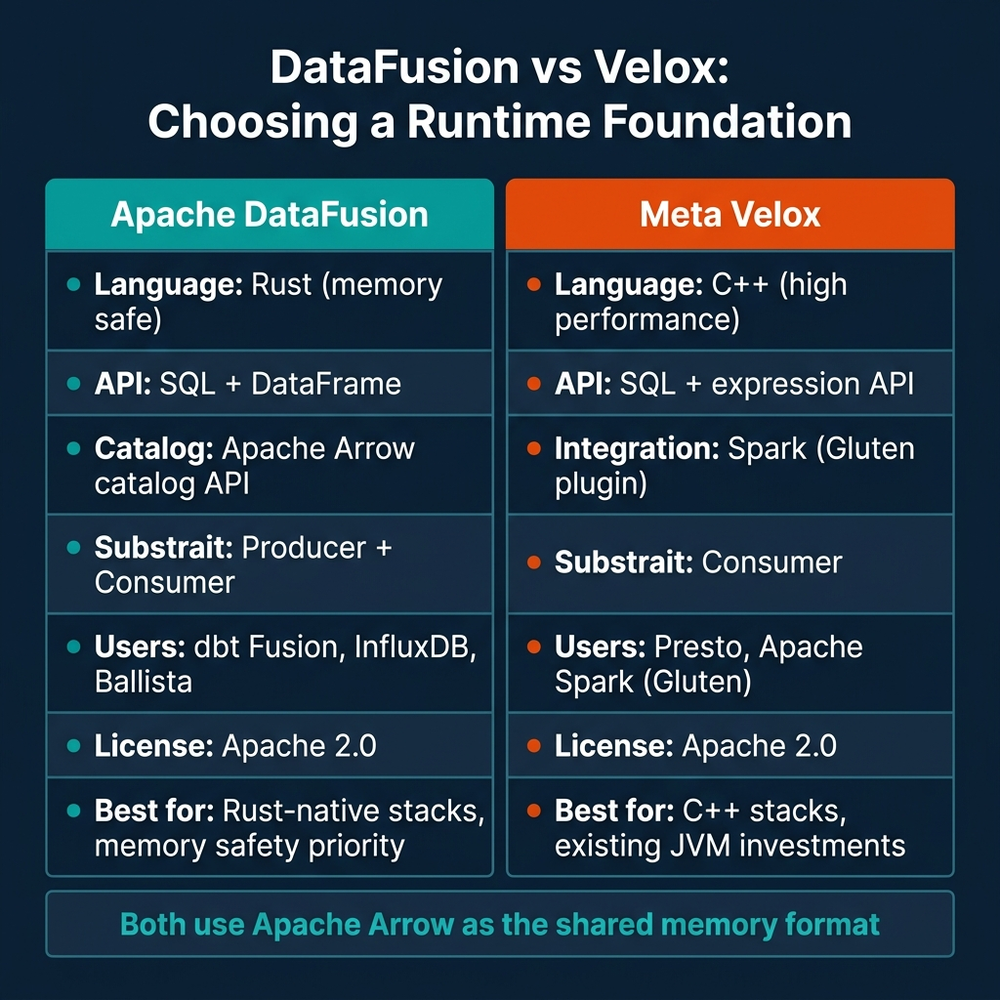

# Building Composable Query Engines with Rust Runtimes

For most of data engineering history, a query engine was a monolithic system. You picked a database or warehouse, and it owned everything from the SQL parser through the disk I/O layer. The engine choice was also your storage choice, your catalog choice, and often your governance choice. Composability—the ability to mix and match components from different systems—was minimal.

That design is being dismantled. Apache DataFusion provides an embeddable, modular query execution engine written in Rust. Meta's Velox provides a high-performance C++ execution kernel that plugs into Presto, Spark, and other systems. Substrait provides a cross-language plan representation format that lets query plans flow between different engines without recompilation or reparse. Apache Arrow provides the in-memory columnar format that eliminates serialization overhead when data moves between components.

Together, these four projects define a stack where you can build a query engine the way you build a web application—assembling purpose-fit components rather than accepting a single vendor's implementation decisions at every layer.

---

## The Problem with Monolithic Engines

A monolithic query engine owns too much. Its SQL parser is tightly coupled to its catalog protocol. Its physical execution layer assumes specific memory management patterns. Its storage I/O uses proprietary file access abstractions. To add a new data source, you often need to implement a connector interface that is specific to that engine's internal API.

This creates two expensive problems. First, every query engine team must solve the same problems: vectorized execution, predicate pushdown, partition pruning, join ordering. The implementations differ in detail but duplicate enormous amounts of engineering. Second, interoperability between engines requires serializing data to an intermediate format—usually Parquet files or Avro on S3—rather than sharing computation directly.

The composable stack addresses both by separating concerns into standardized layers.

---

## The Composable Stack: Four Layers


**Layer 1: The Query Interface.** The application presents queries as SQL strings or DataFrame API calls. This layer handles user-facing concerns: parse, validate column references, resolve types. It produces a logical plan—a tree of relational operators describing what to compute, not how.

**Layer 2: Optimization.** The optimizer transforms the logical plan into a physical plan. This is where join ordering, partition pruning, predicate pushdown, and scan selection happen. The optimizer is where most engine-specific intelligence lives. DataFusion implements a pluggable optimizer pipeline where custom rules can be inserted at each optimization pass.

**Layer 3: Plan Exchange via Substrait.** Substrait is a protobuf-based specification for relational algebra. A physical plan can be serialized to Substrait format and deserialized by a different engine. This enables query federation: part of a query can be executed by DataFusion (Rust), and another part can be offloaded to Velox (C++) or DuckDB, with the plan boundary expressed in Substrait.

DataFusion supports Substrait as both a producer (it can serialize its physical plans to Substrait) and a consumer (it can accept Substrait plans from other systems and execute them). Velox supports Substrait as a consumer, meaning it can receive plans from DataFusion, Spark (via the Gluten plugin), or other producers and execute them using its C++ kernel.

**Layer 4: Execution.** The execution layer reads data, applies operators, and produces results. Both DataFusion and Velox use vectorized, columnar execution: data flows through the operator pipeline as batches of Arrow-format columns rather than row-by-row. This is the architecture that enables cache-friendly SIMD operations and high throughput on modern hardware.

**The memory layer: Apache Arrow IPC.** Arrow's Inter-Process Communication format allows data to pass between processes (or components in the same process) as raw memory pointers to columnar buffers. No serialization, no copying. When a DataFusion component passes a batch to a Velox component in the same process, the data doesn't move at all—only the pointer does.

---

## Apache DataFusion: The Rust-Native Embedded Engine

DataFusion is the component you choose when you're building a new data system in Rust and need a query engine that you can customize at every level. It's not a database you deploy—it's a library you embed.

The key design properties:

**Pluggable table providers.** DataFusion's `TableProvider` trait defines the interface for registering a data source. Any implementation of `TableProvider` can be registered as a SQL table. This is how Iceberg support, Delta Lake support, and custom blob store readers plug into DataFusion-based systems.

**Pluggable execution operators.** The `ExecutionPlan` trait defines the interface for a physical operator. Custom operators—specialized aggregation functions, ML inference operators, custom join algorithms—can be inserted into the execution pipeline.

**Optimizer rule extensibility.** The optimizer runs a sequence of rule passes. Custom optimizer rules can be added to the pipeline to implement engine-specific optimizations that the default DataFusion implementation doesn't include.

```rust
// Minimal DataFusion example: registering an Iceberg table and running SQL
use datafusion::prelude::*;
use iceberg_datafusion::IcebergTableProvider;

#[tokio::main]
async fn main() -> datafusion::error::Result<()> {
    let ctx = SessionContext::new();
    
    // Register an Iceberg table as a DataFusion source
    let iceberg_provider = IcebergTableProvider::try_new(
        "s3://my-bucket/iceberg/events/"
    ).await?;
    
    ctx.register_table("events", Arc::new(iceberg_provider))?;
    
    // Query using standard SQL
    let df = ctx.sql(
        "SELECT region, COUNT(*) as cnt FROM events WHERE event_date = '2025-05-24' GROUP BY region"
    ).await?;
    
    df.show().await?;
    Ok(())
}
```

DataFusion has real production users. dbt Fusion uses DataFusion for SQL compilation and plan analysis. InfluxDB IOx uses it as the query engine for InfluxDB's column-store backend. The Ballista distributed query engine uses DataFusion as its single-node execution layer.

---

## Meta Velox: The C++ Execution Kernel

Velox is Meta's contribution to the composable stack. Where DataFusion targets teams building new systems from scratch in Rust, Velox targets teams with existing C++ or JVM-based systems who want a high-performance execution kernel without rewriting everything.

Velox integrates as a native execution plugin for Presto at Meta and is available to the open-source community as a Spark accelerator through the Gluten project. When Gluten is used, Spark's logical plan is compiled to Velox's internal plan representation, and the actual computation executes in C++ rather than JVM bytecode. Benchmarks from Gluten-enabled Spark clusters show substantial throughput improvements for CPU-bound aggregation and join workloads.

Velox also accepts Substrait plans, which means it can interoperate with DataFusion-produced plans for cross-system execution.

---

## DataFusion vs Velox: Choosing Your Foundation



The choice between DataFusion and Velox is primarily a language and integration question, not a performance question. Both execute on Arrow-format batches with vectorized operations. Both are competitive on analytical workloads.

Choose DataFusion if your team is building a new data system in Rust, you want memory safety guarantees at the execution layer, you need to embed a query engine in a library (not a service), or you want first-class Substrait producer support.

Choose Velox if you're adding an acceleration layer to an existing JVM-based system (specifically Spark via Gluten), your team's core expertise is in C++, or you're operating within Meta's Presto ecosystem.

For most new data platform projects in 2026, DataFusion is the default choice. The Rust ecosystem's library-first design, combined with DataFusion's extensive trait-based extensibility, makes it easier to build a new system on top of DataFusion than to integrate Velox into a stack that wasn't designed around it from the start.

---

## What This Means for Platform Engineers

The composable runtime stack doesn't require you to write a query engine to be useful. The practical implications are:

**Understand what your query tools are built on.** When you're evaluating DuckDB (built on its own C++ engine), dbt Fusion (built on DataFusion), or a custom Rust data tool, knowing whether it uses DataFusion or Velox tells you about extensibility, memory characteristics, and interoperability potential.

**Substrait enables federation without ETL.** If you need to route part of a query to one engine and part to another—for example, reading from an Iceberg table via DataFusion and passing results to a GPU acceleration layer—Substrait is the format that makes this possible without intermediate file writes.

**Arrow eliminates serialization overhead.** If two components in your pipeline both support Apache Arrow IPC, you can pass data between them without serialization. This is especially relevant for ML pipelines where query results feed directly into model inference.

---

## Conclusion

The composable query engine stack—DataFusion for Rust-native execution, Velox for C++ execution, Substrait for plan portability, Arrow for zero-copy memory—represents a genuine architectural shift in how data systems are built. Monolithic engines are not disappearing, but the ability to assemble a custom engine from well-defined, independently-maintained components is now practical rather than theoretical.

For teams building new data infrastructure, DataFusion is the most productive starting point. It's a mature library, actively maintained under the Apache Software Foundation, with production use cases that prove its execution model at scale.

---

## Building an Embedded Analytics Engine with DataFusion

One of the most compelling use cases for DataFusion is embedding it directly in applications that need analytical query capability without the overhead of a separate service. This pattern is increasingly common for multi-tenant SaaS applications where each tenant needs SQL analytics against their own dataset.

A minimal embedded analytics API built on DataFusion:

```rust
use actix_web::{web, App, HttpServer, HttpResponse};
use datafusion::prelude::*;
use serde::{Deserialize, Serialize};
use std::sync::Arc;
use tokio::sync::RwLock;

// Shared DataFusion SessionContext (one per tenant in production)
type SharedContext = Arc<RwLock<SessionContext>>;

#[derive(Deserialize)]
struct QueryRequest {
    sql: String,
    tenant_id: String,
}

#[derive(Serialize)]
struct QueryResponse {
    rows: Vec<serde_json::Value>,
    row_count: usize,
    execution_time_ms: u64,
}

async fn execute_query(
    ctx: web::Data<SharedContext>,
    query: web::Json<QueryRequest>,
) -> HttpResponse {
    let start = std::time::Instant::now();
    
    // Get or create tenant context
    let session = ctx.read().await;
    
    // Execute SQL query
    match session.sql(&query.sql).await {
        Ok(df) => {
            let batches = df.collect().await.unwrap_or_default();
            let rows = arrow_to_json(&batches);
            let elapsed = start.elapsed().as_millis() as u64;
            
            HttpResponse::Ok().json(QueryResponse {
                row_count: rows.len(),
                rows,
                execution_time_ms: elapsed,
            })
        }
        Err(e) => HttpResponse::BadRequest().body(e.to_string()),
    }
}
```

This embedded pattern means the query engine starts and stops with the application process, scales horizontally with the application, and has zero network overhead for query execution—data stays in the process address space.

---

## Ballista: DataFusion for Distributed Workloads

When single-node DataFusion reaches its limits (roughly when the dataset doesn't fit on one machine), Ballista extends DataFusion to a distributed execution model. Ballista uses the same physical plan representation as single-node DataFusion, but distributes plan fragments across worker nodes.

The development workflow is the same: write DataFusion queries locally, test on small data, deploy to a Ballista cluster for large-scale execution. The API difference is creating a `BallistaContext` instead of a `SessionContext`:

```rust
use ballista::prelude::*;

#[tokio::main]
async fn main() -> Result<()> {
    // Connect to Ballista scheduler
    let ctx = BallistaContext::remote("localhost", 50050, &BallistaConfig::new()).await?;
    
    // Register data sources - same API as local DataFusion
    ctx.register_parquet("events", "s3://my-bucket/events/**/*.parquet", ParquetReadOptions::default()).await?;
    
    // Query executes distributed
    let df = ctx.sql("SELECT date, SUM(amount) FROM events GROUP BY date ORDER BY date").await?;
    df.show().await?;
    
    Ok(())
}
```

Ballista is less mature than DataFusion itself and is still catching up to the DataFusion API surface. But for teams that are already building on DataFusion and need to scale out, Ballista provides a path that doesn't require adopting Spark.

---

## The Practical Impact on Query Performance

The composable stack's performance advantages are most visible in workloads that previously required data movement between systems.

In a traditional architecture, a query that joins a Postgres table with an Iceberg table with a Redis lookup might require:
1. Export Postgres data to S3 as Parquet
2. Load S3 Parquet into Spark
3. Load Redis data into Spark
4. Run the join in Spark

With DataFusion's pluggable table providers, all three sources can be registered as tables in the same SessionContext, and the join executes in a single Arrow-native pass with no intermediate files:

```sql
-- All three sources queried in one statement, no data movement
SELECT 
    u.user_id,
    u.email,
    e.purchase_count,
    r.loyalty_tier
FROM postgres_users u
JOIN iceberg_events e ON u.user_id = e.user_id
JOIN redis_loyalty r ON u.user_id = r.user_id
WHERE e.event_date = '2025-05-24'
```

This query processes data from Postgres, Iceberg, and Redis without materializing any intermediate dataset to disk. The Arrow IPC format enables zero-copy data passing between the table providers and the join executor. For queries that frequently need cross-source joins, the performance improvement over traditional ETL-then-join workflows is substantial.

---

## The Composable Data Ecosystem in Practice

The composable data engineering paradigm is not just about query engines. It extends across the entire data stack through a set of shared standards that enable independent components to interoperate.

Apache Iceberg and Delta Lake provide the open table format layer—a standard way to represent tables that any engine can read. Apache Arrow provides the in-memory columnar format that engines use to exchange data without serialization overhead. Substrait provides a standard representation of query plans that different engines can exchange. These three specifications together make the "composable" vision concrete: separate storage, compute, and catalog components that can be mixed and matched without vendor lock-in.

The practical result is that a team can build an architecture where Kafka ingests data to Iceberg via Flink, Spark performs complex transformations, DuckDB runs ad-hoc analyst queries, and Dremio serves BI tool SQL—all against the same underlying Iceberg tables, with no data movement between components.

This composability also means that adopting a new tool doesn't require rebuilding the data stack. When LanceDB's multimodal capabilities became valuable for an ML team's embedding workload, they added it alongside the existing Iceberg infrastructure rather than replacing it. When DataFusion's embedded engine use case emerged for a lightweight API service, it could read the same Iceberg tables as the rest of the stack. Each new tool plugs in to the existing data layer through the open format.

The organizational implication is significant. Composable architectures allow different teams to choose the query engine that fits their workload and skill set without creating data silos. The ML team uses Python and Polars. The analytics team uses DuckDB and SQL. The data platform team uses Spark for heavy transformation. All three teams share the same Iceberg tables. Coordination happens through data agreements and schema contracts, not through shared infrastructure choices.

---

## Choosing a Query Engine: Decision Framework

Teams evaluating composable query engine options benefit from a structured decision framework rather than a feature comparison matrix. The right engine depends on the workload pattern, team skills, deployment environment, and operational constraints—not on which engine wins the TPC-DS benchmark on a specific hardware configuration.

**Start with the access pattern.** Single-process SQL on datasets under 100 GB that fit on disk: DuckDB. Python-centric DataFrame transformations with ML integration: Polars. Complex stateful streaming with event-time semantics: Flink. Large-scale batch transformations with wide ecosystem support: Spark. Embedded query execution in an application or API: DataFusion. No single engine covers all of these patterns optimally.

**Consider the operational context.** A team running Kubernetes already knows how to operate distributed JVM services—Spark or Flink is a natural fit. A team building serverless Python functions won't want to manage a Spark cluster. A startup with two data engineers can't afford the operational overhead of Milvus plus Kafka plus Spark—simpler tools that cover the same ground with less infrastructure are more appropriate.

**Account for ecosystem integrations.** Spark has the deepest catalog and connector integrations of any query engine in the open-source ecosystem. DuckDB has the fastest growing integration surface for ad-hoc analytics. DataFusion's Rust-native execution makes it the best choice when query execution must be embedded in a non-JVM service. Choose based on what already exists in your stack.

---

### Build Deeper Expertise

For a comprehensive treatment of modern data architecture patterns, open table formats, and composable systems, pick up [The 2026 Guide to Lakehouses, Apache Iceberg and Agentic AI: A Hands-On Practitioner's Guide to Modern Data Architecture, Open Table Formats, and Agentic AI](https://www.amazon.com/dp/B0GQNY21TD).

Browse Alex's other data engineering and analytics books at [books.alexmerced.com](https://books.alexmerced.com).

Dremio's query engine uses Apache Arrow as its core data format and is designed for multi-engine lakehouse access. Try it free at [dremio.com/get-started](https://www.dremio.com/get-started).
