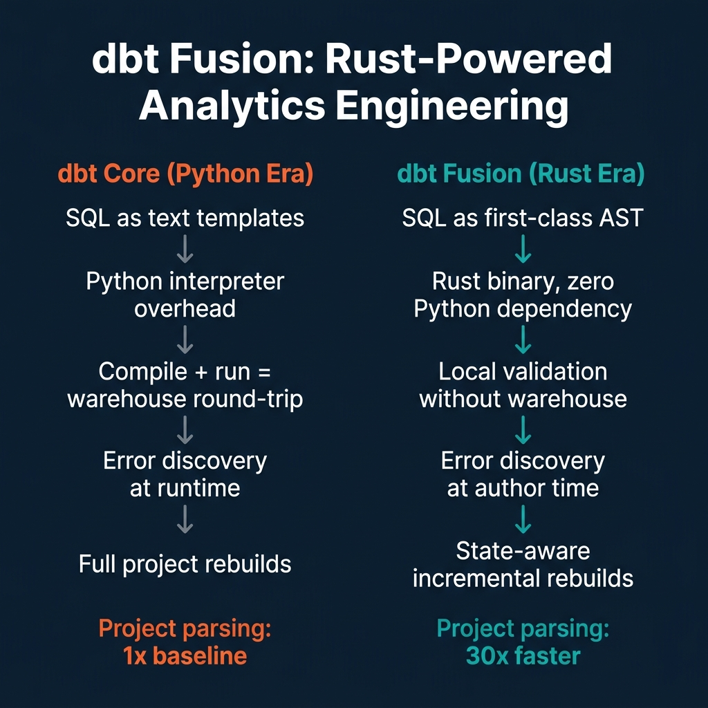
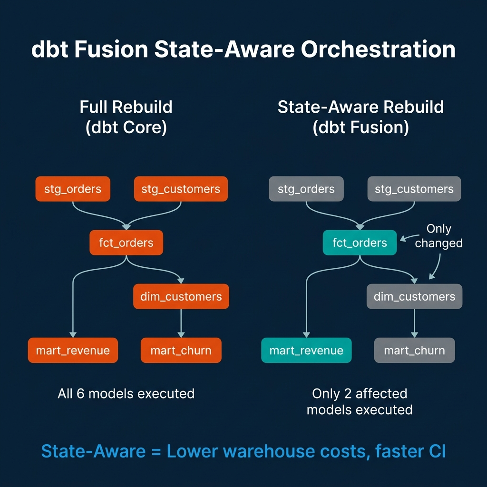

# How dbt Fusion Reshapes Analytics Engineering

The dbt Core engine that analytics engineering teams have relied on since 2017 was built in Python at a time when the job of the tool was to template SQL and run it against a warehouse. It worked well for that job. It also inherited the constraints of a text-template system: SQL was a string to be rendered, not code to be analyzed. The engine had no understanding of column references, type compatibility, or cross-model dependencies beyond the explicit `ref()` calls that connected models in the DAG.

dbt Fusion, launched as a public beta on May 28, 2025, is a ground-up rewrite of the dbt execution engine in Rust. It isn't a version update or a performance patch—it's a different execution model. SQL is now treated as an abstract syntax tree (AST) that the engine understands statically, before any query reaches the warehouse. The downstream effects of this architectural change touch everything from local development experience to CI pipeline cost.

---

## The Python Era: SQL as Text

In dbt Core, a model like this:

```sql
-- models/fct_revenue.sql
select
    o.order_id,
    o.customer_id,
    c.region,
    o.amount as revenue
from {{ ref('stg_orders') }} o
join {{ ref('stg_customers') }} c on o.customer_id = c.id
where o.status = 'completed'
```

is processed by a Jinja2 templating engine that substitutes `{{ ref('stg_orders') }}` with the correct table name for the current target environment. The resulting SQL string is sent to the warehouse for execution. The Python process that manages this rendering has no understanding of SQL syntax—it can't tell you whether `o.customer_id` and `c.id` have compatible types, or whether `amount` exists as a column in `stg_orders`, without actually running the query.

This means errors surface at runtime, after paying for warehouse execution. For a large project with hundreds of models, discovering that a renamed column broke three downstream models requires running the full pipeline—paying for compute, waiting for results, and only then seeing which models failed.

---

## dbt Fusion: SQL as First-Class Code

Fusion replaces the Jinja2-over-text approach with a genuine SQL compiler. The engine parses SQL into an AST, resolves column references across model dependencies, performs type checking, and reports errors locally—before any query reaches the warehouse.



What this enables:

**Real-time error detection in VS Code.** The Fusion engine powers a Language Server Protocol (LSP) implementation. The official dbt VS Code extension uses this to underline type errors, unresolved column references, and dialect incompatibilities as you type—the same experience TypeScript developers have had for years. Analytics engineers no longer need to submit a job to the warehouse to find out if a column rename broke downstream models.

**Column-aware autocomplete.** Because Fusion understands the schema of each model in the project, it can suggest valid column names in joins and `WHERE` clauses. This eliminates a class of typo-induced bugs that previously required runtime discovery.

**30x faster project parsing.** dbt Labs reported up to 30x faster project parsing compared to dbt Core. For large projects with hundreds of models, this transforms the iteration loop. Test a single model change in seconds rather than waiting for a full project scan.

**Zero Python dependency.** Fusion ships as a standalone Rust binary with no Python runtime requirement. This simplifies CI/CD pipeline setup (no virtual environment management), containerization (smaller images), and deployment to environments where managing Python versions is an operational burden.

---

## State-Aware Orchestration: The Cost Story

The most operationally significant Fusion feature for production environments is state-aware orchestration.



In dbt Core, running `dbt build` triggers execution of every model in the project—or every model in a selected subset. If only `fct_orders.sql` changed, the run still typically executes all downstream models to ensure consistency: `fct_orders`, `dim_customers`, `mart_revenue`, `mart_churn`. This costs warehouse compute for models whose logic didn't change.

State-aware orchestration means Fusion tracks which models have actually changed (by diffing the compiled SQL AST, not the source file) and which upstream datasets have new data. It executes only the models that are affected by the change—not the entire downstream graph. In a project with hundreds of models, this can reduce CI run time and warehouse compute cost by an order of magnitude for common change patterns like updating a single staging model.

```bash
# Run only models affected by changes since the last successful run
dbt build --select state:modified+
```

---

## What Doesn't Change

Fusion maintains the dbt authoring layer that analytics engineers already know. SQL files, YAML schema definitions, `ref()` and `source()` functions, Jinja macros—these all work the same way. Teams migrating from dbt Core don't rewrite their models. They install the Fusion binary and change the runtime.

Adapter macro compatibility is the primary migration concern. Fusion's Rust core handles SQL parsing and compilation, but database-specific adapter macros (the code that translates generic dbt operations into warehouse-specific SQL) still use Python. Teams with heavily customized macros may encounter compatibility issues during migration that require testing before moving production environments to Fusion.

---

## The Development Workflow in Practice

The practical change for an analytics engineer's daily workflow looks like this:

**Before Fusion:** Write SQL, run `dbt compile` to check for Jinja errors, run `dbt run --select my_model` against dev warehouse, check output, iterate. Each iteration requires a warehouse round-trip.

**With Fusion:** Write SQL, get real-time syntax and column error highlighting in VS Code without leaving the editor, run `dbt run --select my_model` to validate end-to-end results. The first warehouse round-trip happens later in the loop—after local validation has already caught most errors.

For teams running CI on every pull request, the state-aware rebuild eliminates full-project rebuild costs for targeted changes. A PR that updates one staging model no longer triggers a full project rebuild; it triggers only the affected downstream models.

---

## Conclusion

dbt Fusion is the biggest change to the dbt ecosystem since the introduction of the Semantic Layer. It resolves a design tension that has been present since dbt's origins: SQL is a typed, structured language being processed by a system that treated it as unstructured text.

The Rust rewrite and static AST analysis make the feedback loop tighter, CI pipelines cheaper, and error discovery earlier. Teams still need to test Fusion compatibility with their specific adapter macros and warehouse configurations. But for the majority of dbt projects using standard patterns, Fusion represents a meaningful improvement to the analytics engineering experience.

---

## The dbt Semantic Layer and MetricFlow

Alongside Fusion's execution changes, the dbt Semantic Layer has matured into a production-ready component for teams that want a governed metric layer above their warehouse models.

MetricFlow—the SQL generation engine behind the dbt Semantic Layer—defines metrics as composable objects with defined dimensions, filters, and measures. A metric defined once in MetricFlow can be queried consistently across any downstream tool (Tableau, Looker, Mode, custom applications) without each tool reimplementing the aggregation logic.

```yaml
# models/metrics/fct_revenue.yml
metrics:
  - name: total_revenue
    label: Total Revenue
    description: Gross revenue from completed orders
    type: simple
    type_params:
      measure: revenue_amount
    filter: |
      {{ Dimension('status') }} = 'completed'
    dimensions:
      - name: region
        type: categorical
      - name: order_date
        type: time
        type_params:
          time_granularity: day
```

Once defined, this metric is queryable through the dbt Semantic Layer API, with MetricFlow automatically generating the appropriate SQL for the target warehouse:

```python
# Query the semantic layer from a Python application
from dbt_semantic_interfaces.query_interface import SemanticLayerClient

client = SemanticLayerClient(
    environment_id="your-env-id",
    auth_token="your-token",
    host="semantic-layer.cloud.getdbt.com"
)

# MetricFlow generates correct SQL automatically
results = client.query(
    metrics=["total_revenue"],
    group_by=["region", "order_date"],
    where="order_date >= '2025-01-01'"
)
```

This is the governed alternative to every BI tool writing its own revenue calculation SQL—MetricFlow ensures that "total revenue" means the same thing regardless of which tool is asking the question.

---

## dbt Fusion with Apache Iceberg

The combination of dbt Fusion and Apache Iceberg Iceberg tables as dbt model targets is a configuration that several data teams have adopted for lakehouse analytics engineering.

When dbt models write to Iceberg tables through adapters that support Iceberg (dbt-spark, dbt-trino, dbt-glue, and the newer dbt-iceberg experimental adapter), the benefits of Iceberg's table format—ACID transactions, schema evolution, time travel—apply to dbt model outputs.

**Incremental models with Iceberg:** Iceberg's merge-on-read and copy-on-write strategies map naturally to dbt's incremental materialization strategies. A dbt incremental model that appends new rows uses Iceberg's ACID append. A model that upserts uses Iceberg's MERGE statement support.

```sql
-- dbt incremental model targeting an Iceberg table
{{ config(
    materialized='incremental',
    unique_key='order_id',
    on_schema_change='merge',
    file_format='iceberg',
    incremental_strategy='merge'
) }}

SELECT
    order_id,
    customer_id,
    amount,
    status,
    updated_at
FROM {{ ref('stg_orders') }}

WHERE updated_at > (SELECT MAX(updated_at) FROM {{ this }})

```

**Schema evolution without rebuilds:** Iceberg's schema evolution means adding a column to a dbt model doesn't require dropping and recreating the table. The new column is added to the Iceberg schema metadata, existing data files remain untouched, and the new column shows as NULL for historical rows until backfilled.

---

## Testing Strategies for dbt Projects

dbt's native testing framework has expanded in 2025 to include more sophisticated data quality checks alongside the standard singular and generic tests.

**Generic tests** check universal properties: `not_null`, `unique`, `accepted_values`, `relationships`. These should cover every model's primary key, every foreign key relationship, and every column with a fixed set of valid values.

```yaml
# schema.yml: comprehensive testing for a fact table
models:
  - name: fct_orders
    columns:
      - name: order_id
        tests:
          - not_null
          - unique
      - name: customer_id
        tests:
          - not_null
          - relationships:
              to: ref('dim_customers')
              field: customer_id
      - name: status
        tests:
          - accepted_values:
              values: ['pending', 'processing', 'completed', 'cancelled', 'refunded']
      - name: amount
        tests:
          - not_null
          - dbt_utils.accepted_range:
              min_value: 0
              inclusive: true
```

**Singular tests** express custom business logic that generic tests can't capture:

```sql
-- tests/assert_revenue_positive.sql—Passes if result set is empty (no failing rows)
SELECT
    order_id,
    amount,
    'Expected positive revenue for completed orders' AS failure_reason
FROM {{ ref('fct_orders') }}
WHERE status = 'completed'
  AND amount <= 0
```

Running the full test suite as part of CI with Fusion's state-aware execution means only tests for affected models run on each PR—dramatically reducing CI time for targeted changes.

---

## The Analytics Engineering Role in 2026

The tooling improvements in Fusion and the maturation of the dbt Semantic Layer have changed what it means to be an analytics engineer. Early dbt practitioners spent significant time debugging Jinja macro behavior, writing workarounds for SQL-as-string limitations, and waiting for CI pipelines to complete. The technical friction was constant.

With Fusion, the development experience more closely resembles software engineering. Real-time error feedback in the IDE, fast local compilation, and state-aware CI runs change the feedback loop. The time between "I made a change" and "I know whether the change is correct" shrinks from minutes to seconds for most common changes.

This shift frees analytics engineering time for higher-value work: designing better data models, defining metrics with precision in MetricFlow, improving test coverage, and documenting datasets so that downstream consumers—including AI assistants querying the semantic layer—can use them correctly.

The semantic layer's role in this shift is particularly significant for AI use cases. A well-designed MetricFlow metric definition is not just useful for Tableau dashboards—it's the definition that an AI agent queries when it answers "what was total revenue this quarter?" If the metric is defined correctly in MetricFlow, the AI answer is grounded in the same calculation logic that powers every other downstream tool. If revenue logic is scattered across BI tool calculations and SQL transforms, AI answers will be inconsistent with the numbers analysts see in dashboards.

Analytics engineering discipline—defining metrics in one place, testing every model, documenting every column—has always been valuable. In the AI-assisted analytics environment of 2026, it's load-bearing infrastructure.

---

## dbt Deployment Best Practices: Environments and Promotion

A production-grade dbt deployment requires at least three environments: development, staging, and production. Each environment has its own target database or schema, and models are promoted from development through staging to production after passing validation gates.

**Development environment:** Each data engineer works in their own schema namespace. Fusion's state-aware CI only builds models affected by the current branch's changes, so developers get fast feedback without building the entire project. The development environment uses a limited dataset—either sample data or a subset of production—to keep build times fast.

**Staging environment:** This is a full-scale environment that mirrors production data. CI runs against staging after every pull request merge to the main branch. Staging is where integration tests run—verifying that models produce expected row counts, that relationships between models hold, and that no source freshness violations exist.

**Production environment:** Production runs on a schedule (typically every few hours for batch analytical models) and receives models only after they pass the full staging validation suite. Production dbt runs should emit lineage events (to OpenLineage or the catalog) and alert on failures through PagerDuty or Slack.

The Fusion toolchain's partial parsing capability makes multi-environment deployments faster. When a model's upstream dependencies haven't changed, Fusion skips re-parsing those models during the compile step. For large dbt projects with hundreds of models, this reduces CI compile times from minutes to seconds for typical branch changes.

---

### Go Further with Data Engineering

For comprehensive guidance on building reliable, governed data platforms, pick up [The 2026 Guide to Lakehouses, Apache Iceberg and Agentic AI: A Hands-On Practitioner's Guide to Modern Data Architecture, Open Table Formats, and Agentic AI](https://www.amazon.com/dp/B0GQNY21TD).

Browse Alex's other data engineering and analytics books at [books.alexmerced.com](https://books.alexmerced.com).

For federated analytics with query acceleration across your dbt-modeled data, try Dremio Cloud free at [dremio.com/get-started](https://www.dremio.com/get-started).
