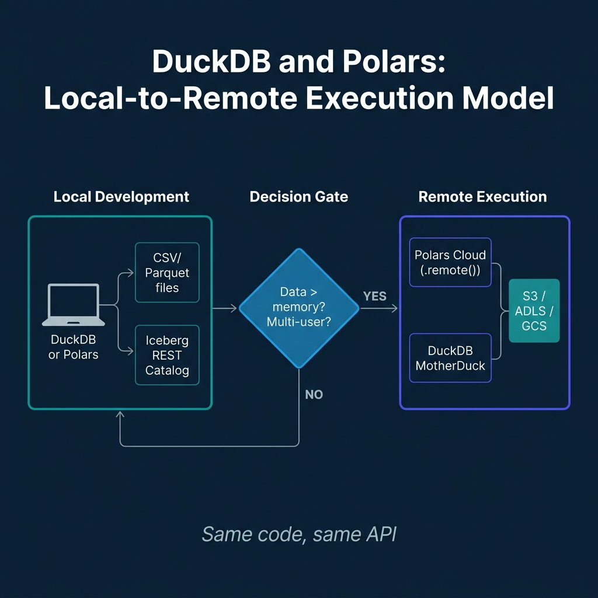
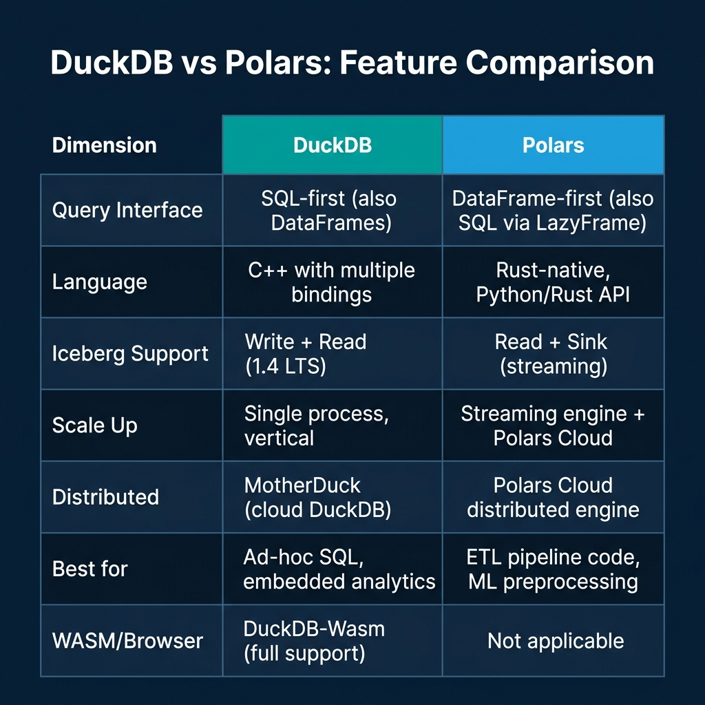

# Using DuckDB and Polars to Query Iceberg Tables

Two years ago, DuckDB and Polars were single-process analytical tools with limited lakehouse integration. You could read Parquet files from S3 using either, but writing to a catalog-managed Iceberg table required Spark or Flink. That constraint has been removed.

DuckDB 1.4 LTS, released in September 2025, shipped with Iceberg write support. Polars extended its streaming engine's sink capabilities to include Iceberg tables in 2026. Both tools now offer a complete read-write path to Iceberg tables managed by REST Catalogs like Apache Polaris, Nessie, and Amazon S3 Tables. DuckDB went further: by December 2025, the DuckDB-Wasm build included the Iceberg extension, enabling browser-based read and write access to Iceberg REST Catalogs with no backend server.

This post covers what's actually different about these two tools and how to integrate both into a lakehouse workflow.

---

## DuckDB and Iceberg: What Changed in 1.4

DuckDB has supported reading Iceberg tables since earlier releases through its `iceberg` extension. The 1.4 LTS release added write capability: INSERT operations create new Parquet files and commit new snapshots to the Iceberg catalog. The 1.4.2 patch extended this to DELETE and UPDATE operations, implemented using positional deletes (merge-on-read semantics).

To connect to an Iceberg table through a REST Catalog:

```sql
-- Install and load the Iceberg extension
INSTALL iceberg;
LOAD iceberg;

-- Configure a REST catalog connection
CREATE SECRET iceberg_catalog (
    TYPE iceberg_rest,
    ENDPOINT 'https://my-polaris-catalog.example.com/api/catalog',
    CREDENTIAL 'Bearer my-oauth-token'
);

-- Attach the catalog
ATTACH 'my_namespace' AS my_lake (TYPE iceberg_rest, SECRET 'iceberg_catalog');

-- Query a table
SELECT * FROM my_lake.events WHERE event_date = '2025-05-24';

-- Write to a table
INSERT INTO my_lake.events 
SELECT * FROM read_parquet('s3://staging/events-2025-05-24/*.parquet');
```

The write constraint to be aware of: DuckDB implements updates and deletes using positional deletes rather than full row rewrites (copy-on-write). For tables receiving heavy mutation loads, this means delete files accumulate between compaction runs, the same issue described earlier for Iceberg V2 CDC pipelines. For append-heavy analytical tables where DuckDB's primary use case lies, this is a non-issue.

DuckDB-Wasm's Iceberg integration is more architecturally novel. The browser build uses JavaScript's Fetch API to handle HTTP requests, meaning DuckDB-Wasm can communicate with Iceberg REST Catalog endpoints directly from a browser tab. This enables analytics dashboards and data exploration tools that run entirely client-side, with the browser reading Iceberg table metadata and Parquet data from S3 directly, without any server-side query layer.

---

## Polars and Iceberg: The Streaming Sink

Polars approaches Iceberg differently. Rather than offering a full SQL-level catalog integration, Polars' Iceberg support is centered on its LazyFrame and streaming engine.

For reading:

```python
import polars as pl

# Read an Iceberg table as a lazy frame
lf = pl.scan_iceberg("s3://my-bucket/iceberg/events/")

# Apply transformations lazily
result = lf.filter(
    pl.col("event_date") == "2025-05-24"
).select(
    ["user_id", "event_type", "amount"]
).sort("amount", descending=True)

# Collect (execute) locally
df = result.collect()
```

For writing through the streaming engine, Polars uses sink operations that allow it to process larger-than-memory datasets:

```python
import polars as pl

# Stream-process a large dataset and sink to Iceberg
(
    pl.scan_parquet("s3://staging/raw-events/**/*.parquet")
    .filter(pl.col("event_type").is_in(["purchase", "signup"]))
    .with_columns([
        pl.col("ts").dt.date().alias("event_date")
    ])
    .sink_iceberg(
        "s3://my-bucket/iceberg/events/",
        mode="append"
    )
)
```

The streaming sink processes input in chunks, writing Parquet files incrementally rather than accumulating everything in memory before writing. This makes Polars a practical ETL engine for medium-scale data movement workloads where data exceeds available RAM but doesn't require the cluster-level parallelism of Spark or Flink.

---

## Polars Cloud: From Local to Distributed

The major Polars development in 2025 is Polars Cloud, which extends local Polars execution to managed cloud infrastructure without requiring code changes.



The pattern is a `ComputeContext` that describes the cloud resources, combined with `.remote(ctx)` chained onto a `LazyFrame`. The same Polars code that runs locally against a sample dataset runs on cloud infrastructure against the full dataset by swapping the execution context:

```python
import polars as pl
from polars_cloud import ComputeContext

# Define a cloud compute context
ctx = ComputeContext(
    provider="aws",
    cpu=64,
    memory_gb=256,
    region="us-east-1"
)

# Same LazyFrame code as local development
result = (
    pl.scan_iceberg("s3://my-data-lake/iceberg/events/")
    .filter(pl.col("revenue") > 1000)
    .group_by("region")
    .agg(pl.sum("revenue"))
    .remote(ctx)  # Execute remotely
    .collect()
)
```

Polars Cloud also supports a distributed engine in open beta, which enables horizontal scaling across multiple machines for queries that don't fit a single node's memory even with streaming. The distributed engine automatically partitions work across worker nodes for aggregations and joins.

MotherDuck provides an analogous capability for DuckDB: cloud-executed DuckDB with a hybrid execution model that can run part of a query locally and part remotely, optimizing network data movement for analytical queries against remote Iceberg tables.

---

## Feature Comparison



The tools serve complementary rather than competing use cases. DuckDB is the right choice when your team speaks SQL, when you need embedded analytics in an application, or when you want to explore Iceberg data from a notebook or browser without managing server infrastructure.

Polars is the right choice when your primary artifacts are Python pipeline code, when you're building ML preprocessing pipelines that need to chain DataFrame operations with scikit-learn or PyTorch, or when you want a Rust-native execution engine with guaranteed memory safety properties.

Both now support Iceberg as a first-class data store, which means you can build a lakehouse workflow where data lands in Iceberg via Flink or Spark ingestion, is queried and explored via DuckDB for ad-hoc analysis, and processed through Polars for feature engineering and ML training set generation, all using the same Iceberg table as the shared source of truth.

## The Development Workflow: Local to Lakehouse

One of the most underappreciated aspects of both DuckDB and Polars is their role in the development workflow itself. Before a pipeline runs in production on Spark or Flink, engineers need to develop and test it against real data at a manageable scale. Both tools excel here.

A common pattern is a staged development approach:

1. **Local exploration (DuckDB):** Use DuckDB to explore the raw data, understand schemas, identify data quality issues, and prototype the transformations needed.

2. **Pipeline development (Polars):** Implement the transformation logic in Polars. Test it against a sample of the production data on a local machine.

3. **Scale verification (Polars Cloud or MotherDuck):** Run the same code against the full production dataset on cloud infrastructure, without rewriting the pipeline for Spark.

4. **Production deployment:** If the dataset grows to Spark/Flink scale, the Polars LazyFrame API provides clear semantics that map reasonably well to PySpark DataFrame operations, making migration manageable.

This workflow eliminates a significant development cost: the local development loop for Spark pipelines requires either running a local Spark cluster (expensive to set up and maintain) or submitting jobs to a remote cluster (slow iteration cycles). With DuckDB and Polars, the local development loop runs in seconds rather than minutes.

---

## DuckDB for Embedded Analytics and Browser Applications

DuckDB's embedding capabilities go well beyond notebook analytics. As a library that can be embedded in applications, DuckDB enables analytics patterns that were previously impractical.

**Application-embedded analytics:** A Python web application can embed DuckDB and run complex aggregation queries against user-specific datasets without external service dependencies. This pattern is particularly useful for multi-tenant SaaS applications where each tenant's data is small enough to query locally but complex enough to require proper SQL analytics.

**Browser-based analytics with DuckDB-Wasm:** The DuckDB-Wasm build, now with Iceberg extension support, enables analytics dashboards that run entirely in the browser. User data is loaded from S3 directly, and DuckDB executes analytical queries client-side. This eliminates the server-side query infrastructure for many dashboard use cases.

```javascript
// Browser-based DuckDB-Wasm with Iceberg support
import * as duckdb from '@duckdb/duckdb-wasm';

const db = await duckdb.createDuckDB({
    query: { castTimestampToDate: true }
});
const conn = await db.connect();

// Load the Iceberg extension
await conn.query("INSTALL iceberg; LOAD iceberg;");

// Configure catalog access
await conn.query(`
    CREATE SECRET iceberg_catalog (
        TYPE iceberg_rest,
        ENDPOINT 'https://catalog.example.com/api/catalog',
        CREDENTIAL 'Bearer ${userToken}'
    );
`);

// Query directly from browser, no server required
const result = await conn.query(`
    SELECT region, SUM(amount) as total_revenue
    FROM iceberg_catalog.main.orders
    WHERE event_date >= '2025-01-01'
    GROUP BY region
    ORDER BY total_revenue DESC
`);
```

This client-side analytics pattern has real performance advantages for interactive dashboards. Users get sub-second query responses for exploratory analytics without waiting for a centralized query service to process their request.

---

## Practical Patterns: DuckDB for Data Quality Profiling

One area where DuckDB shines specifically is data quality profiling during ingestion validation. Before writing to an Iceberg table, you can run statistical profiling queries in DuckDB to validate the incoming data meets quality thresholds:

```sql
-- Profile incoming data before writing to Iceberg
WITH stats AS (
    SELECT
        COUNT(*) AS total_rows,
        COUNT(*) FILTER (WHERE user_id IS NULL) AS null_user_ids,
        COUNT(*) FILTER (WHERE amount < 0) AS negative_amounts,
        MIN(event_date) AS earliest_date,
        MAX(event_date) AS latest_date,
        COUNT(DISTINCT user_id) AS unique_users
    FROM read_parquet('s3://staging/incoming/*.parquet')
)
SELECT
    total_rows,
    (null_user_ids::FLOAT / total_rows) AS null_rate,
    negative_amounts,
    earliest_date,
    latest_date,
    unique_users,
    CASE
        WHEN null_user_ids::FLOAT / total_rows > 0.01 THEN 'FAIL: null rate > 1%'
        WHEN negative_amounts > 0 THEN 'FAIL: negative amounts found'
        WHEN latest_date > CURRENT_DATE THEN 'FAIL: future dates found'
        ELSE 'PASS'
    END AS quality_check
FROM stats;
```

This lightweight profiling step, running in seconds on DuckDB before an Iceberg write, catches data quality issues that would otherwise corrupt the production table and require an expensive rollback and re-ingest.

---

## Polars for ML Feature Preprocessing

Polars' expression API is particularly well-suited for the feature engineering that precedes model training. The lazy evaluation model means you can define a complex feature pipeline and execute it efficiently in a single pass over the data:

```python
import polars as pl

# Define a feature engineering pipeline for a churn model
feature_pipeline = (
    pl.scan_iceberg("s3://data-lake/iceberg/user_events/")
    .filter(pl.col("event_date") >= pl.lit("2024-01-01"))
    .with_columns([
        # Recency: days since last purchase
        (pl.lit("2025-05-24").str.to_date() - pl.col("last_purchase_date"))
        .dt.total_days()
        .alias("days_since_purchase"),
        
        # Frequency: purchases in last 30 days  
        pl.col("purchase_count_30d").alias("frequency"),
        
        # Monetary: average purchase value
        (pl.col("total_spend_90d") / pl.col("purchase_count_90d"))
        .fill_nan(0.0)
        .alias("avg_purchase_value"),
        
        # Engagement: session count last 7 days
        pl.col("session_count_7d").alias("engagement"),
    ])
    .select(["user_id", "days_since_purchase", "frequency", "avg_purchase_value", "engagement", "is_churned"])
    # Write features to training dataset
    .sink_iceberg("s3://data-lake/iceberg/churn_features/", mode="overwrite")
)
```

The same pipeline runs locally against a sample for development and at full scale via Polars Cloud for production. No Spark job code, no cluster management, just Python and Polars.

---

## DuckDB-Wasm: Browser-Native Analytics Without a Backend

One of the more surprising directions in the DuckDB ecosystem is its WebAssembly (Wasm) build, a version of DuckDB that runs entirely in the browser without any server component.

DuckDB-Wasm allows a web application to execute SQL queries against Parquet files or Iceberg tables stored in object storage directly from the user's browser. The query engine runs in a Web Worker (keeping the UI thread responsive), and results render in the browser without any data passing through a backend API. For analytics dashboards, internal reporting tools, and embedded BI use cases, this architecture eliminates the per-query compute cost and reduces infrastructure to just an object storage bucket.

The practical limitation is that DuckDB-Wasm operates within browser memory constraints, typically 1-4 GB depending on the browser and device. For datasets that fit in memory, it's fast. For datasets that don't, the query must be restructured to use streaming or partitioned reads. DuckDB's Iceberg support in the Wasm build is still developing as of mid-2025, but the trajectory is toward full parity with the native binary's Iceberg capabilities.

Several open-source observability and BI tools are already built on DuckDB-Wasm: Evidence, Observable Framework, and Rill all use DuckDB as their embedded query engine. The pattern of "ship the query engine with the application, not the data" is becoming a standard architecture for lightweight analytics tools.

---

## When to Scale Up: Recognizing the Limits of Single-Engine Processing

DuckDB and Polars are remarkable tools, but knowing when they've reached their limits is as important as knowing how to use them.

The practical signals that a workload has outgrown single-process analytics:

**Query runtime exceeds operator patience.** If a DuckDB query takes more than 10-15 minutes, analysts stop waiting for results and start working around the tool. The threshold varies by use case, but slow iteration cycles destroy the value proposition of local analytics tools.

**Memory exhaustion.** DuckDB spills to disk for out-of-memory conditions, but disk-backed operations are dramatically slower than in-memory ones. If a query consistently requires disk spill, it's consuming more I/O than a distributed system would use compute.

**Data size exceeds what fits in reasonable cloud storage in a single query path.** When the input data for a transformation is multiple terabytes, DuckDB and Polars' sequential scan (even with parallel execution) can't match the parallelism of a distributed Spark or Dremio query that reads hundreds of partitions simultaneously from dozens of executors.

**Team size creates contention.** DuckDB and Polars run in-process. When a team of 20 analysts all need to run queries simultaneously, a shared distributed warehouse, Redshift, Snowflake, Dremio, provides resource isolation and fair scheduling that single-process tools can't.

The transition from local analytics to distributed infrastructure is not a failure of the local tools. It's a success signal, the platform has grown to the scale where distributed compute investment pays off. DuckDB and Polars remain valuable at that scale too, in their appropriate roles: DuckDB for developer-local exploration and testing, Polars for Python-based feature engineering pipelines that run as Kubernetes jobs, and both as components in larger orchestrated workflows.

---

## Conclusion

The ecosystem has converged on Iceberg as the shared table format that connects different processing tools. DuckDB's 1.4 LTS and DuckDB-Wasm Iceberg support, combined with Polars' streaming sink and Polars Cloud, complete the path from data exploration to cloud-scale execution using the same open table format.

The practical guidance: use DuckDB for SQL-centric exploration, ad-hoc analytics, data quality profiling, embedded analytics, and browser applications. Use Polars for Python pipeline code that transforms and moves data, particularly in data science and ML feature engineering workflows. Neither requires you to spin up a Spark cluster for tasks at the scale where a well-tuned single process or small cloud cluster handles the job.

Both tools share a commitment to Apache Arrow as their in-memory columnar format. This means data can be passed between DuckDB and Polars without serialization overhead, a DuckDB query result becomes a Polars DataFrame directly through Arrow's zero-copy interface. Combined with shared Iceberg table access, the two tools form a coherent local analytics toolkit that scales gracefully to cloud infrastructure when workload demands grow.

### Explore Further

For a comprehensive guide to lakehouse architecture and the Iceberg ecosystem, pick up [The 2026 Guide to Lakehouses, Apache Iceberg and Agentic AI: A Hands-On Practitioner's Guide to Modern Data Architecture, Open Table Formats, and Agentic AI](https://www.amazon.com/dp/B0GQNY21TD).

Browse Alex's other data engineering and analytics books at [books.alexmerced.com](https://books.alexmerced.com).

For multi-engine lakehouse access with query acceleration across your Iceberg tables, try Dremio Cloud free at [dremio.com/get-started](https://www.dremio.com/get-started).
