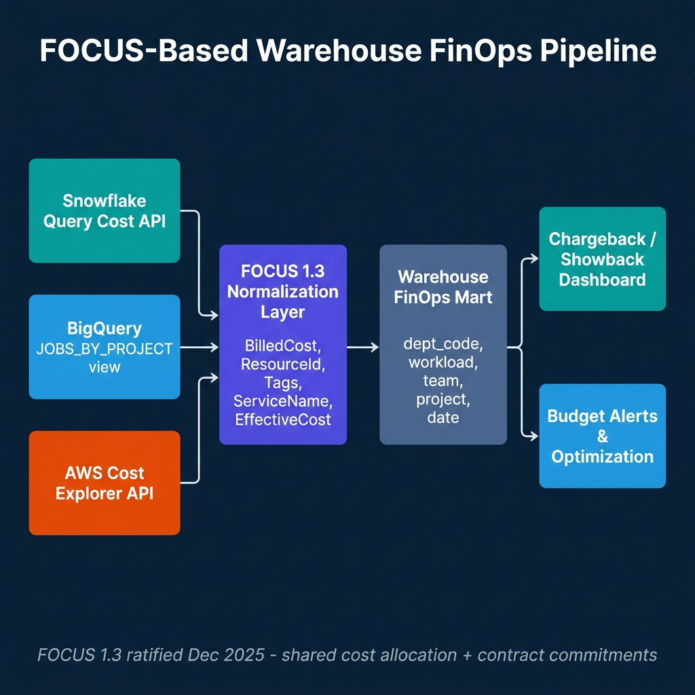
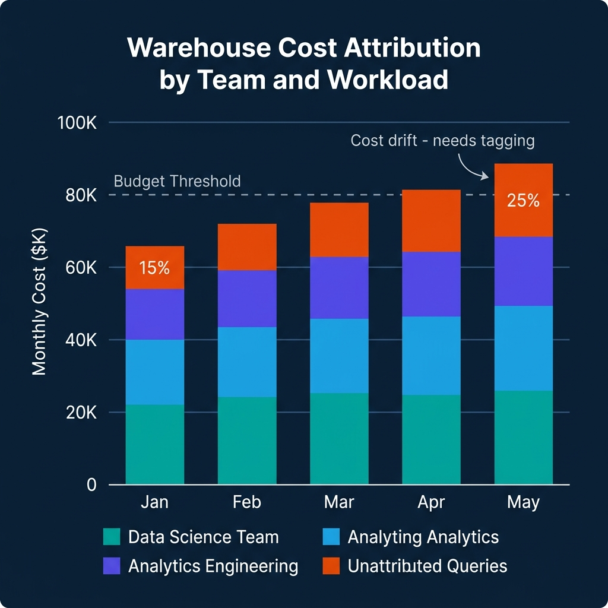

# FinOps for Data Warehouses with Open Billing Data

Warehouse costs are the most visible and most contentious line item on a data platform's budget. Every query is metered. Every dashboard refresh costs something. Engineering leaders who can't explain where costs are coming from can't make informed decisions about where to cut, where to invest, or how to set fair internal budgets by team.

The problem has been interoperability. Snowflake exposes cost data in its own schema format. BigQuery provides cost information through the `JOBS_BY_PROJECT` view and billing export to BigQuery. AWS surfaces it through Cost Explorer and billing exports. None of these use a common format, which means building a unified view requires custom ETL jobs for each provider—jobs that break when providers change their export schemas.

The FOCUS specification—FinOps Open Cost and Usage Specification—addresses this by defining a standard schema for cloud and SaaS billing data. FOCUS 1.3, ratified in December 2025, added shared cost allocation, contract commitment datasets, and data recency signals. It's the first version of the spec that makes warehouse FinOps across multiple providers genuinely tractable.

---

## What FOCUS 1.3 Adds

The core FOCUS schema normalizes cloud billing across providers into a common set of fields: `BilledCost`, `EffectiveCost`, `ResourceId`, `ServiceName`, `SubAccountId`, and `Tags`. Every provider that implements FOCUS maps its billing data to these columns, allowing the same SQL queries to work across AWS, Azure, GCP, and SaaS providers that export FOCUS-formatted data.

FOCUS 1.3 extends this with three important additions:

**Shared cost allocation.** Previous FOCUS versions let you see costs per resource. 1.3 adds allocation columns that show how shared costs are split across workloads—the methodology behind the split, not just the result. For warehouse teams running shared compute across multiple user groups, this is the difference between "we spent $20K on shared virtual warehouses" and "here's how that $20K maps to each team's usage using the provider's allocation algorithm."

**Contract commitment datasets.** A separate dataset tracks committed-use contracts—reservation start and end dates, committed quantities, remaining units, and contract descriptions. This makes it possible to track how much of a committed purchase is actually consumed versus wasted, and to attribute waste to specific allocation decisions.

**Data recency and completeness signals.** New metadata fields indicate when the billing dataset was last updated and whether it's complete. This prevents common cost attribution errors where a reporting pipeline runs against incomplete billing data and produces partial results that mislead budget holders.

---

## Building a Warehouse FinOps Pipeline

The practical architecture for multi-warehouse FinOps normalizes each provider's billing data into FOCUS format, loads it into a FinOps mart, and builds chargeback and budget reporting on top.



**Snowflake cost ingestion:** Snowflake provides cost data through the `QUERY_ATTRIBUTION_HISTORY` view (query-level costs), `METERING_HISTORY` (virtual warehouse consumption by hour), and `RESOURCE_MONITOR_HISTORY` (resource monitor usage against limits). For FOCUS normalization:

```sql
-- Snowflake FOCUS normalization query
SELECT
    start_time::DATE                                    AS ChargePeriodStart,
    end_time::DATE                                      AS ChargePeriodEnd,
    'Snowflake'                                         AS ServiceProvider,
    'Compute'                                           AS ServiceName,
    warehouse_name                                      AS ResourceId,
    credits_used * :credit_cost_usd                     AS BilledCost,
    credits_used * :credit_cost_usd                     AS EffectiveCost,
    OBJECT_CONSTRUCT(
        'team', warehouse_tags:team::STRING,
        'project', warehouse_tags:project::STRING
    )                                                   AS Tags
FROM snowflake.account_usage.metering_history
WHERE start_time >= :start_date
  AND start_time < :end_date;
```

**BigQuery cost ingestion:** BigQuery's `INFORMATION_SCHEMA.JOBS_BY_PROJECT` view provides per-query cost estimates using `total_bytes_billed` and the project's pricing tier. For chargeback, labels applied to queries or jobs serve as the team and project tags:

```sql
-- BigQuery FOCUS normalization query
SELECT
    DATE(creation_time)                                   AS ChargePeriodStart,
    DATE(end_time)                                        AS ChargePeriodEnd,
    'Google Cloud'                                        AS ServiceProvider,
    'BigQuery Compute'                                    AS ServiceName,
    project_id                                            AS ResourceId,
    ROUND(total_bytes_billed / POW(10, 12) * 6.25, 4)   AS BilledCost,
    labels['team']                                        AS team_tag,
    labels['project']                                     AS project_tag
FROM `region-us`.INFORMATION_SCHEMA.JOBS_BY_PROJECT
WHERE creation_time >= TIMESTAMP_SUB(CURRENT_TIMESTAMP(), INTERVAL 30 DAY)
  AND job_type = 'QUERY'
  AND state = 'DONE';
```

---

## Cost Attribution: The Tagging Problem

The most common failure mode in warehouse FinOps is unattributed queries—queries that run without metadata indicating which team or project owns them. As data platform usage grows, the fraction of unattributed costs tends to increase unless tagging is actively enforced.



The remediation is session-level tagging. In Snowflake, this means setting query tags at the session level for all tooling that runs queries:

```sql
-- Set query tag at session start (for Airflow, dbt, or custom tools)
ALTER SESSION SET QUERY_TAG = '{"team": "analytics_engineering", "project": "weekly_revenue_report", "environment": "production"}';
```

In BigQuery, job labels serve the same purpose. Any query submitted through the BigQuery API can include labels:

```python
# Python BigQuery client with labels for cost attribution
from google.cloud import bigquery

client = bigquery.Client()
job_config = bigquery.QueryJobConfig(
    labels={
        "team": "data_science",
        "project": "churn_model_training",
        "environment": "production"
    }
)

query_job = client.query(
    "SELECT * FROM analytics.training_features LIMIT 1000",
    job_config=job_config
)
```

Enforcing tagging at the framework level—in Airflow operators, dbt profiles, and internal query runners—produces consistent attribution without requiring individual analysts to remember to set tags manually.

---

## Chargeback vs Showback

Showback and chargeback serve different organizational purposes.

**Showback** presents cost data to teams without billing them directly. Teams can see their consumption and compare it against budgets, but costs are absorbed by a central platform budget. Showback is appropriate for platforms where granular internal billing creates more friction than value, or where pricing complexity makes it difficult to fairly allocate shared resources.

**Chargeback** bills teams directly for their consumption, either through internal transfers or budget adjustments. Chargeback creates accountability but requires careful handling of shared resources (warehouses, storage) where individual query attribution is imprecise.

FOCUS 1.3's shared cost allocation methodology fields support chargeback by documenting how shared costs are split, which matters when teams dispute allocations. Being able to show that $5K of shared compute was allocated to a team based on their percentage of query hours, using a documented methodology, is more defensible than showing a number without explanation.

---

## Commitment Discounts and Reserved Capacity Management

Most data warehouse providers offer commitment-based pricing that significantly reduces per-query or per-hour costs in exchange for minimum spend commitments. Snowflake's pre-purchased credits, Google BigQuery's flat-rate reservations, and AWS Athena's capacity reservations all operate on this model. Managing these commitments efficiently is one of the highest-leverage FinOps activities for mature data platforms.

The challenge with commitment management is utilization. An organization that commits to $50K/month of Snowflake credits to access a 30% discount but only uses $35K of those credits is paying a 43% premium on its actual consumption. The discount evaporates if the commitment isn't fully consumed.

FOCUS 1.3's contract commitment dataset tracks committed capacity against actual utilization, enabling a commitment health dashboard:

- **Commitment utilization rate:** Actual usage divided by committed quantity for the current period. Below 85% triggers investigation. Below 75% triggers a commitment renegotiation review.
- **Days remaining in commitment period:** How much time remains to consume the committed credits before the period ends.
- **Burn rate:** At the current daily consumption rate, will the commitment be consumed by period end?

For FinOps teams managing multiple warehouse commitments, a simple weekly report on these three metrics for each contract provides early warning before a period ends with significant unused commitment.

The strategic decision is matching commitment size to anticipated usage with a safety margin. Committing to 90% of expected usage (rather than 100%) protects against consumption shortfalls at the cost of slightly higher per-unit pricing on the remaining 10%. Most organizations find that the risk-adjusted value of this buffer exceeds the cost savings of fully committing.

---

## The FinOps Culture Problem

Technology is the easier half of warehouse FinOps. The harder half is organizational: creating a culture where teams are aware of and accountable for their data infrastructure costs.

FinOps culture breaks down at two common failure points. The first is when showback data reaches teams that have never been aware of infrastructure costs and the immediate response is confusion rather than action—"we generated $30K in warehouse costs last month" without context about whether that's good, bad, expected, or avoidable. The second is when chargeback creates political conflict rather than shared accountability, particularly when teams feel that cost allocations are unfair or opaque.

Building a successful FinOps culture requires three investments beyond the technical pipeline:

**Cost awareness education:** Teams that own data pipelines need enough context to interpret their cost reports. What does a BigQuery byte processed actually cost? What makes a query expensive? What's the difference between a cached result and a full scan? This doesn't require deep technical training—a one-hour workshop for analysts and data engineers on "how your queries turn into dollars" dramatically improves the quality of cost-aware behavior.

**Shared optimization incentives:** If engineering teams are charged for warehouse costs but have no mechanism to benefit from reducing them, the rational response is to treat it as a fixed overhead and move on. Creating a shared savings model—where teams that reduce their attributed costs keep a portion of the savings in their platform budget—aligns engineering incentives with cost efficiency.

**Executive visibility:** FinOps programs that exist only in platform team dashboards don't change organizational behavior. Monthly cost reporting that reaches department heads, with clear attribution to teams and projects, creates the organizational pressure for cost accountability that no internal platform campaign can generate alone.

---

## Conclusion

The FOCUS 1.3 specification provides the interoperability layer that makes multi-cloud and multi-warehouse FinOps practical. Combined with native warehouse cost views in Snowflake and BigQuery, it enables a real-time cost attribution pipeline that doesn't require custom ETL per provider.

The operational priority is tagging discipline. A technically excellent FOCUS normalization pipeline produces limited value if 25% of queries run without attribution metadata. Enforce session-level tagging in every framework that touches the warehouse, validate it in CI, and monitor the unattributed fraction as a platform health metric.

---

## Automated Cost Optimization: Resource Monitors and Budget Alerts

Monitoring costs after the fact is useful for reporting but not for controlling spending. Automated budget enforcement prevents runaway costs before they accumulate.

**Snowflake Resource Monitors** allow administrators to set credit limits per virtual warehouse or account, with configurable actions when thresholds are reached:

```sql
-- Create a resource monitor for an analytics team's warehouse
CREATE RESOURCE MONITOR analytics_team_monitor
    WITH CREDIT_QUOTA = 500—500 credits per month
    TRIGGERS ON 75 PERCENT DO NOTIFY
    TRIGGERS ON 90 PERCENT DO NOTIFY  
    TRIGGERS ON 100 PERCENT DO SUSPEND;—Apply to a warehouse
ALTER WAREHOUSE analytics_warehouse 
    SET RESOURCE_MONITOR = analytics_team_monitor;
```

When the analytics team reaches 75% of their monthly credit budget, the monitor sends a notification. At 100%, the warehouse is automatically suspended until manually resumed or the next billing period. This prevents a runaway dbt job or an analyst's inefficient query from exhausting the entire month's budget in a week.

**BigQuery Scheduled Queries for Budget Alerts** use the INFORMATION_SCHEMA to monitor burn rate in near-real-time:

```sql
-- BigQuery: daily cost monitoring with burn rate projection
WITH daily_costs AS (
    SELECT
        DATE(creation_time) AS query_date,
        labels['team'] AS team,
        SUM(total_bytes_billed) / POW(10, 12) * 6.25 AS daily_cost_usd
    FROM `region-us`.INFORMATION_SCHEMA.JOBS_BY_PROJECT
    WHERE creation_time >= TIMESTAMP_SUB(CURRENT_TIMESTAMP(), INTERVAL 30 DAY)
    GROUP BY 1, 2
),
team_burn_rate AS (
    SELECT
        team,
        AVG(daily_cost_usd) AS avg_daily_cost,—Project monthly cost based on last 7 days
        AVG(daily_cost_usd) FILTER (WHERE query_date >= DATE_SUB(CURRENT_DATE, INTERVAL 7 DAY)) * 30 AS projected_monthly_cost
    FROM daily_costs
    GROUP BY team
)
SELECT
    team,
    avg_daily_cost,
    projected_monthly_cost,
    CASE 
        WHEN projected_monthly_cost > team_budget_usd * 0.9 THEN 'ALERT: Near budget limit'
        WHEN projected_monthly_cost > team_budget_usd * 0.7 THEN 'WARNING: 70% of budget on track'
        ELSE 'OK'
    END AS budget_status
FROM team_burn_rate
JOIN team_budgets USING (team);
```

Scheduling this query to run hourly and alerting when `budget_status = 'ALERT'` provides proactive budget management that catches overspend early enough to take corrective action.

---

## Cost Efficiency Metrics: Beyond Total Spend

Total spend is a useful metric but an incomplete one. A team that doubled their query volume while keeping costs flat has improved efficiency. A team that cut their queries in half but costs stayed the same has a performance problem.

Cost efficiency metrics provide the denominator that makes spend numbers meaningful:

**Cost per query:** Total warehouse cost divided by number of queries. Declining cost per query indicates that query optimization, caching, or materialization is working.

**Cost per business outcome:** For analytical teams, this might be cost per report delivered, cost per dashboard view, or cost per data product refresh. This connects infrastructure spending to business value.

**Cache hit rate:** Dremio's Reflections, Snowflake result caches, and BigQuery BI Engine all provide query acceleration through caching and materialization. A high cache hit rate means the same compute is serving more queries. Track cache hit rate as a cost efficiency indicator.

**Query efficiency ratio:** Bytes processed divided by bytes returned. High ratios (processing much more than returned) indicate opportunities for partition pruning, materialization, or query optimization. Snowflake and BigQuery both expose this ratio in their query metadata views.

Building a simple cost efficiency dashboard—cost per query over time, cache hit rate, bytes processed ratio—gives platform teams the signal they need to identify optimization opportunities before they pursue spending cuts that might affect analytics quality.

---

### Build a Financially Accountable Data Platform

For comprehensive guidance on modern data architecture, governance, and cost management, pick up [The 2026 Guide to Lakehouses, Apache Iceberg and Agentic AI: A Hands-On Practitioner's Guide to Modern Data Architecture, Open Table Formats, and Agentic AI](https://www.amazon.com/dp/B0GQNY21TD).

Browse Alex's other data engineering and analytics books at [books.alexmerced.com](https://books.alexmerced.com).

Dremio provides unified query access across your lakehouse with query reflection caching that reduces warehouse compute costs. Try it free at [dremio.com/get-started](https://www.dremio.com/get-started).
