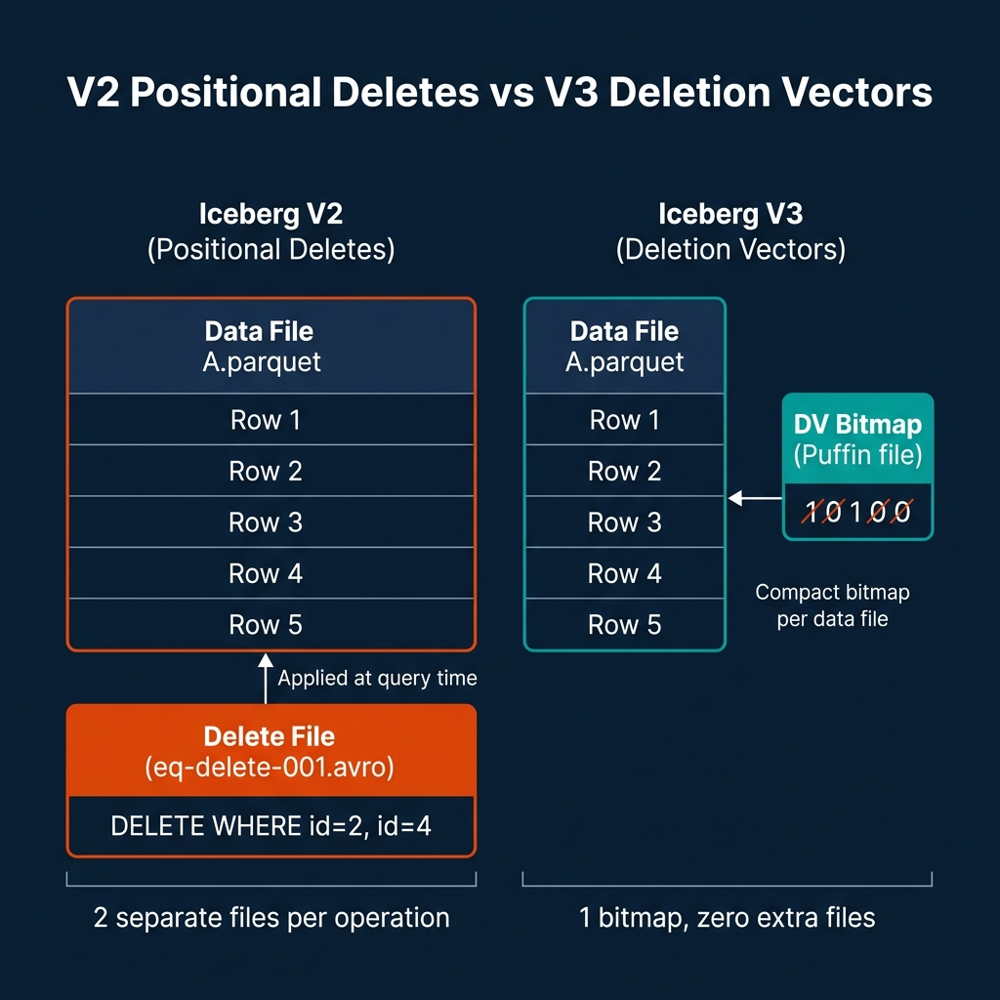
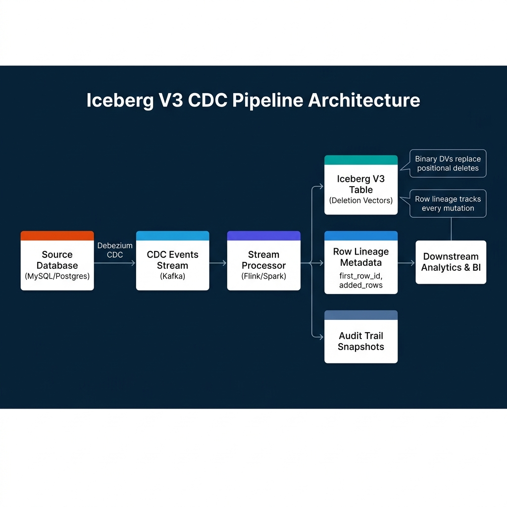
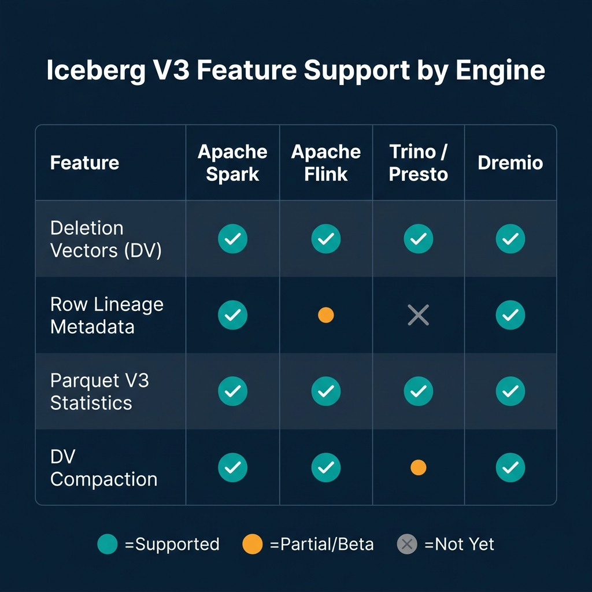

# What Iceberg V3 Advances Mean for CDC Pipelines

Change Data Capture pipelines expose one of Apache Iceberg's most persistent weaknesses: its original mechanism for handling updates and deletes. When you stream CDC events into Iceberg using merge-on-read semantics, you accumulate delete files. Each update or delete operation for a row creates a separate positional delete file that the query engine must reconcile against the original data file at read time. The delete files pile up between compaction runs. Read performance degrades. Compaction becomes a continuous obligation.

Iceberg format version 3, ratified in 2024 and moving to full production stability with the Apache Iceberg 1.11.0 release in May 2026, replaces this design with binary deletion vectors. Combined with native row lineage tracking, these two changes reshape how CDC pipelines can be built and maintained. They don't eliminate all CDC complexity, but they remove the structural weaknesses that made Iceberg an awkward fit for high-churn streaming workloads.

---

## The Core Problem with Iceberg V2 and CDC

In Iceberg V2, updating or deleting a row doesn't rewrite the original data file. Instead, the engine writes a separate delete file, either a positional delete file that records the file path and row offset of each deleted row, or an equality delete file that records key values to be matched and removed at query time.

This design was an improvement over full copy-on-write rewrites for individual row mutations. But it introduced a different problem: delete file accumulation. Every streaming CDC commit adds more delete files. A high-churn table receiving thousands of updates per second can accumulate thousands of delete files per hour. Queries must scan all relevant delete files and apply them to data files before returning results. Planning time increases with delete file count, not with data volume.

The remediation is compaction. Running `RewriteDataFiles` with the binpack strategy merges delete files back into data files, producing clean, fully materialized Parquet outputs. But compaction is expensive, and streaming pipelines produce mutations faster than compaction can clean up unless you dedicate substantial compute to maintenance jobs running continuously in parallel with your ingestion.

---

## Iceberg V3: Deletion Vectors

The binary deletion vector (DV) mechanism in Iceberg V3 addresses the delete file accumulation problem at the format level. Instead of writing a separate delete file for each mutation, the engine writes a compact binary bitmap, stored in a Puffin statistics file, that marks which row positions in a data file are deleted.



A Puffin file is Iceberg's extensible statistics file format. In V3, it also serves as the container for deletion vector bitmaps. Each data file has at most one associated DV bitmap. When a row is deleted, the engine sets the corresponding bit in the bitmap. When multiple rows in the same data file are deleted in separate commits, the bitmaps are merged, OR-ing the bits, rather than creating new files.

The operational implications are significant:

**No separate delete file per operation.** A table receiving thousands of individual row deletes per second produces one bitmap update per data file instead of thousands of individual delete files. The file count per partition remains stable regardless of deletion rate.

**Faster read-time reconciliation.** Applying a bitmap to filter out deleted rows is a vectorized operation. The query engine reads the bitmap, applies it as a bitmask to the row group during Parquet scan, and skips deleted rows without needing to scan a separate file and perform a join-like reconciliation. This is substantially faster than the equality delete join that V2 required.

**Smaller metadata overhead.** Delete bitmaps are compact. A bitmap tracking deleted rows across a 128 MB Parquet file containing millions of rows takes kilobytes, not megabytes.

The upgrade path from V2 to V3 is a one-way operation. You can enable V3 on a table using:

```sql
-- Upgrade an existing Iceberg table to format version 3
ALTER TABLE my_catalog.analytics.events
SET TBLPROPERTIES (
    'format-version' = '3',
    'write.delete.mode' = 'merge-on-read',
    'write.update.mode' = 'merge-on-read'
);
```

Once upgraded, the table uses deletion vectors for all subsequent delete and update operations. Existing V2-format data files and positional delete files from before the upgrade remain readable. V3-written files and bitmaps coexist with V2 files until compaction rewrites them.

---

## Row Lineage: Native Incremental Processing

The second major V3 addition for CDC pipelines is row lineage. This feature adds two system-generated metadata fields to every Iceberg table: `_first_row_id` and `_added_rows`.

`_first_row_id` assigns a monotonically increasing integer identifier to each row when it is first written. This identifier is stable across updates: if row A is written in snapshot 5 with `_first_row_id = 1001`, and then updated in snapshot 12, the row still carries `_first_row_id = 1001` in the updated version.

`_added_rows` records how many rows were added to a data file in the snapshot that wrote it.

Together, these fields provide a native mechanism for incremental reads that doesn't require engine-specific CDC implementations. Downstream systems can query for rows added since a known snapshot by filtering on `_first_row_id > last_known_max`. They can identify exactly which rows changed between snapshots by comparing row IDs across the incremental range.

Before row lineage, incremental reads from Iceberg required either full snapshot comparison (expensive) or engine-specific extension metadata that wasn't portable across different query engines. Row lineage makes this portable at the format level.

```sql
-- Query rows added since a known snapshot using row lineage
SELECT *
FROM my_catalog.analytics.orders
WHERE _first_row_id > 5000000
  AND event_date >= CURRENT_DATE - INTERVAL '1' DAY
ORDER BY _first_row_id;
```

For audit and compliance use cases, row lineage provides a trail of every row's origin that persists even after updates. A row's `_first_row_id` never changes, allowing you to trace when a piece of data first entered the system regardless of how many times it was subsequently updated.

---

## End-to-End CDC Pipeline Architecture with V3

The practical CDC architecture using Iceberg V3 looks like this:



A Debezium connector captures row-level changes from MySQL or PostgreSQL and publishes them as structured CDC events to Kafka. Each event contains the operation type (INSERT, UPDATE, DELETE), the before image of the row, and the after image.

A Flink job consumes these events and applies them to the Iceberg table using the Iceberg Flink connector. For INSERT operations, new rows are written with fresh `_first_row_id` values. For UPDATE operations, the old row is marked in the deletion vector bitmap and the new row image is written to a new data file. For DELETE operations, the row position is marked in the bitmap.

This design avoids the separate delete file accumulation problem entirely. High-velocity UPDATE streams produce bitmap updates rather than ever-growing delete file collections.

---

## Engine Support and Compatibility

Iceberg V3 requires engine support to use deletion vectors and row lineage effectively. As of mid-2026, support has stabilized across major engines:



Apache Spark has the most complete V3 support, having driven much of the specification work. Apache Flink supports deletion vectors and DV compaction fully; row lineage support is in progress as of mid-2026. Trino supports deletion vectors for reads and writes but row lineage and DV-aware compaction are not yet fully available. Dremio has been adding comprehensive V3 support including row lineage in its query planning and result delivery.

The backward compatibility story is solid. V3 tables can still be read by engines that support V2 Iceberg format, though those engines will fall back to treating deletion vector bitmaps as unknown statistics and may not apply deletes correctly. Before upgrading tables to V3, confirm that all query engines in your data platform support reading V3-format files.

---

## What V3 Doesn't Change

Iceberg V3 doesn't eliminate the need for compaction. Deletion vector bitmaps reduce the number of separate files per partition, but data files still fragment from streaming writes. Compaction remains necessary to merge small data files and rewrite deletion vector bitmaps into fully materialized clean files. The difference is that compaction frequency can be lower because bitmaps accumulate more gracefully than separate delete files.

V3 also doesn't change the upgrade path complexity. Tables must be explicitly upgraded from V2 to V3. In environments with many active tables, this requires a coordinated migration plan, you can't upgrade all tables simultaneously without testing engine compatibility and validating query results.

---

## Conclusion

Iceberg V3's deletion vectors and row lineage features are the most significant improvements to the format's CDC story since the introduction of merge-on-read semantics. Deletion vectors replace the separate delete file design that caused metadata bloat in high-mutation streaming environments. Row lineage provides a portable, engine-independent mechanism for incremental reads and audit trails.

For CDC pipeline teams, the practical step is to test V3 deletion vectors on your most write-heavy tables, validate that your downstream query engines support V3 reads, and plan an incremental migration. Don't upgrade everything at once, start with the tables where delete file accumulation is currently causing compaction pressure and measure the improvement before rolling out broadly.

---

## Practical Debezium Setup for Iceberg CDC

Getting a Debezium-to-Iceberg CDC pipeline working in practice involves several configuration choices that have significant downstream effects on your Iceberg table structure.

**Choosing the Kafka topic structure.** Each Debezium connector produces events for a specific database table. The event schema includes the before and after row images and the operation type. For Iceberg pipelines, the most common pattern is one Kafka topic per source table, with a Flink consumer reading each topic and writing to a corresponding Iceberg table.

**Snapshot mode.** The first time Debezium connects to a source database, it takes a full snapshot of existing data before streaming CDC events. For large tables (millions of rows), the snapshot can take hours. The Iceberg target table must be empty or handle idempotent writes from the snapshot before receiving streaming events. The `snapshot.mode` configuration in Debezium controls this behavior, `initial` snapshots first and then streams, while `never` only streams ongoing changes.

```json
{
  "connector.class": "io.debezium.connector.postgresql.PostgresConnector",
  "database.hostname": "postgres.prod.internal",
  "database.port": "5432",
  "database.user": "debezium_user",
  "database.password": "${file:/run/secrets/postgres-creds:password}",
  "database.dbname": "production",
  "database.server.name": "prod_postgres",
  "table.include.list": "public.orders,public.customers,public.products",
  "plugin.name": "pgoutput",
  "slot.name": "debezium_prod",
  "snapshot.mode": "initial",
  "decimal.handling.mode": "double",
  "heartbeat.interval.ms": "10000",
  "publication.name": "dbz_publication"
}
```

The `heartbeat.interval.ms` setting is important for tables with low write volume. Without heartbeats, a replication slot in PostgreSQL can accumulate WAL logs indefinitely if no changes occur, potentially filling disk. Regular heartbeat events keep the replication slot position advancing.

---

## Schema Migration in CDC Pipelines

One of the most operationally challenging aspects of CDC pipelines is handling source database schema changes. When a developer adds a column to the `orders` table in PostgreSQL, several things need to happen:

1. Debezium detects the schema change from the DDL event in the WAL
2. The Kafka topic schema (if using Schema Registry) must be updated
3. The Flink consumer must handle the new column in incoming events
4. The Iceberg target table must be updated with the new column
5. Historical rows in the Iceberg table will have NULL for the new column

Iceberg's schema evolution makes step 4 non-destructive. Adding a new optional column to an Iceberg table is metadata-only, no data files are rewritten, and the column shows as NULL for all historical rows. This is the same guarantee that enables the CDC schema migration flow to be automated.

```python
# Automatically apply schema changes from Debezium to Iceberg
from pyiceberg.catalog import load_catalog
from pyiceberg.schema import Schema
from pyiceberg.types import NestedField, StringType

catalog = load_catalog("polaris", **{"uri": "https://catalog.example.com"})
table = catalog.load_table("prod_replica.orders")

# Add a new column without rewriting data files
with table.update_schema() as update:
    update.add_column(
        path="shipping_carrier",  # New column added to source
        field_type=StringType(),
        required=False  # Always optional for schema migration safety
    )
```

This automated schema migration pattern, detecting DDL changes from Debezium, applying them to the Iceberg schema via the PyIceberg API, allows the CDC pipeline to self-heal after schema changes without manual intervention.

---

## Flink Checkpoint Configuration for CDC Reliability

Flink checkpointing is the mechanism that makes CDC pipelines resumable after failures. Without proper checkpoint configuration, a Flink job failure requires reprocessing from the beginning of the Kafka topic, which for high-volume tables means hours of catch-up processing.

The critical Flink checkpoint settings for Iceberg CDC pipelines:

```yaml
# flink-conf.yaml for Iceberg CDC reliability
execution.checkpointing.interval: 60s           # Checkpoint every 60 seconds
execution.checkpointing.min-pause: 30s          # Minimum time between checkpoints
execution.checkpointing.timeout: 300s           # Checkpoint must complete within 5 minutes
execution.checkpointing.max-concurrent-checkpoints: 1
state.backend: rocksdb                          # RocksDB for large-state CDC
state.backend.incremental: true                 # Incremental RocksDB checkpoints
state.checkpoints.dir: s3://checkpoints/flink/  # Checkpoint storage in S3
```

The Iceberg Flink connector commits data files to the Iceberg catalog at checkpoint time. This means that exactly-once semantics in the pipeline correspond to checkpoint frequency, a 60-second checkpoint interval means the pipeline can be at most 60 seconds behind the latest committed snapshot in Iceberg. This is typically acceptable for analytical workloads but may need tuning for near-real-time requirements.

---

### Go Deeper on Iceberg and Lakehouse Architecture

For a comprehensive treatment of Apache Iceberg, open table format design, and modern lakehouse patterns, pick up [The 2026 Guide to Lakehouses, Apache Iceberg and Agentic AI: A Hands-On Practitioner's Guide to Modern Data Architecture, Open Table Formats, and Agentic AI](https://www.amazon.com/dp/B0GQNY21TD).

Browse Alex's other data engineering and analytics books at [books.alexmerced.com](https://books.alexmerced.com).

Dremio provides native Iceberg V3 query support with automated reflection acceleration across your Iceberg tables. Try it free at [dremio.com/get-started](https://www.dremio.com/get-started).
