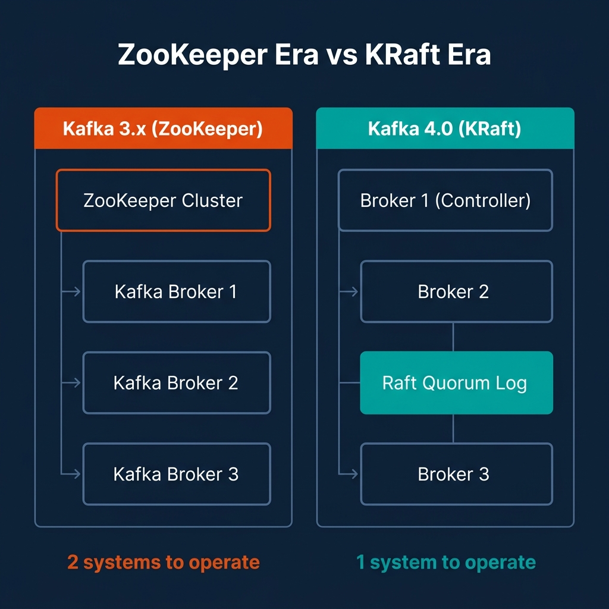
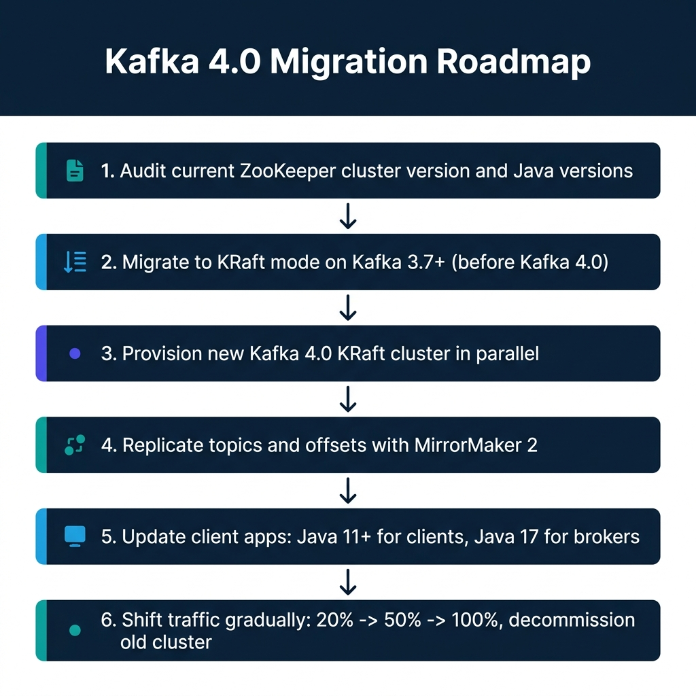
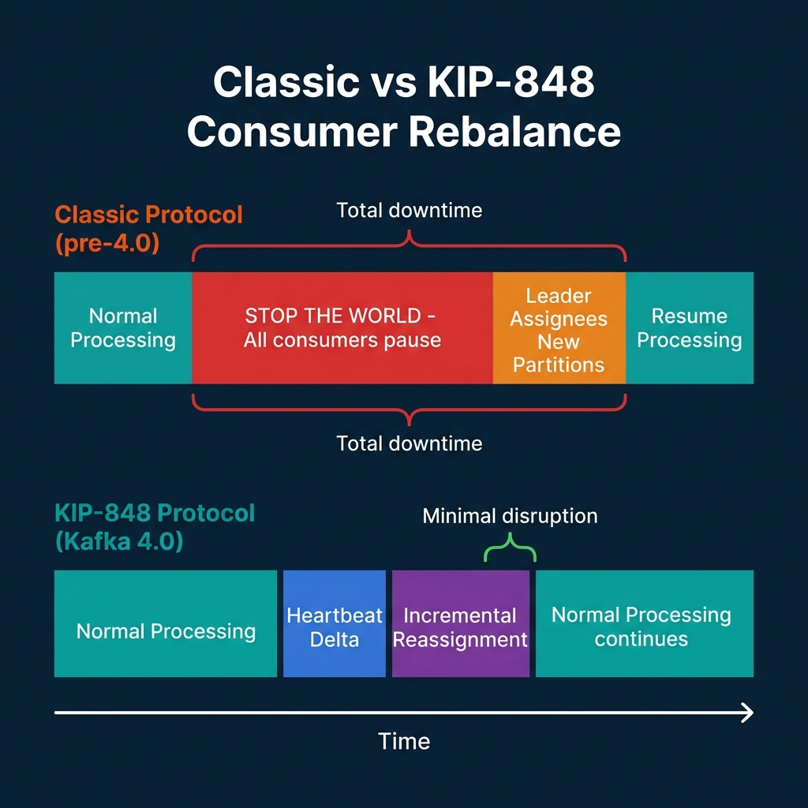

# Kafka 4.0 Changes Streaming Platform Operations

Apache Kafka 4.0 shipped on March 18, 2025, and it made one thing official: ZooKeeper is gone. Not deprecated, not optional, removed. Every new Kafka 4.0 cluster runs in KRaft mode. If your team still runs ZooKeeper-based brokers, you cannot do an in-place upgrade to 4.0. That's the short version of what changed.

The longer version is more interesting. Kafka 4.0 also marks two other operational milestones. The new consumer rebalance protocol (KIP-848) is now generally available, replacing the "stop-the-world" rebalance behavior that has caused consumer lag spikes for years. And Queues for Kafka (KIP-932), which enables point-to-point messaging semantics on top of Kafka topics, entered early access.

Together, these changes rewrite several operating model assumptions that platform teams have held since 2015. Here's what they mean in practice.

---

## The End of ZooKeeper: What KRaft Actually Changes

ZooKeeper served Kafka as a distributed coordination service. Kafka brokers used it to store cluster metadata, conduct leader elections for partition controllers, and track consumer group state. Every Kafka operator knew the drill: you didn't just run Kafka, you ran Kafka plus a ZooKeeper ensemble, monitored both, and managed the dependency chain between them.

KRaft, which stands for Kafka Raft, replaces ZooKeeper by embedding the consensus and metadata management directly in the Kafka broker process. A quorum of Kafka brokers act as controllers, storing metadata in an internal Raft-replicated log rather than in a separate ZooKeeper cluster. One broker holds the active controller role; the others replicate its log and are ready to take over if the controller fails.



The operational implications are substantial.

**Infrastructure reduction.** A production ZooKeeper ensemble typically requires three or five nodes, each with separate monitoring, patching, and disk management. In KRaft mode, those nodes disappear. You manage one system instead of two. For teams running Kafka on Kubernetes, this removes several StatefulSet configurations, PersistentVolumeClaims, and service accounts from your deployment manifests.

**Faster controller failover.** In ZooKeeper-based Kafka, a controller failover triggered a ZooKeeper session timeout, which could take 18 to 30 seconds under default configurations before the election completed and a new controller began serving metadata. KRaft uses a heartbeat-based leader detection mechanism with typical election times under 5 seconds in most environments.

**Higher partition limits.** ZooKeeper stored partition metadata in memory, which capped practical cluster limits at around 200,000 partitions before memory pressure and election latency became problematic. KRaft's metadata log approach scales to millions of partitions on the same hardware. For teams running high-fanout event platforms with many small topics, this removes a hard architectural ceiling.

**What doesn't change.** Your producer and consumer code still works the same way. Your topics, partitions, and consumer groups remain intact after migration. The client-facing API is backward compatible. The operational change is entirely on the broker and infrastructure side.

---

## The Upgrade Path: Why You Can't Jump Directly to 4.0

This is where most teams will need careful planning. If your cluster currently runs in ZooKeeper mode on Kafka 2.x or 3.x, you cannot upgrade directly to Kafka 4.0. The 4.0 broker binary includes no ZooKeeper client libraries at all. Attempting to start a 4.0 broker against a ZooKeeper-based cluster will fail on startup.

The supported path has two stages. First, you migrate your existing cluster to KRaft mode while still on Kafka 3.7 or later. The 3.x releases include a built-in ZooKeeper-to-KRaft migration tool that converts an existing cluster's metadata in place while the cluster remains live. Second, once the cluster runs in KRaft mode, you upgrade broker versions to 4.0.

For Amazon MSK users, the in-place conversion path is not available. AWS MSK does not support converting a ZooKeeper-based MSK cluster to KRaft. The supported migration approach is a parallel cluster strategy:

1. Provision a new MSK cluster in KRaft mode.
2. Use MirrorMaker 2 to replicate your topic configurations and consumer group offsets to the new cluster.
3. Update your producer and consumer applications to point to the new cluster's bootstrap brokers.
4. Validate offset continuity and run both clusters in parallel for a burn-in period.
5. Shift traffic progressively: 20%, then 50%, then 100%.
6. Decommission the original cluster after validating no data loss.

For Confluent Cloud users, the managed platform handles KRaft internally. If you use Confluent Cloud, you're already running on KRaft. The upgrade path concern applies to self-managed clusters.

One more constraint: Kafka 4.0 raises the minimum Java version requirements. Brokers, Kafka Connect workers, and command-line tools now require Java 17. Kafka client libraries and Kafka Streams applications require Java 11. If your application stack still runs on Java 8 or Java 11 for broker processes, that must be resolved before the upgrade.



---

## KIP-848: The New Consumer Group Protocol

The second major change in Kafka 4.0 is the general availability of the new consumer rebalance protocol, KIP-848. To understand why this matters, you need to understand what was wrong with the old one.

The classic rebalance protocol is sometimes called "stop-the-world" because that's what it does. When a consumer joins or leaves a group, or when a consumer's heartbeat times out, the group coordinator triggers a full group rebalance. Every consumer in the group stops processing, revokes its current partition assignments, and waits for the group leader (a client-side process) to compute a new assignment and distribute it to all members through the coordinator. Only after all members acknowledge the new assignment does processing resume.

For a consumer group with ten members, adding an eleventh member pauses all ten existing members for the duration of the rebalance. In practice, this can pause processing for seconds to tens of seconds, depending on the number of partitions, the complexity of the assignment strategy, and network round-trip times between consumers and the broker.



KIP-848 moves the assignment logic from the client to the broker. Under the new protocol:

- Consumers send heartbeats that describe their current partition assignments and capabilities.
- The broker-side group coordinator computes assignment changes incrementally without requiring all consumers to revoke their current partitions simultaneously.
- Only the partitions being reassigned are affected. Consumers holding partitions that don't need to move continue processing throughout the rebalance.

The practical result is that adding a consumer to a group with 100 partitions no longer pauses all 99 other partitions' processing. The coordinator moves partitions incrementally, one or a few at a time, with no group-wide pause.

### Enabling KIP-848

The new protocol is not enabled by default for existing consumer applications. To opt in, set this consumer configuration property:

```properties
group.protocol=consumer
```

The broker supports both the classic protocol and the new protocol simultaneously. A consumer group can mix consumers using both protocols during a rolling restart, which enables gradual migration without coordinated downtime. Once all consumers in a group are restarted with the new configuration, the group transitions fully to the KIP-848 protocol.

Several configuration properties that consumers previously managed client-side are now handled by the broker under KIP-848. Specifically, `group.consumer.session.timeout.ms`, `group.consumer.heartbeat.interval.ms`, and the assignor configuration are now server-side settings. Clients provide `rebalance.timeout.ms` (derived from `max.poll.interval.ms`) to tell the broker how long they need to revoke partitions safely, but the assignment computation itself no longer happens on the client.

If you use Kafka Streams, note that Streams has a separate roadmap (KIP-1071) for adopting the new protocol. Do not enable `group.protocol=consumer` for Kafka Streams applications until the Streams version you're running explicitly supports it.

---

## Removed APIs and Protocol Changes

Kafka 4.0 also removes several legacy components that were deprecated in earlier releases. This is the category most likely to break existing integrations without warning if you skip the compatibility check.

**Removed message formats.** Message formats v0 and v1, deprecated in Kafka 3.0, are no longer present in 4.0. These were the original binary formats from Kafka's earliest versions. Clients using these formats will fail to produce or consume messages against a 4.0 broker.

**Removed old API versions.** Kafka's protocol uses versioned RPCs. Old API versions deprecated in 3.x are removed in 4.0. Most modern clients (librdkafka 1.9+, Java client 3.0+, Python confluent-kafka 1.9+) handle protocol version negotiation automatically and will work fine. Clients that hardcode specific API versions may fail.

**Log4j to Log4j2.** Kafka's internal logging framework migrated from Log4j 1.x to Log4j2. Custom logging configurations in `log4j.properties` format need to be migrated to the Log4j2 XML or YAML format. The old file is ignored silently, which means logging configuration changes don't take effect unless you notice and convert the file.

**Queues for Kafka (KIP-932).** This feature, in early access, enables point-to-point queue semantics where a message is consumed by exactly one consumer, rather than being broadcast to all subscribers in a partition-based group. For teams building task queue patterns on top of Kafka, this removes the need for external workarounds like single-partition topics or external coordination. Early access means the API may change before it stabilizes.

---

## What This Means for Platform Operations

The combination of KRaft, KIP-848, and removed ZooKeeper dependency simplifies the operational surface of a streaming platform in meaningful ways.

Your monitoring stack needs to change. ZooKeeper-specific metrics (`/brokers/ids`, ensemble latency, leader election counts) disappear. KRaft introduces its own metrics through the `kafka.controller` and `kafka.raft` metric namespaces, which track Raft quorum health, metadata log lag, and controller election timing. Update your Prometheus scrapers, Grafana dashboards, or DataDog monitors before upgrading.

Kafka Connect workers are largely unaffected by the KRaft transition. Connect uses consumer groups internally and the broker API; the ZooKeeper removal doesn't change the Connect worker's behavior. The Connect REST API remains the same. The only Connect-related change is the Java 17 requirement for the worker process itself.

Schema Registry, ksqlDB, and other Confluent Platform components that store metadata in Kafka topics (rather than ZooKeeper) are also mostly unaffected from an operational standpoint. Check version compatibility tables for each component before upgrading the broker.

The clearest near-term win from 4.0 for most teams is not the architectural change but the operational simplification. Running one fewer distributed system, with its own leader election, connection pooling, Jute serialization format, and 4-letter word commands, reduces the number of things that can fail at 2 a.m.

---

## Conclusion

Kafka 4.0 marks the end of a decade-long dependency on ZooKeeper. The migration path is well-defined, but it requires advance planning: you cannot jump directly from a ZooKeeper-based cluster to 4.0 without first converting to KRaft on 3.x. On MSK, that means a parallel cluster migration. On self-managed clusters, the built-in migration tool in 3.7+ handles the conversion.

Plan for three specific compatibility items before starting: Java version requirements, removed legacy API versions, and the log4j configuration format change. None of them are blockers, but all three will cause silent failures if you don't check them ahead of time.

---

## Producer Configuration for Throughput vs. Reliability

Kafka producer configuration involves a fundamental tradeoff: higher throughput settings reduce reliability guarantees, and higher reliability settings reduce throughput. Understanding which side of this tradeoff your workload needs is essential for correct configuration.

**High-throughput, tolerant of some data loss (metrics, telemetry):**
```properties
acks=1                          # Leader acknowledges only
batch.size=131072               # 128 KB batches
linger.ms=20                    # Wait up to 20ms to fill batch
compression.type=lz4            # Fast compression
enable.idempotence=false        # No dedup overhead
max.in.flight.requests.per.connection=5
```

**Exactly-once semantics (financial transactions, CDC events):**
```properties
acks=all                        # All in-sync replicas acknowledge
enable.idempotence=true         # Deduplicate retries at the broker
transactional.id=my-producer-001  # Enable transactions
transaction.timeout.ms=60000    # 60 second transaction window
max.in.flight.requests.per.connection=5  # Required with idempotence
batch.size=65536               # 64 KB batches (smaller for latency)
linger.ms=5                    # Short linger for latency
```

The `enable.idempotence=true` setting ensures that retried producer sends don't create duplicate messages. The broker assigns each producer a unique PID (Producer ID) and sequence numbers to each message, allowing it to detect and discard duplicates. For CDC pipelines and financial event streams, idempotent producers are essential.

---

## Consumer Lag Monitoring in Production

Consumer lag, the gap between the latest offset in a Kafka partition and the consumer group's current committed offset, is the most important operational metric for streaming platforms. Growing consumer lag means the pipeline is falling behind incoming data. Without monitoring and alerting on consumer lag, you may not discover a falling pipeline until business logic downstream has been starved for hours.

The standard tools for consumer lag monitoring:

**Prometheus JMX Exporter + Kafka Exporter:** The `kafka_consumergroup_lag` metric exposed through the Kafka Exporter is the simplest path. Set alerts when lag exceeds thresholds per consumer group and topic:

```yaml
# Alertmanager rule for consumer lag
groups:
  - name: kafka_consumer_lag
    rules:
      - alert: KafkaConsumerGroupHighLag
        expr: kafka_consumergroup_lag{consumergroup="analytics-events-processor"} > 100000
        for: 10m
        labels:
          severity: warning
        annotations:
          summary: "Consumer group {{ $labels.consumergroup }} is lagging"
          description: "Lag of {{ $value }} messages on topic {{ $labels.topic }}, partition {{ $labels.partition }}"
      
      - alert: KafkaConsumerGroupCriticalLag
        expr: kafka_consumergroup_lag{consumergroup="analytics-events-processor"} > 1000000
        for: 5m
        labels:
          severity: critical
```

**Lag-in-seconds vs. lag-in-messages:** Message count lag is misleading when message sizes vary significantly. A lag of 100,000 small metrics events is very different from a lag of 100,000 10-KB transaction records. When possible, combine message lag with throughput metrics to estimate time-to-recovery:

```python
def estimate_catchup_time(current_lag_messages, consumer_throughput_msgs_per_sec, producer_throughput_msgs_per_sec):
    """Estimate time for a consumer to catch up with a given lag."""
    net_catchup_rate = consumer_throughput_msgs_per_sec - producer_throughput_msgs_per_sec
    if net_catchup_rate <= 0:
        return float('inf')  # Consumer can't catch up at current rates
    return current_lag_messages / net_catchup_rate  # Returns seconds to catch up
```

If `estimate_catchup_time()` returns infinity (the consumer isn't keeping up with the producer even without the backlog), the issue isn't lag, it's consumer throughput. Adding more consumer instances or optimizing the processing logic is the correct intervention, not simply monitoring the lag number.

---

## Kafka and the Streaming Lakehouse Stack

Kafka rarely operates in isolation. It's typically one component in a streaming data pipeline that ends in a lakehouse: Kafka → Flink/Spark Structured Streaming → Iceberg tables → BI and ML workloads.

The reliability properties at each layer interact. Kafka provides ordered, persistent event streams with configurable retention. Flink provides exactly-once stateful processing with Kafka offset checkpointing. Iceberg provides ACID table commits with snapshot isolation. Together, these three systems provide an end-to-end exactly-once guarantee from source events to lakehouse tables.

Understanding which component is the bottleneck at each scale level helps teams debug and optimize:

- **Kafka throughput limited:** Add partitions, scale brokers, tune producer batching
- **Flink processing limited:** Scale task slots, parallelize operators, optimize state backends
- **Iceberg commit limited:** Increase checkpoint intervals, reduce micro-batch frequency, tune file sizes
- **S3/GCS I/O limited:** Use multipart uploads, tune buffer sizes, consider S3 Tables for managed I/O

Operational observability across this entire stack is what OpenLineage (for lineage) and Prometheus/Grafana (for metrics) enable, providing a unified view of where the streaming pipeline stands at any given moment.

---

### Go Deeper on Streaming Data Architecture

For a comprehensive treatment of streaming lakehouses, open table formats, and real-time pipelines, pick up [The 2026 Guide to Lakehouses, Apache Iceberg and Agentic AI: A Hands-On Practitioner's Guide to Modern Data Architecture, Open Table Formats, and Agentic AI](https://www.amazon.com/dp/B0GQNY21TD).

Browse Alex's other data engineering and analytics books at [books.alexmerced.com](https://books.alexmerced.com).

To query Kafka-sourced Iceberg tables with sub-second performance and automated query acceleration, try Dremio Cloud free at [dremio.com/get-started](https://www.dremio.com/get-started).
