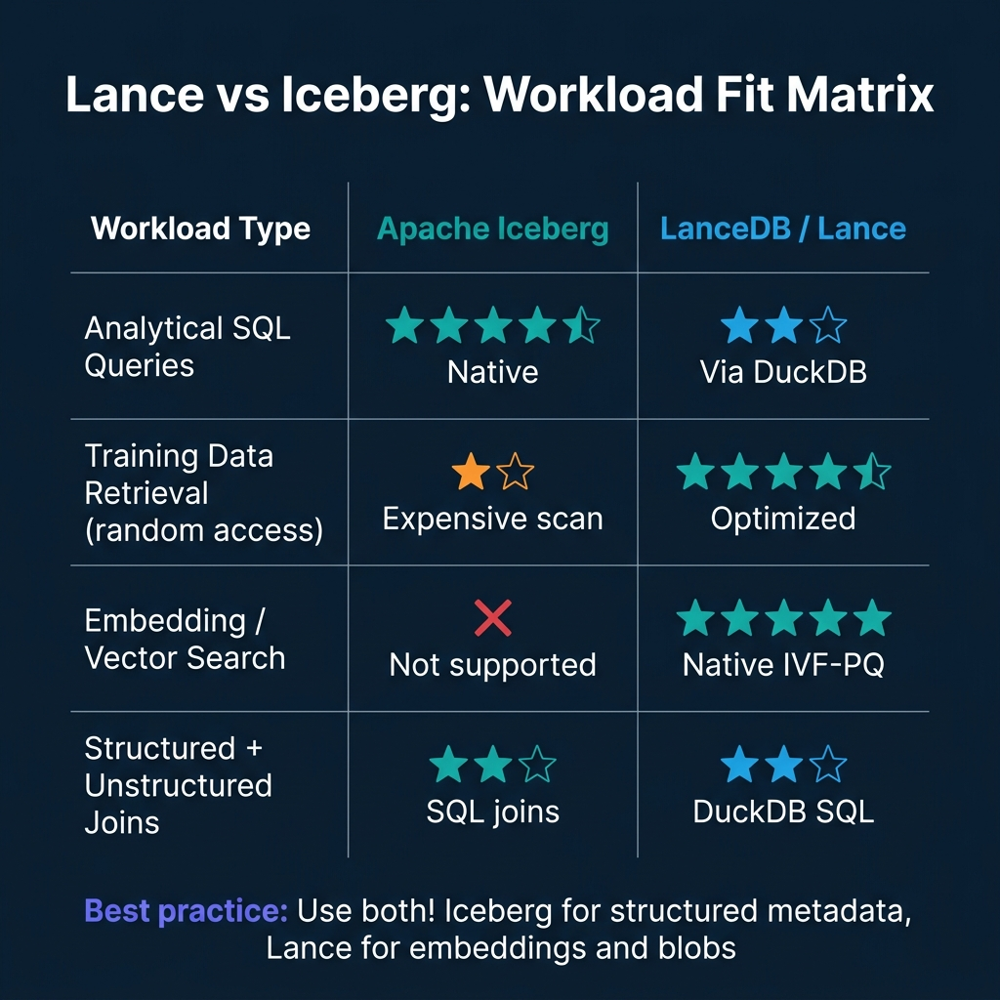

# Lance and Iceberg for Multimodal AI Data

Apache Iceberg was designed for analytical workloads: columnar scans, partition pruning, SQL aggregations. It's excellent at returning the answer to "what was the average revenue by region for the last 30 days?" and poor at answering "give me the 500 training images most similar to this query image."

The second question is random access retrieval from an embedding index, a fundamentally different access pattern. Columnar storage optimized for scan performance is inefficient for retrieving arbitrary rows by vector similarity. Iceberg tables store Parquet files, and Parquet files are optimized for column projection and predicate pushdown, not random row access.

This is where LanceDB and the Lance format fill a gap. Lance is a columnar format designed for both scan-efficient analytics (like Parquet) and random-access retrieval (unlike Parquet). It builds IVF-PQ vector indexes natively on disk, without requiring vectors to fit in RAM. Combined with Iceberg for structured metadata and SQL analytics, Lance enables a complete multimodal AI data architecture.

---

## The Two Patterns That Don't Fit Together

**Scan-heavy analytical queries**, aggregations, group-bys, time-window analytics, joins, are what Iceberg is built for. The underlying Parquet files store column values contiguously, enabling vectorized scan operations that process entire columns in cache-friendly chunks. Partition pruning eliminates entire file groups based on metadata. Predicate pushdown moves filters into the file reading layer.

**Random-access retrieval**, fetching 500 specific rows from a 10-million-row dataset based on vector similarity, breaks the columnar scan model. To retrieve a specific row in a Parquet file, you must read at minimum the row group containing that row, even if you only want one record. At scale, random access across an Iceberg table degrades into many expensive small reads.

ML training workloads require random access at scale: sample 256 images from 10 million for a training batch, read specific samples from disk without materializing the full dataset in memory, and iterate over shuffled samples across epochs without loading everything into RAM.

The Lance format was designed for exactly this workload. Its on-disk layout supports random access to individual rows with low read amplification. Combined with its IVF-PQ vector index, which is disk-native and doesn't require vectors to be in RAM, Lance is the format of choice for embedding storage and training data retrieval.

---

## The Complementary Architecture


The production architecture uses Iceberg and Lance together:

**Iceberg tables** hold structured metadata about each media asset: content ID, source URL, creation timestamp, labels, annotation status, split assignment (train/val/test), and any tabular features. SQL queries against this metadata are fast: find all training images from source X with label Y added after date Z, joining against annotation tables.

**LanceDB / Lance tables** hold the embeddings and enable vector retrieval: given a query image embedding, find the 50 most semantically similar training examples. The Lance table stores the embedding alongside a pointer to the object store location (S3 URL or file path) so the actual image bytes can be fetched directly after retrieval.

**Object store (S3/GCS/ABS)** holds the raw media files. Neither Iceberg nor Lance tries to store raw images or video, object storage is the right layer for blobs. Both table formats store references to the object store.

The multimodal ingestion pipeline ties these together: when new media arrives, it gets stored in object storage, its embedding is computed (CLIP for images and video, Whisper for audio), the embedding is written to the Lance table, and the structured metadata is written to the Iceberg table.

---

## Working with Lance and DuckDB

LanceDB integrates with DuckDB, allowing SQL queries against Lance tables. This enables joining Lance embedding data with Iceberg metadata without separate ETL:

```python
import lancedb
import duckdb

# Connect to LanceDB
db = lancedb.connect("s3://my-bucket/lancedb/")
images_table = db.open_table("training_images")

# Query: find similar images to a reference image
similar_images = (
    images_table.search(reference_embedding)
    .metric("cosine")
    .limit(100)
    .to_pandas()
)

# Join with Iceberg metadata via DuckDB for filtered retrieval
conn = duckdb.connect()
conn.execute("INSTALL iceberg; LOAD iceberg;")

# Register the pandas DataFrame (from Lance) for DuckDB querying
conn.register("similar_images", similar_images)

# Join with Iceberg metadata to filter by label and split
annotated_similar = conn.execute("""
    SELECT s.content_id, s.s3_uri, m.label, m.split
    FROM similar_images s
    JOIN iceberg_scan('s3://my-bucket/iceberg/image_metadata/') m
        ON s.content_id = m.content_id
    WHERE m.label IN ('cat', 'dog')
      AND m.split = 'train'
""").fetchdf()
```

---

## Workload Fit: When to Use Each



The choice between Lance and Iceberg is not either/or. The complementary architecture uses both:

- **SQL analytics on metadata:** Iceberg
- **Random-access training sample retrieval:** Lance
- **Similarity search / nearest neighbor:** Lance (with IVF-PQ index)
- **Data quality monitoring, annotation tracking:** Iceberg
- **Cross-format queries:** DuckDB joining both

The operational complexity of running both formats is lower than it appears. Lance tables can be co-located in S3 alongside Iceberg tables. Both use object storage as the persistence layer. Catalog management for Lance tables can use LanceDB's own catalog API or integrate with Polaris/Nessie for unified catalog visibility.

---

## LanceDB: Beyond Embeddings

LanceDB's longer-term positioning is as an AI-native multimodal lakehouse, not just an embedding store. It supports storing raw blobs alongside vectors in the same table, enabling truly unified storage for AI datasets.

In this model, a Lance table for a vision model training dataset might store: `image_bytes` (raw PNG/JPEG), `embedding` (1536-dim float vector), `label`, `source_id`, and `created_at`. Retrieval is a single operation that returns both the embedding neighborhood and the raw image bytes, without an additional object storage fetch.

For large-scale training datasets, this architecture offers better cache locality and simpler pipeline management than the separate Iceberg + object store + Lance design, at the cost of storing raw bytes in the table format rather than object storage.

---

## Conclusion

Apache Iceberg and LanceDB/Lance serve different access patterns in a multimodal AI lakehouse. Iceberg handles structured analytics, SQL governance, and metadata management. Lance handles random-access retrieval, vector search, and training data pipelines. The optimal architecture uses both, with Iceberg and Lance tables co-located in object storage and DuckDB providing the SQL bridge between them.

For teams building AI training infrastructure in 2026, defaulting to "Iceberg for everything" creates unnecessary performance bottlenecks in the training data retrieval path. Adding Lance tables for embedding and blob storage is low-friction and high-impact.

---

## Building the Multimodal Ingestion Pipeline

The ingestion pipeline that populates both Iceberg and Lance tables needs to handle several concerns simultaneously:

1. **Blob storage:** Upload raw media (images, audio, video) to object storage
2. **Embedding computation:** Run the media through the appropriate encoder (CLIP for vision, Whisper for audio) to produce vector embeddings
3. **Lance write:** Append the embedding and metadata to the Lance table
4. **Iceberg write:** Append structured metadata (labels, source, split, timestamps) to the Iceberg table
5. **Consistency:** Ensure that a content_id written to Lance is also written to Iceberg in the same ingestion batch

```python
import lancedb
import pyarrow as pa
import open_clip
import torch
from pyiceberg.catalog import load_catalog

def ingest_image_batch(image_paths: list[str], labels: list[str]):
    """
    Ingest a batch of images into the multimodal AI lakehouse.
    Writes embeddings to Lance and metadata to Iceberg.
    """
    # Load CLIP model for embedding computation
    model, _, preprocess = open_clip.create_model_and_transforms("ViT-B-32")
    
    # Compute embeddings
    embeddings = []
    content_ids = []
    for path in image_paths:
        image = preprocess(Image.open(path)).unsqueeze(0)
        with torch.no_grad():
            embedding = model.encode_image(image)
        content_id = compute_content_hash(path)
        embeddings.append(embedding.numpy().flatten())
        content_ids.append(content_id)
    
    # Upload to object storage and get S3 URIs
    s3_uris = upload_to_s3(image_paths, content_ids)
    
    # Write to Lance table
    lance_db = lancedb.connect("s3://ai-lake/lancedb/")
    lance_table = lance_db.open_table("training_images")
    lance_records = [
        {"content_id": cid, "embedding": emb, "s3_uri": uri}
        for cid, emb, uri in zip(content_ids, embeddings, s3_uris)
    ]
    lance_table.add(lance_records)
    
    # Write metadata to Iceberg
    catalog = load_catalog("polaris", **{"uri": "https://catalog.example.com"})
    iceberg_table = catalog.load_table("ai_datasets.image_metadata")
    
    metadata_records = pa.table({
        "content_id": content_ids,
        "s3_uri": s3_uris,
        "label": labels,
        "split": assign_split(content_ids),  # train/val/test assignment
        "ingested_at": [datetime.utcnow().isoformat()] * len(content_ids),
        "embedding_model": ["ViT-B-32"] * len(content_ids)
    })
    iceberg_table.append(metadata_records)
```

---

## Versioning Training Datasets

One of the critical properties for reproducible ML training is dataset versioning: the ability to recreate the exact training set used for a specific model version. Iceberg provides this naturally through its snapshot mechanism.

When you're ready to lock a training dataset for a specific model run, record the Iceberg snapshot ID:

```python
import mlflow
from pyiceberg.catalog import load_catalog

catalog = load_catalog("polaris", **{"uri": "https://catalog.example.com"})
iceberg_table = catalog.load_table("ai_datasets.image_metadata")

# Record current snapshot ID before training
current_snapshot = iceberg_table.current_snapshot()
snapshot_id = current_snapshot.snapshot_id

# Log to MLflow for training reproducibility
with mlflow.start_run() as run:
    mlflow.log_param("training_dataset_table", "ai_datasets.image_metadata")
    mlflow.log_param("training_dataset_snapshot_id", snapshot_id)
    
    # Load training data from the specific snapshot for reproducibility
    training_metadata = iceberg_table.scan(snapshot_id=snapshot_id).to_arrow()
    training_content_ids = training_metadata["content_id"].to_pylist()
    
    # Retrieve embeddings from Lance using the content IDs
    lance_db = lancedb.connect("s3://ai-lake/lancedb/")
    lance_table = lance_db.open_table("training_images")
    
    # Filter Lance table to only the content IDs in the Iceberg snapshot
    training_data = lance_table.search() \
        .where(f"content_id IN {tuple(training_content_ids[:100])}") \
        .to_pandas()
    
    # Train model
    model = train_vision_model(training_data)
    mlflow.pytorch.log_model(model, "model")
```

Six months later, a team investigating why model v5 had better performance than model v7 can retrieve the exact training data composition for each run using the recorded snapshot IDs.

---

## Fine-Tuning Workflow Patterns

The Iceberg + Lance architecture particularly shines for fine-tuning workflows, where you start from a pretrained model and adapt it to a specific domain using a curated subset of your training data.

The fine-tuning dataset selection query uses Iceberg's SQL capabilities:

```sql
-- Select high-quality fine-tuning examples from Iceberg metadata
SELECT content_id, s3_uri, label
FROM iceberg.ai_datasets.image_metadata
WHERE label IN ('product_photo', 'lifestyle_photo')
  AND annotation_quality_score >= 4  -- Expert-annotated examples only
  AND split = 'train'
  AND ingested_at >= '2024-01-01'  -- Recent, high-quality additions only
LIMIT 50000;
```

The query results identify which content IDs to retrieve from Lance for embedding-based curriculum learning (training on the hardest examples first, then easy examples), or for diverse sampling (using vector clustering in Lance to ensure diverse coverage of the fine-tuning distribution).

This SQL-to-Lance bridge, using Iceberg SQL to select training example metadata, then using Lance vector retrieval to access the embedding and raw data, is the core pattern of a multimodal fine-tuning pipeline that doesn't require loading tens of millions of embeddings into memory.

---

## LanceDB in Production: Cloud and Self-Hosted Options

LanceDB operates in two deployment modes. The embedded mode runs the entire database in-process, no separate server, no network overhead. This is the mode used in the code examples throughout this post and is appropriate for single-machine workloads like a model training server or a batch embedding pipeline.

For production systems that need shared access from multiple processes or distributed environments, LanceDB Cloud provides a managed serverless option. The client API is identical to the embedded mode, you point the connection URI at the cloud endpoint instead of a local path:

```python
import lancedb

# Embedded mode (local development, training nodes)
db = lancedb.connect("s3://my-bucket/lancedb/")

# LanceDB Cloud (shared multi-process access)
db = lancedb.connect(
    "db://my-org-name",
    api_key="lancedb_api_key_here",
    region="us-east-1"
)
```

The operational difference is significant for ML infrastructure. In embedded mode on S3, multiple training jobs reading the same Lance table simultaneously can conflict on file access. LanceDB Cloud provides the coordination layer that makes concurrent read and write safe. For training pipelines where several GPU nodes read from the same embedding store during distributed training, LanceDB Cloud is the appropriate deployment target.

---

## Lance vs. Dedicated Vector Databases

Teams evaluating the Lance/Iceberg combination often ask how it compares to dedicated vector databases like Pinecone, Weaviate, or Qdrant. The comparison depends entirely on what you're optimizing for.

**Dedicated vector databases** (Pinecone, Qdrant, Weaviate) are built specifically for vector similarity search and optimize aggressively for low-latency single-vector retrieval. They typically offer hosted APIs, built-in metadata filtering, and management dashboards that reduce operational overhead. For production RAG systems where the primary workload is real-time question answering with sub-100ms retrieval latency requirements, dedicated vector databases have proven operational track records.

**LanceDB** optimizes for the training data use case. Its columnar storage model, Arrow-native memory format, and S3-compatible storage make it efficient for batch retrieval patterns, retrieving thousands to millions of embeddings at once for training, evaluation, or similarity analysis. The trade-off is that real-time query latency is not its primary design target.

**The practical decision rule:** If your primary use case is serving a production chatbot or search API where individual queries need sub-50ms vector lookup, a dedicated vector database or managed vector service (Vertex AI Matching Engine, Azure AI Search vector fields) is the operationally simpler choice. If your primary use case is training data management, embedding storage at scale, and dataset versioning for model development, LanceDB's native integration with the Python ML ecosystem and its Arrow-based columnar model make it the better fit.

Many organizations end up using both: a dedicated vector database for production retrieval serving and LanceDB or Lance files for training data management. These aren't competing choices, they serve different points in the ML lifecycle.

---

## Versioning Training Datasets with Lance and Iceberg Snapshots

One of the most valuable operational features of the Lance/Iceberg combination for ML teams is reproducible dataset versioning. Reproducibility in model training requires being able to reconstruct the exact dataset used to train any given model version.

Iceberg's snapshot ID is the natural version anchor. Every model training run can record the Iceberg snapshot ID of each table it queried at training start:

```python
import mlflow
from pyiceberg.catalog import load_catalog

catalog = load_catalog("polaris", **catalog_config)
annotations = catalog.load_table("training.multimodal_annotations")

# Record the snapshot ID used for this training run
training_snapshot_id = annotations.current_snapshot().snapshot_id
mlflow.log_param("iceberg_snapshot_id", training_snapshot_id)

# Dataset construction proceeds from this specific snapshot
selected_ids = spark.read.format("iceberg") \
    .option("snapshot-id", training_snapshot_id) \
    .table("training.multimodal_annotations") \
    .filter("annotation_quality_score >= 4 AND split = 'train'") \
    .select("content_id") \
    .collect()
```

Six months later, when a production model regression is reported, the training team can load the same snapshot and reconstruct the exact training set that produced the model, enabling them to compare against the current data distribution and identify what changed.

Lance files are versioned implicitly through their S3 paths and the LanceDB table versions. Recording both the Iceberg snapshot ID and the LanceDB table version in the experiment metadata creates a complete, reproducible reference to the training dataset.

---

### Go Deeper on AI-Native Data Architecture

For comprehensive guidance on lakehouse architecture for AI workloads, open table formats, and agentic AI integration, pick up [The 2026 Guide to Lakehouses, Apache Iceberg and Agentic AI: A Hands-On Practitioner's Guide to Modern Data Architecture, Open Table Formats, and Agentic AI](https://www.amazon.com/dp/B0GQNY21TD).

Browse Alex's other data engineering and analytics books at [books.alexmerced.com](https://books.alexmerced.com).

Dremio provides unified SQL access to your Iceberg lakehouse with query acceleration and multi-engine governance. Try it free at [dremio.com/get-started](https://www.dremio.com/get-started).
