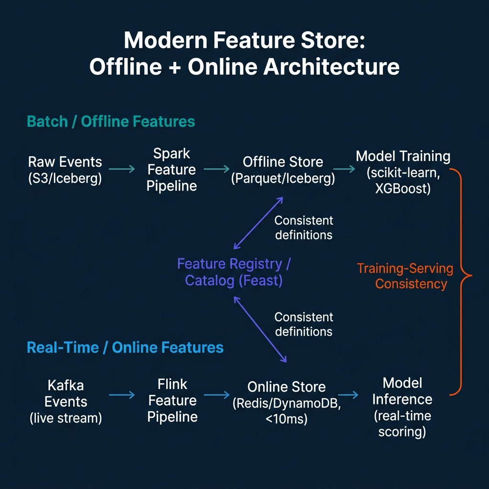

# Modern Feature Stores Beyond Batch Pipelines

The original value proposition of a feature store was straightforward: define features once, use them in both training and serving. The feature engineering logic that computed the `user_30d_purchase_count` feature for training data would be the same logic that computed it for inference, no more training-serving skew where the model trains on slightly different features than it receives in production.

That problem is real and important. But the batch-only feature store has a significant limitation: the features it can provide are as fresh as the batch pipeline that computes them. For models that make real-time decisions, fraud detection, recommendation ranking, dynamic pricing, batch features computed every hour or every day are not fresh enough.

The next generation of feature stores adds streaming feature views: feature computations that run continuously against Kafka or Kinesis event streams, populating an online store with features that are seconds-fresh rather than hours-fresh. Feast, the most widely-used open-source feature store, supports streaming feature views natively, with event sources from Kafka and Kinesis and online store backends including Redis, DynamoDB, and Bigtable.

---

## The Two-Store Model

The feature store architecture separates two concerns: **historical features for training** (offline store) and **fresh features for inference** (online store).


The **offline store** is a data warehouse or lakehouse table that holds historical feature values. When training a model, you retrieve a training dataset by joining entity keys (user IDs, product IDs) with their historical feature values at the correct point in time, a technique called point-in-time correct joining. This prevents training data leakage, where future feature values contaminate historical training examples.

The **online store** is a low-latency key-value store (Redis, DynamoDB) that holds the most recent feature values for each entity. At inference time, the model server retrieves features by entity key with sub-10ms latency, fast enough for synchronous real-time scoring in a serving API.

The feature registry is the central registry of feature definitions. The same YAML or Python definition that configures how a feature is computed in the offline store also configures how it's computed in streaming. This is the mechanism that ensures training-serving consistency: there is one definition of `user_30d_purchase_count`, and both stores compute it the same way.

---

## Streaming Feature Views in Feast

A streaming feature view in Feast connects a Kafka or Kinesis source to a feature computation that runs continuously:

```python
from feast import Entity, FeatureView, Field, KafkaSource, RedisOnlineStore
from feast.types import Float64, Int64
from datetime import timedelta

# Define an entity (the key for feature lookup)
user = Entity(name="user_id", join_keys=["user_id"])

# Define a streaming source from Kafka
kafka_source = KafkaSource(
    name="user_actions_kafka",
    kafka_bootstrap_servers="localhost:9092",
    topic="user_actions",
    batch_source=FileSource(path="s3://features/user_actions/"),  # Fallback for training
    message_format=JsonFormat(
        schema_json='{"user_id": "string", "action_type": "string", "amount": "double"}'
    ),
    timestamp_field="event_timestamp"
)

# Define a streaming feature view with window aggregations
user_activity_fv = FeatureView(
    name="user_activity_features",
    entities=[user],
    ttl=timedelta(days=7),
    schema=[
        Field(name="purchase_count_1h", dtype=Int64),
        Field(name="purchase_amount_1h", dtype=Float64),
        Field(name="session_count_24h", dtype=Int64)
    ],
    online=True,  # Materialize to online store
    source=kafka_source,
)
```

The streaming processor computes window aggregations (purchase count in the last hour, purchase amount in the last hour) from the event stream and writes results to the online store continuously. The offline store receives a batch version of the same computation for training data generation.

---

## The Training-Serving Skew Problem

Training-serving skew is the core problem feature stores solve. Consider a churn prediction model trained with a feature `days_since_last_purchase`. During training, this is computed as `today - max(purchase_date)` from a historical purchase table. During inference, the same feature might be computed from a different table, with a different filter, or with a different date cutoff, producing a value that's close to but not exactly what the model was trained on.

At scale, small inconsistencies in feature computation compound. A model trained with specific feature distributions performs worse in production because the production feature distributions don't match training. Debugging requires comparing feature computation code across pipeline boundaries, often owned by different teams.

The feature store eliminates this by centralizing feature definitions. The feature registry holds the canonical computation logic. Training pipelines use the registry to generate training data. Serving infrastructure uses the registry to compute inference features. Both use the same code path for the same feature definition.

```python
# Training: retrieve historical features for a training dataset
from feast import FeatureStore

store = FeatureStore(repo_path="./feature_repo")

training_df = store.get_historical_features(
    entity_df=pd.DataFrame({
        "user_id": user_ids,
        "event_timestamp": training_cutoff_dates
    }),
    features=[
        "user_activity_features:purchase_count_1h",
        "user_activity_features:session_count_24h"
    ]
).to_df()

# Inference: retrieve online features for real-time scoring
online_features = store.get_online_features(
    features=[
        "user_activity_features:purchase_count_1h",
        "user_activity_features:session_count_24h"
    ],
    entity_rows=[{"user_id": user_id}]
).to_dict()
```

The same feature names, the same registry, the same underlying computation logic, just different execution contexts (historical scan vs online store lookup).

---

## Modern Feature Store Architecture



The integration of Feast into Kubeflow MLOps pipelines has made feature stores more visible to the broader ML platform community. Kubeflow's model training and serving components reference Feast as the recommended feature management layer, which means teams building Kubeflow-based ML platforms have a clear integration point for feature governance.

For data engineering teams, the practical implication is that feature engineering is no longer purely a data pipeline concern. Features that were previously computed ad-hoc in Spark notebooks for training and re-implemented in application code for serving now have a shared definition layer. Data engineering involvement in feature definition and maintenance is expected, not optional.

---

## Using Apache Iceberg as the Feature Offline Store

One of the most significant recent developments in feature store architecture is the use of Apache Iceberg tables as the offline store backend. Iceberg brings several properties to offline feature storage that traditional Parquet-on-S3 approaches lack.

**Time travel for training data generation.** Iceberg's snapshot-based versioning means you can generate training data using a specific snapshot of the feature table, ensuring that the training data snapshot is stable and reproducible even if the feature table continues to be updated.

**Schema evolution without migration cost.** Adding new features to the offline store doesn't require rewriting existing Parquet files. Iceberg's schema evolution handles column additions and type widening without data movement.

**ACID writes for concurrent feature computation.** When multiple Spark jobs are writing different feature groups to the same offline store table, Iceberg's ACID transaction support prevents partial writes and read-after-write inconsistencies.

Feast supports Iceberg as an offline store backend through its plugin system:

```python
# feast/feature_store.yaml
project: my_feature_store
registry: s3://feature-registry/registry.db
provider: local

offline_store:
    type: feast_iceberg.IcebergOfflineStore
    catalog_name: my_catalog
    catalog_type: rest
    uri: https://polaris.example.com/api/catalog
    warehouse: s3://features/iceberg-warehouse/
    token: <token>
```

With Iceberg as the offline store, feature retrieval for training uses Iceberg's predicate pushdown for efficient scan performance, and the feature history is preserved through Iceberg snapshots rather than requiring separate time-partitioned Parquet directories.

---

## Feature Governance and Discovery

A feature store without governance becomes a feature graveyard. Features are added for specific models and then abandoned when those models are deprecated. Without ownership tracking, the registry fills with stale feature definitions that nobody maintains.

Effective feature governance requires:

**Ownership tracking.** Every feature view in the registry should have a named owner, an individual or a team, who is accountable for keeping the computation logic current and the feature quality above threshold. Feast's registry supports tagging feature views with ownership metadata.

**Quality thresholds.** Features have expected statistical properties. A `days_since_last_purchase` feature shouldn't have null rates above 5% for active user entities. Setting expected statistics and alerting when feature distributions shift prevents degraded models from silently serving incorrect predictions.

**Deprecation workflows.** When a model that uses a feature is retired, the feature itself might have no remaining consumers. A deprecation workflow that checks consumer count before allowing feature deletion prevents accidental removal of features still used by secondary models.

**Cross-team discoverability.** The feature registry is only valuable if teams can find features they need instead of recomputing them. A searchable registry with human-readable descriptions, entity types, and sample values reduces duplicate feature engineering work across teams.

---

## On-Demand Features and Real-Time Transformations

Feast supports on-demand feature views: transformations that are computed at request time rather than pre-computed and stored. This is useful for features that depend on the request context, for example, the distance between a user's current location and a candidate restaurant in a recommendation system.

```python
from feast import OnDemandFeatureView, Field, RequestSource
from feast.types import Float64
import pandas as pd

# Define request data schema (available at inference time from the request context)
request_source = RequestSource(
    name="request_features",
    schema=[
        Field(name="user_lat", dtype=Float64),
        Field(name="user_lon", dtype=Float64),
    ]
)

@on_demand_feature_view(
    sources=[request_source, restaurant_feature_view],
    schema=[Field(name="distance_km", dtype=Float64)]
)
def compute_distance(inputs: pd.DataFrame) -> pd.DataFrame:
    """Haversine distance from user location to restaurant."""
    R = 6371  # Earth radius in km
    lat1 = inputs["user_lat"].values
    lon1 = inputs["user_lon"].values
    lat2 = inputs["restaurant_lat"].values
    lon2 = inputs["restaurant_lon"].values
    
    dlat = lat2 - lat1
    dlon = lon2 - lon1
    a = (dlat/2).map(lambda x: x**2) + (dlon/2).map(lambda x: x**2)
    # Simplified haversine
    c = 2 * (a**0.5).map(lambda x: min(x, 1.0))
    outputs = pd.DataFrame()
    outputs["distance_km"] = R * c
    return outputs
```

On-demand features combine with pre-computed online features in a single retrieval call, giving model serving both the pre-computed aggregations (purchase history, session count) and the request-time computations (current distance, real-time price delta) in one unified feature vector.

---

## Enterprise Feature Stores: Databricks Feature Store and Vertex AI Feature Store

Beyond open-source Feast, major cloud platforms provide managed feature store services with tighter integration into their ML ecosystems.

**Databricks Feature Store** (now part of Unity Catalog) integrates feature storage and governance with the broader Unity Catalog data governance layer. Feature tables are Iceberg tables registered in Unity Catalog, with the same lineage tracking, access control, and discoverability that apply to any other Unity Catalog dataset. The tight integration with Databricks Model Registry means model cards automatically record which feature tables a model depends on.

**Vertex AI Feature Store** on Google Cloud provides online/offline feature serving with BigQuery as the offline store backend and Bigtable for low-latency online serving. Vertex Feature Store 2.0 (released 2024) added streaming ingest directly to the online store via BigQuery continuous queries, reducing the engineering overhead of maintaining separate batch and streaming feature computation pipelines.

Both managed services trade flexibility for operational simplicity. Teams that are deeply invested in a single cloud provider benefit from the reduced operational overhead. Teams that need cross-cloud model serving, or that use Feast for portability, should weigh the managed service benefits against the coupling to a single provider.

---

## When to Introduce a Feature Store

Feature stores solve real problems, but they add complexity. Teams should consider introducing a feature store when they encounter:

1. **Training-serving skew in production.** When model performance in production consistently lags behind offline evaluation metrics and the root cause is feature computation inconsistency, a feature store addresses the problem directly.

2. **Redundant feature engineering.** When multiple teams are independently computing the same features (30-day purchase count, days since last login) from the same raw data, centralizing feature computation in a registry reduces duplicate work and ensures consistency.

3. **Real-time model serving requirements.** When models need sub-second feature retrieval for synchronous API scoring, a feature store with an online store backend (Redis, DynamoDB) provides the access pattern that batch feature pipelines can't match.

For small teams with a handful of models and no real-time serving requirements, the overhead of running a feature store may not be justified. A well-organized set of dbt models producing feature tables can serve many of the same purposes with less infrastructure complexity.

---

## Conclusion

Feature stores in 2026 have moved from a niche ML platform tool to a standard component in teams that build real-time predictive models. The combination of streaming feature views (for freshness), point-in-time correct historical features (for accurate training data), and a central feature registry (for training-serving consistency) addresses the three most common sources of ML model degradation in production.

Using Apache Iceberg as the offline store backend brings additional benefits: time travel for reproducible training datasets, schema evolution without migration cost, and ACID writes for concurrent feature computation. The combination of Feast with an Iceberg offline store and Redis online store represents a production-proven architecture for teams that need both training reproducibility and real-time inference performance.

For data engineering teams, the operational responsibility is maintaining the streaming infrastructure that feeds streaming feature views (Kafka topics with the right schemas, Flink or Feast streaming processors), the batch pipelines that populate the offline store for training data generation, and the governance discipline that keeps the feature registry current and discoverable.

---

## Feature Store Governance: The Metadata Layer

A feature store without governance creates a new category of technical debt. As the feature registry grows to hundreds of features defined by dozens of teams, discoverability degrades and duplicate feature definitions accumulate. The solution is treating the feature registry as a governed data catalog, not just a configuration file.

Effective feature store governance requires:

**Feature ownership.** Every feature view should have a designated owner, a team or individual responsible for its correctness, freshness, and documentation. Ownership is enforced through the registry metadata, not through social convention. When a consumer discovers that a feature is stale, they know immediately who to contact.

**Freshness SLAs.** Features consumed for real-time inference have latency requirements. A feature that should be updated every 5 minutes but hasn't been updated in 3 hours is serving stale values. Freshness SLAs, defined in the feature view metadata and monitored through platform alerts, catch staleness before it silently degrades model performance.

**Deprecation workflows.** Feature registries accumulate technical debt as models are retrained with better features and old feature views become unused. Without deprecation workflows, unused features continue consuming compute resources for their materialization jobs. A deprecation workflow identifies unused features (by tracking which models consume which features), marks them as deprecated with a sunset date, and eventually removes their materialization jobs.

**Cross-team discoverability.** The feature registry's primary value proposition is reuse, a fraud detection team's transaction velocity features might also be valuable for a credit risk team's model. This reuse only happens if teams can discover what features exist. Investing in feature documentation (including example values, distributions, and known caveats) dramatically improves cross-team reuse rates.

---

## The Training-Serving Skew Problem

Training-serving skew is one of the most common and most damaging failure modes in production ML systems. It occurs when the feature values used to train a model differ systematically from the feature values served to the model during inference. The result is a model that performs well in evaluation (against held-out training data) but poorly in production (against actual inference-time features).

The causes of training-serving skew:

**Different feature computation logic.** The offline batch job that computes features for training runs different code than the online service that computes features for inference. A subtle difference, perhaps a different treatment of missing values, or a different time window for an aggregation, produces different values for the same raw input.

**Different data sources.** Training features are computed from the offline store (Iceberg tables, data warehouse). Serving features are read from the online store (Redis, DynamoDB). If the pipelines that populate these two stores have different latency characteristics or different data cleaning logic, the values diverge.

**Point-in-time retrieval errors.** Training requires point-in-time correct feature values, the values that were available at the time of each training example's label, not the current values. Failing to implement proper point-in-time retrieval introduces future data leakage into training features, causing artificially high training performance that doesn't generalize.

Feature stores address training-serving skew by centralizing feature computation in a single pipeline that serves both offline and online stores. When both the training dataset generation and the real-time inference path read features from the same computation logic, the risk of skew from code divergence is eliminated. Point-in-time retrieval is handled natively by the feature store's training dataset generation API.

---

### Build ML-Ready Data Platforms

For comprehensive guidance on AI-native data architecture and agentic ML systems, pick up [The 2026 Guide to Lakehouses, Apache Iceberg and Agentic AI: A Hands-On Practitioner's Guide to Modern Data Architecture, Open Table Formats, and Agentic AI](https://www.amazon.com/dp/B0GQNY21TD).

Browse Alex's other data engineering and analytics books at [books.alexmerced.com](https://books.alexmerced.com).

For unified lakehouse access to your Iceberg-backed feature offline store with query acceleration, try Dremio Cloud free at [dremio.com/get-started](https://www.dremio.com/get-started).
