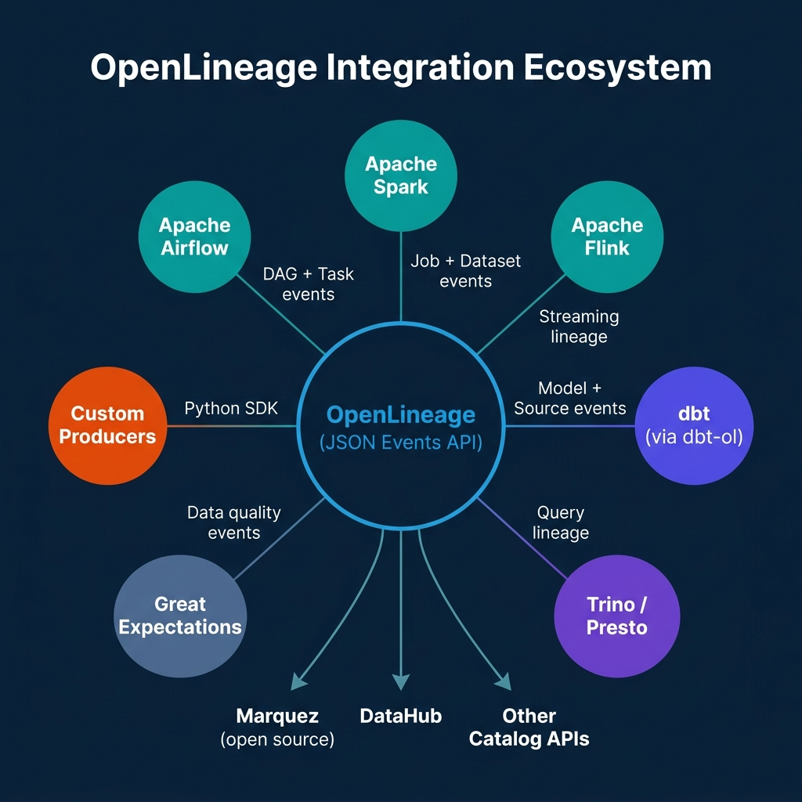
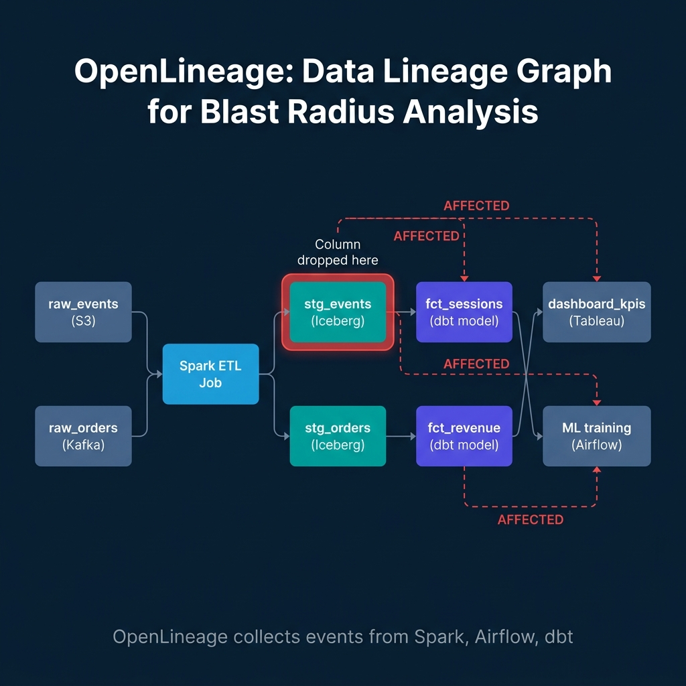

# OpenLineage as the Spine of Data Observability

Data platform incidents follow a predictable pattern. A pipeline fails or a dashboard goes stale. Someone opens Slack and asks which table feeds that dashboard. Someone else checks the Airflow UI and traces it to a Spark job. A third person pulls up the dbt DAG and realizes the issue is three steps upstream in a staging model that reads from an Iceberg table that failed due to a schema change two days ago. The entire investigation takes hours of manual archaeology.

OpenLineage was built to make this archaeology unnecessary. It provides a standardized API for tools across the data stack, Airflow, Spark, Flink, dbt, to emit structured lineage events as pipelines run. Those events flow to a lineage backend (Marquez, DataHub, or similar) that assembles them into a searchable, queryable dependency graph. When something breaks, the graph shows exactly which downstream assets are affected without requiring a human to trace the dependency tree manually.

---

## What OpenLineage Actually Is

OpenLineage is a specification, not a tool. It defines a JSON event format for describing pipeline runs, the datasets they read, and the datasets they write. Any tool that emits events in this format is an OpenLineage producer. Any backend that ingests and stores these events is a compatible consumer.

The core event types are:

**RunEvent:** Records the start, complete, or failure of a pipeline run (a DAG task, a Spark job, a dbt model execution). Contains a unique run ID, a job name, and arrays of input and output datasets.

**DatasetEvent:** Records a change to a dataset outside the context of a specific job, for example, a schema change applied via DDL.

**JobEvent:** Records changes to a job definition, for example, a DAG being updated in Airflow.

Each event carries **facets**, structured metadata payloads that extend the base event with specific information. The `SchemaDatasetFacet` records column names and types for a dataset. The `DataQualityMetricsInputDatasetFacet` records row counts and null rates for input datasets. The `SqlJobFacet` records the SQL query associated with a job. Facets are extensible: you can define custom facets for organization-specific metadata without breaking the standard format.

---

## Integration Across the Stack

The value of OpenLineage comes from its coverage. A single tool emitting lineage events gives you partial visibility. When Airflow, Spark, Flink, and dbt all emit events, the resulting graph shows complete end-to-end provenance.



**Apache Airflow:** The `apache-airflow-providers-openlineage` package integrates at the operator level. It intercepts task execution events and automatically emits OpenLineage run events for each task in a DAG. It propagates parent run IDs so downstream backends can reconstruct the full orchestration hierarchy.

**Apache Spark:** The Spark integration uses a Spark listener, a JVM agent that intercepts read and write operations at the execution plan level. No code changes to Spark jobs are required. The listener reads the physical plan, identifies input and output datasets, and emits run events with schema facets at job start and completion.

**Apache Flink:** Similar to Spark, the Flink integration operates as an agent that captures streaming lineage without modifying job code. This is particularly valuable for streaming pipelines where the data flow is complex and documentation is often out of date.

**dbt:** The `dbt-ol` integration captures lineage from dbt model executions. Each `dbt run` emits events for every model that runs, recording the `ref()` and `source()` dependencies as dataset relationships, and the compiled SQL as a facet on the job event.

---

## Blast Radius Analysis in Practice

The most immediate operational benefit of a live lineage graph is blast radius analysis, understanding what breaks when something changes.



A practical scenario: an analyst drops a column from the `stg_events` Iceberg table, perhaps cleaning up an obsolete field that was supposed to be unused. With a complete lineage graph, you can run a lineage query against the OpenLineage backend before making the change:

```bash
# Query Marquez for downstream consumers of stg_events
curl -X GET "http://marquez:5000/api/v1/datasets/my_namespace/stg_events/lineage?depth=3" \
  | jq '.graph | [.[] | select(.type == "DATASET")] | map(.id)'
```

The response shows every downstream dataset and job that reads from `stg_events`, up to three hops downstream. You discover that `fct_sessions`, `dashboard_kpis`, and the ML training Airflow DAG all have direct or indirect dependencies on the column you planned to drop. What looked like a safe cleanup is now a breaking change that requires coordinating with three teams before executing.

This is not a theoretical benefit. In organizations running OpenLineage at scale, the difference between this query and manual archaeology is measured in hours.

---

## The OpenLineage Event Model in Practice

Emitting custom OpenLineage events from a Python pipeline:

```python
from openlineage.client import OpenLineageClient
from openlineage.client.run import RunEvent, RunState, Run, Job
from openlineage.client.facet import SchemaDatasetFacet, SchemaField
from openlineage.client.dataset import Dataset
import uuid
from datetime import datetime, timezone

client = OpenLineageClient.from_environment()

# Start event when job begins
run_id = str(uuid.uuid4())
job_name = "my_custom_etl"
namespace = "production"

client.emit(
    RunEvent(
        eventType=RunState.START,
        eventTime=datetime.now(timezone.utc).isoformat(),
        run=Run(runId=run_id),
        job=Job(namespace=namespace, name=job_name),
        inputs=[
            Dataset(namespace=namespace, name="raw_events", 
                   facets={"schema": SchemaDatasetFacet(
                       fields=[SchemaField("event_id", "BIGINT"),
                               SchemaField("event_type", "STRING"),
                               SchemaField("ts", "TIMESTAMP")]
                   )})
        ],
        outputs=[
            Dataset(namespace=namespace, name="stg_events")
        ]
    )
)
```

---

## Backends: Marquez and DataHub

Marquez is the reference implementation backend for OpenLineage, an open-source metadata service that provides an API and basic UI for storing and querying lineage events. It's the easiest path to get started: run it with Docker Compose, point your OpenLineage producers at it, and the lineage graph starts populating immediately.

DataHub provides a more complete data catalog experience, integrating lineage with search, ownership, documentation, and data quality signals. Its OpenLineage integration allows lineage events to flow into the DataHub graph alongside metadata collected from other sources.

For organizations that need enterprise governance features alongside lineage, access control, data classification, business glossary, DataHub or commercial platforms like Atlan or Alation that support OpenLineage ingestion are the better fit.

---

## Conclusion

OpenLineage addresses the observability gap that has made data platform incidents disproportionately expensive to diagnose. A data pipeline fails in ways that aren't visible to the tools monitoring individual components, Airflow knows the task failed, but doesn't know what the downstream effects are. Spark knows the job completed, but doesn't know what business dashboard depends on the table it wrote.

By standardizing the lineage event format across tools, OpenLineage makes it possible to build a single, authoritative dependency graph that spans the entire platform. That graph makes blast radius analysis instant and root cause investigation tractable without manual archaeology.

---

## Column-Level Lineage: The Next Frontier

Dataset-level lineage ("job X reads from table A and writes to table B") is the baseline. Column-level lineage ("column C in table B is derived from columns D and E in table A through transformation F") is substantially more powerful for impact analysis.

Column-level lineage makes it possible to answer: if we change the data type of `user_id` in the `users` source table from INTEGER to BIGINT, which downstream columns are affected? Without column-level lineage, the answer requires reading every downstream pipeline's SQL. With column-level lineage in the graph, the query returns the complete affected column set in milliseconds.

The Spark OpenLineage integration captures column-level lineage from the physical plan for SQL operations, including joins, aggregations, and transformations. The dbt integration captures column-level lineage from the compiled SQL of each model using SQL parsing.

For custom Python pipelines, column-level lineage requires explicitly declaring column mappings in the `ColumnLineageDatasetFacet`:

```python
from openlineage.client.facet import (
    ColumnLineageDatasetFacet,
    ColumnLineageDatasetFacetFieldsAdditional,
    ColumnLineageDatasetFacetFieldsAdditionalInputFields
)

# Declare column-level lineage for a custom transformation
column_lineage = ColumnLineageDatasetFacet(
    fields={
        "total_spend": ColumnLineageDatasetFacetFieldsAdditional(
            inputFields=[
                ColumnLineageDatasetFacetFieldsAdditionalInputFields(
                    namespace="production",
                    name="raw_orders",
                    field="order_amount"
                )
            ],
            transformationDescription="SUM over 90-day window",
            transformationType="AGGREGATE"
        ),
        "customer_segment": ColumnLineageDatasetFacetFieldsAdditional(
            inputFields=[
                ColumnLineageDatasetFacetFieldsAdditionalInputFields(
                    namespace="production",
                    name="raw_orders",
                    field="total_spend"
                )
            ],
            transformationDescription="CASE WHEN segment classification",
            transformationType="CONDITIONAL"
        )
    }
)
```

Column-level lineage is more expensive to collect and store than dataset-level lineage, but for high-value data products where understanding transformation provenance is critical, the investment is justified.

---

## SLA Tracking with OpenLineage

Pipeline SLAs define when a dataset should be ready: "The `fct_daily_revenue` table must be available by 6 AM UTC for the morning executive dashboard." Tracking SLA compliance requires knowing when each pipeline run completed and comparing it against the expected completion time.

OpenLineage events carry completion timestamps that backends can use for SLA monitoring. Marquez's API supports SLA queries directly:

```bash
# Check recent runs of a job for SLA compliance
curl "http://marquez:5000/api/v1/jobs/production/fct_daily_revenue_etl/runs?limit=10" | \
  jq '.runs[] | {
    run_id: .id,
    started_at: .startedAt,
    ended_at: .endedAt,
    state: .state,
    duration_minutes: (
      ((.endedAt | fromdateiso8601) - (.startedAt | fromdateiso8601)) / 60 | round
    )
  }'
```

Building SLA monitoring on top of OpenLineage data requires three components:

1. **SLA definitions:** A configuration file or catalog record that defines the expected completion time for each dataset.
2. **Completion detection:** A listener or scheduled query that checks when the relevant `COMPLETE` event was emitted for each monitored job.
3. **Alert delivery:** A notification when a pipeline hasn't emitted its `COMPLETE` event before the SLA deadline.

This approach treats SLA monitoring as a metadata query problem rather than an infrastructure monitoring problem, you're checking the lineage graph for expected events, not polling health endpoints.

---

## Integrating OpenLineage with Data Quality Tools

The data quality facets in the OpenLineage spec allow quality monitoring tools like Great Expectations, Soda, and dbt tests to emit their results alongside pipeline events. This creates an integrated observability surface where you can see not just "the pipeline ran" but "the pipeline ran and the output data met quality expectations."

```python
# Great Expectations integration: emit quality results as OpenLineage facets
from openlineage.client.facet import DataQualityMetricsInputDatasetFacet

quality_facet = DataQualityMetricsInputDatasetFacet(
    rowCount=1_542_783,
    bytes=2_847_291_024,
    columnMetrics={
        "user_id": {
            "nullCount": 0,
            "distinctCount": 1_542_783,
            "quantiles": {"0.1": 1000, "0.5": 500000, "0.9": 1400000}
        },
        "order_amount": {
            "nullCount": 127,
            "min": 0.01,
            "max": 49999.99,
            "sum": 87_293_441.50
        }
    }
)
```

When a data quality check fails, the OpenLineage backend shows the failure alongside the pipeline run event. Downstream SLA monitoring can check not just whether the pipeline completed but whether it completed with passing quality metrics.

---

## Building a Data Observability Culture

OpenLineage provides the technical foundation for data observability, but tooling alone doesn't create an observable data platform. The cultural and organizational practices around using lineage data matter as much as the implementation.

The most effective data observability practices share common patterns. The first is establishing a lineage review process for any pipeline change that touches a widely-consumed dataset. Before a data engineer renames a column, drops a table, or changes a transformation, a lineage query shows which downstream assets are affected. This makes the impact assessment step fast and routine rather than slow and anxious.

The second is using lineage data in incident postmortems. When a pipeline failure or data quality incident is resolved, the postmortem includes a lineage analysis: which upstream changes contributed to the incident? Which downstream assets were affected? What would have been visible in the lineage graph that could have detected the issue earlier? Postmortems that include lineage analysis produce actionable improvements to monitoring configurations.

The third is making lineage visible to data consumers, not just platform engineers. When a data analyst can open the data catalog, click on the dashboard they use daily, and trace its lineage back to source systems, seeing what pipelines feed it, when those pipelines last ran successfully, and whether any upstream quality checks are failing, they develop intuitions about data trustworthiness that improve their analytical work. Analysts who understand that the revenue dashboard reads from Iceberg tables that were last updated four hours ago ask better questions about data freshness than analysts who have no visibility into their data's provenance.

The barrier to this visibility is often not technical but organizational. Platform teams that treat lineage data as internal infrastructure rather than a consumer-facing feature miss the organizational benefit. The goal is a culture where "check the lineage" is a natural first response to data questions, the same way "check the logs" is a natural first response to software incidents.

---

## OpenLineage and Data Catalog Integration

OpenLineage's most powerful use is when lineage events are consumed by a data catalog that provides a searchable, visual interface for the lineage graph. Tools like OpenMetadata, DataHub, and Atlan consume OpenLineage events through their integrations and build navigable lineage graphs in their catalogs.

The integration pattern is straightforward: the Marquez or other OpenLineage backend stores events, and the data catalog either reads from Marquez or receives OpenLineage events directly through its own API. The catalog then presents lineage as a feature of each data asset's profile, alongside description, schema, quality metrics, and access information.

This integration enables impact analysis at catalog query time. When a data engineer needs to make a change to a source table, they can open the table in the catalog, click on the lineage tab, and immediately see all downstream assets that depend on it, dbt models, Spark jobs, dashboards, and reports. Impact analysis that previously required searching through code repositories and asking colleagues is now a self-service catalog operation.

Automated impact notification takes this further. Governance platforms that integrate with OpenLineage can automatically notify owners of downstream assets when an upstream table's schema changes. The Iceberg `SchemaChange` event, emitted through OpenLineage when a column is added or type is changed, triggers notifications to every team that owns a downstream asset consuming that schema. This replaces informal Slack notifications and runbook checklist items with automated, reliable communication.

---

### Build Reliable Data Platforms

For comprehensive guidance on data platform observability, governance, and lakehouse architecture, pick up [The 2026 Guide to Lakehouses, Apache Iceberg and Agentic AI: A Hands-On Practitioner's Guide to Modern Data Architecture, Open Table Formats, and Agentic AI](https://www.amazon.com/dp/B0GQNY21TD).

Browse Alex's other data engineering and analytics books at [books.alexmerced.com](https://books.alexmerced.com).

Dremio provides native query lineage and integrated observability for your Iceberg lakehouse. Try it free at [dremio.com/get-started](https://www.dremio.com/get-started).
