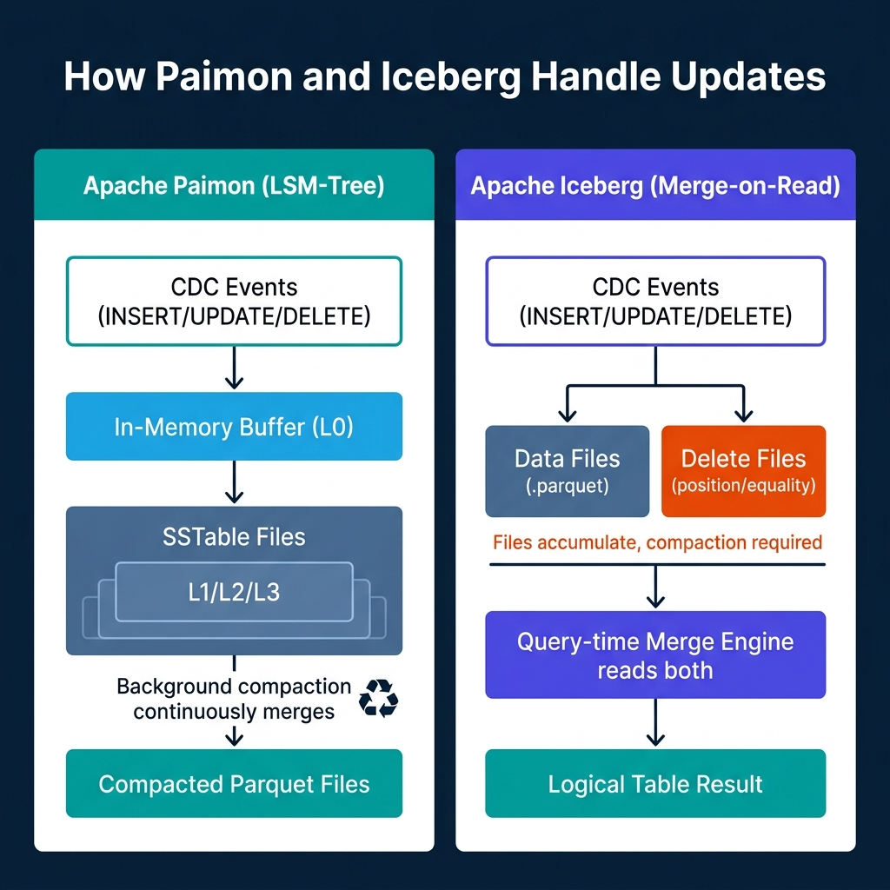
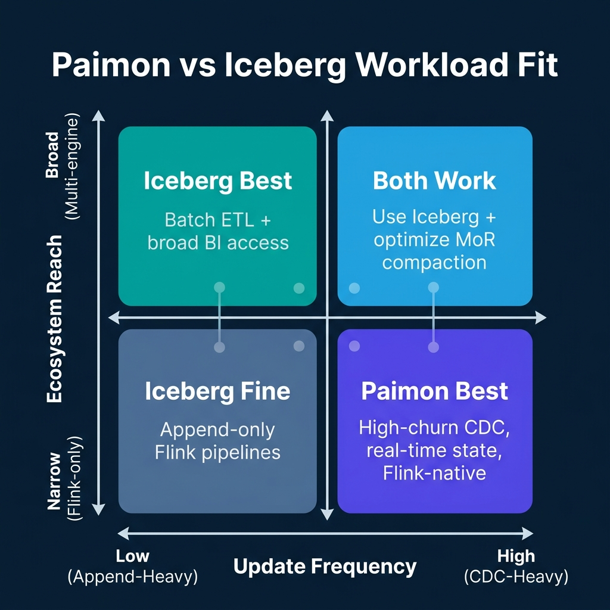

# When Paimon Beats Iceberg for Mutable Streams

Most lakehouse format comparisons skip the part that actually matters for streaming teams: how the format handles mutations. Apache Iceberg is excellent for append-heavy analytics, schema evolution, and multi-engine compatibility. But feed a high-churn CDC stream of updates and deletes into Iceberg using merge-on-read (MoR), and you're managing a growing pile of delete files that accumulate between compaction runs.

Apache Paimon takes a different approach. Its Log-Structured Merge-tree (LSM-tree) architecture is designed from the ground up for continuous upserts. For the right workload, high-frequency mutations, Flink-native execution, real-time table freshness requirements, Paimon produces a cleaner operational profile than Iceberg. For the wrong workload, it's an unnecessary complexity burden.

This post defines the specific conditions where Paimon wins, where Iceberg remains the better default, and what you actually need to configure to use either effectively.

---

## What Paimon Is and Where It Came From

Apache Paimon graduated to a Top-Level Project at the Apache Software Foundation in 2024 and has since progressed through several production-ready releases. It grew out of the Flink Table Store project, which explains why its design assumptions are so tightly aligned with Apache Flink.

Paimon distinguishes itself from Iceberg and Delta Lake through its choice of storage data structure. While Iceberg stores data as immutable Parquet snapshots and Hudi uses a record-level index for updates, Paimon uses an LSM-tree, the same family of data structures that underlies systems like LevelDB, RocksDB, and Apache Cassandra.

The choice of LSM-tree is not incidental. It's a direct response to the specific access pattern of high-frequency updates.

---

## How the LSM-Tree Handles Updates Differently

In an LSM-tree, incoming writes land in an in-memory buffer, which is periodically flushed to sorted files on disk. These sorted files are organized into levels (L0, L1, L2, and so on). Background compaction processes merge smaller files from lower levels into larger files at higher levels, resolving conflicts between earlier and later writes to the same key.

For a CDC stream where the same row might be updated many times per minute, this has concrete benefits. New CDC events always write to the in-memory buffer and are flushed to the lowest level. The query engine reads the merged view across levels. The background compaction consolidates updates at rest without blocking writes. At no point does a query need to scan separate delete files and reconcile them against data files, the LSM-tree's merge logic handles this intrinsically.



Iceberg's approach is different. Under MoR semantics, an update to a row in Iceberg does not rewrite the data file. Instead, it writes a delete file that records the position or equality of the row to be removed, and writes a new data file containing the updated row. Queries must read both the original data files and the corresponding delete files, then apply the delete records to produce the correct result.

This works fine when updates are infrequent. When a table receives thousands of updates per second across a high-cardinality key space, delete files accumulate faster than compaction can remove them. Query performance degrades because the engine must read and reconcile more and more file pairs. The recommended remediation is more frequent compaction, which adds operational overhead and resource contention.

---

## Paimon's Primary Key Table: The Core Streaming Primitive

The central concept in Paimon for streaming workloads is the primary key table. When you define a table with a primary key, Paimon routes all writes for that key through the LSM-tree, resolving conflicts using the configured merge engine.

```sql
-- Create a Paimon primary key table for CDC ingestion from MySQL
CREATE TABLE customer_orders (
    order_id    BIGINT PRIMARY KEY NOT ENFORCED,
    customer_id BIGINT,
    status      STRING,
    amount      DECIMAL(10, 2),
    updated_at  TIMESTAMP(3)
) WITH (
    'connector'                 = 'paimon',
    'path'                      = 's3://data-lake/paimon/customer_orders',
    'bucket'                    = '8',
    'changelog-producer'        = 'lookup',
    'merge-engine'              = 'deduplicate'
);
```

The `changelog-producer` property controls how Paimon generates downstream changelog records for consumers of this table:

- **`input`**: Assumes the input stream already contains full changelog events (+-I, -U, +U, -D). Use this when consuming from a Debezium CDC source.
- **`lookup`**: Generates changelogs by performing a point query on the existing table state before each write. This ensures accurate before-and-after pairs even when the input stream doesn't carry them.
- **`full-compaction`**: Generates changelogs by comparing table states across full compaction cycles. Produces the most accurate changelogs but with higher latency.

The `merge-engine` property controls how conflicts for the same primary key are resolved. `deduplicate` keeps the last write. For aggregation use cases, such as a running balance or session counter, `aggregation` allows you to define column-level merge functions like `sum`, `max`, or `last_non_null`.

---

## The Changelog Stream Feature: Why Paimon Tables Are Different from Iceberg Tables

One of Paimon's most distinctive capabilities is that primary key tables can serve as both a batch-readable lakehouse table and a changelog source for downstream Flink jobs.

When a Flink job reads a Paimon primary key table as a streaming source, it doesn't read static snapshots. It reads the changelog stream, a continuous stream of `+I`, `-U`, `+U`, and `-D` records that represent every mutation to the table. This means you can chain Flink jobs where the output of one job becomes the changelog input of the next, building multi-stage stateful streaming pipelines that maintain real-time derived tables.

Iceberg can serve as a streaming source in Flink through incremental reads, but its model is snapshot-based. Flink reads successive Iceberg snapshots and emits new or deleted rows detected between them. This works for append-only tables and bounded update patterns, but doesn't produce the full changelog semantics that Paimon emits natively. Building an accurate changelog from Iceberg incremental reads requires additional logic to handle updates that touch the same row across multiple snapshots.

---

## Where Paimon Falls Short

Paimon's ecosystem reach is its most significant constraint. As of mid-2025, the query engines with strong Paimon read support are Apache Flink and Apache Spark. Trino has a community-maintained Paimon connector, but it lacks some of the more advanced Paimon table features. Engines like Dremio, DuckDB, and Snowflake don't have native Paimon integration.

If your architecture requires ad-hoc SQL from multiple query engines, particularly BI tools that connect through Trino or Presto, Iceberg's ecosystem compatibility is a clear advantage. Nearly every modern query engine supports Iceberg out of the box.

Paimon does offer an Iceberg-compatible read path, which exposes Paimon tables as Iceberg tables to engines that support the Iceberg REST Catalog API. This compatibility layer allows engines like Spark and Trino to read Paimon data without native Paimon support. However, the compatibility layer is read-only and doesn't expose Paimon's changelog semantics. You get table data but not the streaming mutation stream.

Another constraint is operational maturity. Iceberg has a larger user base, more documented failure patterns, and more tooling for maintenance, governance, and catalog integration. Teams evaluating Paimon for production use should plan for less community documentation on edge cases and a steeper learning curve on tuning the LSM-tree parameters.

---

## The Workload Decision Matrix

The decision between Paimon and Iceberg narrows to two dimensions: how frequently your tables receive updates and how many different engines need to read the data.



**High-frequency CDC, Flink-native execution, real-time freshness required:** This is Paimon's optimal use case. Examples include order management systems where rows update dozens of times per order lifecycle, inventory tracking with near-continuous SKU-level updates, and user session tables where states change multiple times per minute. The LSM-tree handles the churn cleanly without delete file accumulation.

**Batch ETL with broad BI access:** Iceberg wins here without competition. If your primary workload is appending daily partitions and querying from Trino, Dremio, Snowflake, and Spark, Iceberg's multi-engine support and mature governance features make it the clear choice.

**Mixed workload, multi-engine access, moderate update frequency:** Both work. For teams with existing Iceberg infrastructure and moderate CDC volume, tuning Iceberg's compaction settings and using copy-on-write (CoW) for large-batch updates is often simpler than introducing a second table format. Adopt Paimon selectively for the tables where it demonstrably helps, rather than as a wholesale platform replacement.

---

## Practical Configuration for High-Churn Paimon Tables

When tuning a Paimon primary key table for a high-churn CDC source, three settings matter most.

**Bucket count:** Paimon distributes data by primary key across a fixed number of buckets. Each bucket holds an LSM-tree. More buckets allow more write parallelism but increase the number of small files at low data volumes. For a table with millions of rows and hundreds of thousands of updates per minute, 16 to 64 buckets is a reasonable starting range.

**Compaction trigger:** Paimon triggers compaction when the number of sorted files at level 0 exceeds a threshold. The default threshold is 5. For very high write rates, reducing this to 3 keeps the LSM-tree shallow and maintains consistent read performance. For lower write rates, increasing the threshold to 8 or 10 reduces compaction frequency and I/O overhead.

**Full-compaction interval:** For tables serving changelog consumers, schedule periodic full compaction to ensure that changelog events are complete and accurate. Lookup-mode changelog producers generate accurate changelogs on individual writes, but full compaction provides a consistency checkpoint that catches any drift between levels.

```sql
-- Configure a high-churn Paimon table with aggressive compaction settings
ALTER TABLE customer_orders SET (
    'num-sorted-run.compaction-trigger' = '3',
    'full-compaction.delta-commits'     = '20',
    'write.merge-engine'                = 'deduplicate'
);
```

---

## Conclusion

Paimon is not a general-purpose Iceberg replacement. It's a purpose-built tool for a specific problem: high-frequency mutations in streaming lakehouse architectures, particularly where Apache Flink is the primary compute engine and real-time table freshness is a hard requirement.

For append-heavy pipelines, mixed-engine analytics, or organizations that have already invested in Iceberg governance tooling, Iceberg remains the better default. The format choice should follow the workload, not the other way around.

The clearest signal that Paimon is worth evaluating is mounting operational complexity around Iceberg compaction on high-churn tables. If you're spending more time managing delete file accumulation and compaction schedules than building pipeline features, Paimon's LSM-tree model is worth testing against your specific throughput numbers.

---

## Paimon Tags: Batch-Compatible Snapshots for CDC Tables

One of Paimon's useful operational features is the Tag system. Unlike Iceberg's snapshot-based time travel (which is tied to all historical snapshots), Paimon Tags allow you to mark specific points in a table's history for long-term retention.

Tags are particularly valuable for CDC tables where you want to support both the streaming changelog use case and the batch analytics use case simultaneously:

```sql
-- Create a daily tag for batch processing access
CALL sys.create_tag('my_catalog.default.customer_orders', '2025-05-24', 2 /*snapshot-id*/);

-- Read from a tagged version for batch analytics
SELECT * FROM customer_orders /*+ OPTIONS('scan.tag-name'='2025-05-24') */;

-- Expire snapshots while retaining tags
CALL sys.expire_snapshots('my_catalog.default.customer_orders', '2025-05-24 00:00:00', 10 /*retain-latest*/);
```

Tags persist independently from snapshots. You can expire Paimon snapshots aggressively to control storage costs while retaining daily or weekly tags for historical analytical access. This gives CDC tables the same time-travel capability that makes Iceberg valuable for audit use cases, without the storage cost of retaining every intermediate snapshot.

---

## Streaming Aggregations with Paimon's Aggregation Merge Engine

One of Paimon's most distinctive features is its native support for streaming aggregations, running computations that accumulate over time directly in the table format.

The aggregation merge engine allows defining column-level merge functions that resolve conflicts for the same primary key:

```sql
-- Paimon table for session-level aggregations
CREATE TABLE user_sessions (
    user_id             BIGINT PRIMARY KEY NOT ENFORCED,
    session_count       INT,
    total_purchase_amt  DOUBLE,
    last_active         TIMESTAMP(3),
    active_days         BIGINT
) WITH (
    'connector'     = 'paimon',
    'path'          = 's3://data-lake/paimon/user_sessions',
    'merge-engine'  = 'aggregation',
    'fields.session_count.aggregate-function'         = 'sum',
    'fields.total_purchase_amt.aggregate-function'    = 'sum',
    'fields.last_active.aggregate-function'           = 'last_non_null',
    'fields.active_days.aggregate-function'           = 'count'
);
```

Incoming events contain partial updates: a new session event increments `session_count` by 1, adds the purchase amount to `total_purchase_amt`, and updates `last_active` to the event timestamp. Paimon's LSM-tree merge logic applies these aggregations at compaction time, accumulating the correct running totals without requiring a stateful Flink operator to maintain the aggregation in RocksDB.

This pattern is particularly efficient for analytics tables that are updated continuously from streaming sources but queried on a batch schedule. The aggregation merge engine handles the incremental state in the table format itself, rather than requiring complex stateful stream processing.

---

## Monitoring Paimon Tables in Production

Paimon doesn't have the same ecosystem of monitoring tooling as Iceberg (which benefits from tools like PyIceberg's table introspection and Spark's `DESCRIBE HISTORY`). But Paimon exposes sufficient system tables for building operational monitoring:

```sql
-- Check LSM-tree file count across buckets
SELECT bucket, level, count(*) as file_count
FROM customer_orders$files
GROUP BY bucket, level
ORDER BY bucket, level;

-- Check snapshot history
SELECT snapshot_id, schema_id, commit_time, total-size
FROM customer_orders$snapshots
ORDER BY commit_time DESC
LIMIT 20;
```

**Metrics to watch in production Paimon environments:**

- **L0 file count per bucket:** High L0 file counts (>5) indicate compaction is falling behind write throughput. This degrades read performance as the query engine must merge more sorted runs.
- **Compaction lag time:** How recently did the last full compaction complete? For changelog-producing tables, stale compaction creates gaps in downstream changelog accuracy.
- **Storage size per bucket:** Uneven distribution across buckets indicates poor key distribution. Hot buckets receive disproportionate writes and compact more frequently than cold buckets, creating performance inconsistency.

Paimon's Flink integration also exposes JVM metrics for compaction thread pool saturation, which can be monitored through Prometheus/Grafana for operational alerting.

---

### Go Further with Lakehouse Architecture

For a comprehensive guide to modern data architectures including open table format comparisons, streaming lakehouse design, and AI-native data platforms, pick up [The 2026 Guide to Lakehouses, Apache Iceberg and Agentic AI: A Hands-On Practitioner's Guide to Modern Data Architecture, Open Table Formats, and Agentic AI](https://www.amazon.com/dp/B0GQNY21TD).

Browse Alex's other data engineering and analytics books at [books.alexmerced.com](https://books.alexmerced.com).

To query both Paimon and Iceberg tables with unified sub-second performance and automated reflection caching, try Dremio Cloud free at [dremio.com/get-started](https://www.dremio.com/get-started).
