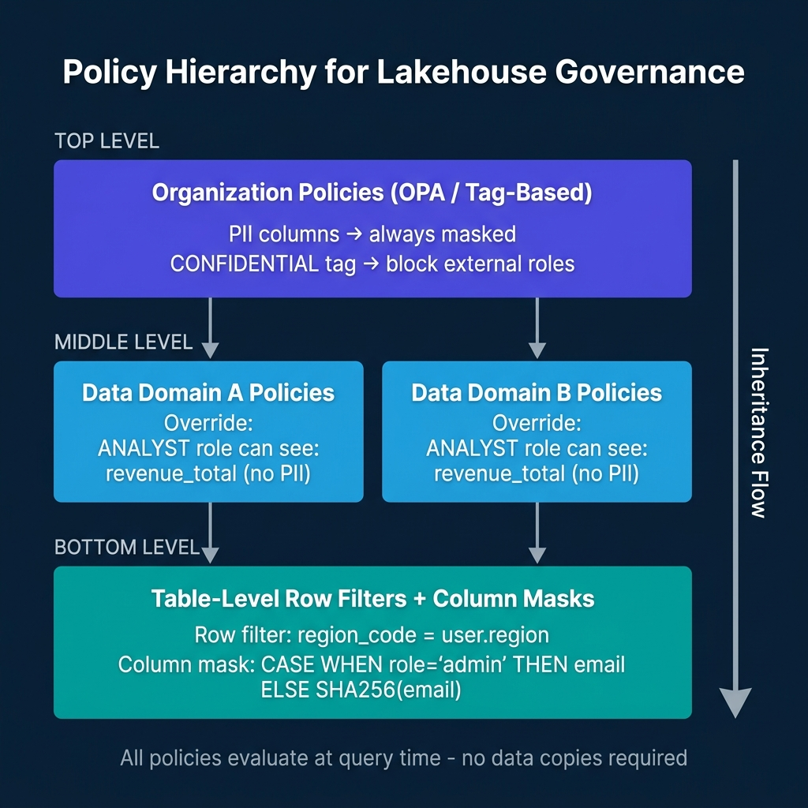
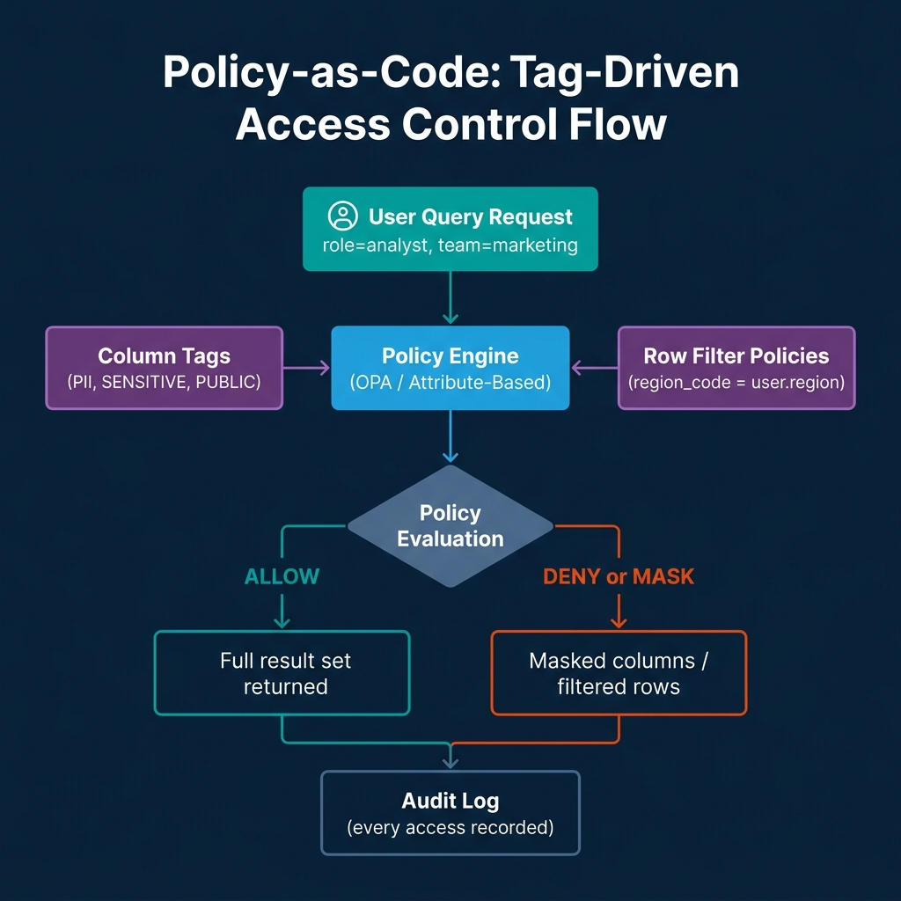

# Policy as Code for Lakehouse Governance

The traditional approach to data access governance relies on role-based access control: you define roles, assign users to roles, and grant roles access to specific tables or schemas. For a team of ten analysts and a handful of sensitive tables, this is manageable. For an organization with hundreds of analysts, dozens of data domains, and fine-grained sensitivity classifications across thousands of tables, RBAC becomes a maintenance burden that governance teams can't keep current.

The role explosion problem is real. When access is controlled purely by roles, every new combination of "user group + sensitivity level + regional constraint" requires a new role. Governance teams spend more time managing role assignments than thinking about policy intent. Access reviews become a bureaucratic exercise because nobody can actually read the policy from the role hierarchy.

Attribute-based access control (ABAC) with policy-as-code addresses this by making policy intent explicit and composable. Instead of managing roles that encode every possible permission combination, you write policies that express rules like "anyone with the ANALYST attribute can see aggregate-level metrics but not individual user records" or "any column tagged PII is masked for all roles except DATA_OWNER."

---

## The Policy Layers

Modern lakehouse governance operates at three levels, each serving a different granularity of control.

**Column-level masking** controls what individual fields a user sees. A column tagged `PII` might return `SHA256(email)` for analysts and the raw value for data owners. Column masks are SQL expressions that evaluate per-user at query time, no materialized copies of masked data are required.

**Row-level filters** control which rows a user can see. A table with a `region_code` column might filter results to `WHERE region_code = current_user_attribute('region')`, ensuring regional managers only see data for their assigned regions without requiring separate materialized views per region.

**Object-level policies** control whether a user can access a table, schema, or catalog at all. These are the coarser-grained permissions that sit above column and row controls.

The key architectural property of all three layers: policy evaluation happens at query time against live data. No data copies for different user groups, no materialized views per region, no separate tables for masked versus unmasked data.

---

## Policy Hierarchy: From Organization to Table



An effective governance architecture organizes policies in a hierarchy:

**Organization-level policies** express intent that applies everywhere: "PII-tagged columns are always masked for external roles." These live in OPA or in the lakehouse catalog's tag governance layer.

**Domain-level policies** refine organization policies for specific data domains: "The finance domain allows ANALYST role to see `revenue_total` because it's not PII, even though it's CONFIDENTIAL."

**Table-level policies** apply specific row filters and column masks based on the table's data and the query user's attributes.

---

## OPA: General-Purpose Policy Engine

Open Policy Agent (OPA) provides a general-purpose policy engine using the Rego policy language. For data governance use cases, OPA typically sits as a policy decision point that data access layers query before allowing data retrieval.

```rego
# OPA policy: column access by tag and role
package data.access

default allow_column = false

allow_column {
    # Allow if the column is not tagged PII
    not column_is_pii
}

allow_column {
    # Allow if user has DATA_OWNER role even for PII
    input.user.roles[_] == "DATA_OWNER"
}

column_is_pii {
    # Check if this column has a PII tag
    input.column.tags[_] == "PII"
}

# Generate a mask expression for partially visible columns
mask_expression = mask {
    column_is_pii
    not allow_column
    mask := sprintf("SHA256(%s)", [input.column.name])
}
```

OPA works well for governance logic that needs to span multiple data platforms. If your organization uses both Databricks and Snowflake, OPA can serve as the authoritative policy decision point for both, with each platform's governance layer consulting OPA at query time.

---

## Databricks: Row Filters and Column Masks

Databricks implements ABAC-style governance through Unity Catalog's row filter functions and column masking functions, applied at the table level.

```sql
-- Create a column masking function for PII
CREATE OR REPLACE FUNCTION masks.email_masker(email STRING)
RETURNS STRING
RETURN CASE 
    WHEN is_member('data_owners') THEN email
    ELSE CONCAT(LEFT(email, 2), '****@', SPLIT_PART(email, '@', 2))
END;

-- Apply the mask to a table column
ALTER TABLE users 
ALTER COLUMN email SET MASK masks.email_masker;

-- Create a row filter function for regional access
CREATE OR REPLACE FUNCTION filters.region_filter(region_code STRING)
RETURNS BOOLEAN
RETURN CASE
    WHEN is_member('global_analysts') THEN TRUE
    ELSE region_code = current_user_attribute('region')
END;

-- Apply the row filter to a table
ALTER TABLE orders
SET ROW FILTER filters.region_filter ON (region_code);
```

These functions evaluate at query time using the current user's session context, their roles and attributes. The SQL for the function is stored in Unity Catalog and version-controlled alongside other table metadata.

---

## Snowflake Horizon: Cross-Engine Policy Enforcement

Snowflake Horizon extends governance beyond Snowflake to Iceberg tables managed by Snowflake's Iceberg integration. When external engines (Spark, Trino, Dremio) access Iceberg tables through Snowflake's REST Catalog endpoint, the same row and column policies that apply to Snowflake-native queries apply to external engine queries.

This cross-engine policy enforcement is architecturally significant. It means your column masking policies for PII fields apply regardless of whether the query originates from Snowflake SQL, a Spark job, or a BI tool connecting through Trino, all enforced through the catalog layer, not duplicated in each engine.

---

## BigQuery: Tag-Based Row and Column Security

BigQuery implements governance through a combination of data classification tags, row-level access policies, and dynamic data masking:

```sql
-- Apply BigQuery row-level access policy
CREATE OR REPLACE ROW ACCESS POLICY regional_access_policy
ON my_dataset.orders
GRANT TO ("group:us-analysts@company.com")
FILTER USING (region = 'US');

-- Apply column-level masking policy for sensitive data
CREATE OR REPLACE DATA POLICY email_masking_policy
ON my_dataset.users
USING (MASKING POLICY RULE 
    WHEN CURRENT_GROUPS() NOT IN UNNEST(['group:data-owners@company.com']) 
    THEN SHA256(email)
);

-- Assign masking policy to column
ALTER TABLE my_dataset.users 
ALTER COLUMN email SET DATA POLICY email_masking_policy;
```

---

## Tag-Driven Policy Evaluation



The most scalable governance implementations use tags as the bridge between data classification and policy rules. Data engineers tag columns and tables during creation using the catalog API. Governance policies reference tags rather than specific column names. This means adding a new table with properly tagged columns automatically inherits all relevant policies without requiring governance team intervention for each new dataset.

The tagging workflow in practice:

```python
# Tag columns during table creation using Unity Catalog
catalog_client.apply_column_tags(
    catalog="production",
    schema="customer_data",
    table="users",
    column_tags={
        "email": ["PII", "GDPR_PERSONAL_DATA"],
        "phone": ["PII", "GDPR_PERSONAL_DATA"],
        "user_id": ["IDENTIFIER"],
        "region": ["OPERATIONAL"],
        "total_spend": ["FINANCIAL", "CONFIDENTIAL"]
    }
)
```

Once columns are tagged, governance policies evaluate dynamically based on tags, no policy updates required when new columns are added to existing tables, as long as they're tagged correctly.

---

## Conclusion

Policy-as-code governance replaces a role explosion problem with a classification and expression problem. The discipline required is maintaining accurate column and table tags, writing clear policy expressions, and validating that policies evaluate correctly for each relevant user persona.

The operational benefit is governance at scale: hundreds of tables with complex sensitivity classifications, regional requirements, and user attribute constraints, all managed through composable policies rather than an unmaintainable role hierarchy.

---

## CI/CD for Governance Policies

One of the most underappreciated benefits of policy-as-code is that policies can go through the same CI/CD workflows as application code. A governance policy change, extending PII masking to a new column, adding a regional restriction, creating a new attribute for a third-party analytics role, is a pull request that gets reviewed, approved, and deployed through the same process as software changes.

This process change matters for compliance. When access policy changes are version-controlled and require approval, there's an audit trail of every policy change, who proposed it, who approved it, and when it was deployed. This audit trail is the kind of evidence SOC 2, GDPR data processing audits, and HIPAA compliance reviews require.

A practical governance CI/CD workflow:

```yaml
# .github/workflows/governance-policy.yml
name: Governance Policy CI/CD

on:
  pull_request:
    paths:
      - 'governance/policies/**'
      - 'governance/tags/**'

jobs:
  validate:
    runs-on: ubuntu-latest
    steps:
      - uses: actions/checkout@v4
      
      - name: Install OPA
        run: |
          curl -L -o opa https://openpolicyagent.org/downloads/latest/opa_linux_amd64
          chmod +x opa
      
      - name: Validate Rego syntax
        run: ./opa check governance/policies/
      
      - name: Run policy unit tests
        run: ./opa test governance/policies/ governance/tests/ -v
      
      - name: Simulate policy against test users
        run: |
          python scripts/simulate_policy_evaluation.py \
            --policy-dir governance/policies/ \
            --test-users test-fixtures/user-personas.json \
            --expected-access test-fixtures/expected-access.json
  
  deploy:
    needs: validate
    runs-on: ubuntu-latest
    if: github.ref == 'refs/heads/main'
    steps:
      - name: Apply policies to Unity Catalog
        run: python scripts/apply_policies.py --env production
```

Policy unit tests validate that specific user personas get the expected access decisions:

```python
# governance/tests/test_pii_masking.py
import subprocess
import json

def test_analyst_sees_masked_email():
    """Analyst role should see masked email, not raw PII."""
    input_data = {
        "user": {"roles": ["ANALYST"], "region": "US"},
        "column": {"name": "email", "tags": ["PII"]},
        "resource": {"table": "users"}
    }
    result = subprocess.run(
        ["./opa", "eval", "--data", "governance/policies/",
         "--input", "/dev/stdin", "data.access.allow_column"],
        input=json.dumps(input_data), capture_output=True, text=True
    )
    assert json.loads(result.stdout)["result"][0]["expressions"][0]["value"] == False

def test_data_owner_sees_raw_email():
    """Data owner role should see raw email."""
    input_data = {
        "user": {"roles": ["DATA_OWNER"], "region": "US"},
        "column": {"name": "email", "tags": ["PII"]},
        "resource": {"table": "users"}
    }
    result = subprocess.run(
        ["./opa", "eval", "--data", "governance/policies/",
         "--input", "/dev/stdin", "data.access.allow_column"],
        input=json.dumps(input_data), capture_output=True, text=True
    )
    assert json.loads(result.stdout)["result"][0]["expressions"][0]["value"] == True
```

These tests run in CI for every policy pull request, catching policy regressions before they reach production.

---

## Governance in Practice: Common Patterns and Pitfalls

Teams implementing policy-as-code governance consistently encounter the same patterns and pitfalls:

**Start with classification, not policies.** The foundation of effective policy-as-code is a well-maintained taxonomy of sensitivity tags. If columns aren't consistently tagged, policies can't apply consistently. Invest in automated tagging during table creation (inference from column names, schema patterns) and manual review workflows for classification confirmation before writing complex policies.

**Test every user persona.** Policies have a way of having unintended consequences for edge case user types. A policy that correctly restricts external partners might accidentally also restrict internal read-only service accounts that need full data access for operational purposes. Test matrices covering all significant user personas, not just the typical analyst and data owner, catch these edge cases before they become incidents.

**Avoid policy logic in application code.** When data access restrictions are duplicated in application code (for example, a BI dashboard that adds a WHERE clause for the current user's region), governance drifts: the policy in the catalog and the logic in the application can diverge. Centralize all access restrictions in the catalog's policy layer.

**Monitor for policy failures, not just audit logs.** Audit logs show what queries ran. Policy failure monitoring shows when queries were blocked or returned masked data, and for what reason. Governance teams need both views: audit for compliance evidence, failure monitoring for diagnosing access configuration problems.

---

## Policy-as-Code for AI Agents and Automated Systems

One governance challenge that has grown rapidly with the adoption of AI agents is access control for non-human principals. A traditional RBAC model assumes a human user logs in and queries data through a BI tool or SQL client. In 2025, the reality includes AI agents that query data, generate reports, train on datasets, and make data-driven decisions autonomously.

Policy-as-code frameworks are well-suited to governing AI agent access because they can express intent-based access control, not just "does this principal have read access to this table" but "is this query consistent with the stated purpose of this agent." For example, an agent that is authorized to answer customer support questions should not be able to query the aggregate financial metrics table, even if that table is technically accessible to the service account the agent runs under.

Attribute-based access control extends naturally to AI agents. An agent can carry attributes in its authentication token that describe its purpose, its associated team, and its approved data domains:

```json
{
  "principal_type": "ai_agent",
  "agent_name": "customer_support_assistant",
  "allowed_domains": ["customer", "order", "product"],
  "purpose": "customer_issue_resolution",
  "approval_scope": "customer_facing_data_only",
  "team": "support_engineering"
}
```

Governance policies evaluate these agent attributes the same way they evaluate human user attributes. An agent with `allowed_domains: ["customer", "order"]` is blocked from querying the `finance.revenue_summary` table by the same domain restriction policy that applies to human users.

This design future-proofs the governance layer. As agentic AI systems multiply and become embedded in more data workflows, the policy-as-code framework already handles them, no new access control mechanism is needed, just additional principal types.

---

## Getting Started: A Practical Roadmap

For teams moving from RBAC to policy-as-code governance, the transition is best done incrementally rather than all at once. A complete governance overhaul that touches all tables and all roles simultaneously creates significant risk of access disruptions and policy mistakes that affect production workflows.

A phased approach works better. In the first phase, implement tagging for the highest-sensitivity data assets: PII columns in customer tables, financial data columns, and any data covered by external regulatory requirements. Write and test the policies for those tags. Deploy in shadow mode (logging policy decisions without enforcing them) to validate that the policies produce the expected decisions for all user groups.

In the second phase, enable enforcement for the policies covering high-sensitivity data. This is the phase where the governance team needs to be actively engaged, answering questions from teams whose data access patterns change. Expect surprises: analysts who had broader access than they needed, service accounts whose access patterns weren't documented, and edge cases that the policy test suite didn't cover.

In the third phase, extend the tagging taxonomy to cover the full data asset inventory and develop policies for the broader classification tiers. By this point, the policy authoring, CI/CD, and validation workflows are established, the third phase is primarily a coverage expansion rather than a capability development exercise.

The transition from ad-hoc RBAC to systematic policy-as-code governance is a multi-quarter project for most organizations. The investment pays off in governance scalability: when the data platform adds fifty new tables next quarter, the governance burden is tag application (fast) rather than role design and assignment (slow and error-prone).

---

### Build Governed Data Access Patterns

For comprehensive guidance on lakehouse governance, Iceberg access control, and data platform architecture, pick up [The 2026 Guide to Lakehouses, Apache Iceberg and Agentic AI: A Hands-On Practitioner's Guide to Modern Data Architecture, Open Table Formats, and Agentic AI](https://www.amazon.com/dp/B0GQNY21TD).

Browse Alex's other data engineering and analytics books at [books.alexmerced.com](https://books.alexmerced.com).

Dremio provides fine-grained column and row-level governance across your Iceberg lakehouse with native RBAC and Catalog-level policies. Try it free at [dremio.com/get-started](https://www.dremio.com/get-started).
