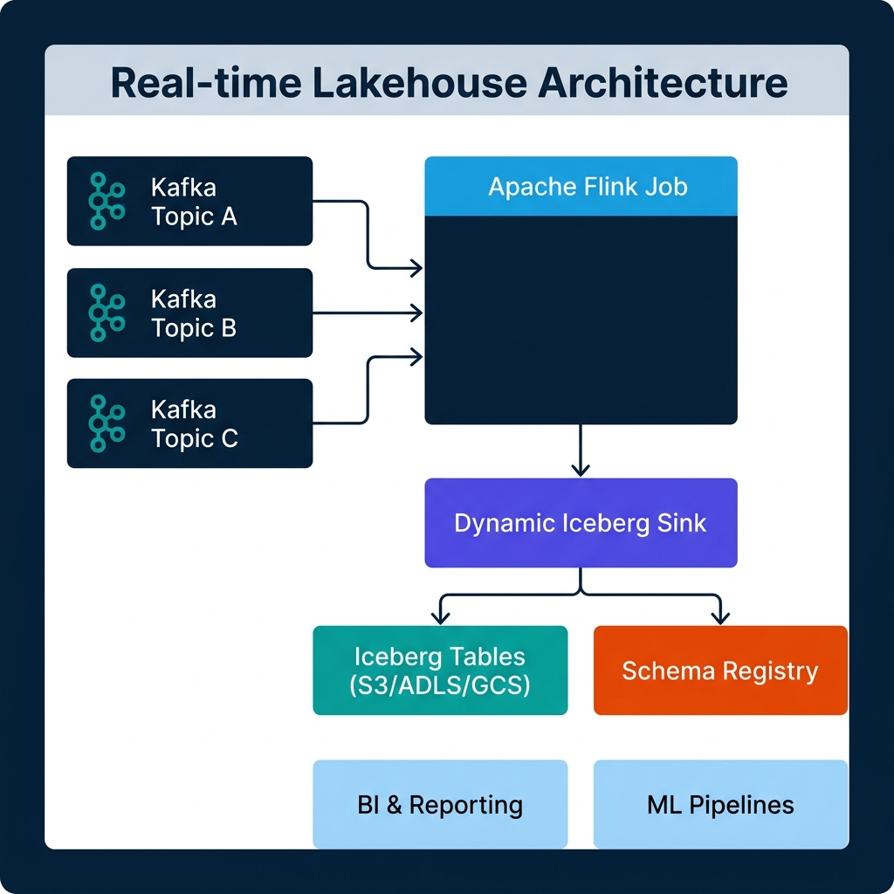
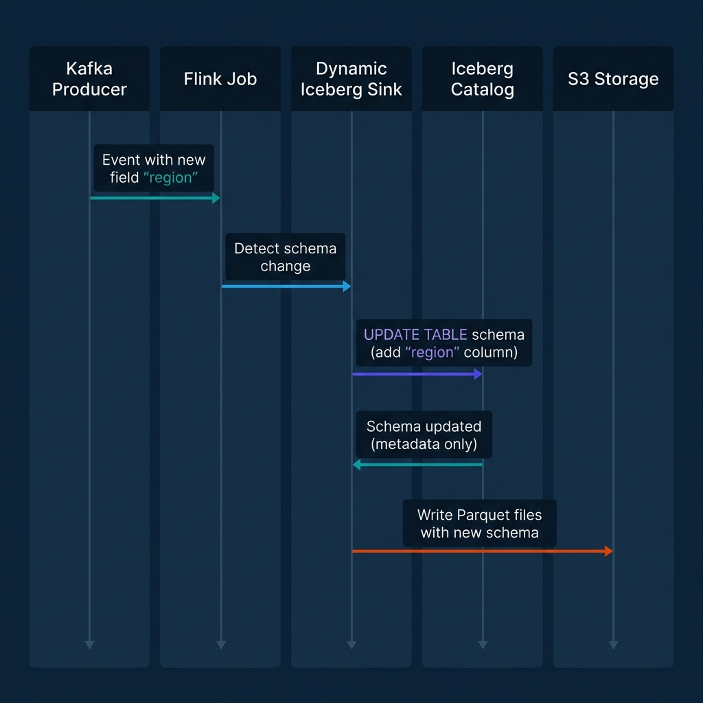
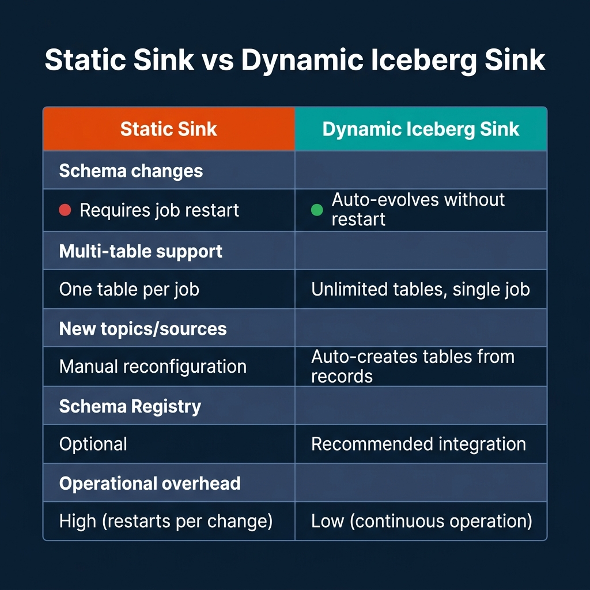

# Real-Time Lakehouse Patterns with Apache Flink and Iceberg

Most streaming pipelines solve the wrong problem. Teams spend months building infrastructure to move data fast, then discover their downstream lakehouse tables are a mess: thousands of tiny files per partition, schemas that drift silently across topics, and compaction jobs fighting live writes at 3 a.m. The ingestion is fast, but the data is barely usable.

Apache Flink 2.1, released in July 2025, explicitly frames itself as a unified real-time Data and AI platform. Paired with the Dynamic Iceberg Sink—which reached production-ready status with Apache Iceberg 1.10.0 support—you now have a concrete path to an architecture where Kafka topics land cleanly in Iceberg tables, schema changes never require a job restart, and a single Flink job can serve hundreds of tables simultaneously.

This post walks through how to actually build that architecture, including the configuration details teams usually skip and the failure modes nobody documents until something breaks in production.

---

## Why the Traditional Kafka-to-Lakehouse Pattern Breaks Down

The classic Kafka-to-lake pipeline works like this: a Kafka consumer reads from a topic, transforms the events, and writes Parquet files to S3. Simple, effective, and full of hidden costs.

The first problem is schema drift. Kafka producers add fields, rename values, and change types. If your consumer expects a fixed schema, it either crashes or silently drops new data. In the best case, your pipeline goes down. In the more common case, you get quiet data loss that doesn't surface until a report is wrong.

The second problem is file proliferation. Every Flink checkpoint commits a set of files. If your checkpoint interval is 60 seconds, you produce one set of files per minute. At a 128 MB target file size—the standard recommendation—you can handle that load. But if your data volume drops overnight, you're writing sub-megabyte files every minute. A week of low-traffic hours can leave a partition with thousands of small files that kill query performance.

The third problem is operational rigidity. A traditional Flink job defines its source topics and sink tables statically at job startup. Adding a new Kafka topic means modifying the job definition and restarting. For platforms with dozens of microservices publishing to Kafka, that constraint turns the streaming pipeline into a constant maintenance burden.

The Dynamic Iceberg Sink addresses all three.

---

## The Dynamic Iceberg Sink: How It Works

The Dynamic Iceberg Sink, supported in Flink 1.20, 2.0, and 2.1 with Apache Iceberg 1.10.0 or newer, removes the static contract between a Flink job and its downstream tables.

In a traditional Flink-to-Iceberg pipeline, the table schema is defined at job deployment time. If a new field appears in incoming Kafka events, the job has no mechanism to handle it. The field either gets dropped or the job fails on deserialization.

The Dynamic Sink adds three capabilities that change this:

**Automated schema evolution.** When the sink encounters a field in an incoming record that doesn't exist in the current Iceberg table schema, it calls the Iceberg catalog to add the new column. Because Iceberg stores its schema as metadata rather than embedded in the data files, this operation doesn't touch any existing Parquet files. The schema update is a metadata-only write to the catalog. Existing data continues to be readable; new files written after the update include the new field.

**Multi-table fan-out.** A single Dynamic Sink instance can write to an unlimited number of Iceberg tables simultaneously. The routing logic is defined in the incoming event records themselves. Your Kafka event includes a routing key—typically a topic name or entity type—and the sink maps that key to the appropriate Iceberg table. If a table doesn't exist yet, the sink creates it.

**Automatic table creation.** When the sink encounters a routing key that maps to a table that doesn't exist in the catalog, it creates the table on the fly using the schema inferred from the current record. This means onboarding a new Kafka topic requires zero changes to the Flink job.



---

## Setting Up the Pipeline: From Kafka to Iceberg

Here's a minimal working configuration using Flink SQL. This assumes Flink 2.1, the `flink-iceberg-runtime` JAR on the classpath, and a Kafka cluster with the Confluent Schema Registry running.

### Define the Kafka Source

```sql
-- Create a Kafka source table in Flink SQL
CREATE TABLE kafka_events (
  `topic`    STRING METADATA FROM 'topic' VIRTUAL,
  `payload`  STRING,
  `ts`       TIMESTAMP(3) METADATA FROM 'timestamp',
  WATERMARK FOR `ts` AS `ts` - INTERVAL '5' SECOND
) WITH (
  'connector'                  = 'kafka',
  'topic-pattern'              = 'events\\..*',
  'properties.bootstrap.servers' = 'kafka-broker:9092',
  'properties.group.id'        = 'flink-iceberg-ingestor',
  'scan.startup.mode'          = 'latest-offset',
  'format'                     = 'avro-confluent',
  'avro-confluent.schema-registry.url' = 'http://schema-registry:8081'
);
```

The `topic-pattern` parameter is key. This single source definition captures all topics matching the regular expression `events\..*`, which means adding a new topic like `events.user_signups` requires no changes to the job.

### Configure Checkpointing for Exactly-Once Delivery

Exactly-once semantics in Flink are a function of checkpointing, not a toggle you set on the Iceberg connector. The Iceberg sink participates in Flink's checkpointing protocol: when a Flink checkpoint completes, the Iceberg sink commits the data files written during that interval as a new Iceberg snapshot. If the job fails before a checkpoint completes, the uncommitted files are orphaned and the offset position rolls back to the last successful checkpoint.

```sql
-- Enable exactly-once checkpointing
SET 'execution.checkpointing.interval'            = '5min';
SET 'execution.checkpointing.mode'                = 'EXACTLY_ONCE';
SET 'execution.checkpointing.timeout'             = '10min';
SET 'state.backend'                               = 'rocksdb';
SET 'state.backend.incremental'                   = 'true';
```

Five minutes is a reasonable starting checkpoint interval for most production workloads. Shorter intervals produce more files per hour; longer intervals increase recovery time if the job fails. The tradeoff is latency versus operational stability.

### Configure the Dynamic Iceberg Sink

```sql
-- Write to Iceberg using the dynamic sink (DataStream API example)
FlinkSink.forRowData(inputStream)
    .tableLoader(TableLoader.fromCatalog(catalogLoader, TableIdentifier.of("default", "events_raw")))
    .upsertMode(false)
    .writeParallelism(8)
    .set("write.target-file-size-bytes", String.valueOf(128 * 1024 * 1024)) // 128 MB
    .set("write.distribution-mode", "hash")
    .append();
```

For the Dynamic Sink variant that auto-routes to multiple tables based on a routing field, the configuration is handled through `DynamicRecordWriter` in the Iceberg 1.10 DataStream API. The routing key must be present in each record and map to a valid Iceberg table identifier in your catalog.



---

## Schema Evolution Without Restarts

The sequence illustrated above shows what happens when a Kafka producer adds a new field, `region`, to an event that previously only had `user_id`, `event_type`, and `ts`.

In a static Flink pipeline, this silently drops the field or crashes the job depending on how the schema validation is configured. In a Dynamic Sink pipeline:

1. The Flink job receives the event and detects the new field during deserialization.
2. The Dynamic Sink calls the Iceberg catalog's `updateSchema()` API to add the `region` column as a nullable string.
3. Because Iceberg schema evolution is a metadata-only operation, no existing data files are rewritten. The catalog records the new column in the table metadata and associates it with a new schema ID.
4. The sink writes the current record—including the `region` field—to a new Parquet file using the updated schema.
5. All downstream readers (Spark, Trino, Dremio) that query the table see the new column for records where it exists. Historical records return NULL for the `region` column, which is correct behavior.

One important constraint: Iceberg only supports widening schema evolution, not narrowing. You can add columns, rename columns (with full compatibility tracking), and widen numeric types (e.g., `int` to `long`). You cannot drop columns via the Dynamic Sink's schema evolution path. Dropping a column requires an explicit catalog operation outside the streaming job.

---

## Operational Patterns: Static Sink vs. Dynamic Iceberg Sink



The operational differences become most pronounced at scale. A platform with 50 microservices publishing to 50 Kafka topics, where each topic's schema evolves independently, requires 50 static Flink jobs under the traditional model. Adding a field to one schema means deploying a code change and restarting a job. With the Dynamic Sink, one Flink job handles all 50 topics, and schema evolution happens without any operator intervention.

The tradeoff is schema control. With static sinks, your Flink job's schema definition acts as a contract enforcement layer. Any event that doesn't match the expected schema fails fast and loud. The Dynamic Sink's auto-evolution makes this boundary more permissive. You trade strict contract enforcement for operational flexibility.

For most production teams, the right answer is to combine the Dynamic Sink with Confluent Schema Registry compatibility rules. Set the Schema Registry to `FULL_TRANSITIVE` compatibility on your topics, which ensures producers can only make backward-compatible schema changes. The Dynamic Sink then handles the Iceberg-side evolution automatically, while the Schema Registry enforces that producers don't break downstream consumers.

---

## Managing Small Files from Streaming Writes

Every Flink checkpoint produces at least one data file per active partition. With a 5-minute checkpoint interval and data spread across 20 partitions, you produce at least 20 files every 5 minutes. Over 24 hours, that's 5,760 small files per day before any other workload pressure.

The files don't need to be large to cause problems. Query planners read manifest files to build execution plans, and each manifest entry is a file reference. Scanning thousands of manifest entries before reading a single data row degrades planning performance, even when the data itself is small.

There are two approaches to controlling this, and you need both.

**At write time: tune file sizing and writer parallelism.** Set `write.target-file-size-bytes` to 128 MB or higher. Use `write.distribution-mode = hash` to route records within each Flink task by partition key before writing, which ensures each task fills larger files rather than writing many small, scattered ones.

**After landing: use Flink native table maintenance.** Starting with Iceberg 1.7, the `flink-iceberg-runtime` JAR includes built-in table maintenance actions that run inside a Flink job. This eliminates the dependency on a separate Spark cluster for compaction.

```java
// Run Iceberg compaction natively inside a Flink job
TableLoader loader = TableLoader.fromCatalog(catalogLoader,
    TableIdentifier.of("default", "events_raw"));

RewriteDataFilesSparkAction rewrite = SparkActions
    .get()
    .rewriteDataFiles(table)
    .option("target-file-size-bytes", Long.toString(128L * 1024 * 1024))
    .filter(Expressions.lessThan("ts", currentHourMinus2()));

RewriteDataFilesSparkAction.Result result = rewrite.execute();
```

A critical operational rule: never compact the hot partition currently receiving streaming writes. The compaction job reads a set of files, rewrites them into larger files, and commits a new snapshot that removes the original files. If your streaming job is concurrently writing to that same partition, the commit can conflict. Restrict compaction to cold partitions—those at least one or two intervals behind the current streaming boundary.

---

## When Flink Is the Right Choice (and When It Isn't)

Flink is the right tool when you need stateful stream processing, not just event delivery. Joining a stream of user events to a slowly changing dimension table, computing windowed aggregations, or running real-time model inference in `ML_PREDICT` table-valued functions—these require Flink's managed state, event-time handling, and exactly-once guarantees.

If your use case is straightforward topic-to-table ingestion with no joins or transformations, Flink may be more infrastructure than you need. Kafka Connect with the Iceberg Sink connector handles simple ingestion with less operational overhead, though it lacks Flink's transformation capabilities and the full Dynamic Sink feature set.

Where Flink's real-time lakehouse pattern becomes clearly superior is in multi-source, multi-table scenarios with evolving schemas. If you're ingesting 50 Kafka topics, performing lightweight enrichment from reference tables, and landing data into 50 Iceberg tables where new fields appear regularly—that's Flink's strongest use case and where the Dynamic Sink's automation provides direct operational savings.

---

## Conclusion

The real-time lakehouse is not a marketing concept. It's a specific set of architectural decisions: Flink for stateful stream processing, the Dynamic Iceberg Sink for zero-downtime schema evolution and multi-table ingestion, exactly-once checkpointing for delivery guarantees, and native Flink table maintenance for compaction on cold partitions.

Start with a checkpoint interval of 5 minutes, set your target file size to 128 MB, configure Schema Registry with full transitive compatibility, and don't compact the hot partition. Those four decisions alone will prevent most of the operational problems that make streaming lakehouses painful to run.

---

### Build on the Lakehouse

To go deeper on lakehouse architecture patterns, open table formats, and real-time data platforms, pick up [The 2026 Guide to Lakehouses, Apache Iceberg and Agentic AI: A Hands-On Practitioner's Guide to Modern Data Architecture, Open Table Formats, and Agentic AI](https://www.amazon.com/dp/B0GQNY21TD) for a comprehensive, hands-on treatment of these patterns in production environments.

Browse Alex's other data engineering and analytics books at [books.alexmerced.com](https://books.alexmerced.com).

If you want to query your Iceberg tables with sub-second performance after they land from Flink, try Dremio Cloud free for 30 days at [dremio.com/get-started](https://www.dremio.com/get-started).
