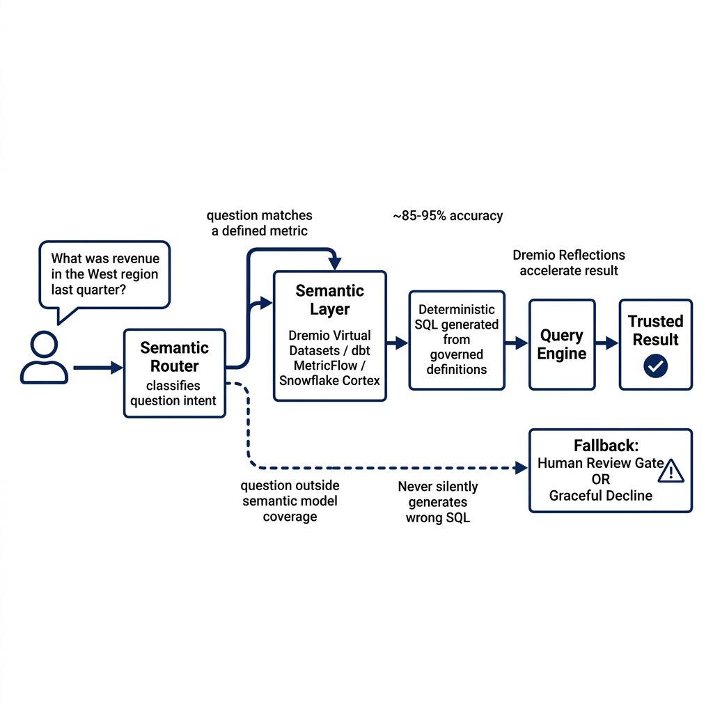
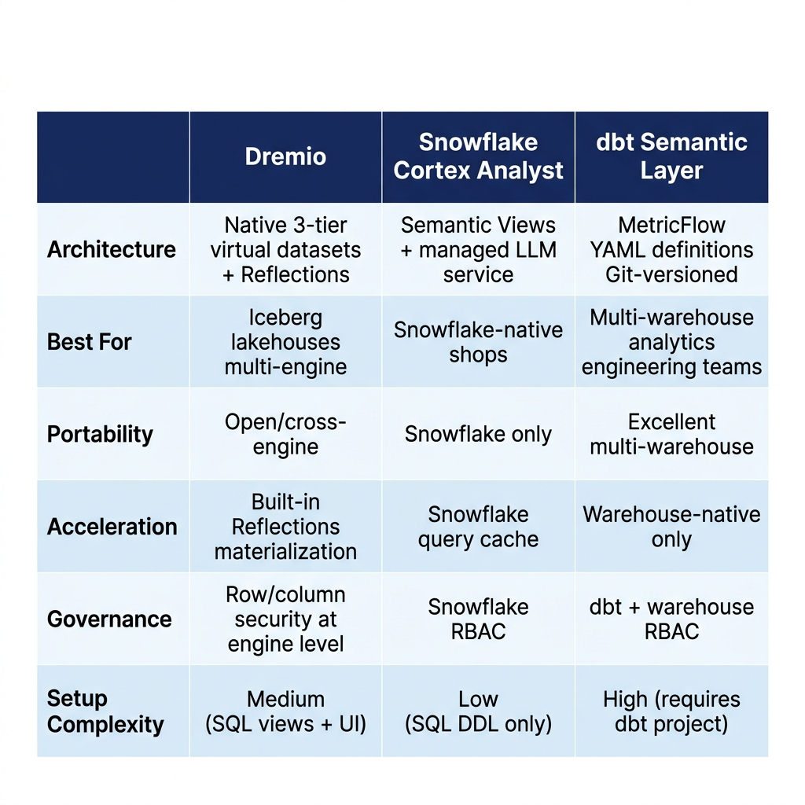

# Why Semantic Layers Make Enterprise Text-to-SQL Safer

Text-to-SQL generated serious excitement when early demonstrations showed AI assistants turning plain English into working SQL. It also generated serious skepticism from the analytics engineers who knew what those SQL queries were actually running against: messy schemas with inconsistent column naming, duplicate business logic spread across dozens of views, and metric definitions that varied by team.

Raw text-to-SQL, meaning a large language model receiving a database schema and a question and generating SQL directly, produces accurate results on toy datasets and embarrassing results on enterprise schemas. Accuracy rates around 40% on real-world enterprise schemas have been reported across several industry evaluations. That's below the threshold where any responsible team deploys it to business users.

The semantic layer changes this calculation. When the AI generates SQL against a well-maintained semantic model—where metrics like revenue and churn rate are precisely defined, dimensions are mapped, and synonyms are registered—accuracy climbs to 85–95% in multiple enterprise deployments. The difference isn't a better LLM. It's better context.

This post covers how four different approaches to semantic layers enable reliable enterprise text-to-SQL: Dremio's natively integrated virtual dataset and reflections architecture, Snowflake Cortex Analyst with Semantic Views, the dbt Semantic Layer powered by MetricFlow, and how to choose between them.

---

## Why Raw Text-to-SQL Fails in Enterprise Environments

Enterprise data warehouses are built by humans over years. Column names like `ord_amt`, `revenue_adj`, and `net_rev_usd` might all represent variations of the same underlying concept in different tables, each adjusted for a different business rule. An LLM given raw schema DDL has no way to know which one to use for "total revenue by region last quarter" without additional context.

Business logic is usually embedded in SQL transformations, not schema definitions. `daily_active_users` might require a specific session window, a deduplication step, and an exclusion of internal traffic. None of that is visible from `SELECT * FROM users LIMIT 100`.

There's also the terminology problem. A sales team's "customer" might join against `accounts` in Salesforce sync data, while a support team's "customer" joins against `users` in the product database. An LLM generating SQL against ambiguous schema names has no reliable way to distinguish these without documentation it doesn't have.

Finally, most large enterprise schemas contain hundreds or thousands of tables. An LLM prompted with an entire schema doesn't have a useful understanding of which tables matter for which business questions—it's working with a phone book when it needs a guided directory.

---

## The Semantic Layer: Structured Context for AI

A semantic layer provides the translation layer between business concepts and database tables. At minimum it defines:

- **Metrics**: Precisely computed business measures with their SQL definitions, filters, and aggregation logic
- **Dimensions**: The attributes business users slice and filter by, with human-readable labels
- **Joins**: How tables relate to each other for cross-entity queries
- **Synonyms**: Alternative names business users might say for the same concept
- **Business descriptions**: Documentation that explains what each metric measures and how it's calculated

When text-to-SQL is routed through a semantic layer, the AI doesn't generate SQL against raw schema—it generates SQL against a governed vocabulary of pre-defined metrics and dimensions. The generated SQL is guaranteed to use the correct table joins, the correct filters, and the correct aggregation logic because those definitions exist in the semantic model, not in the AI's general knowledge.



The routing architecture works like this: a user submits a natural language question. A semantic router classifies the intent and determines whether the question can be answered using a defined metric or dimension from the semantic model. If yes, the question is routed to the semantic layer, which generates deterministic SQL using the metric definition. If no—the question is outside the semantic model's coverage—the system either falls back to raw text-to-SQL with human review gates, or returns a message asking the user to rephrase.

This routing discipline is what makes the accuracy improvement so dramatic. Questions within the semantic model's coverage are answered deterministically—the SQL is generated from governed metric definitions, not LLM inference. Questions outside coverage either have a human review checkpoint or are declined gracefully. The system never silently generates plausible-but-wrong SQL from raw schema and serves it as a trusted answer.

---

## Dremio: Semantic Layer Natively Integrated with the Query Engine

Dremio takes a different architectural approach from standalone semantic layer tools. Instead of a separate service that sits between BI tools and a warehouse, Dremio's semantic layer is natively integrated into the query engine and catalog. This integration enables capabilities that are difficult to achieve with add-on semantic layers.

The core of Dremio's semantic modeling is a three-tier virtual dataset architecture:

**Preparation Layer:** A 1-to-1 mapping to source tables. These views handle cleansing, type casting, column renaming, and normalization. No business logic lives here—just the transformations needed to make raw data consistent and usable.

**Business Layer:** Where business logic and metric definitions live. Joins between entities, calculated metrics, and approved business definitions are encoded here. This is the layer an LLM or BI tool should be reasoning about when answering business questions.

**Application Layer:** Tailored views optimized for specific consumers—a BI dashboard, an AI agent, a data science notebook. These views are narrow, purpose-built, and carry the precise definitions their consumers need.

This layering creates a stable semantic surface that AI tools, BI dashboards, and data science notebooks all consume from the same governed definitions. A metric defined in the business layer propagates to all consumers automatically.


### Reflections: Performance Without Data Movement

Dremio's Reflections feature adds an acceleration dimension that most semantic layers can't match. A Reflection is a materialized, optimized view of a dataset or aggregation that Dremio maintains automatically. When a query hits a dataset covered by a Reflection, Dremio transparently rewrites the query to use the optimized materialization instead of re-running the raw join and aggregation logic.

For text-to-SQL use cases, this means the semantic layer isn't just providing correct context—it's also providing fast results. When an AI assistant routes a natural language question through Dremio's semantic model, the resulting SQL benefits from Reflection-based acceleration without requiring the AI to know anything about the underlying physical optimization.

```sql
-- Create an aggregation reflection for revenue analytics—This materializes the join and aggregation, accelerating downstream text-to-SQL
ALTER DATASET "business_layer"."revenue_analytics"
CREATE AGGREGATE REFLECTION "revenue_daily_agg"
USING DISPLAY (region, product_category)
DIMENSIONS (region, product_category, order_date)
MEASURES (total_revenue BY SUM, order_count BY COUNT);
```

Dremio analyzes query patterns and recommends Reflections automatically. The system then rewrites incoming queries to use the appropriate Reflection, delivering sub-second responses on queries that would otherwise require expensive multi-table joins.

### Generative AI Integration: Automatic Metadata Generation

Dremio has integrated generative AI directly into its semantic layer metadata management. The system can automatically generate wikis, labels, and descriptions for tables and virtual datasets, making data more discoverable without requiring manual documentation efforts.

For text-to-SQL accuracy, this automatic metadata generation directly improves the context available to AI models. When column descriptions, business definitions, and usage notes are automatically maintained and up-to-date, the AI has richer, more accurate context to draw from when generating SQL.

Natural language discovery—finding datasets by describing what you're looking for in plain English rather than knowing specific table names—further extends the semantic layer's value. A business analyst who doesn't know that revenue data lives in `fct_orders` can describe "I need revenue by customer segment for Q1" and Dremio's catalog surfaces the appropriate dataset automatically.

### Governed Access Through the Semantic Layer

Dremio's semantic layer includes built-in fine-grained access control. Row-level security and column masking policies apply through the virtual dataset layer—which means business users querying a "Revenue by Region" dataset automatically see only the regions they're authorized for, without requiring the AI or the BI tool to implement access filtering.

This is architecturally significant for AI use cases. When an LLM generates SQL against a Dremio virtual dataset that has row-level security configured, the row filter is enforced at execution time by the query engine. The AI doesn't need to know about access policies—they're invisible to the query generation layer but always enforced.

---

## Snowflake Cortex Analyst

Snowflake Cortex Analyst is Snowflake's native managed text-to-SQL service. It's designed to work with Snowflake Semantic Views—objects defined in Snowflake's metadata layer that describe metrics, measures, and dimension relationships.

```sql
-- Define a Snowflake Semantic View for revenue analytics
CREATE OR REPLACE SEMANTIC VIEW revenue_analytics AS
    SELECT
        o.order_date,
        c.region,
        SUM(o.amount) AS total_revenue,
        COUNT(DISTINCT o.customer_id) AS unique_customers
    FROM orders o
    JOIN customers c ON o.customer_id = c.id
    WHERE o.status = 'completed'
    GROUP BY 1, 2;—Annotate with semantic metadata
COMMENT ON SEMANTIC VIEW revenue_analytics IS 
    'Daily revenue by region for completed orders';
```

Cortex Analyst uses the semantic view definitions to constrain its SQL generation. A user asking "what was revenue in the west region last week?" generates a SQL query against the pre-defined `total_revenue` metric with the `region` and `order_date` filters applied correctly—not an ad-hoc query that might join the wrong tables.

The Cortex Analyst API returns both the SQL it generated and the underlying semantic view it used, providing full transparency about the query generation process. This auditability matters for enterprise deployments where understanding why a query was generated a certain way is as important as the result.

Cortex Analyst is Snowflake-specific. The accuracy advantages it provides apply within Snowflake environments, and the semantic views cannot be ported to Databricks, BigQuery, or other engines.

---

## dbt Semantic Layer and MetricFlow

The dbt Semantic Layer, powered by MetricFlow, takes a different architectural approach. Metrics are defined in YAML files in a dbt project, versioned in Git alongside the SQL models that provide the underlying data.

```yaml
# metrics/revenue.yml
semantic_models:
  - name: orders
    defaults:
      agg_time_dimension: order_date
    model: ref('fct_orders')
    entities:
      - name: order
        type: primary
        expr: order_id
      - name: customer
        type: foreign
        expr: customer_id
    measures:
      - name: total_revenue
        agg: sum
        expr: amount
        filter: "status = 'completed'"
    dimensions:
      - name: region
        type: categorical
        expr: region
      - name: order_date
        type: time
        type_params:
          time_granularity: day

metrics:
  - name: revenue
    type: simple
    type_params:
      measure: total_revenue
    label: "Total Revenue"
    description: "Sum of completed order amounts"
```

Because the metric definitions are code in a Git repository, they go through the same review processes as SQL models. Changes to metric definitions are auditable. Teams can see the history of how a metric definition evolved and who approved each change.

The dbt Semantic Layer operates as a service that sits between BI tools and the data warehouse. Tableau, Power BI, Hex, and other supported BI tools query the semantic layer using the MetricFlow API, which translates the metric requests into warehouse-native SQL. AI tools that integrate with dbt's API can use the same metric definitions for text-to-SQL generation.

The key advantage of the dbt approach is portability. The same metric YAML definitions work against Snowflake, BigQuery, Databricks, Redshift, and other supported warehouses. Organizations that want to run multi-warehouse experiments or migrate between warehouses carry their metric definitions with them in the same Git repository.

The limitation is coupling to the dbt ecosystem. Teams that don't use dbt for transformation logic face a significant setup cost to build out dbt models as the foundation for semantic model definitions.

---

## Building the Synonym and Description Library

Regardless of which semantic layer tool you use, the investment in synonym and description management is what separates good text-to-SQL implementations from great ones.

Business users don't ask questions in schema language. They ask:
- "How many customers" (not "COUNT DISTINCT customer_id")
- "Revenue" (not "SUM(amount) WHERE status = 'completed'")
- "Last month" (not "WHERE order_date >= DATE_TRUNC('month', CURRENT_DATE - INTERVAL 1 MONTH)")

A semantic layer that only maps technical terms to metric definitions still requires users to know the technical vocabulary. One with a rich synonym library handles the natural language variation users actually produce.

In Dremio, synonyms and business descriptions are maintained alongside virtual dataset definitions in the catalog. In dbt, descriptions are YAML metadata fields. In Snowflake, semantic view annotations and Cortex-specific metadata files provide the synonym mapping.

Practical synonym management requires a feedback loop: when text-to-SQL questions fail to route correctly, the routing failures are logged, reviewed, and used to add new synonyms. Teams that treat synonym management as a one-time setup task see accuracy plateau. Teams that maintain a feedback loop see accuracy improve over time as the semantic model's vocabulary coverage expands.

---

## Choosing Between Dremio, Snowflake Cortex Analyst, and dbt



The choice between semantic layer approaches comes down to four factors:

**Platform coupling:** If your analytics platform is Snowflake-native, Cortex Analyst provides the lowest-friction path with no external service dependencies. If you're multi-cloud or plan to stay engine-agnostic, dbt Semantic Layer or Dremio's virtual dataset approach provide more portability.

**Lakehouse architecture:** If you're building on Apache Iceberg in a cloud object store and want cross-engine query access with built-in acceleration, Dremio's integrated semantic layer is purpose-built for this. The Reflections system provides a materialization strategy that serves both BI and AI query workloads without requiring a separate caching layer.

**Governance requirements:** Dremio's native integration with its query engine means access control policies apply at the semantic layer and propagate to all query paths—SQL, BI, and AI-generated. This reduces the surface area where access policies can be bypassed.

**Team skills:** dbt Semantic Layer requires analytics engineering investment in YAML metric definitions and model maintenance. Snowflake Cortex Analyst requires SQL DDL for semantic views. Dremio's virtual dataset approach requires SQL-based view building but benefits from a guided UI and AI-assisted metadata generation.

---

## The AI Reliability Improvement in Practice

The jump from 40% to 85–95% accuracy on enterprise text-to-SQL questions doesn't come uniformly. Accuracy improvements are sharpest on:

1. Questions about standard business metrics (revenue, churn, DAU) that are fully defined in the semantic model
2. Questions involving time period filters ("last quarter", "year to date") that the semantic layer maps to correct date expressions
3. Questions that join entities that the semantic model has pre-defined relationships for

Accuracy improvements are smallest on:

1. Questions requiring logic not captured in the semantic model
2. Questions that span multiple domains without pre-defined cross-domain joins
3. Complex analytical questions requiring window functions or advanced SQL that the semantic layer doesn't expose

This is why semantic model coverage expansion is an ongoing practice, not a one-time project. Each category of unanswered questions represents an opportunity to extend the semantic model's coverage and push accuracy higher.

---

## Conclusion

Text-to-SQL without a semantic layer is an interesting demo. Text-to-SQL grounded in a well-maintained semantic model is an enterprise capability. The jump from 40% to 85–95% accuracy isn't free—it requires investment in defining metrics, maintaining synonyms, and extending semantic model coverage as the business evolves. But that investment is far lower than the alternative: building and maintaining approval workflows for every AI-generated SQL query that analytics users need reviewed before acting on.

Dremio's integrated approach—native semantic layer, automatic Reflection acceleration, AI-assisted metadata generation, and cross-engine governance—offers a particularly compelling path for organizations building on Iceberg lakehouses. For Snowflake-native shops, Cortex Analyst provides managed text-to-SQL without infrastructure overhead. For multi-warehouse environments with analytics engineering teams, dbt Semantic Layer provides the best portability and code-first governance.

The semantic layer turns AI-generated analytics from a liability into a controlled surface. That's the version enterprise teams can actually trust.

---

### Go Deeper on Data Reliability

For comprehensive guidance on building reliable, governed data architectures, pick up [The 2026 Guide to Lakehouses, Apache Iceberg and Agentic AI: A Hands-On Practitioner's Guide to Modern Data Architecture, Open Table Formats, and Agentic AI](https://www.amazon.com/dp/B0GQNY21TD).

Browse Alex's other data engineering and analytics books at [books.alexmerced.com](https://books.alexmerced.com).

Dremio's natively integrated semantic layer, with AI-assisted metadata generation, Reflections acceleration, and fine-grained access control, makes it the ideal foundation for trusted enterprise text-to-SQL and AI analytics. Try Dremio Cloud free at [dremio.com/get-started](https://www.dremio.com/get-started).
