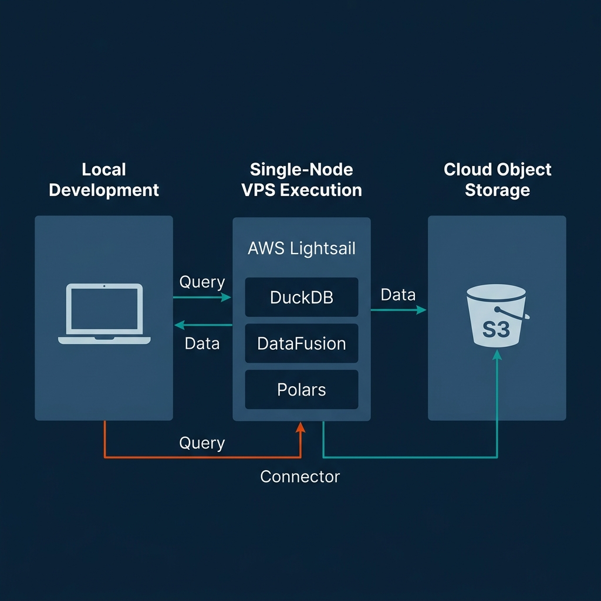
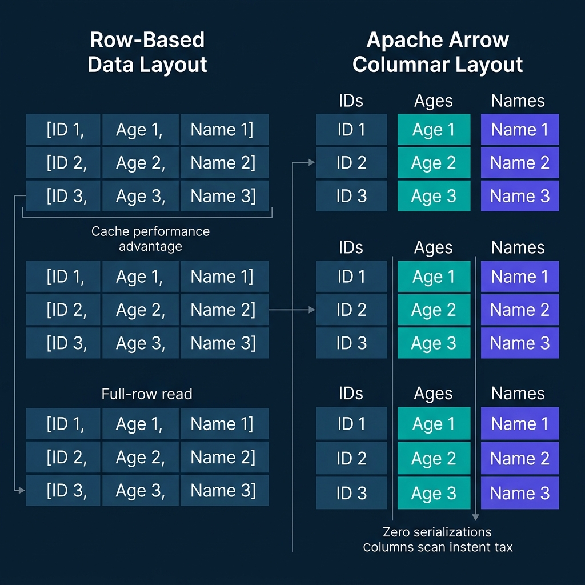
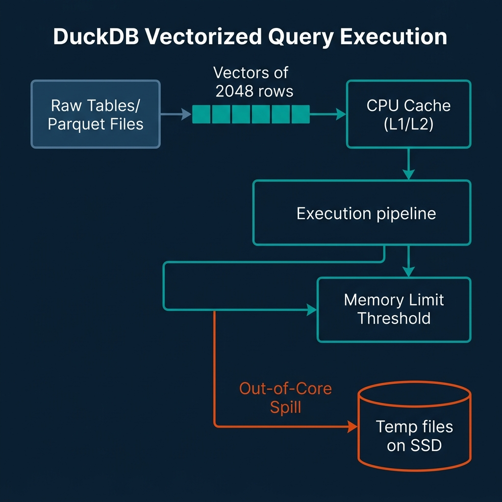
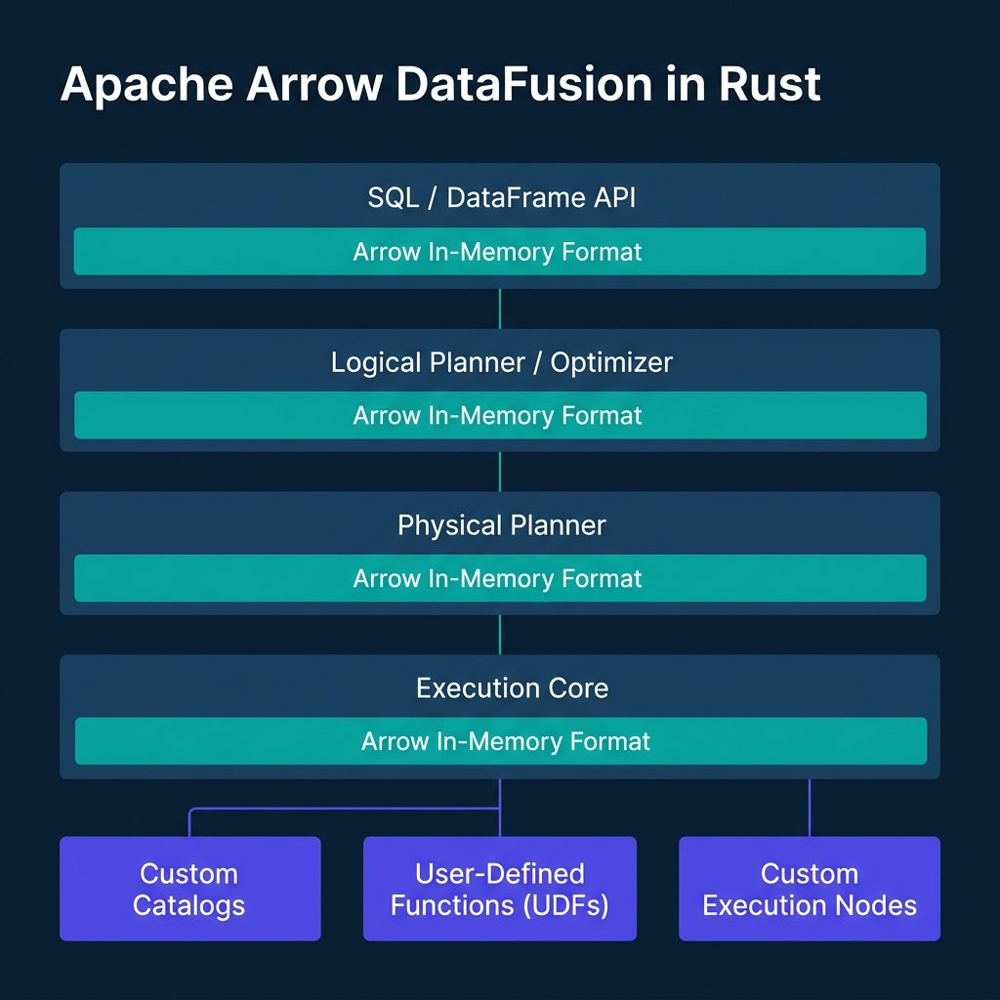
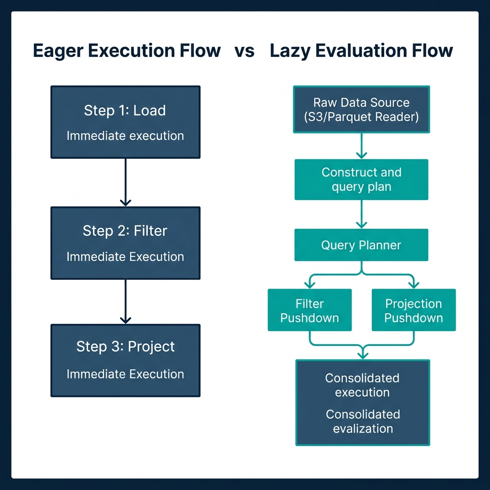
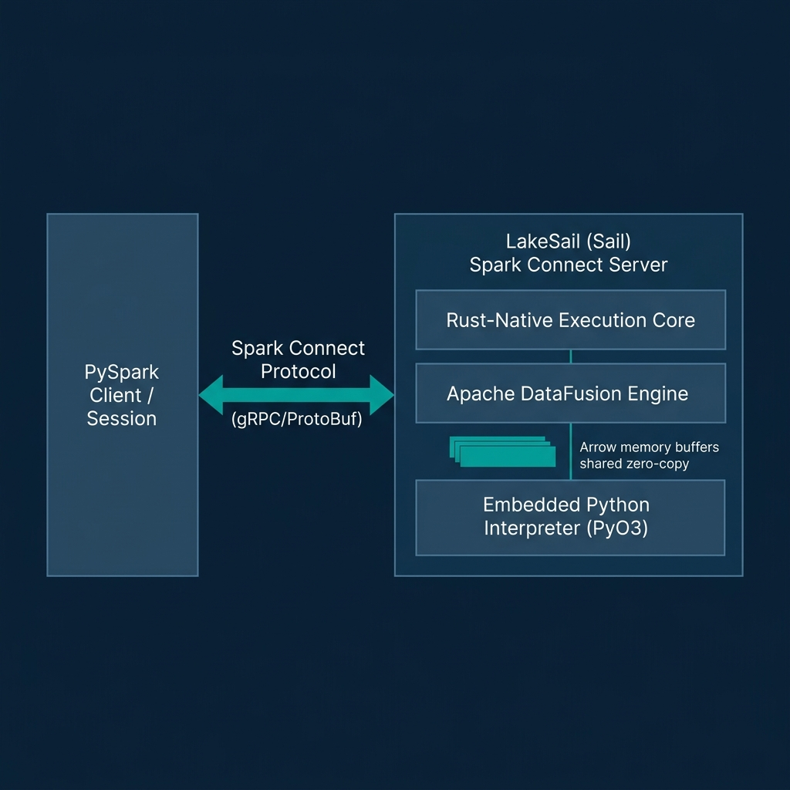
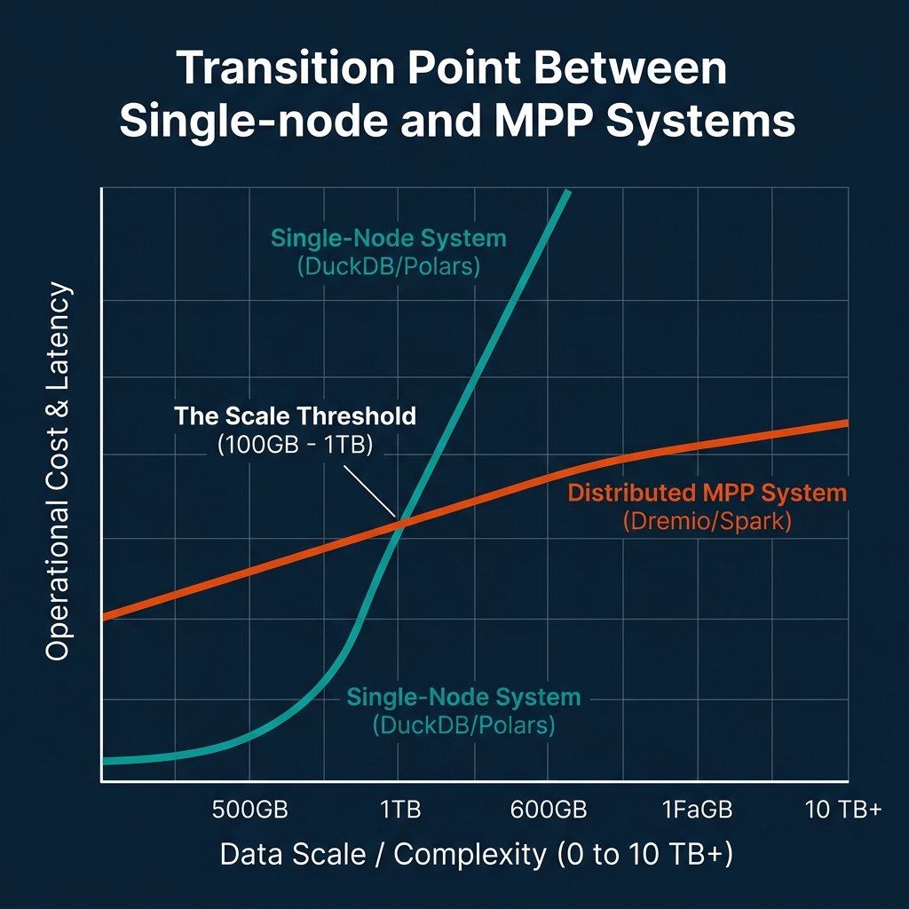
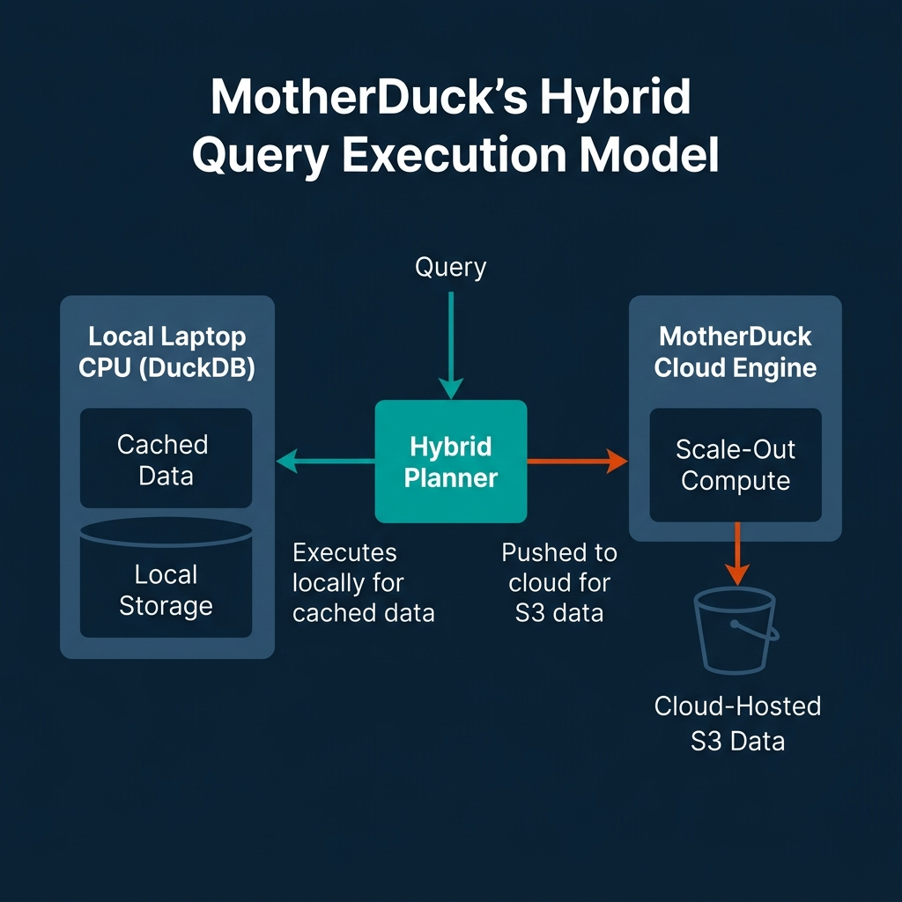
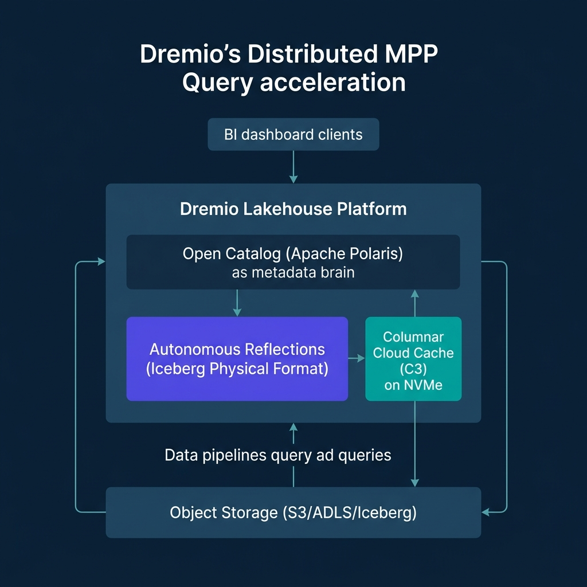
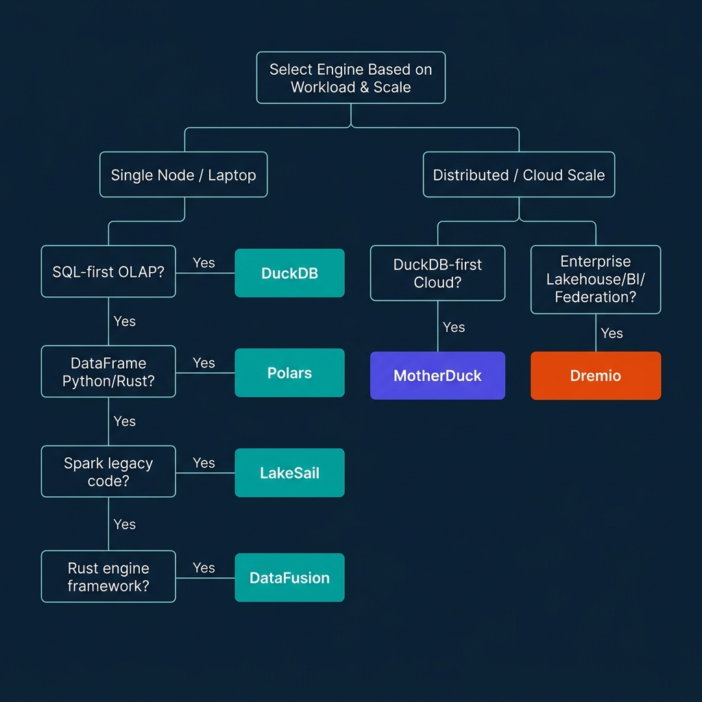

# Single-Node Data Engineering: DuckDB, DataFusion, Polars, and LakeSail

For the past decade, data engineering was synonymous with distributed clusters. If your dataset exceeded a few gigabytes, standard practice dictated spinning up an Apache Spark cluster on AWS EMR or Databricks. This distributed paradigm introduced massive operational complexity: managing JVM configurations, allocating executors, tuning shuffle partitions, and paying a substantial "serialization tax" to move data across network sockets and language runtimes. 

Recently, the data engineering landscape has experienced a single-node renaissance. Rather than scaling out to distributed clusters, teams are scaling up on single machines. Modern laptops ship with 12 or more CPU cores, fast NVMe SSDs capable of multi-gigabyte-per-second read throughput, and up to 128 GB of RAM. Cloud providers offer single virtual machines with hundreds of cores and terabytes of memory for a fraction of the cost of a Kubernetes or Spark cluster.

This physical hardware evolution is only half the story. The true catalyst is a new generation of data technologies built on Apache Arrow, vectorized execution, and out-of-core memory management. Tools like DuckDB, Apache Arrow DataFusion, Polars, and LakeSail enable a single laptop or VM to process hundreds of gigabytes (and even terabytes) of data. You can now execute complex analytical pipelines locally or on a single node without the overhead of a distributed JVM runtime.



---

## The Core Foundations: Columnar Memory and Apache Arrow

To understand how single-node data engineering can process datasets that previously required hundreds of cluster nodes, you must look at how data is structured in memory.

Traditional databases and processing runtimes designed for transactional workloads (OLTP) use row-oriented layouts. They store all fields of a single record contiguously in memory: `[User_ID, Age, Name]`, followed by the next record. When executing analytical queries (OLAP) that only target a subset of columns (such as calculating the average age of users), a row-oriented engine must scan the entire record structure from memory. This process loads irrelevant data (like names and IDs) into the CPU's L1/L2 caches, leading to cache pollution and wasted memory bandwidth.

Columnar query engines solve this inefficiency by storing data contiguously by column: `[Age, Age, Age]` in one buffer, and `[Name, Name, Name]` in another. The CPU only reads the specific columns required by the query. 

```
Row-Oriented Layout (OLTP):
┌──────────────────────────────┬──────────────────────────────┐
│ ID 1 │ Age 1 │ Name 1        │ ID 2 │ Age 2 │ Name 2        │
└──────────────────────────────┴──────────────────────────────┘

Columnar Layout (Arrow/OLAP):
┌──────────┬──────────┐ ┌──────────┬──────────┐ ┌──────────┬──────────┐
│ ID 1     │ ID 2     │ │ Age 1    │ Age 2    │ │ Name 1   │ Name 2   │
└──────────┴──────────┘ └──────────┴──────────┘ └──────────┴──────────┘
```

Apache Arrow standardizes this columnar memory layout. It defines an open-source, language-independent specification for in-memory columnar data. By establishing a shared memory format, Arrow eliminates the serialization tax that historically slowed down data pipelines. 

In traditional architectures, passing data between a Python script and a Java or C++ engine required serializing the data into a byte stream (like JSON or Protobuf) and deserializing it on the other side. This serialization tax frequently consumed up to 80% of the total query execution time. 

Arrow enables zero-copy Inter-Process Communication (IPC). Because Arrow represents data in memory exactly the same way across Python, Rust, and C++, different processes can memory-map (mmap) the same physical memory buffers. An engine can pass a dataset to Python for machine learning or visualization by exchanging memory pointers. No bytes are copied, and no serialization occurs.

Additionally, Arrow's contiguous memory alignment matches the layout of modern CPU cache lines, making it straightforward to utilize Single Instruction, Multiple Data (SIMD) instruction sets (such as AVX-512 on Intel/AMD or Neon on ARM). SIMD allows the CPU to apply a single instruction (such as a filter comparison or an arithmetic addition) to a vector of data points in a single clock cycle. This hardware-level parallelism turns data processing from a memory-bound or CPU-bound bottleneck into an efficient operation running directly on the processor.



---

## In-Process SQL Powerhouse: DuckDB Architecture & Features

DuckDB has become the standard database engine for single-node SQL analytics. Designed as an in-process analytical database, DuckDB runs directly inside the host process (such as a Python interpreter or a CLI binary) rather than as a separate server daemon. This eliminates the network socket latency and IPC overhead of client-server databases like PostgreSQL or Snowflake.

DuckDB's execution engine utilizes a vectorized query execution model. Rather than processing data one row at a time (the Volcano iterator model) or processing entire columns at once (which overflows L1/L2 caches for large tables), DuckDB processes data in small, cache-friendly vectors. These vectors typically contain 2048 elements. 

```
Volcano Model:       [Row 1] ──► [Operator] ──► [Row 2] ──► [Operator]
Column-at-a-time:    [Entire Column (10M rows)] ──► [Operator] (Overflows Cache)
Vectorized Model:    [Vector of 2048 rows] ──► [L1/L2 CPU Cache] ──► [Operator]
```

By keeping these vectors small enough to fit inside the CPU's L1/L2 cache, DuckDB minimizes memory bandwidth bottlenecks. The CPU executes operations on the vectors using SIMD instructions, keeping the execution pipelines saturated with data.

To handle datasets that exceed physical RAM, DuckDB implements out-of-core execution. When memory consumption reaches a user-defined limit, DuckDB's buffer manager automatically spills intermediate query states (such as hash join tables, sorting buffers, or aggregation states) to temporary disk files. This spilling mechanism uses a block-based buffer pool that page-faults data to disk, allowing you to run queries on datasets that are multiple times larger than your system's RAM.

In the latest v1.5.3 release (May 2026), DuckDB has introduced several updates that expand its single-node utility:

*   **Quack Remote Protocol:** DuckDB now ships with a core extension implementing the Quack protocol. This protocol allows users to run DuckDB in a client-server configuration when needed, facilitating remote attachments and remote query orchestration without losing the simplicity of the engine.
*   **Ecosystem and Format Updates:** The Iceberg extension has been upgraded to support `MERGE INTO` operations, making it possible to execute complex delta updates on Iceberg tables directly from a local DuckDB session.
*   **AWS Security and IRSA:** Native support for IAM Roles for Service Accounts (IRSA) has been added, simplifying secure S3 access when running DuckDB inside containerized single-node pipelines.
*   **Static Linking:** The distribution now statically links `jemalloc` on Linux platforms, improving memory allocation speed and reducing fragmentation during heavy out-of-core spilling.

The following Python script illustrates how to configure DuckDB's memory limits, register an S3 credential using the new AWS extension features, and run a query that spills to disk:

```python
import duckdb

# Initialize DuckDB connection
con = duckdb.connect(database='local_cache.db')

# Set memory limit to force out-of-core spilling on smaller datasets
con.execute("SET max_memory='8GB';")
con.execute("SET temp_directory='./duckdb_temp';")

# Load S3 and AWS extensions (built-in in v1.5.3)
con.execute("INSTALL aws;")
con.execute("LOAD aws;")

# Autodetect AWS credentials from environment (supports IRSA)
con.execute("CALL load_aws_credentials();")

# Query a large Parquet dataset directly on S3 with predicate pushdown
# DuckDB only downloads the columns and row groups that match the filter
query = """
    SELECT 
        user_id, 
        COUNT(event_id) as event_count,
        AVG(session_duration) as avg_duration
    FROM read_parquet('s3://my-lakehouse/bronze/events/**/*.parquet')
    WHERE event_date >= '2026-01-01'
    GROUP BY user_id
    HAVING event_count > 1000
    ORDER BY avg_duration DESC
"""

# Execute and stream results
result = con.execute(query).fetchdf()
print(result.head())
```

DuckDB's combination of SQL support, vectorized performance, and out-of-core stability makes it a core tool for local analytical workloads.



---

## Extensible Rust Processing: Apache Arrow DataFusion

While DuckDB is packaged as an analytical database, Apache Arrow DataFusion is designed as an extensible query engine framework. Written in Rust and utilizing Apache Arrow as its native memory format, DataFusion is widely used to build other databases, query engines, and custom data platforms (including Bauplan, Spice.ai, and LakeSail).

DataFusion's design is modular. It decouples the query planning, optimization, and execution stages. If you are building a custom data tool, you can register custom catalogs, write user-defined logical optimization rules (like custom predicate pushdowns), or plug in custom physical execution nodes.

For thread-level parallelism, DataFusion utilizes Rust's asynchronous Tokio runtime. Rather than pinning execution to a fixed number of threads, DataFusion distributes physical plan fragments (represented as asynchronous streams of Arrow `RecordBatch` objects) across a Tokio worker thread pool. This allows the engine to adapt to multi-core architectures and avoid thread contention under heavy I/O loads.

In the recent v53.x and v54.x releases (early-to-mid 2026), the DataFusion community has introduced several optimizations:

*   **Datetime Predicate Preimages:** DataFusion now optimizes queries containing datetime functions (like `date_trunc` and `date_part`) by evaluating their mathematical "preimages." Instead of executing the datetime function on every row, the optimizer rewrites the filter predicate against the raw partition bounds, enabling partition pruning.
*   **Sort Pushdown Phase 2:** The engine now sorts file groups by physical statistics before executing sort operators. If a set of Parquet files contains non-overlapping sorted ranges, DataFusion skips the global sort merge step, reducing planning and CPU execution times.
*   **Null-Aware Anti-Joins:** Support has been optimized for null-aware anti-joins, which frequently occur in SQL queries containing `NOT IN` clauses.
*   **Variant Type Integration:** The planner has introduced initial support for the binary `VARIANT` format, laying the groundwork for format-agnostic semi-structured data querying.

The following Rust code snippet demonstrates how to initialize a DataFusion context, register an in-memory Arrow table, and execute a query programmatically:

```rust
use datafusion::prelude::*;
use datafusion::arrow::record_batch::RecordBatch;
use datafusion::arrow::schema::{DataType, Field, Schema};
use datafusion::arrow::array::{Int32Array, StringArray};
use std::sync::Arc;

#[tokio::main]
async fn main() -> datafusion::error::Result<()> {
    // Create a local execution context
    let ctx = SessionContext::new();

    // Define a simple schema
    let schema = Arc::new(Schema::new(vec![
        Field::new("id", DataType::Int32, false),
        Field::new("name", DataType::Utf8, false),
    ]));

    // Create Arrow arrays
    let id_array = Int32Array::from(vec![1, 2, 3, 4, 5]);
    let name_array = StringArray::from(vec!["Alice", "Bob", "Charlie", "David", "Eve"]);

    // Build the record batch
    let batch = RecordBatch::try_new(
        schema.clone(),
        vec![Arc::new(id_array), Arc::new(name_array)],
    )?;

    // Register the record batch as an in-memory table
    ctx.register_batch("users", batch)?;

    // Execute SQL query
    let df = ctx.sql("SELECT name FROM users WHERE id > 2").await?;

    // Print the physical execution plan
    df.show().await?;

    Ok(())
}
```

This library-first model makes DataFusion the preferred choice for teams building specialized, high-performance data systems.



---

## Vectorized DataFrames: Polars Eager & Lazy Pipelines

For developers working in Python, Rust, or JavaScript, DataFrames are the preferred API for data manipulation. While Pandas has been the standard in Python for a decade, it is single-threaded, has a high memory footprint (often requiring 5–10x the dataset size in RAM), and does not support query optimization.

Polars is a Rust-native, Arrow-backed DataFrame library designed to replace Pandas. It is optimized for multi-core execution, utilizing a custom work-stealing CPU scheduler that distributes execution chunks across available cores.

Polars offers two execution modes:

1.  **Eager API:** Executes operations immediately, step-by-step, mimicking Pandas' behavior. This mode is useful for interactive debugging in Jupyter Notebooks.
2.  **Lazy API:** Builds a logical Directed Acyclic Graph (DAG) representing the pipeline. When you call `.collect()`, Polars passes the DAG through a query optimizer. The optimizer applies several rules:
    *   **Projection Pushdown:** Only reads the columns explicitly referenced in the query.
    *   **Predicate Pushdown:** Moves filter operations as close to the storage layer as possible (pushing them down into the Parquet reader).
    *   **Common Subexpression Elimination:** Identifies duplicate calculations and executes them once.

```
Eager: Load File (All Columns) ──► Filter Rows ──► Select Columns
Lazy:  Query Planner ──► Push Filter & Select Into File Reader ──► Load File (Filtered & Pruned)
```

In 2026, the Polars team officially stabilized its streaming execution engine. This engine allows out-of-core DataFrame execution on datasets that exceed physical memory limits. The streaming engine now supports:

*   **Streaming Merge and AsOf Joins:** Useful for temporal alignments (such as joining financial tick data or IoT sensor metrics).
*   **Streaming Aggregations:** Complex statistical calculations (including skew, kurtosis, and entropy) can now run in streaming mode.
*   **Direct Cloud Sinks:** Polars can stream data directly back to storage formats like Delta Lake (`sink_delta`) and Apache Iceberg (`sink_iceberg`) without materializing the intermediate tables.

To enable the streaming engine, developers configure Polars to use the streaming execution path:

```python
import polars as pl

# Enable streaming engine affinity globally
pl.Config.set_engine_affinity("streaming")

# Define a Lazy pipeline querying a folder of compressed CSVs
lazy_query = (
    pl.scan_csv("./data/raw_metrics/*.csv")
    .filter(pl.col("metric_type") == "cpu_utilization")
    .with_columns(
        (pl.col("metric_value") * 100).alias("percentage")
    )
    .group_by(["host_id", "timestamp"])
    .agg([
        pl.col("percentage").mean().alias("mean_cpu"),
        pl.col("percentage").skew().alias("skew_cpu") # Uses new streaming aggregations
    ])
    .sort("mean_cpu", descending=True)
)

# Execute the query out-of-core using the streaming engine
# This will process files in batches, avoiding Out-Of-Memory (OOM) crashes
result_df = lazy_query.collect(streaming=True)
print(result_df.head())
```

Polars' combination of an expressive DataFrame API, lazy query optimization, and stabilized streaming makes it a powerful engine for Python and Rust developers.



---

## Comparative Analysis: Evaluating Single-Node Engines

Choosing the right tool requires evaluating their architectural differences and primary API surfaces:

| Feature | DuckDB | Apache Arrow DataFusion | Polars | LakeSail (Sail) |
|---|---|---|---|---|
| **Primary Language** | C++ | Rust | Rust | Rust |
| **API Types** | SQL, Python, R, Node.js, C++ | SQL, DataFrame (Rust/Python) | DataFrame (Python/Rust/JS) | PySpark, Spark Connect SQL |
| **Native Memory Format** | Custom Vector / Arrow IPC | Apache Arrow | Apache Arrow | Apache Arrow |
| **Vectorization Pattern**| Fixed-size Vectors (2048 rows) | Arrow RecordBatches | Contiguous Arrow arrays | Arrow RecordBatches |
| **Out-of-Core Method** | Buffer Pool Disk Spilling | Streaming RecordBatch execution | Streaming Engine (Lazy API) | DataFusion-backed streaming |
| **Primary Use Case** | SQL-first analytical queries | Query engine library / framework | Dataframe transformations | JVM-free PySpark execution |
| **Setup Complexity** | Very Low (single binary/import) | Moderate (library setup) | Low (`pip install polars`) | Low (`pip install pysail`) |

### Key Tradeoffs to Consider

*   **API Choice:** If your team writes standard SQL, DuckDB is the logical starting point. If you write procedural code, Polars' expression language is more expressive and easier to parallelize than SQL.
*   **Extensibility vs. Out-of-the-Box Utility:** DuckDB and Polars are complete user-facing applications. DataFusion is an engine framework. You use DataFusion if you are building a custom database or need to modify how the physical query execution layer functions.
*   **Memory Footprint:** DataFusion and Polars generally maintain a lower memory footprint than DuckDB for in-memory operations due to Rust's memory management model and direct mapping to Arrow structures. However, DuckDB's buffer manager is more mature for highly complex queries that require massive disk spilling.

---

## Zero-JVM Spark: High-Performance Pipelines with LakeSail

For teams with existing data codebases, the primary blocker to adopting single-node tools is the legacy API footprint. Many organizations have thousands of lines of Apache Spark code written in PySpark. Rewriting these pipelines to DuckDB SQL or Polars DataFrames is expensive and introduces validation risks.

Historically, running PySpark locally required spinning up a local Spark cluster. This cluster runs on the Java Virtual Machine (JVM), which introduces significant configuration complexity and memory overhead. A default local Spark session can easily consume 4 GB of RAM just to start, even when processing a 10 MB CSV file. 

Additionally, PySpark operates via a Py4J gateway bridge. When your PySpark code calls a Python User-Defined Function (UDF), the data must be serialized, sent from the JVM to a Python worker process, processed, serialized again, and sent back to the JVM. This cross-process serialization tax makes Python UDF execution in Spark slow.

```
Traditional PySpark UDF Path:
[JVM Executor] ──(Serialize via Py4J)──► [Python Worker] ──► [Run UDF] ──(Serialize)──► [JVM Executor]
```

**LakeSail** (specifically the open-source **Sail** engine) solves this constraint. Sail is a Rust-native, JVM-free compute engine designed as a drop-in replacement for Apache Spark. It implements the Spark Connect protocol, allowing existing PySpark and Spark SQL applications to run unmodified by connecting to a Sail server over gRPC.

```
LakeSail PySpark Connect Path:
[PySpark Session] ──(Spark Connect gRPC Logical Plan)──► [LakeSail Rust Server] ──► [DataFusion Physical Execution]
```

Under the hood, Sail replaces Spark's JVM-based Catalyst optimizer and Tungsten execution engine with Apache DataFusion and Apache Arrow. This architecture provides several advantages:

*   **Zero JVM Overhead:** Sail starts in milliseconds and has a negligible idle memory footprint. You can run Spark code on small single-core VMs or local laptops.
*   **Zero-Copy Python UDF Execution:** Sail embeds a Python interpreter directly into its Rust binary using PyO3. When executing a Python UDF, Sail passes pointers to the Arrow memory buffers directly to the Python interpreter. The UDF executes in-process without serialization, eliminating the cross-process Py4J bottleneck.
*   **Native Open Formats:** Sail includes native Rust-based support for Delta Lake, Apache Iceberg, and Parquet, integrating directly with AWS Glue, Unity Catalog, and Polaris REST catalogs.

To run your PySpark pipelines against a local Sail session, you install the packages and point the session builder to the local Sail gRPC port:

```bash
# Install pysail and PySpark client supporting Spark Connect
pip install pysail pyspark
```

Start the Sail server from your terminal:

```bash
# Start local Sail gRPC server on port 50051
sail spark server --port 50051
```

In your Python code, connect the `SparkSession` to the local Sail server using the standard remote connection string:

```python
from pyspark.sql import SparkSession
from pyspark.sql.functions import col, udf
from pyspark.sql.types import IntegerType

# Connect to the local Sail Rust-native server over Spark Connect protocol
spark = SparkSession.builder \
    .remote("sc://localhost:50051") \
    .getOrCreate()

# Load a local Parquet dataset using standard Spark DataFrame API
df = spark.read.parquet("./data/raw_orders")

# Define a standard Python UDF
@udf(returnType=IntegerType())
def calculate_tax(amount):
    # This runs in-process via Sail's PyO3 integration
    # Zero serialization tax is paid between Rust and Python
    return int(amount * 0.08)

# Execute transformations and show results
processed_df = df.filter(col("status") == "COMPLETED") \
                 .withColumn("tax", calculate_tax(col("total_amount")))

processed_df.show()
```

By keeping the Spark API surface while replacing the execution engine, LakeSail allows teams to modernize their legacy PySpark pipelines and run them on single nodes without the overhead of a JVM.



---

## The Threshold of Scale: When Does Single-Node Break?

While single-node data engineering has expanded the scale of data that can be processed on a single machine, it is not a silver bullet. At a certain point, physical resource constraints make single-node architectures impractical.

The primary bottleneck is I/O. During out-of-core execution, spilling data to disk shifts the bottleneck from memory capacity to disk read/write bandwidth. Even on fast NVMe SSDs, writing and reading hundreds of gigabytes of intermediate join tables or sorting buffers introduces latency. If a query spends more time reading and writing temporary blocks to disk than it does executing CPU cycles, the system is I/O-bound.

The second bottleneck is query planning and CPU execution scaling. If your query must scan multiple terabytes of data, even a vectorized engine running on 64 cores will take minutes to complete the scan. If your business SLAs require sub-second or low-second query latencies, you need to distribute the scanning and processing work across multiple machines in parallel.

The third bottleneck is organizational concurrency. If a single VM hosts your analytical database, and hundreds of analysts or BI dashboards query it simultaneously, the CPU cores will experience thread starvation, and lock contention will slow execution times for all users.

To guide your architectural transitions, use the following operational decision framework:

| Metric | Single-Node Range | MPP Transition Trigger | Distributed MPP Target |
|---|---|---|---|
| **Compressed Data Volume** | < 100 GB | **> 500 GB – 1 TB** | Multi-TB to Petabytes |
| **Target Query Latency** | Minutes (OK for batch/ad-hoc) | **< 3 – 5 Seconds** | Sub-second interactive BI |
| **Concurrent Users / Queries**| < 5–10 concurrent sessions | **> 20+ concurrent queries** | Hundreds of concurrent dashboards |
| **Data Topology** | Local files or single S3 bucket | **Federated across multiple sources** | Lakehouses, warehouses, transactional DBs |



---

## The MPP Landscape: Scaling to Spark, Dremio, Bauplan, SpiceAI, and MotherDuck

When your data scale, latency requirements, or concurrency needs exceed single-node limits, you must transition to a distributed MPP (Massively Parallel Processing) architecture. The modern MPP landscape offers several pathways, depending on your workflow patterns.

### MotherDuck (Dual Execution)
For teams who want to scale their DuckDB workloads to the cloud without managing infrastructure, MotherDuck provides a serverless platform built on DuckDB. 

MotherDuck's core architectural pattern is **Dual Execution** (formerly hybrid execution). When you submit a query, MotherDuck's query planner evaluates the locations of the datasets. It splits the query plan: executing parts of the query locally on your laptop CPU using local cached data, and executing other parts on MotherDuck's cloud compute nodes (for cloud-hosted Parquet or Iceberg tables). The engine joins these streams dynamically using specialized "bridge" operators.

In early 2026, MotherDuck added a native **PostgreSQL wire protocol endpoint**. This allows BI tools and legacy applications to connect directly to MotherDuck using standard PostgreSQL drivers, eliminating the need to install the DuckDB runtime on the client machine. Additionally, MotherDuck features **Pulse (serverless)** billing with one-second increments and **DuckLake** integration for scaling storage to the petabyte range.



### Bauplan (Serverless Python Pipelines)
For data engineers building pipeline workflows on Apache Iceberg, Bauplan provides a serverless, "zero-infrastructure" execution engine. 

Instead of managing Spark or Kubernetes clusters to run scheduled data transformations, you define your pipeline steps as standard Python or SQL functions. Bauplan spins up stateless, ephemeral compute on-demand to execute the code and shuts down immediately after, utilizing a pay-per-invocation model.

Bauplan integrates Apache Iceberg with Project Nessie, providing a "Git-for-data" experience. Developers and AI agents can create isolated branches of the lakehouse, run experimental Python pipelines to verify changes, and merge the updates atomically back into production without risking data corruption or paying for idle staging compute.

### Spice.ai (Federated Query Acceleration)
Spice.ai (SpiceAI) targets the data access layer for high-performance applications and AI agents. It functions as a federated query runtime that accelerates slow data queries by materializing "hot" data sets locally.

Spice.ai implements a tiered caching model. It caches query results in-memory and caches active working sets of data in high-performance local engines like DuckDB or Cayenne (a native columnar engine). 

In its recent v2.0 updates, Spice.ai introduced a **prefix-aware list-files cache** that speeds up data lake scans, a **statistics cache** for file metadata, and native Change Data Capture (CDC) syncing that streams updates from databases (like PostgreSQL WAL streams) directly into the local acceleration cache. This keeps the local cached tables updated in real-time without requiring complex Kafka or Debezium setups.

### Dremio (Distributed MPP Lakehouse Platform)
For enterprise-scale BI, multi-source data federation, and semantic layer management, Dremio serves as the central engine of the lakehouse.

Dremio is built from the ground up on Apache Arrow, eliminating the serialization tax entirely. When Dremio queries data, the physical execution plan processes memory structures natively in Arrow columnar format and streams results to clients (such as Python scripts or BI tools) using Arrow Flight.

Dremio achieves sub-second performance on massive cloud data lakes through three architectural layers:

*   **Columnar Cloud Cache (C3):** Automatically caches data blocks from object storage (like AWS S3 or Azure ADLS) onto local NVMe drives at execution nodes, turning remote cloud I/O into local disk read speeds.
*   **Reflections:** Dremio’s query planner automatically and transparently substitutes physically optimized, pre-computed Iceberg materializations to accelerate user queries. As of Dremio v26, Reflections store data exclusively in Iceberg format, deprecating legacy formats to streamline the storage path. Dremio's **Autonomous Reflections** use AI to observe query patterns over a rolling 7-day window, automatically creating, updating, and dropping Reflections to maintain optimal dashboard performance without manual administration.
*   **Open Catalog (Powered by Apache Polaris):** Dremio's built-in catalog is built on Apache Polaris, which graduated to a top-level Apache project in 2026. The Open Catalog implements the Apache Iceberg REST specification, allowing other engines (like Spark or Flink) to query the same tables securely. It provides Fine-Grained Access Control (FGAC) including column-masking and row-level filtering.

Dremio’s **AI Semantic Layer** allows teams to define virtual datasets (views) once and reuse them across all BI and AI applications. This layer embeds descriptions, wikis, and tags directly onto columns and datasets. The semantic layer teaches AI models the business context of your data, allowing AI agents to generate correct, governed SQL queries rather than hallucinating generic code. Dremio also embeds generative AI features to auto-generate wiki descriptions and suggest tags based on schema patterns.



---

## Architectural Selection Framework and Conclusion

Modern data engineering is no longer about choosing between a local script and a massive cluster. It is about matching your toolchain to your data volume, latency SLAs, and organizational needs. 

To guide your selection, follow this decision tree:

1.  **Is your workload running locally or on a single node?**
    *   *If you prefer writing SQL for analytical queries:* Use **DuckDB**. It requires zero configuration and handles larger-than-memory data via out-of-core spilling.
    *   *If you are writing procedural Python or Rust DataFrame pipelines:* Use **Polars**. Its lazy optimizer and stabilized streaming engine provide rapid execution.
    *   *If you have legacy PySpark or Spark SQL code but want to avoid JVM overhead:* Use **LakeSail**. It executes Spark Connect gRPC logical plans natively in Rust.
    *   *If you are building a custom query engine or analytical tool:* Use **Apache Arrow DataFusion** as your modular compiler framework.
2.  **Does your workload exceed single-node capabilities (multi-TB scale, high concurrency, or cross-source BI)?**
    *   *If you want a serverless, hybrid extension of your DuckDB SQL code:* Use **MotherDuck**.
    *   *If you need to build serverless Python pipelines directly on Iceberg with Git-like version control:* Use **Bauplan**.
    *   *If you need to cache and accelerate federated data for local AI/RAG applications:* Use **Spice.ai**.
    *   *If you need enterprise-scale BI, semantic governance, multi-source federation, and sub-second SQL queries on Iceberg:* Use **Dremio**.



Single-node data technologies have shifted the boundary of what is possible on a single machine. By utilizing Apache Arrow for zero-copy memory layouts, compilers like DataFusion, and vectorized execution engines, you can process workloads that previously required a complex distributed cluster. 

As you design your next data platform, start by evaluating if your workload can run on a single node. Modern columnar engines let you build, test, and run pipelines with minimal infrastructure complexity. When your data scale or organizational concurrency requires a distributed architecture, transition incrementally using open standards like Apache Iceberg and Apache Arrow.

---

### Accelerate Your Lakehouse Skills

To deepen your understanding of modern data architectures, consider the following next steps:

*   **Read Lakehouse Reference Materials:** Explore **"Architecting an Apache Iceberg Lakehouse"** and other technical publications that cover partition tuning, catalog design, and query optimization at [books.alexmerced.com](https://books.alexmerced.com).
*   **Build Your Own Local Pipeline:** Start by downloading `pysail` or `polars` and testing them against a local Parquet dataset. Compare the query planning time and CPU memory footprint against your existing frameworks.
*   **Evaluate Dremio Cloud:** If your local query engines are hitting limits or you need to federate data across multiple sources, deploy Dremio directly on your S3 data lake. Try Dremio Cloud free for 30 days at [dremio.com/get-started](https://www.dremio.com/get-started).
