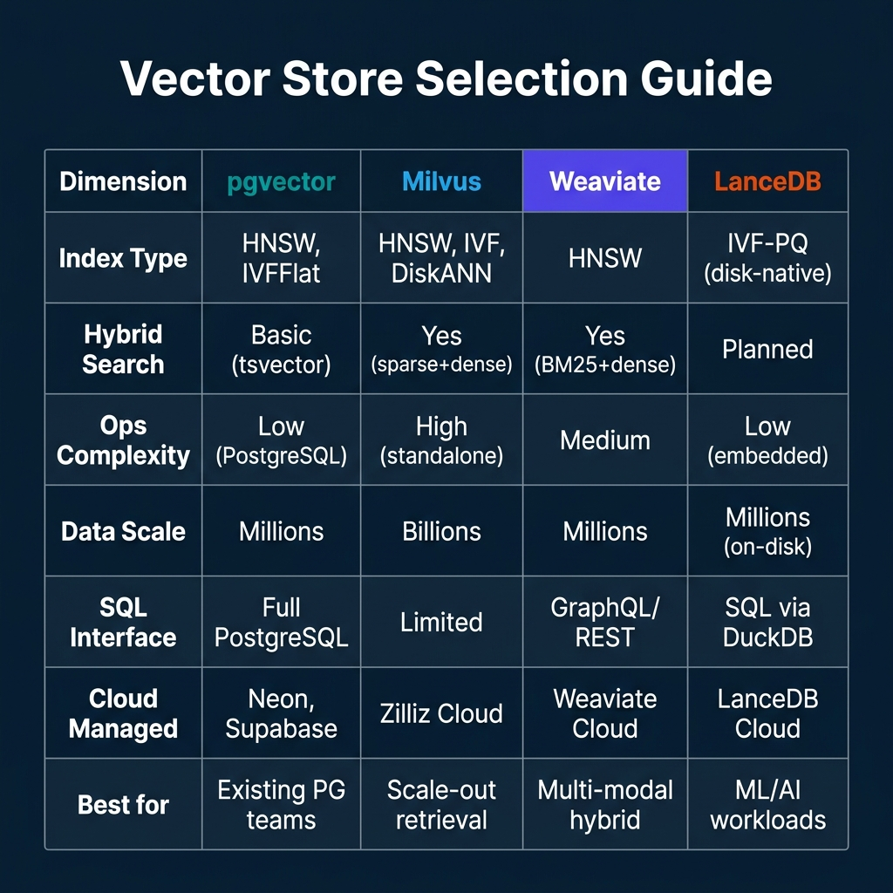

# Choosing Vector Stores for Retrieval Workloads

Vector retrieval has become a standard component in data platform architectures, not just an ML research topic. RAG pipelines use it to retrieve document context before generation. Recommendation systems use it to find similar items. Search applications use it to retrieve semantically relevant results that keyword search misses.

The vector store market has matured rapidly. pgvector brings approximate nearest neighbor (ANN) search to PostgreSQL. Milvus provides a purpose-built distributed vector database designed for billions of vectors. Weaviate integrates hybrid dense and sparse search with a multi-modal retrieval model. LanceDB uses the Lance columnar format for disk-native vector retrieval optimized for ML workflows.

Each of these tools makes different tradeoffs that matter in practice. This guide is about those tradeoffs—not which tool markets itself best, but which tool fits specific workload and operational requirements.

---

## Index Types: HNSW vs IVFFlat vs DiskANN

The index algorithm determines the recall-latency tradeoff for approximate nearest neighbor search.

**HNSW (Hierarchical Navigable Small World)** builds a multi-layer proximity graph. Queries traverse the graph from coarse to fine layers, achieving high recall with low latency. HNSW is the dominant choice for high-performance vector retrieval. Its limitation is memory: the graph must fit in RAM, making it unsuitable for datasets larger than available memory on a single node.

**IVFFlat (Inverted File with Flat Quantization)** partitions vectors into clusters and searches only the nearest clusters during query. It uses less memory than HNSW at the cost of lower recall for the same search effort. IVFFlat is appropriate when memory is constrained and some recall degradation is acceptable.

**DiskANN** (used by Milvus) is designed for billion-scale datasets where HNSW's memory requirements are prohibitive. It stores the index partially on disk and partially in RAM, trading some latency for dramatically better scale. For datasets in the tens of billions of vectors, DiskANN is often the only practical option.

**IVF-PQ (used by LanceDB)** combines inverted file indexing with Product Quantization, which compresses vectors before indexing. This enables disk-native storage of very large vector datasets without requiring the full vector in memory during search.

---

## pgvector: Vector Search Inside PostgreSQL

pgvector extends PostgreSQL with vector data types, indexes, and similarity search operations. If you're already using PostgreSQL, adding vector search is an extension install and schema change.

```sql
-- Enable pgvector extension
CREATE EXTENSION vector;—Create a table with a vector column
CREATE TABLE documents (
    id BIGSERIAL PRIMARY KEY,
    content TEXT,
    embedding vector(1536),—OpenAI text-embedding-3-small dimensions
    created_at TIMESTAMPTZ DEFAULT NOW()
);—Create an HNSW index for fast approximate nearest neighbor search
CREATE INDEX ON documents USING hnsw (embedding vector_cosine_ops)
WITH (m = 16, ef_construction = 64);—Semantic similarity search
SELECT id, content, 
       1 - (embedding <=> $1::vector) AS similarity
FROM documents
WHERE created_at > NOW() - INTERVAL '30 days'
ORDER BY embedding <=> $1::vector
LIMIT 10;
```

pgvector's operational advantage is zero new infrastructure. Your existing PostgreSQL setup, backup procedures, replication topology, and tooling all apply to vector columns without modification. The limitation is scale: HNSW indexes must fit in RAM, which practically limits pgvector to datasets of millions of vectors on typical server configurations.

For hybrid search—combining dense vector similarity with keyword (BM25) relevance—pgvector uses PostgreSQL's native `tsvector` full-text search in combination with vector search, joined by RRF (Reciprocal Rank Fusion) or similar fusion scoring. This requires more manual implementation than Milvus or Weaviate's native hybrid search capabilities.

---

## Milvus: Purpose-Built for Scale

Milvus is a purpose-built vector database designed for production workloads at billions of vectors. It supports multiple index types (HNSW, IVF, DiskANN), hardware-accelerated search (SIMD, GPU), and a native hybrid search pipeline that combines dense and sparse retrieval in a single query.

```python
from pymilvus import connections, Collection, DataType, FieldSchema, CollectionSchema

# Connect to Milvus
connections.connect("default", host="localhost", port="19530")

# Define a collection schema
schema = CollectionSchema(fields=[
    FieldSchema("id", DataType.INT64, is_primary=True, auto_id=True),
    FieldSchema("text", DataType.VARCHAR, max_length=65535),
    FieldSchema("dense_embedding", DataType.FLOAT_VECTOR, dim=1536),
    FieldSchema("sparse_embedding", DataType.SPARSE_FLOAT_VECTOR)
])

collection = Collection("documents", schema)

# Hybrid search: combine dense and sparse retrieval
from pymilvus import AnnSearchRequest, WeightedRanker

dense_req = AnnSearchRequest(
    data=[query_dense_embedding],
    anns_field="dense_embedding",
    param={"nprobe": 20},
    limit=50
)

sparse_req = AnnSearchRequest(
    data=[query_sparse_embedding],
    anns_field="sparse_embedding",
    param={},
    limit=50
)

results = collection.hybrid_search(
    reqs=[dense_req, sparse_req],
    rerank=WeightedRanker(0.8, 0.2),  # 80% dense, 20% sparse
    limit=10
)
```

Milvus's hybrid search combines BGEM3 sparse embeddings (or BM25-style representations) with dense embeddings in a single query with configurable weighting. This is particularly valuable for domain-specific retrieval where exact term matching (sparse) and semantic similarity (dense) both contribute signal.

The operational cost of Milvus is high. It requires running etcd (for metadata), MinIO or S3 (for persistence), and multiple service components (proxy, query nodes, data nodes, index nodes). For teams without dedicated infrastructure, Zilliz Cloud provides a managed Milvus service.

---

## Weaviate: Hybrid Search and Multi-Modal Retrieval

Weaviate implements hybrid search by combining HNSW-based dense vector search with BM25 sparse search, with the fusion handled natively:

```python
import weaviate
from weaviate.classes.query import HybridFusion

client = weaviate.connect_to_local()
collection = client.collections.get("Documents")

# Hybrid search with BM25 + dense vector
results = collection.query.hybrid(
    query="machine learning model deployment",  # Used for both BM25 and embedding
    fusion_type=HybridFusion.RELATIVE_SCORE,
    alpha=0.75,  # 0=pure BM25, 1=pure vector, 0.75=mostly vector
    limit=10,
    return_metadata=weaviate.classes.query.MetadataQuery(score=True)
)

for obj in results.objects:
    print(f"Score: {obj.metadata.score}, Content: {obj.properties['content'][:100]}")
```

Weaviate's `alpha` parameter controls the blend between sparse and dense retrieval. For domain-specific technical content where terminology matters, lower alpha (more BM25 weight) often improves precision. For general semantic retrieval, higher alpha (more vector weight) captures meaning better.

---

## LanceDB: Disk-Native for ML Workflows

LanceDB uses the Lance columnar format—a format designed for efficient random access alongside columnar scan performance. Unlike HNSW-based stores that require indexes in RAM, LanceDB's IVF-PQ index is disk-native, making it practical for large-scale ML datasets that don't fit in memory.

```python
import lancedb
import numpy as np

db = lancedb.connect("./my-lance-db")

# Create a table
table = db.create_table("embeddings", data=[
    {"id": 1, "text": "example document", "vector": np.random.rand(1536).tolist()},
])

# Query for nearest neighbors
results = table.search(query_vector) \
    .metric("cosine") \
    .limit(10) \
    .to_pandas()
```

LanceDB integrates with DuckDB for SQL-based analytics on the same dataset—you can run aggregation queries and vector similarity searches against the same Lance table without data movement. This is particularly useful for ML workflows where you need both analytical queries (row counts by label, feature statistics) and retrieval queries (find similar training examples).

---

## Selection Guide



The primary decision factors:

- **Existing PostgreSQL investment + millions of vectors:** pgvector
- **Billions of vectors + production scale-out:** Milvus / Zilliz Cloud
- **Multi-modal hybrid search + moderate scale:** Weaviate
- **ML/AI workflows + disk-native large datasets:** LanceDB

All four options support cloud-managed deployments, reducing the operational burden of running infrastructure.

---

## Embedding Model Choice and Dimension Tradeoffs

The vector store choice is only half of the retrieval architecture decision. The embedding model determines vector dimensionality, quality of semantic similarity, and encoding latency—all of which affect the operational characteristics of the vector store.

**OpenAI text-embedding-3-small:** 1536 dimensions. Good general-purpose text retrieval quality with low cost. Works well with all four vector stores.

**OpenAI text-embedding-3-large:** 3072 dimensions. Higher quality at higher cost and storage. Memory requirements for HNSW indexes scale with dimensionality—moving from 1536 to 3072 dimensions approximately doubles the HNSW index size.

**Cohere embed-v3:** 1024 dimensions with strong multilingual performance. Lower dimensionality reduces storage and memory costs while maintaining competitive retrieval quality for multilingual content.

**BGE-M3 (BAAI):** Produces both dense embeddings and sparse representations in a single model pass. This is the foundation for Milvus hybrid search—dense and sparse representations from the same model, enabling highly effective hybrid retrieval without running separate embedding and BM25 pipelines.

Dimensionality matters operationally because HNSW indexes must fit in RAM. For a 1-million-vector dataset with 1536 dimensions using float32 encoding:

```
1,000,000 vectors × 1,536 dimensions × 4 bytes = 6.1 GB (vectors alone)
HNSW graph overhead ≈ 30-40 additional bytes per vector × 1,000,000 = 30-40 MB
Total index memory ≈ 6.1 GB + graph overhead
```

For a server with 16 GB RAM, this is feasible. For 10 million vectors at 3072 dimensions, the math exceeds 120 GB—requiring IVFFlat (which can use less RAM at the cost of recall), DiskANN, or LanceDB's IVF-PQ disk-native approach.

---

## Hybrid Search: Dense + Sparse in Practice

Hybrid search combines dense vector retrieval (semantic similarity) with sparse keyword retrieval (BM25/TF-IDF term matching). The intuition is that dense retrieval handles paraphrase and synonym matches well but can miss precise technical terms; sparse retrieval handles exact term matching well but misses semantic equivalents.

For domain-specific retrieval—internal documentation, legal texts, medical literature—hybrid search typically outperforms either approach alone by 10-20% on NDCG@10 benchmarks.

The fusion strategy combines results from both retrievers. Reciprocal Rank Fusion (RRF) is the most common:

```python
def reciprocal_rank_fusion(dense_results, sparse_results, k=60):
    """
    Combine dense and sparse retrieval results using RRF.
    k=60 is the standard constant (empirically good across many benchmarks).
    """
    scores = {}
    
    for rank, doc in enumerate(dense_results):
        doc_id = doc["id"]
        scores[doc_id] = scores.get(doc_id, 0) + 1 / (k + rank + 1)
    
    for rank, doc in enumerate(sparse_results):
        doc_id = doc["id"]
        scores[doc_id] = scores.get(doc_id, 0) + 1 / (k + rank + 1)
    
    # Sort by combined score
    return sorted(scores.items(), key=lambda x: x[1], reverse=True)
```

Milvus and Weaviate implement RRF and weighted score fusion natively. For pgvector, RRF requires implementing the fusion logic in application code or PostgreSQL SQL.

---

## Index Tuning for Production Performance

Each index type has tunable parameters that trade recall for speed and memory:

**HNSW tuning (pgvector, Weaviate, Milvus):**
```sql
-- pgvector HNSW with tuned parameters
CREATE INDEX ON documents USING hnsw (embedding vector_cosine_ops)
WITH (
    m = 16,—Max connections per layer (higher = better recall, more memory)
    ef_construction = 64—Build-time candidate set size (higher = better quality, slower build)
);—At query time, increase ef_search for higher recall (at latency cost)
SET hnsw.ef_search = 200;
```

**IVFFlat tuning (pgvector fallback):**
```sql
CREATE INDEX ON documents USING ivfflat (embedding vector_cosine_ops)
WITH (lists = 1000);—More lists = lower recall per probe, fewer lists = more memory scanned—Query-time: increase probes for higher recall
SET ivfflat.probes = 50;—Query 50 out of 1000 lists
```

The recall-latency tradeoff is real and measurable. For production deployments, establish a minimum recall threshold (often 95% recall at top-10) and tune ef_search or probes to meet that threshold with the lowest latency at expected QPS.

---

## Production Monitoring for Vector Retrieval

Vector stores require different monitoring than traditional databases. Beyond standard infrastructure metrics (CPU, memory, disk), retrieval quality monitoring is essential:

**Recall monitoring.** Periodically evaluate retrieval recall against a labeled ground-truth test set. If recall drops (because index tuning drifted from optimal or the data distribution changed), it's often invisible in latency metrics but visible in downstream task performance.

**Embedding freshness.** If documents are updated without re-embedding and re-indexing, retrieval returns stale results for updated content. Monitor the gap between document update timestamps and their embedding update timestamps.

**Distribution drift.** When the query embedding distribution drifts significantly from the indexed document distribution (because a new use case is generating different query types), retrieval quality degrades. Monitoring average cosine similarity of returned results provides a signal.

**ANN algorithm performance.** For HNSW, monitor index build time and memory usage as the dataset grows. For LanceDB IVF-PQ, monitor the number of partitions scanned per query.

---

## Security Considerations for Vector Stores

Enterprise vector stores present security challenges that are different from traditional databases. The primary concern is what has been called "embedding inversion"—the theoretical and practical ability to reconstruct the original text from an embedding vector.

For most practical enterprise deployments, embedding inversion is not a realistic attack vector against the embedding vectors themselves. Current embedding models produce high-dimensional representations where reconstruction is computationally impractical. However, the threat model matters: if vectors are stored in a system accessible to untrusted parties, the combination of vector similarity search and inference can reveal membership information—whether a specific document is in the database—even if the document text itself isn't returned.

The practical security controls for enterprise vector stores:

**Access control at the retrieval layer.** Vector search results should go through the same access control checks as any other data retrieval. For multi-tenant deployments where different user groups should only retrieve documents from their namespace, enforce namespace isolation in the query filter—never retrieve across tenants and filter after the fact.

**Encryption at rest.** All four vector stores discussed in this post support encrypted storage. For compliance-sensitive environments (HIPAA, SOC 2 Type II), verify that encryption applies to both the vector data and the associated metadata fields.

**Audit logging for similarity search queries.** Unlike SQL queries, similarity search queries don't have a natural human-readable representation in audit logs. Log the query embedding (or a hash of it), the number of results returned, the user identity, and the timestamp. The embedding itself can be stored encrypted for forensic purposes without being readable in normal audit review.

**Tokenization and content filtering.** For RAG applications serving external users, the content retrieved by vector search should pass through a content filter before inclusion in the LLM prompt. Adversarial documents in the corpus can attempt to manipulate the LLM's behavior through retrieval—a technique called "indirect prompt injection." Filtering retrieved content against a predefined allowlist of acceptable content patterns reduces this risk.

---

## Evaluating Retrieval Quality: Beyond "Does It Return Results"

One of the most underinvested areas in production RAG and retrieval systems is systematic evaluation of retrieval quality. Teams often measure whether the system returns results, but rarely measure whether it returns the right results—and whether retrieval quality is stable over time as the document corpus and query distribution evolve.

**Recall@K** is the primary retrieval quality metric: given a query for which the ground-truth relevant documents are known, what fraction of those relevant documents appear in the top K results? A Recall@10 of 0.85 means the system returns 8-9 of 10 relevant documents in its first page of results.

**Mean Reciprocal Rank (MRR)** measures where the first relevant result appears. If the first relevant result is always in position 1, MRR = 1.0. If it typically appears at position 3 or 4, MRR ≈ 0.3. For RAG applications where the LLM uses the top 3-5 retrieved documents, high MRR is more important than high Recall at large K values.

Building a retrieval evaluation suite requires a labeled dataset of query-document relevance pairs. For internal enterprise deployments, this can be bootstrapped from historical query logs combined with analyst feedback on result quality. Even a small evaluation set of 200-300 labeled queries provides enough signal to detect retrieval regressions when index parameters or embedding models change.

---

## Conclusion

The vector store landscape in 2026 has matured from a niche ML research tool to production infrastructure for enterprise search and AI applications. pgvector, Milvus, Weaviate, and LanceDB each address different points in the scale-complexity-capability tradeoff.

The optimal architecture choice depends on current data scale, operational team capacity, existing infrastructure investments, and the specific retrieval quality requirements of the application. For teams starting fresh in a mid-scale environment (1-100 million vectors), Weaviate provides the best balance of hybrid search capability, manageable operations, and cloud-managed deployment options. Teams already running PostgreSQL should evaluate pgvector as a zero-new-infrastructure option before investing in a purpose-built vector database.

At billion-vector scale, the choice narrows to Milvus (in-memory with DiskANN for large indexes) or LanceDB (fully disk-native). The operational overhead of Milvus is significant but manageable for teams with dedicated infrastructure capacity.

---

### Explore Further

For comprehensive coverage of AI-native data architectures, vector retrieval patterns, and lakehouse integration, pick up [The 2026 Guide to Lakehouses, Apache Iceberg and Agentic AI: A Hands-On Practitioner's Guide to Modern Data Architecture, Open Table Formats, and Agentic AI](https://www.amazon.com/dp/B0GQNY21TD).

Browse Alex's other data engineering and analytics books at [books.alexmerced.com](https://books.alexmerced.com).

For federated analytics across your data products including vector-enriched datasets, try Dremio Cloud free at [dremio.com/get-started](https://www.dremio.com/get-started).
